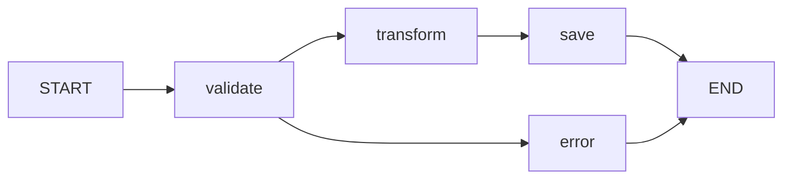
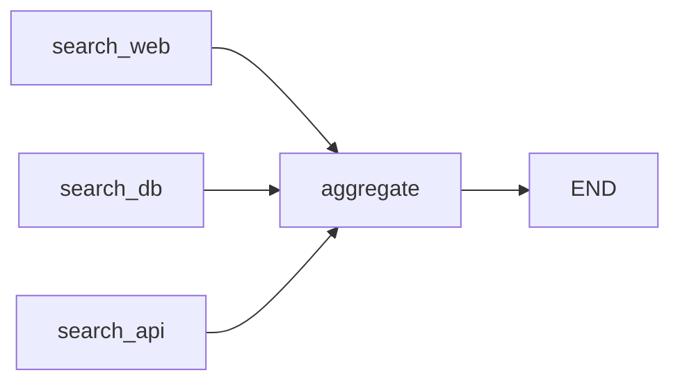

# Nodes and Edges

Nodes and edges are the building blocks of any LangGraph application. Nodes do the work, edges define the flow.

---

## Adding Nodes with add_node

Every node is a Python function registered with a unique name:

```python
from langgraph.graph import StateGraph
from typing_extensions import TypedDict

class State(TypedDict):
    messages: list[str]
    count: int

builder = StateGraph(State)

def greet(state: State) -> dict:
    return {"messages": state["messages"] + ["Hello!"]}

def increment(state: State) -> dict:
    return {"count": state["count"] + 1}

builder.add_node("greet", greet)
builder.add_node("increment", increment)
```

### Node Name Rules

- Names must be **unique** within the graph
- Use **descriptive names** (`"analyze_query"` over `"node_1"`)
- Names are used in edge definitions and streaming output
- Avoid special characters and spaces

### Adding Multiple Nodes

```python
def node_a(state: State) -> dict:
    return {"messages": state["messages"] + ["A"]}

def node_b(state: State) -> dict:
    return {"messages": state["messages"] + ["B"]}

def node_c(state: State) -> dict:
    return {"messages": state["messages"] + ["C"]}

builder.add_node("a", node_a)
builder.add_node("b", node_b)
builder.add_node("c", node_c)
```

[!TIP]
You can add nodes in any order. The execution order is determined by edges, not by the order you call add_node().

---

## Node Return Values

Nodes must return one of:

| Return Type | Behavior |
| :--- | :--- |
| `dict` | Keys are merged into state (shallow merge) |
| `None` | State is unchanged |
| `{}` | Empty dict, state is unchanged |

### Pattern: Reading and Writing State

```python
def node_with_side_effects(state: State) -> dict:
    # Read current state
    previous = state["messages"]
    current_count = state["count"]

    # Process (call LLM, run logic, etc.)
    new_message = f"Processed message #{current_count + 1}"

    # Return updates
    return {
        "messages": previous + [new_message],
        "count": current_count + 1
    }
```

[!IMPORTANT]
Never mutate state directly. Always return a new dict with the updates. LangGraph handles the merge internally.

---

## Edges: Connecting Nodes

Edges define which nodes execute and in what order.

### Simple Edge

```python
# After node A finishes, run node B
builder.add_edge("A", "B")
```

### Parallel Edges (Fan-Out)

```python
# After node A finishes, run B and C in parallel
builder.add_edge("A", "B")
builder.add_edge("A", "C")
```

When A completes, both B and C execute **simultaneously** in separate threads. Each receives a copy of the current state.

### Sequential Chain

```python
# A → B → C → D (linear pipeline)
builder.add_edge("A", "B")
builder.add_edge("B", "C")
builder.add_edge("C", "D")
```

[!NOTE]
Parallel fan-out is one of LangGraph's superpowers. Multiple nodes read the same state, process independently, and their updates are merged when all complete.

---

## Entry and Finish Points

### Using set_entry_point / set_finish_point

```python
builder = StateGraph(State)
builder.add_node("first", first_node)
builder.add_node("second", second_node)
builder.add_node("last", last_node)

builder.set_entry_point("first")
builder.add_edge("first", "second")
builder.add_edge("second", "last")
builder.set_finish_point("last")
```

### Using START and END Constants (Modern Approach)

```python
from langgraph.graph import START, END

builder = StateGraph(State)
builder.add_node("first", first_node)
builder.add_node("second", second_node)

builder.add_edge(START, "first")
builder.add_edge("first", "second")
builder.add_edge("second", END)
```

[!TIP]
Use `START` and `END` constants instead of `set_entry_point`/`set_finish_point`. They are more explicit and work better in complex graphs with multiple entry or exit points.

### Multiple Entry Points (Advanced)

```python
# Graph can start from either node
builder.add_edge(START, "ingest_api")
builder.add_edge(START, "ingest_file")
```

Both entry nodes execute in parallel when `invoke()` is called.

### Multiple Finish Points

```python
builder.add_edge("success_handler", END)
builder.add_edge("error_handler", END)
```

The graph ends when any branch reaches `END`.

---

## Complete Graph Topology Example

```python
from langgraph.graph import StateGraph, START, END
from typing_extensions import TypedDict
from typing import List

class ProcessingState(TypedDict):
    data: str
    validated: bool
    transformed: str
    result: str

def validate(state: ProcessingState) -> dict:
    is_valid = len(state["data"]) > 0
    return {"validated": is_valid}

def transform(state: ProcessingState) -> dict:
    transformed = state["data"].upper().strip()
    return {"transformed": transformed}

def save(state: ProcessingState) -> dict:
    return {"result": f"Saved: {state['transformed']}"}

def report_error(state: ProcessingState) -> dict:
    return {"result": "Error: Invalid data"}

builder = StateGraph(ProcessingState)
builder.add_node("validate", validate)
builder.add_node("transform", transform)
builder.add_node("save", save)
builder.add_node("error", report_error)

builder.add_edge(START, "validate")
builder.add_edge("validate", "transform")
builder.add_edge("transform", "save")
builder.add_edge("save", END)
builder.add_edge("validate", "error")
builder.add_edge("error", END)

app = builder.compile()

# Visualize
print(app.get_graph().draw_mermaid())
```



[!WARNING]
The above example has a problem: after `validate`, the graph runs both `transform` AND `error` in parallel because there are edges to both. Use **conditional edges** (next lesson) to route based on the validation result.

---

## Fan-In: Multiple Nodes Merging to One

When multiple nodes connect to the same target:

```python
builder.add_edge("search_web", "aggregate")
builder.add_edge("search_db", "aggregate")
builder.add_edge("search_api", "aggregate")
```

The `aggregate` node runs after **all three** incoming nodes complete. Their updates are merged before `aggregate` receives the state.



[!SUCCESS]
Fan-out lets you parallelize work. Fan-in lets you synchronize results. Together, they enable powerful Map-Reduce patterns inside your graph.

---

## Nodes Without Return Values

Sometimes a node performs an action without modifying state (e.g., logging, sending a notification):

```python
def log_node(state: State) -> None:
    print(f"Current state messages: {state['messages']}")
    # No return — state is unchanged

builder.add_node("logger", log_node)
```

[!NOTE]
Nodes that return `None` are useful for side effects like logging, metrics emission, or webhook calls. They don't modify state but can access it.

---

## Node and Edge Best Practices

1. **One responsibility per node**: Each node should do one thing (validate, transform, search, generate)
2. **Descriptive names**: `"classify_intent"` is better than `"step_3"`
3. **Keep nodes pure when possible**: Avoid side effects in the main logic; add separate side-effect nodes
4. **Limit parallel breadth**: Too many parallel nodes can overwhelm thread pools
5. **Test nodes independently**: Each node should be testable in isolation

```python
# Bad: One giant node
def do_everything(state: State) -> dict:
    # validates, transforms, searches, generates, and saves
    # ... dozens of lines of logic
    pass

# Good: Composable nodes
def validate_input(state: State) -> dict: ...
def search_knowledge(state: State) -> dict: ...
def generate_response(state: State) -> dict: ...
def save_to_db(state: State) -> dict: ...
```

---

## Common Edge Patterns

### Pipeline (Sequential)
```
START → A → B → C → END
```

### Fan-Out (Parallel)
```
START → A → B → END
         ↓
         C → END
```

### Fan-In (Merge)
```
START → B → D → END
START → C → END
```

### Branching (Conditional)
```
START → A → B → END
         ↓
         C → END
```
(Conditional edges — covered in lesson 9 — determine which path to take)

---

## Practice Questions

```question
{
  "id": "lg-beginner-04-q1",
  "type": "multiple-choice",
  "question": "What method is used to register a function as a node in LangGraph?",
  "options": ["register_node()", "add_node()", "create_node()", "define_node()"],
  "correct": 1,
  "explanation": "builder.add_node('name', function) registers a Python function as a graph node with the given name."
}
```

```question
{
  "id": "lg-beginner-04-q2",
  "type": "multiple-choice",
  "question": "What happens when a node returns None?",
  "options": [
    "The graph raises an error",
    "State is unchanged",
    "All state values are reset",
    "The node is skipped and marked as failed"
  ],
  "correct": 1,
  "explanation": "return None means no state updates. The state passes through unchanged to the next node."
}
```

```question
{
  "id": "lg-beginner-04-q3",
  "type": "multiple-choice",
  "question": "What does add_edge('A', 'B') do?",
  "options": [
    "Adds A as a subgraph of B",
    "Creates a connection so B runs after A completes",
    "Creates a conditional routing from A to B",
    "Defines A and B as the same node"
  ],
  "correct": 1,
  "explanation": "add_edge('A', 'B') creates a directed edge: after node A finishes, node B starts execution."
}
```

```question
{
  "id": "lg-beginner-04-q4",
  "type": "multiple-choice",
  "question": "What happens when two edges leave the same node?",
  "options": [
    "Only the first edge is followed",
    "Both target nodes execute in parallel",
    "An error is thrown",
    "The graph pauses and asks which to follow"
  ],
  "correct": 1,
  "explanation": "When a node has multiple outgoing edges, all target nodes execute simultaneously in separate threads."
}
```

```question
{
  "id": "lg-beginner-04-q5",
  "type": "multiple-choice",
  "question": "What does the END constant represent?",
  "options": [
    "A special node that resets state",
    "A terminal node that completes graph execution",
    "An error handler",
    "A logging node"
  ],
  "correct": 1,
  "explanation": "END is a special constant that marks graph completion. Reaching END from any branch terminates execution."
}
```

```question
{
  "id": "lg-beginner-04-q6",
  "type": "multiple-choice",
  "question": "Which approach to setting entry points is recommended for modern LangGraph code?",
  "options": [
    "set_entry_point('node')",
    "add_edge(START, 'node')",
    "configure_entry('node')",
    "define_start('node')"
  ],
  "correct": 1,
  "explanation": "add_edge(START, 'node') is the modern recommended approach. It is more explicit and flexible for complex graphs."
}
```

```question
{
  "id": "lg-beginner-04-q7",
  "type": "multiple-choice",
  "question": "If nodes B and C both connect to node D, when does D run?",
  "options": [
    "After either B or C completes",
    "After both B and C complete",
    "After B completes (C is ignored)",
    "D runs before B and C"
  ],
  "correct": 1,
  "explanation": "Fan-in: D waits until all incoming nodes (B and C) have completed, then receives the merged state from both."
}
```

```question
{
  "id": "lg-beginner-04-q8",
  "type": "multiple-choice",
  "question": "Can you have multiple START nodes?",
  "options": [
    "Yes, both execute in parallel",
    "No, only one entry point is allowed",
    "Yes, but they execute sequentially",
    "No, START can only connect to one node"
  ],
  "correct": 0,
  "explanation": "You can connect START to multiple nodes. All of them execute in parallel when the graph is invoked."
}
```

```question
{
  "id": "lg-beginner-04-q9",
  "type": "multiple-choice",
  "question": "What is the best practice for node naming?",
  "options": [
    "Use sequential numbers (node_1, node_2)",
    "Use descriptive names (validate_input, generate_response)",
    "Single letters (a, b, c)",
    "Python reserved keywords"
  ],
  "correct": 1,
  "explanation": "Descriptive names make the graph readable, easier to debug, and clearer in streaming output."
}
```

```question
{
  "id": "lg-beginner-04-q10",
  "type": "multiple-choice",
  "question": "What does fan-out mean in the context of LangGraph?",
  "options": [
    "Removing a node from the graph",
    "One node triggering multiple downstream nodes in parallel",
    "Combining multiple nodes into one",
    "Sorting nodes alphabetically"
  ],
  "correct": 1,
  "explanation": "Fan-out occurs when one node has multiple outgoing edges, causing all targets to execute in parallel."
}
```

---

[!SUCCESS]
### Key Takeaways
- `add_node('name', func)` registers a node; names must be unique and descriptive
- Nodes receive the full state and return partial updates (or None for no changes)
- Edges define topology: `add_edge('A', 'B')` means B runs after A
- `START` and `END` constants mark entry and exit points
- Fan-out enables parallel execution; fan-in synchronizes multiple branches
- Never mutate state directly — always return a dict of updates
- Use a single responsibility per node for composability and testing
- Multiple `add_edge(START, ...)` calls create parallel entry points
