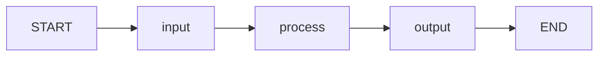

# Building a Simple Graph

In this lesson, we'll build a complete 3-step LangGraph: **input** → **process** → **output**. This is the foundation for every agent you'll build.

---

## The 3-Step Pattern

Every LangGraph application follows this pattern:

1. **Input node**: Accepts and validates raw input
2. **Process node**: Performs the core logic (LLM call, computation, etc.)
3. **Output node**: Formats and returns the final result



---

## Step 1: Define the State

```python
from typing_extensions import TypedDict
from typing import Optional

class SimpleState(TypedDict):
    input_text: str          # Raw user input
    processed_text: str      # Intermediate processed value
    output_text: str         # Final output
    error: Optional[str]     # Error message (if any)
```

[!NOTE]
Include an `error` field in your state from the start. It makes error handling much cleaner as your graph grows.

---

## Step 2: Define the Nodes

### Input Node

```python
def input_node(state: SimpleState) -> dict:
    raw = state["input_text"].strip()

    if not raw:
        return {"error": "Input cannot be empty"}

    return {"input_text": raw}
```

### Process Node

```python
def process_node(state: SimpleState) -> dict:
    if state.get("error"):
        return {}  # Skip processing if there's an error

    # Simple text transformation
    processed = state["input_text"].upper()
    word_count = len(state["input_text"].split())

    return {
        "processed_text": f"[{word_count} words] {processed}"
    }
```

### Output Node

```python
def output_node(state: SimpleState) -> dict:
    if state.get("error"):
        return {"output_text": f"Error: {state['error']}"}

    return {
        "output_text": f"Result: {state['processed_text']}"
    }
```

[!TIP]
The pattern of checking `state.get("error")` in each node is a basic form of error propagation. Later we'll replace this with conditional edges for cleaner routing.

---

## Step 3: Build the Graph

```python
from langgraph.graph import StateGraph, START, END

builder = StateGraph(SimpleState)

# Add nodes
builder.add_node("input", input_node)
builder.add_node("process", process_node)
builder.add_node("output", output_node)

# Add edges
builder.add_edge(START, "input")
builder.add_edge("input", "process")
builder.add_edge("process", "output")
builder.add_edge("output", END)

# Compile
app = builder.compile()
```

---

## Step 4: Invoke the Graph

```python
# Successful execution
result = app.invoke({
    "input_text": "hello world",
    "processed_text": "",
    "output_text": "",
    "error": None
})

print(result["output_text"])
# Result: [2 words] HELLO WORLD

# Error case
result = app.invoke({
    "input_text": "   ",
    "processed_text": "",
    "output_text": "",
    "error": None
})

print(result["output_text"])
# Error: Input cannot be empty
```

---

## Step 5: Add Streaming

Streaming lets you observe each node's output as it executes:

```python
for event in app.stream({
    "input_text": "langgraph is awesome",
    "processed_text": "",
    "output_text": "",
    "error": None
}):
    for node_name, state_update in event.items():
        if node_name == "__end__":
            continue

        print(f"---[{node_name}]---")
        for key, value in state_update.items():
            if value:
                print(f"  {key}: {value}")
```

Output:
```
---[input]---
  input_text: langgraph is awesome
---[process]---
  processed_text: [3 words] LANGGRAPH IS AWESOME
---[output]---
  output_text: Result: [3 words] LANGGRAPH IS AWESOME
```

[!SUCCESS]
Streaming gives you real-time visibility into your graph's execution. Use it during development to verify each node's behavior.

---

## Complete Working Example

```python
from langgraph.graph import StateGraph, START, END
from typing_extensions import TypedDict
from typing import Optional

# 1. State
class SimpleState(TypedDict):
    input_text: str
    processed_text: str
    output_text: str
    error: Optional[str]

# 2. Nodes
def input_node(state: SimpleState) -> dict:
    raw = state["input_text"].strip()
    if not raw:
        return {"error": "Input cannot be empty"}
    return {"input_text": raw}

def process_node(state: SimpleState) -> dict:
    if state.get("error"):
        return {}
    processed = state["input_text"].upper()
    word_count = len(state["input_text"].split())
    return {"processed_text": f"[{word_count} words] {processed}"}

def output_node(state: SimpleState) -> dict:
    if state.get("error"):
        return {"output_text": f"Error: {state['error']}"}
    return {"output_text": f"Result: {state['processed_text']}"}

# 3. Graph
builder = StateGraph(SimpleState)
builder.add_node("input", input_node)
builder.add_node("process", process_node)
builder.add_node("output", output_node)
builder.add_edge(START, "input")
builder.add_edge("input", "process")
builder.add_edge("process", "output")
builder.add_edge("output", END)

app = builder.compile()

# 4. Run
result = app.invoke({
    "input_text": "hello langgraph",
    "processed_text": "",
    "output_text": "",
    "error": None
})
print(result["output_text"])
# Result: [2 words] HELLO LANGGRAPH
```

---

## Adding an LLM to the Process Node

Let's upgrade the process node to use an LLM:

```python
from langchain_openai import ChatOpenAI
from langchain.prompts import ChatPromptTemplate
from langchain_core.output_parsers import StrOutputParser

llm = ChatOpenAI(model="gpt-4o", temperature=0.3)

def process_with_llm(state: SimpleState) -> dict:
    if state.get("error"):
        return {}

    prompt = ChatPromptTemplate.from_messages([
        ("system", "You are a text analyzer. Analyze the given text and provide:\n"
                   "1. A summary (1 sentence)\n"
                   "2. Sentiment (positive/negative/neutral)\n"
                   "3. Key topics"),
        ("human", "{text}")
    ])

    chain = prompt | llm | StrOutputParser()
    analysis = chain.invoke({"text": state["input_text"]})

    return {"processed_text": analysis}
```

Now instead of simple string transformation, your process node performs AI-powered analysis.

[!NOTE]
Swapping a deterministic node for an LLM-powered node requires no changes to the graph structure. Only the node function changes. This is the power of the graph abstraction.

---

## Adding a Loop (Preview)

Even in a simple graph, you can add a loop. Let's make the process node repeat until the text is clean:

```python
from langgraph.graph import START, END, StateGraph
from typing_extensions import TypedDict

class CleanState(TypedDict):
    text: str
    cleaned: bool
    attempts: int

def clean_text(state: CleanState) -> dict:
    original = state["text"]
    cleaned = original.strip().lower()
    is_clean = cleaned == original

    return {
        "text": cleaned,
        "cleaned": is_clean,
        "attempts": state["attempts"] + 1
    }

def should_continue(state: CleanState) -> str:
    if state["cleaned"] or state["attempts"] >= 3:
        return "end"
    return "continue"

builder = StateGraph(CleanState)
builder.add_node("clean", clean_text)
builder.add_edge(START, "clean")
builder.add_conditional_edges(
    "clean",
    should_continue,
    {
        "continue": "clean",  # Loop back
        "end": END
    }
)

app = builder.compile()

result = app.invoke({"text": "  HELLO WORLD  ", "cleaned": False, "attempts": 0})
print(result["text"])      # hello world
print(result["attempts"])  # 2 (first pass cleans, second confirms)
```

[!WARNING]
Always have a termination condition in loops. Without the `attempts >= 3` check, a bug could cause an infinite loop. Always set `recursion_limit` in invocation config.

---

## Testing Your Graph

```python
# Test 1: Normal input
result = app.invoke({"input_text": "Test", "processed_text": "", "output_text": "", "error": None})
assert "Error" not in result["output_text"]

# Test 2: Empty input
result = app.invoke({"input_text": "", "processed_text": "", "output_text": "", "error": None})
assert "Error" in result["output_text"]

# Test 3: Whitespace input
result = app.invoke({"input_text": "   ", "processed_text": "", "output_text": "", "error": None})
assert "Error" in result["output_text"]
```

[!TIP]
Write tests for each node individually (pure function tests) and for the full graph (integration tests). This catches both node-level bugs and topology issues.

---

## Common Mistakes

### Mistake 1: Forgetting to handle the error case
```python
def process_node(state: State) -> dict:
    # BUG: If state has an error, this still runs
    return {"result": expensive_computation(state["input"])}

# FIX: Check for errors first
def process_node(state: State) -> dict:
    if state.get("error"):
        return {}
    return {"result": expensive_computation(state["input"])}
```

### Mistake 2: Mutating state directly
```python
def bad_node(state: State) -> dict:
    state["value"] = "new"  # BUG: Don't mutate state!
    return {"value": "new"}  # CORRECT: Return updates

def good_node(state: State) -> dict:
    return {"value": "new"}  # CORRECT
```

### Mistake 3: Missing edge to END
```python
builder.add_edge("process", "output")
# BUG: No edge from output to END — graph never terminates!

builder.add_edge("output", END)  # FIX
```

---

## Practice Questions

```question
{
  "id": "lg-beginner-05-q1",
  "type": "multiple-choice",
  "question": "What is the standard 3-step pattern for a simple LangGraph?",
  "options": [
    "Train → Test → Deploy",
    "Input → Process → Output",
    "Fetch → Parse → Display",
    "Connect → Query → Close"
  ],
  "correct": 1,
  "explanation": "The basic pattern is Input (accept/validate), Process (perform logic), Output (format/return results)."
}
```

```question
{
  "id": "lg-beginner-05-q2",
  "type": "multiple-choice",
  "question": "What should a node return when an error has occurred upstream?",
  "options": [
    "Raise an exception",
    "Return an empty dict {}",
    "Return None",
    "Return the original state unchanged"
  ],
  "correct": 1,
  "explanation": "Returning {} (empty dict) means no state changes, effectively skipping the node's work when there's an upstream error."
}
```

```question
{
  "id": "lg-beginner-05-q3",
  "type": "multiple-choice",
  "question": "How do you observe intermediate node outputs during graph execution?",
  "options": [
    "Using print() inside nodes",
    "Using the stream() method instead of invoke()",
    "Using the debug() method",
    "By checking the graph logs"
  ],
  "correct": 1,
  "explanation": "app.stream() yields events for each node as they complete, showing intermediate state updates."
}
```

```question
{
  "id": "lg-beginner-05-q4",
  "type": "multiple-choice",
  "question": "What happens if you forget to add an edge from the last node to END?",
  "options": [
    "The graph runs but returns None",
    "The graph never terminates",
    "The graph automatically ends after the last node",
    "An error is thrown during compilation"
  ],
  "correct": 1,
  "explanation": "Without an edge to END, the graph has no termination path and will eventually hit the recursion limit."
}
```

```question
{
  "id": "lg-beginner-05-q5",
  "type": "multiple-choice",
  "question": "What's the best practice for handling errors in a simple graph?",
  "options": [
    "Let exceptions propagate to the caller",
    "Include an error field in state and check it in each node",
    "Ignore errors in processing",
    "Restart the graph on any error"
  ],
  "correct": 1,
  "explanation": "Adding an error field to state and checking it at the start of each node provides clean error propagation."
}
```

```question
{
  "id": "lg-beginner-05-q6",
  "type": "multiple-choice",
  "question": "Can you replace a deterministic node with an LLM-powered node without changing the graph structure?",
  "options": [
    "Yes, only the node function changes",
    "No, you need to rebuild the graph",
    "Only if you recompile",
    "No, LLM nodes require special configuration"
  ],
  "correct": 0,
  "explanation": "The graph structure (nodes, edges, state) stays the same. Only the node function's internal logic changes."
}
```

```question
{
  "id": "lg-beginner-05-q7",
  "type": "multiple-choice",
  "question": "What must every loop in LangGraph have?",
  "options": [
    "At least 3 iterations",
    "A termination condition",
    "A separate thread",
    "A memory checkpoint"
  ],
  "correct": 1,
  "explanation": "Every loop must have a termination condition (e.g., max iterations, success flag) to prevent infinite execution."
}
```

```question
{
  "id": "lg-beginner-05-q8",
  "type": "multiple-choice",
  "question": "What is the correct way to update state in a node?",
  "options": [
    "state['key'] = 'value'; return state",
    "return {'key': 'value'}",
    "state.update({'key': 'value'}); return state",
    "return state"
  ],
  "correct": 1,
  "explanation": "Nodes should return a dict of updates. LangGraph handles merging. Never mutate state directly."
}
```

```question
{
  "id": "lg-beginner-05-q9",
  "type": "multiple-choice",
  "question": "What is a good use of a node that returns None?",
  "options": [
    "To reset the entire state",
    "For side effects like logging or metrics",
    "To terminate the graph",
    "To trigger an error"
  ],
  "correct": 1,
  "explanation": "Nodes returning None are useful for side effects (logging, metrics, notifications) that don't modify state."
}
```

```question
{
  "id": "lg-beginner-05-q10",
  "type": "multiple-choice",
  "question": "What does the stream() method return for each event?",
  "options": [
    "A string of the current node name",
    "A dict with node names as keys and state updates as values",
    "The final state only",
    "A log of all errors encountered"
  ],
  "correct": 1,
  "explanation": "stream() yields dicts where keys are node names and values are the state updates from that node."
}
```

---

[!SUCCESS]
### Key Takeaways
- The Input → Process → Output pattern is the foundation of all LangGraph apps
- Include an `error` field in your state for clean error handling
- Use `stream()` during development to observe node execution
- Always add an edge from the last node to END
- Nodes can be upgraded from deterministic to LLM-powered without graph changes
- Loops need termination conditions
- Never mutate state directly — return a dict of updates
- Test nodes individually and the full graph as integration tests
