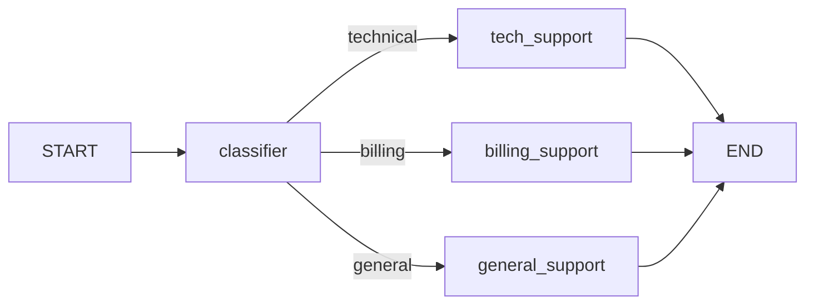

# Conditional Branching

Not all graphs are linear. Conditional branching lets your graph make decisions at runtime, routing execution to different paths based on the current state.

---

## What is Conditional Branching?

Conditional branching means the next node to execute depends on the **current state**, not a fixed topology.



The `classifier` node analyzes the input and decides which path to take.

---

## add_conditional_edges

`add_conditional_edges` is the method that enables conditional routing:

```python
from langgraph.graph import StateGraph, START, END
from typing_extensions import TypedDict

class State(TypedDict):
    input_text: str
    category: str

def classifier(state: State) -> dict:
    # Simplified classification — in practice, use an LLM
    text = state["input_text"].lower()
    if "bill" in text or "payment" in text:
        return {"category": "billing"}
    elif "bug" in text or "error" in text:
        return {"category": "technical"}
    else:
        return {"category": "general"}

# Routing function: receives state, returns a node name
def route_by_category(state: State) -> str:
    return state["category"]

builder = StateGraph(State)
builder.add_node("classifier", classifier)
builder.add_node("tech_support", lambda s: {"tech_support": True})
builder.add_node("billing_support", lambda s: {"billing_support": True})
builder.add_node("general_support", lambda s: {"general_support": True})

builder.add_edge(START, "classifier")
builder.add_conditional_edges(
    "classifier",            # Source node
    route_by_category,       # Router function
    {                        # Mapping: return value → target node
        "technical": "tech_support",
        "billing": "billing_support",
        "general": "general_support"
    }
)
builder.add_edge("tech_support", END)
builder.add_edge("billing_support", END)
builder.add_edge("general_support", END)

app = builder.compile()
```

[!NOTE]
The routing function receives the full state dict and returns a string. That string is used as a key in the mapping dict to look up the target node name.

---

## Router Function Patterns

### Simple String Return

```python
def router(state: State) -> str:
    if state["is_complete"]:
        return "end"
    return "continue"
```

### Dictionary Mapping

```python
builder.add_conditional_edges(
    "analyze",
    router,
    {
        "end": END,           # Map to END constant
        "continue": "process" # Map to another node
    }
)
```

### Default Route with Fallback

If the router returns a value not in the mapping, an error is thrown. Always cover all possible return values:

```python
def sentiment_router(state: State) -> str:
    sentiment = state["sentiment"]
    if sentiment == "positive":
        return "positive"
    elif sentiment == "negative":
        return "negative"
    return "neutral"  # Default fallback

builder.add_conditional_edges(
    "analyze",
    sentiment_router,
    {
        "positive": "handle_positive",
        "negative": "handle_negative",
        "neutral": "handle_neutral"
    }
)
```

---

## LLM-Powered Routing

Use an LLM to classify input and determine routing:

```python
from langchain_openai import ChatOpenAI
from langchain.prompts import ChatPromptTemplate
from langchain_core.output_parsers import StrOutputParser

llm = ChatOpenAI(model="gpt-4o-mini")

class RouteState(TypedDict):
    query: str
    route: str

def classify_route(state: RouteState) -> dict:
    prompt = ChatPromptTemplate.from_messages([
        ("system", "Classify the query into one category: 'technical', 'billing', or 'general'. "
                   "Respond with only the category name."),
        ("human", "{query}")
    ])
    chain = prompt | llm | StrOutputParser()
    route = chain.invoke({"query": state["query"]}).strip().lower()
    return {"route": route}

def dynamic_router(state: RouteState) -> str:
    return state["route"]

builder.add_conditional_edges(
    "classify",
    dynamic_router,
    {
        "technical": "tech_handler",
        "billing": "billing_handler",
        "general": "general_handler"
    }
)
```

[!TIP]
When using LLMs for routing, add a post-processing step to clean and validate the route value. Set a default fallback for unexpected outputs.

---

## Conditional Loops

The most common use of conditional edges is **looping** — repeating a node until a condition is met:

```python
class LoopState(TypedDict):
    input: str
    result: str
    attempts: int
    is_valid: bool

def process(state: LoopState) -> dict:
    # Attempt to process the input
    result = attempt_processing(state["input"])
    is_valid = validate_result(result)
    return {
        "result": result,
        "is_valid": is_valid,
        "attempts": state["attempts"] + 1
    }

def loop_router(state: LoopState) -> str:
    if state["is_valid"]:
        return "valid"
    if state["attempts"] >= 3:
        return "max_retries"
    return "retry"

builder.add_conditional_edges(
    "process",
    loop_router,
    {
        "valid": "format_output",  # Success — move forward
        "retry": "process",        # Retry — loop back
        "max_retries": "error_handler"  # Give up
    }
)
```

[!WARNING]
Always include a maximum retry count in loops. Without it, a persistent failure causes an infinite loop that hits the recursion limit.

---

## Multi-Condition Routing

Route to different nodes based on multiple state fields:

```python
def complex_router(state: State) -> str:
    if state.get("error"):
        return "error"

    if state["requires_tools"] and state["has_tool_results"]:
        return "synthesize"

    if state["requires_tools"] and not state["has_tool_results"]:
        return "execute_tools"

    return "generate"

builder.add_conditional_edges(
    "analyze",
    complex_router,
    {
        "error": "error_handler",
        "synthesize": "synthesizer",
        "execute_tools": "tool_executor",
        "generate": "generator"
    }
)
```

---

## Conditional Edges from Multiple Nodes

You can add conditional edges from any node, not just a classifier:

```python
builder.add_conditional_edges("validate", validate_router, {...})
builder.add_conditional_edges("search", search_router, {...})
builder.add_conditional_edges("generate", quality_check_router, {...})
```

---

## Ternary Router Pattern

A simple binary decision:

```python
def is_complete(state: State) -> str:
    return "done" if state.get("finished") else "continue"

builder.add_conditional_edges(
    "worker",
    is_complete,
    {
        "done": END,
        "continue": "worker"  # Loop back
    }
)
```

---

## Complete Example: Intelligent Query Router

```python
from langchain_openai import ChatOpenAI
from langchain.prompts import ChatPromptTemplate
from langchain_core.output_parsers import StrOutputParser
from langchain_core.tools import tool
from langgraph.graph import StateGraph, START, END
from typing_extensions import TypedDict
from typing import Annotated, List
from operator import add

llm = ChatOpenAI(model="gpt-4o-mini")

# Tools
@tool
def search_web(query: str) -> str:
    """Search the web for information."""
    return f"Web results for: {query}"

@tool
def calculate(expr: str) -> str:
    """Calculate math expressions."""
    return str(eval(expr, {"__builtins__": {}}, {}))

class RouterState(TypedDict):
    messages: Annotated[List, add]
    query: str
    route: str
    response: str

def classify_node(state: RouterState) -> dict:
    prompt = ChatPromptTemplate.from_messages([
        ("system", "Route the query to: 'web_search', 'calculator', or 'chat'. "
                   "Respond with only the route name."),
        ("human", "{query}")
    ])
    chain = prompt | llm | StrOutputParser()
    route = chain.invoke({"query": state["query"]}).strip().lower()
    return {"route": route}

def router_fn(state: RouterState) -> str:
    return state["route"]

def web_search_node(state: RouterState) -> dict:
    result = search_web.invoke({"query": state["query"]})
    return {"response": result, "messages": [f"[Web] {result}"]}

def calculator_node(state: RouterState) -> dict:
    result = calculate.invoke({"expr": state["query"]})
    return {"response": result, "messages": [f"[Calc] {result}"]}

def chat_node(state: RouterState) -> dict:
    response = llm.invoke(f"Answer this: {state['query']}")
    return {"response": response.content, "messages": [f"[Chat] {response.content}"]}

builder = StateGraph(RouterState)
builder.add_node("classify", classify_node)
builder.add_node("web_search", web_search_node)
builder.add_node("calculator", calculator_node)
builder.add_node("chat", chat_node)

builder.add_edge(START, "classify")
builder.add_conditional_edges("classify", router_fn, {
    "web_search": "web_search",
    "calculator": "calculator",
    "chat": "chat"
})
builder.add_edge("web_search", END)
builder.add_edge("calculator", END)
builder.add_edge("chat", END)

app = builder.compile()

# Test
result = app.invoke({
    "messages": [],
    "query": "What is 15 * 7?",
    "route": "",
    "response": ""
})
print(result["response"])  # 105

result = app.invoke({
    "messages": [],
    "query": "Who invented Python?",
    "route": "",
    "response": ""
})
print(result["response"])  # Chat or web search result
```

[!SUCCESS]
This pattern — classify → route → execute specialized handler — is the foundation of all intelligent routing agents.

---

## Routing Best Practices

1. **Always handle all possible route values** — missing a mapping raises an error
2. **Add a default/fallback route** for unexpected router outputs
3. **Validate the router output** when using LLMs for routing
4. **Use descriptive route names** that match node names for clarity
5. **Limit routing depth** — deeply nested conditional chains are hard to debug
6. **Log the route decision** for debugging and observability

---

## Practice Questions

```question
{
  "id": "lg-beginner-09-q1",
  "type": "multiple-choice",
  "question": "What method is used for conditional branching in LangGraph?",
  "options": ["add_edge()", "add_conditional_edges()", "set_conditional()", "branch()"],
  "correct": 1,
  "explanation": "add_conditional_edges() adds edges that are determined at runtime by a router function."
}
```

```question
{
  "id": "lg-beginner-09-q2",
  "type": "multiple-choice",
  "question": "What does a router function receive and return?",
  "options": [
    "Receives the full state, returns a string key",
    "Receives only the query, returns a boolean",
    "Receives nothing, returns a node function",
    "Receives the previous node output, returns a dict"
  ],
  "correct": 0,
  "explanation": "A router function receives the complete state dict and returns a string that maps to a target node in the mapping dict."
}
```

```question
{
  "id": "lg-beginner-09-q3",
  "type": "multiple-choice",
  "question": "What happens if a router returns a value not in the mapping dict?",
  "options": [
    "The graph takes the default path",
    "An error is raised",
    "The router is called again",
    "The graph pauses"
  ],
  "correct": 1,
  "explanation": "All router return values must have corresponding entries in the mapping dict. Missing mappings raise an error."
}
```

```question
{
  "id": "lg-beginner-09-q4",
  "type": "multiple-choice",
  "question": "What is the most common use of conditional edges in agents?",
  "options": [
    "Formatting output",
    "Creating loops that repeat until a condition is met",
    "Adding logging",
    "Setting up the LLM"
  ],
  "correct": 1,
  "explanation": "Conditional edges enable the ReAct loop: call LLM → execute tools → check if done → loop back or finish."
}
```

```question
{
  "id": "lg-beginner-09-q5",
  "type": "multiple-choice",
  "question": "How can you create a simple binary (yes/no) conditional edge?",
  "options": [
    "Use a router that returns 'yes' or 'no' with a two-entry mapping",
    "Use two add_edge() calls",
    "Use a boolean return in the node function",
    "Binary routing is not supported"
  ],
  "correct": 0,
  "explanation": "A router function returning 'yes'/'no' (or 'done'/'continue') with a two-entry mapping is the standard binary pattern."
}
```

```question
{
  "id": "lg-beginner-09-q6",
  "type": "multiple-choice",
  "question": "What should you always include in a loop with conditional edges?",
  "options": [
    "A sleep timer",
    "A maximum retry count as a termination condition",
    "A database connection",
    "At least 10 nodes"
  ],
  "correct": 1,
  "explanation": "Always include a maximum retry/iteration count to prevent infinite loops if the condition is never met."
}
```

```question
{
  "id": "lg-beginner-09-q7",
  "type": "multiple-choice",
  "question": "Can you use an LLM as a router in LangGraph?",
  "options": [
    "No, routers must be deterministic functions",
    "Yes, use an LLM to classify input and write the decision to state",
    "Only with specific LangChain integrations",
    "LLMs are too slow for routing"
  ],
  "correct": 1,
  "explanation": "LLM-powered routing is common: an LLM classifies the input, writes the category to state, and a simple router function reads it."
}
```

```question
{
  "id": "lg-beginner-09-q8",
  "type": "multiple-choice",
  "question": "What is the advantage of using add_conditional_edges over multiple add_edge calls?",
  "options": [
    "It's faster",
    "It makes routing decisions dynamically based on state",
    "It supports more nodes",
    "It doesn't require node registration"
  ],
  "correct": 1,
  "explanation": "add_conditional_edges evaluates the state at runtime to decide which path to take, enabling dynamic, adaptive workflows."
}
```

```question
{
  "id": "lg-beginner-09-q9",
  "type": "multiple-choice",
  "question": "How do you make a conditional edge loop back to the source node?",
  "options": [
    "Map the route to the source node's name in the mapping dict",
    "Use add_edge(self, source)",
    "Set loop=True on the edge",
    "Create a duplicate node"
  ],
  "correct": 0,
  "explanation": "Map one of the route values to the source node name (e.g., 'retry': 'process'). This creates a loop."
}
```

```question
{
  "id": "lg-beginner-09-q10",
  "type": "multiple-choice",
  "question": "Which constant can be used as a target in the conditional edge mapping?",
  "options": ["START", "END", "HALT", "BREAK"],
  "correct": 1,
  "explanation": "END is valid as a conditional edge target, allowing the graph to terminate from a conditional branch. START is not valid as a target."
}
```

---

[!SUCCESS]
### Key Takeaways
- `add_conditional_edges(source, router, mapping)` enables dynamic routing
- Router functions receive state and return a string key
- The mapping dict translates router output into target node names
- Loops are created by mapping a route back to a previously executed node
- LLM-powered routing uses an LLM to classify and write the route to state
- Always cover all possible router outputs in the mapping dict
- Include termination conditions in loops to prevent infinite execution
- END can be a target in conditional edge mappings
- Log route decisions for debugging and observability
