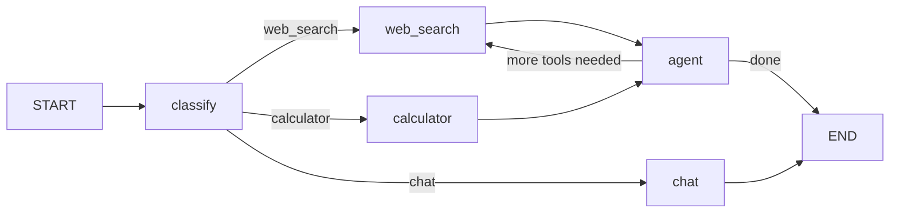

# Beginner Project: Q&A Agent with Tool Use and Routing

In this capstone project, you'll build a complete Q&A agent that can answer questions using tools and intelligent routing. This brings together everything you've learned: state, nodes, edges, LLMs, tools, and conditional branching.

---

## Project Overview

The agent will:

1. **Classify** the user's question into a category
2. **Route** to the appropriate handler based on the category
3. **Execute** tools or generate responses as needed
4. **Loop** if tools were called, to process results
5. **Return** a final answer



---

## Step 1: Setup and Imports

```python
from langchain_openai import ChatOpenAI
from langchain_core.tools import tool
from langchain_core.messages import HumanMessage, AIMessage, ToolMessage
from langchain.prompts import ChatPromptTemplate
from langchain_core.output_parsers import StrOutputParser
from langgraph.graph import StateGraph, START, END
from langgraph.prebuilt import ToolExecutor
from typing_extensions import TypedDict, List, Annotated
from typing import Any
from operator import add
import json
```

---

## Step 2: Define Tools

```python
@tool
def web_search(query: str) -> str:
    """Search the web for current information. Use for news, facts, and general knowledge."""
    # In production, call a real search API
    return f"## Web Results for '{query}'\n"
           f"1. LangGraph is a framework for building stateful AI agents.\n"
           f"2. It was created by LangChain Inc.\n"
           f"3. Version 0.2 was released in 2024."

@tool
def calculator(expression: str) -> str:
    """Evaluate a mathematical expression. Use Python syntax: +, -, *, /, **, //, %."""
    try:
        safe_dict = {"__builtins__": {}}
        result = eval(expression, safe_dict)
        return str(result)
    except Exception as e:
        return f"Calculation error: {e}"

@tool
def get_timezone(city: str) -> str:
    """Get the timezone for a given city."""
    timezones = {
        "new york": "America/New_York (UTC-5)",
        "london": "Europe/London (UTC+0)",
        "tokyo": "Asia/Tokyo (UTC+9)",
        "paris": "Europe/Paris (UTC+1)",
        "sydney": "Australia/Sydney (UTC+11)"
    }
    return timezones.get(city.lower(), f"Timezone not found for {city}")
```

[!NOTE]
These are simulated tools for the project. In production, replace them with real API calls to search engines, calculators, and timezone databases.

---

## Step 3: Initialize LLM and Tool Bindings

```python
llm = ChatOpenAI(model="gpt-4o-mini")

all_tools = [web_search, calculator, get_timezone]
llm_with_tools = llm.bind_tools(all_tools)
tool_executor = ToolExecutor(all_tools)
```

---

## Step 4: Define State

```python
class AgentState(TypedDict):
    messages: Annotated[List[Any], add]
    question: str
    category: str
    tool_results: List[str]
    final_answer: str
    error: str
```

| Field | Type | Purpose |
| :--- | :--- | :--- |
| `messages` | `Annotated[List, add]` | Full conversation history with appending |
| `question` | `str` | The user's original question |
| `category` | `str` | Classification result for routing |
| `tool_results` | `List[str]` | Accumulated tool outputs |
| `final_answer` | `str` | The final response to the user |
| `error` | `str` | Error tracking |

---

## Step 5: Define Nodes

### Classify Node

```python
def classify_question(state: AgentState) -> dict:
    prompt = ChatPromptTemplate.from_messages([
        ("system", "Classify the question into exactly one category:\n"
                   "- 'web_search': questions about news, facts, people, concepts\n"
                   "- 'calculator': math problems, calculations, equations\n"
                   "- 'chat': general conversation, opinions, explanations\n\n"
                   "Respond with ONLY the category name."),
        ("human", "{question}")
    ])
    chain = prompt | llm | StrOutputParser()
    category = chain.invoke({"question": state["question"]}).strip().lower()

    if category not in ["web_search", "calculator", "chat"]:
        category = "chat"  # Default fallback

    return {"category": category, "messages": [HumanMessage(state["question"])]}
```

### Web Search Node

```python
def web_search_node(state: AgentState) -> dict:
    try:
        result = tool_executor.invoke({
            "name": "web_search",
            "args": {"query": state["question"]},
            "id": "search_1",
            "type": "tool_call"
        })
        return {
            "tool_results": state["tool_results"] + [str(result)],
            "messages": [ToolMessage(content=str(result), tool_call_id="search_1")]
        }
    except Exception as e:
        return {"error": f"Web search failed: {e}"}
```

### Calculator Node

```python
def calculator_node(state: AgentState) -> dict:
    try:
        result = tool_executor.invoke({
            "name": "calculator",
            "args": {"expression": state["question"]},
            "id": "calc_1",
            "type": "tool_call"
        })
        return {
            "tool_results": state["tool_results"] + [str(result)],
            "messages": [ToolMessage(content=str(result), tool_call_id="calc_1")]
        }
    except Exception as e:
        return {"error": f"Calculator failed: {e}"}
```

### Agent Node (Handles Final Response)

```python
def agent_node(state: AgentState) -> dict:
    context = "\n".join(state["tool_results"]) if state["tool_results"] else "No tools were needed."

    prompt = ChatPromptTemplate.from_messages([
        ("system", "You are a helpful Q&A assistant. Answer the user's question "
                   "based on the available context. Be concise and accurate.\n\n"
                   "Context:\n{context}"),
        ("human", "{question}")
    ])

    chain = prompt | llm | StrOutputParser()
    answer = chain.invoke({
        "context": context,
        "question": state["question"]
    })

    return {
        "final_answer": answer,
        "messages": [AIMessage(content=answer)]
    }
```

[!TIP]
The agent node reads `tool_results` from state. If tools were used, it synthesizes a response from their output. If not, it answers directly.

---

## Step 6: Define Router Functions

```python
def route_by_category(state: AgentState) -> str:
    return state["category"]

def should_continue(state: AgentState) -> str:
    if state.get("error"):
        return "error"
    if state["category"] in ("web_search", "calculator"):
        return "use_agent"  # Tool was called, now synthesize
    return "done"  # Chat doesn't need tools
```

---

## Step 7: Build the Graph

```python
builder = StateGraph(AgentState)

# Add nodes
builder.add_node("classify", classify_question)
builder.add_node("web_search", web_search_node)
builder.add_node("calculator", calculator_node)
builder.add_node("agent", agent_node)

# Add edges
builder.add_edge(START, "classify")

# Conditional routing from classifier
builder.add_conditional_edges(
    "classify",
    route_by_category,
    {
        "web_search": "web_search",
        "calculator": "calculator",
        "chat": "agent"  # Chat goes directly to agent
    }
)

# After tools, go to agent for final answer
builder.add_edge("web_search", "agent")
builder.add_edge("calculator", "agent")
builder.add_edge("agent", END)

# Compile
app = builder.compile()
```

---

## Step 8: Run the Agent

```python
def ask_question(question: str) -> str:
    result = app.invoke({
        "messages": [],
        "question": question,
        "category": "",
        "tool_results": [],
        "final_answer": "",
        "error": ""
    })
    return result["final_answer"]

# Test the agent
print(ask_question("What is LangGraph?"))
# → Uses web_search and returns answer from context

print(ask_question("What is 245 * 37?"))
# → Routes to calculator, returns result via agent

print(ask_question("What timezone is Tokyo in?"))
# → Uses web_search (keyword: timezone), returns answer

print(ask_question("What is the meaning of life?"))
# → Routes to chat, LLM answers directly

print(ask_question("Solve: (15 + 7) * 2"))
# → Routes to calculator, evaluates expression
```

[!SUCCESS]
Your agent now intelligently routes questions to the right tool and synthesizes a final answer. This is the core pattern behind all LangGraph agents.

---

## Step 9: Add Streaming

```python
def ask_with_streaming(question: str) -> None:
    print(f"\nQ: {question}")
    print("-" * 40)

    for event in app.stream({
        "messages": [],
        "question": question,
        "category": "",
        "tool_results": [],
        "final_answer": "",
        "error": ""
    }):
        for node, update in event.items():
            if node == "__end__":
                continue
            if "category" in update:
                print(f"[Classified as: {update['category']}]")
            if "tool_results" in update:
                for r in update["tool_results"]:
                    print(f"[Tool result]: {r[:100]}...")
            if "final_answer" in update:
                print(f"[Answer]: {update['final_answer']}")
```

---

## Step 10: Error Handling and Edge Cases

```python
def safe_ask(question: str) -> str:
    try:
        result = app.invoke(
            {
                "messages": [],
                "question": question,
                "category": "",
                "tool_results": [],
                "final_answer": "",
                "error": ""
            },
            {"recursion_limit": 10}
        )

        if result.get("error"):
            return f"An error occurred: {result['error']}"

        return result.get("final_answer", "No answer generated.")

    except Exception as e:
        return f"Sorry, I encountered an error: {str(e)}"

# Test edge cases
print(safe_ask(""))                         # Empty question
print(safe_ask("123456" * 1000))            # Very long question
print(safe_ask("∫ x² dx"))                  # Unsupported input
```

[!NOTE]
Always wrap `app.invoke()` in try/except and set `recursion_limit`. This prevents crashes from unexpected inputs and infinite loops.

---

## Project Extension Ideas

1. **Add more tools**: Integrate a real search API (Tavily, SerpAPI), database query tool, or file reader
2. **Add memory**: Use the `add_messages` reducer on `messages` to track conversation history across turns
3. **Add confidence scoring**: Make the classifier return a confidence score, route to fallback if low
4. **Parallel tool calls**: For questions that need multiple tools, call them in parallel
5. **Human handoff**: Add an interrupt for questions the agent cannot answer

---

## Complete Project Code

```python
# Full project — combine all steps above
from langchain_openai import ChatOpenAI
from langchain_core.tools import tool
from langchain_core.messages import HumanMessage, AIMessage, ToolMessage
from langchain.prompts import ChatPromptTemplate
from langchain_core.output_parsers import StrOutputParser
from langgraph.graph import StateGraph, START, END
from langgraph.prebuilt import ToolExecutor
from typing_extensions import TypedDict, List, Annotated
from typing import Any
from operator import add

# Tools
@tool
def web_search(query: str) -> str:
    """Search the web for current information."""
    return f"Web results for '{query}' — LangGraph is a stateful agent framework."

@tool
def calculator(expression: str) -> str:
    """Evaluate mathematical expressions."""
    return str(eval(expression, {"__builtins__": {}}, {}))

# Setup
llm = ChatOpenAI(model="gpt-4o-mini")
all_tools = [web_search, calculator]
tool_executor = ToolExecutor(all_tools)

# State
class AgentState(TypedDict):
    messages: Annotated[List[Any], add]
    question: str
    category: str
    tool_results: List[str]
    final_answer: str
    error: str

# Nodes
def classify_question(state: AgentState) -> dict:
    prompt = ChatPromptTemplate.from_messages([
        ("system", "Classify as 'web_search', 'calculator', or 'chat'. Respond with only the category."),
        ("human", "{question}")
    ])
    chain = prompt | llm | StrOutputParser()
    cat = chain.invoke({"question": state["question"]}).strip().lower()
    return {"category": cat if cat in ("web_search", "calculator", "chat") else "chat",
            "messages": [HumanMessage(state["question"])]}

def web_search_node(state: AgentState) -> dict:
    result = tool_executor.invoke({"name": "web_search", "args": {"query": state["question"]}, "id": "s1", "type": "tool_call"})
    return {"tool_results": state["tool_results"] + [str(result)],
            "messages": [ToolMessage(content=str(result), tool_call_id="s1")]}

def calculator_node(state: AgentState) -> dict:
    result = tool_executor.invoke({"name": "calculator", "args": {"expression": state["question"]}, "id": "c1", "type": "tool_call"})
    return {"tool_results": state["tool_results"] + [str(result)],
            "messages": [ToolMessage(content=str(result), tool_call_id="c1")]}

def agent_node(state: AgentState) -> dict:
    context = "\n".join(state["tool_results"]) if state["tool_results"] else "No tools needed."
    prompt = ChatPromptTemplate.from_messages([
        ("system", "Answer concisely using context:\n{context}"),
        ("human", "{question}")
    ])
    answer = (prompt | llm | StrOutputParser()).invoke({"context": context, "question": state["question"]})
    return {"final_answer": answer, "messages": [AIMessage(content=answer)]}

# Router
def route_by_category(state: AgentState) -> str:
    return state["category"]

# Graph
builder = StateGraph(AgentState)
builder.add_node("classify", classify_question)
builder.add_node("web_search", web_search_node)
builder.add_node("calculator", calculator_node)
builder.add_node("agent", agent_node)

builder.add_edge(START, "classify")
builder.add_conditional_edges("classify", route_by_category, {
    "web_search": "web_search",
    "calculator": "calculator",
    "chat": "agent"
})
builder.add_edge("web_search", "agent")
builder.add_edge("calculator", "agent")
builder.add_edge("agent", END)

app = builder.compile()

# Run
if __name__ == "__main__":
    questions = [
        "What is LangGraph?",
        "What is 15 * 37?",
        "What timezone is Tokyo in?",
        "Tell me a fun fact"
    ]
    for q in questions:
        result = app.invoke({"messages": [], "question": q, "category": "", "tool_results": [], "final_answer": "", "error": ""})
        print(f"Q: {q}\nA: {result['final_answer']}\n")
```

---

## Practice Questions

```question
{
  "id": "lg-beginner-10-q1",
  "type": "multiple-choice",
  "question": "What is the first node executed in the Q&A agent project?",
  "options": ["web_search", "agent", "classify", "calculator"],
  "correct": 2,
  "explanation": "The classify node runs first to determine the category of the user's question."
}
```

```question
{
  "id": "lg-beginner-10-q2",
  "type": "multiple-choice",
  "question": "What happens after a tool node (web_search or calculator) executes?",
  "options": [
    "The graph ends immediately",
    "Execution goes to the agent node for final synthesis",
    "Execution goes back to classify",
    "The tool result is returned directly to the user"
  ],
  "correct": 1,
  "explanation": "After a tool runs, the agent node receives the tool results and synthesizes a final answer."
}
```

```question
{
  "id": "lg-beginner-10-q3",
  "type": "multiple-choice",
  "question": "What is the default fallback category in the classify node?",
  "options": ["web_search", "calculator", "chat", "error"],
  "correct": 2,
  "explanation": "If the LLM returns an unexpected category, it defaults to 'chat' for safe general handling."
}
```

```question
{
  "id": "lg-beginner-10-q4",
  "type": "multiple-choice",
  "question": "What state reducer is used for the messages field?",
  "options": ["replace", "add (append)", "merge", "overwrite"],
  "correct": 1,
  "explanation": "messages uses Annotated[List, add] so each message is appended to the conversation history."
}
```

```question
{
  "id": "lg-beginner-10-q5",
  "type": "multiple-choice",
  "question": "Why should you set recursion_limit when invoking the graph?",
  "options": [
    "To limit the number of parallel threads",
    "To prevent infinite loops if the routing logic has a bug",
    "To reduce token usage",
    "To speed up execution"
  ],
  "correct": 1,
  "explanation": "recursion_limit prevents infinite execution by capping the total number of node executions."
}
```

```question
{
  "id": "lg-beginner-10-q6",
  "type": "multiple-choice",
  "question": "What type of edge determines which tool node runs?",
  "options": ["add_edge()", "add_conditional_edges()", "set_entry_point()", "set_finish_point()"],
  "correct": 1,
  "explanation": "add_conditional_edges on the classify node routes to the appropriate tool based on the category."
}
```

```question
{
  "id": "lg-beginner-10-q7",
  "type": "multiple-choice",
  "question": "How does the agent node access tool outputs?",
  "options": [
    "Through the tool_results field in state",
    "By calling the tools again",
    "Through a separate API",
    "Tool outputs are stored in a file"
  ],
  "correct": 0,
  "explanation": "Tool nodes write to state['tool_results'], which the agent node reads to synthesize the answer."
}
```

```question
{
  "id": "lg-beginner-10-q8",
  "type": "multiple-choice",
  "question": "What category does a math question like 'What is 2+2?' route to?",
  "options": ["web_search", "calculator", "chat", "classify"],
  "correct": 1,
  "explanation": "Math questions are classified as 'calculator' and routed to the calculator node."
}
```

```question
{
  "id": "lg-beginner-10-q9",
  "type": "multiple-choice",
  "question": "What is the purpose of wrapping app.invoke() in try/except?",
  "options": [
    "To make the code slower",
    "To handle unexpected errors gracefully and return a friendly message",
    "To prevent the graph from compiling",
    "To log successful executions"
  ],
  "correct": 1,
  "explanation": "try/except around invoke() catches exceptions (LLM failures, tool errors, etc.) and returns a user-friendly error message."
}
```

```question
{
  "id": "lg-beginner-10-q10",
  "type": "multiple-choice",
  "question": "What does the ToolExecutor do in this project?",
  "options": [
    "It validates tool arguments",
    "It routes tool calls to the correct tool function by name",
    "It generates tool schemas for the LLM",
    "It executes tools in a sandbox"
  ],
  "correct": 1,
  "explanation": "ToolExecutor takes a tool_call dict and automatically invokes the correct function based on the 'name' field."
}
```

---

[!SUCCESS]
### Key Takeaways
- The Q&A agent uses classification → routing → tool execution → synthesis as its core pattern
- State flows through every node, accumulating results along the way
- The `add` reducer on messages appends to conversation history
- Conditional edges enable intelligent routing based on question category
- The agent node synthesizes tool results into a coherent final answer
- Always use try/except and recursion_limit for robust error handling
- This architecture is the foundation for all production LangGraph agents
