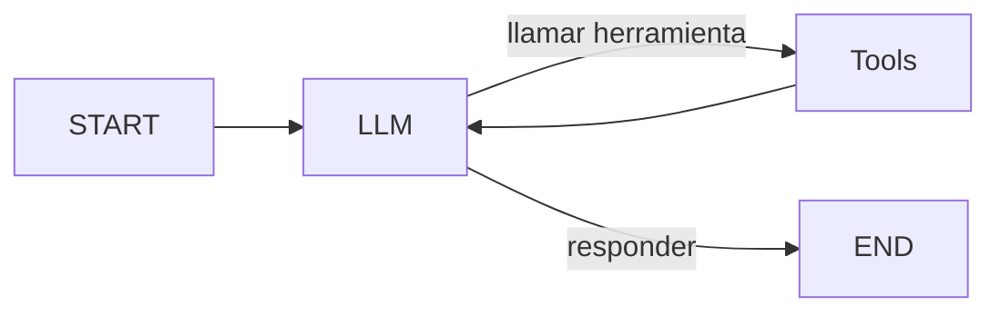

# ¿Qué es LangGraph?

LangGraph es un framework para construir aplicaciones de IA **basadas en estado** y **multi-actores**. Piensa en ello como un motor de grafo donde cada paso de tu flujo de trabajo de IA es un nodo, y las conexiones entre pasos son aristas.

---

## LangChain vs LangGraph

| Aspecto | LangChain | LangGraph |
| :--- | :--- | :--- |
| Paradigma | Pipeline lineal | Grafo cíclico |
| Estado | Efímero (pipe-through) | Persistente, compartido |
| Flujo de control | Secuencial fijo | Condicional, dinámico |
| Bucles | No soportados | Soportados (ReAct) |
| Caso de uso | Prompts simples, chains | Agentes, flujos complejos |

```python
# LangChain: pipeline lineal
chain = prompt | llm | output_parser

# LangGraph: grafo con estado
builder = StateGraph(State)
builder.add_node("agent", agent)
builder.add_node("tools", execute_tools)
builder.add_conditional_edges("agent", should_continue, {"continue": "tools", "end": END})
```

---

## ¿Por qué usar un Grafo?

Los flujos de trabajo del mundo real rara vez son lineales. Un agente típico necesita:

1. **Recibir** entrada del usuario
2. **Decidir** qué hacer (¿llamar a una herramienta? ¿responder?)
3. **Ejecutar** acciones (herramientas, búsqueda, cálculo)
4. **Repetir** hasta que esté listo
5. **Devolver** la respuesta final



Este bucle (llamar LLM → ejecutar herramienta → llamar LLM → ...) es imposible en un pipeline lineal. LangGraph lo hace natural.

---

## Conceptos Principales

| Concepto | Descripción |
| :--- | :--- |
| `State` | Un único diccionario compartido que contiene todos los datos del flujo de trabajo |
| `Node` | Una función de Python que lee/escribe en el State |
| `Edge` | Una conexión entre nodos, que define el orden de ejecución |
| `Conditional Edge` | Una arista que decide el siguiente nodo basada en el State actual |

[!NOTE]
Todo en LangGraph gira en torno al **State**. Los nodos lo leen, lo modifican y las aristas deciden qué ocurre después en función de él.

---

## Tu Primer Grafo

```python
from langgraph.graph import StateGraph, START, END
from typing_extensions import TypedDict

class MyState(TypedDict):
    message: str

def hello_world(state: MyState) -> dict:
    return {"message": "¡Hola, LangGraph!"}

builder = StateGraph(MyState)
builder.add_node("say_hello", hello_world)
builder.add_edge(START, "say_hello")
builder.add_edge("say_hello", END)
app = builder.compile()

result = app.invoke({"message": ""})
print(result["message"])  # ¡Hola, LangGraph!
```

[!SUCCESS]
¡Has construido tu primer grafo LangGraph! Este patrón — definir estado, añadir nodos, conectar aristas, compilar e invocar — es la base de todo lo que construyas.

---

## ¿Qué sigue?

En las próximas lecciones aprenderás:
- **Lección 2**: Repaso rápido de LangChain (prompts, LLMs, chains)
- **Lección 3**: Definir grafos de estado con esquemas tipados
- **Lección 4**: Trabajar con nodos y aristas
- **Lección 5**: Construir tu primer grafo funcional
- **Lección 6**: Añadir un LLM a tu grafo
- **Lección 7**: Dar herramientas a tu agente
- **Lección 8**: Cadenas secuenciales y pipelines
- **Lección 9**: Ramificación condicional
- **Lección 10**: Proyecto final: agente de Q&A

---

## Preguntas de Práctica

```question
{
  "id": "lg-beginner-01-q1",
  "type": "multiple-choice",
  "question": "¿Cuál es la principal diferencia entre LangChain y LangGraph?",
  "options": [
    "LangChain es para LLMs, LangGraph es para herramientas",
    "LangChain usa pipelines lineales, LangGraph usa grafos con estado",
    "LangChain es más rápido que LangGraph",
    "No hay diferencia, son el mismo framework"
  ],
  "correct": 1,
  "explanation": "LangChain se basa en pipelines lineales donde los datos fluyen en una dirección. LangGraph usa grafos con estado que soportan bucles, ramificaciones y estado compartido."
}
```

```question
{
  "id": "lg-beginner-01-q2",
  "type": "multiple-choice",
  "question": "¿Qué representa un Node en LangGraph?",
  "options": [
    "Una conexión entre dos componentes",
    "Un paso en el flujo de trabajo, normalmente una función de Python",
    "El estado global de la aplicación",
    "Un modelo de lenguaje"
  ],
  "correct": 1,
  "explanation": "Un Node es una función de Python que recibe el estado, realiza algún trabajo y devuelve actualizaciones al estado."
}
```

```question
{
  "id": "lg-beginner-01-q3",
  "type": "multiple-choice",
  "question": "¿Qué hace una Conditional Edge?",
  "options": [
    "Siempre ejecuta el siguiente nodo en orden",
    "Decide el siguiente nodo basándose en el estado actual",
    "Conecta dos nodos sin condición",
    "Elimina un nodo del grafo"
  ],
  "correct": 1,
  "explanation": "Una Conditional Edge evalúa el estado actual y elige dinámicamente qué nodo ejecutar a continuación."
}
```

```question
{
  "id": "lg-beginner-01-q4",
  "type": "multiple-choice",
  "question": "¿Qué tipo de flujo de trabajo NO es posible en un pipeline lineal de LangChain pero sí en LangGraph?",
  "options": [
    "Pipeline de transformación de texto",
    "Bucle que decide si continuar basándose en resultados intermedios",
    "Parser de salida estructurada",
    "Chain de prompts con plantillas"
  ],
  "correct": 1,
  "explanation": "Los bucles (ejecutar, comprobar, re-ejecutar) son imposibles en pipelines lineales pero naturales en los grafos de LangGraph."
}
```

```question
{
  "id": "lg-beginner-01-q5",
  "type": "multiple-choice",
  "question": "¿Cuál es el papel del State en LangGraph?",
  "options": [
    "Solo almacena la entrada del usuario",
    "Es un diccionario compartido al que cada nodo puede leer y escribir",
    "Es opcional y rara vez se usa",
    "Se reinicia después de cada nodo"
  ],
  "correct": 1,
  "explanation": "El State es el centro de LangGraph — un diccionario compartido que cada nodo lee y modifica, fluyendo a través de todo el grafo."
}
```

---

[!SUCCESS]
### Puntos Clave
- LangGraph construye aplicaciones de IA como grafos con estado, no pipelines lineales
- Nodos = funciones de Python; Aristas = conexiones entre nodos
- Aristas Condicionales permiten rutas de ejecución dinámicas
- El State es un diccionario compartido, accesible por todos los nodos
- LangGraph soporta bucles, ramificaciones y flujos complejos del mundo real
- Los grafos se construyen con: StateGraph, add_node, add_edge, compile e invoke
