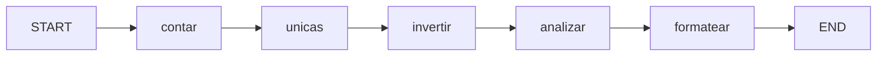

# Construyendo un Grafo Simple

Construyamos un grafo LangGraph completamente funcional desde cero. Este ejemplo de **analizador de texto** toma texto de entrada, lo analiza y formatea los resultados.

---

## Paso 1: Definir el Estado

```python
from typing_extensions import TypedDict

class EstadoTexto(TypedDict):
    texto: str
    recuento_palabras: int
    palabras_unicas: list
    texto_invertido: str
    analisis: str
```

---

## Paso 2: Definir Nodos

```python
def contar_palabras(state: EstadoTexto) -> dict:
    palabras = state["texto"].split()
    return {"recuento_palabras": len(palabras)}

def encontrar_unicas(state: EstadoTexto) -> dict:
    palabras = state["texto"].lower().split()
    return {"palabras_unicas": list(set(palabras))}

def invertir_texto(state: EstadoTexto) -> dict:
    return {"texto_invertido": state["texto"][::-1]}

def generar_analisis(state: EstadoTexto) -> dict:
    analisis = (
        f"Texto: '{state['texto']}'\n"
        f"Recuento de palabras: {state['recuento_palabras']}\n"
        f"Palabras únicas: {len(state['palabras_unicas'])}\n"
        f"Invertido: {state['texto_invertido']}"
    )
    return {"analisis": analisis}

def formatear_resultado(state: EstadoTexto) -> dict:
    return {"texto": f"## Resultado del Análisis\n\n{state['analisis']}"}
```

---

## Paso 3: Construir el Grafo

```python
from langgraph.graph import StateGraph, START, END

builder = StateGraph(EstadoTexto)

# Añadir nodos
builder.add_node("contar", contar_palabras)
builder.add_node("unicas", encontrar_unicas)
builder.add_node("invertir", invertir_texto)
builder.add_node("analizar", generar_analisis)
builder.add_node("formatear", formatear_resultado)

# Añadir aristas (flujo secuencial)
builder.add_edge(START, "contar")
builder.add_edge("contar", "unicas")
builder.add_edge("unicas", "invertir")
builder.add_edge("invertir", "analizar")
builder.add_edge("analizar", "formatear")
builder.add_edge("formatear", END)

# Compilar
app = builder.compile()
```

---

## Paso 4: Ejecutar el Grafo

```python
resultado = app.invoke({
    "texto": "Hola mundo desde LangGraph",
    "recuento_palabras": 0,
    "palabras_unicas": [],
    "texto_invertido": "",
    "analisis": ""
})

print(resultado["texto"])
# ## Resultado del Análisis
#
# Texto: 'Hola mundo desde LangGraph'
# Recuento de palabras: 4
# Palabras únicas: 4
# Invertido: hparGgnaL edsed odnum aloH
```

[!NOTE]
Observa cómo `contar_palabras` se ejecuta primero y escribe `recuento_palabras`. Luego `generar_analisis` lo lee. El estado fluye automáticamente — los nodos no necesitan pasarse datos explícitamente.

---

## El Flujo Completo



Cada paso es un nodo separado. Cada uno contribuye al estado. El último (`formatear`) produce la salida final.

---

## Probando con Diferentes Entradas

```python
def analizar_texto(texto: str) -> str:
    resultado = app.invoke({
        "texto": texto,
        "recuento_palabras": 0,
        "palabras_unicas": [],
        "texto_invertido": "",
        "analisis": ""
    })
    return resultado["texto"]

# Pruebas
print(analizar_texto("Python es genial"))
print(analizar_texto("LangGraph LangGraph LangGraph"))
print(analizar_texto("Uno dos tres cuatro cinco"))
```

[!SUCCESS]
¡Felicitaciones! Has construido un grafo LangGraph completamente funcional con múltiples nodos, flujo de estado automático y salida formateada.

---

## Preguntas de Práctica

```question
{
  "id": "lg-beginner-05-q1",
  "type": "multiple-choice",
  "question": "¿Cuál es el primer paso al construir un grafo LangGraph?",
  "options": [
    "Añadir aristas",
    "Definir el esquema de estado",
    "Compilar el grafo",
    "Invocar el grafo"
  ],
  "correct": 1,
  "explanation": "El primer paso es siempre definir el esquema de estado con TypedDict (o dataclass/Pydantic)."
}
```

```question
{
  "id": "lg-beginner-05-q2",
  "type": "multiple-choice",
  "question": "¿Qué método prepara el grafo para la ejecución?",
  "options": [".run()", ".compile()", ".build()", ".prepare()"],
  "correct": 1,
  "explanation": ".compile() construye el grafo internamente y devuelve una aplicación ejecutable."
}
```

```question
{
  "id": "lg-beginner-05-q3",
  "type": "multiple-choice",
  "question": "¿Qué método ejecuta el grafo con datos de entrada?",
  "options": [".run()", ".execute()", ".invoke()", ".call()"],
  "correct": 2,
  "explanation": ".invoke(datos_iniciales) ejecuta el grafo desde START hasta END y devuelve el estado final."
}
```

```question
{
  "id": "lg-beginner-05-q4",
  "type": "multiple-choice",
  "question": "En el ejemplo del analizador de texto, ¿qué nodo se ejecuta primero después de START?",
  "options": ["unicas", "formatear", "contar", "invertir"],
  "correct": 2,
  "explanation": "El nodo 'contar' está conectado a START mediante add_edge(START, 'contar'), por lo que se ejecuta primero."
}
```

```question
{
  "id": "lg-beginner-05-q5",
  "type": "multiple-choice",
  "question": "¿Cómo accede generar_analisis a los resultados de contar_palabras?",
  "options": [
    "Recibiendo la salida directamente de contar_palabras",
    "Leyendo state['recuento_palabras'] del diccionario de estado compartido",
    "Mediante una llamada a API",
    "A través de una variable global"
  ],
  "correct": 1,
  "explanation": "Todos los nodos comparten el mismo diccionario de estado. generar_analisis lee state['recuento_palabras'] que fue escrito por contar_palabras."
}
```

---

[!SUCCESS]
### Puntos Clave
- Construir grafo: definir estado → añadir nodos → añadir aristas → compilar → invocar
- El estado fluye automáticamente entre nodos — no se necesita paso explícito de datos
- Cada nodo se enfoca en una tarea y contribuye al estado
- .compile() prepara el grafo; .invoke() lo ejecuta con datos iniciales
- Los valores iniciales deben proporcionarse para todos los campos del estado
- El resultado de invoke() contiene el estado final después de que todos los nodos se ejecutan
