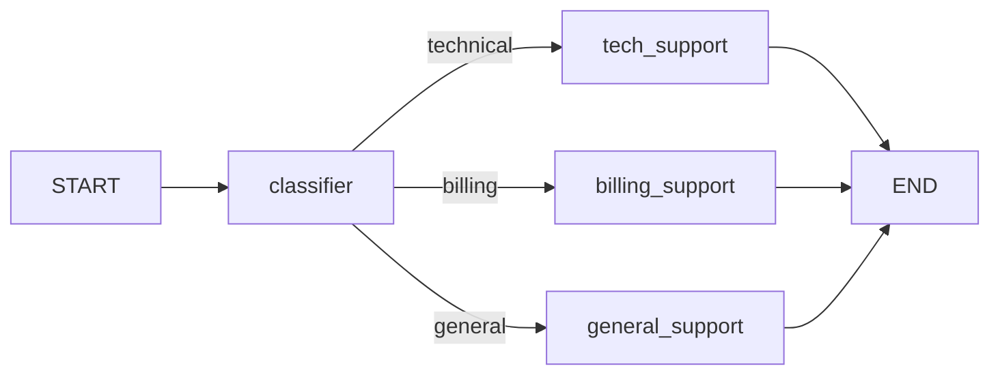

# Ramificación Condicional

No todos los grafos son lineales. La ramificación condicional permite que tu grafo tome decisiones en tiempo de ejecución, enrutando la ejecución a diferentes caminos basándose en el estado actual.

---

## ¿Qué es la Ramificación Condicional?

Ramificación condicional significa que el siguiente nodo a ejecutar depende del **estado actual**, no de una topología fija.



---

## add_conditional_edges

```python
from langgraph.graph import StateGraph, START, END
from typing_extensions import TypedDict

class State(TypedDict):
    input_text: str
    category: str

def classifier(state: State) -> dict:
    text = state["input_text"].lower()
    if "bill" in text or "payment" in text:
        return {"category": "billing"}
    elif "bug" in text or "error" in text:
        return {"category": "technical"}
    else:
        return {"category": "general"}

def route_by_category(state: State) -> str:
    return state["category"]

builder = StateGraph(State)
builder.add_node("classifier", classifier)
builder.add_node("tech_support", lambda s: {"tech_support": True})
builder.add_node("billing_support", lambda s: {"billing_support": True})
builder.add_node("general_support", lambda s: {"general_support": True})

builder.add_edge(START, "classifier")
builder.add_conditional_edges("classifier", route_by_category, {
    "technical": "tech_support",
    "billing": "billing_support",
    "general": "general_support"
})
builder.add_edge("tech_support", END)
builder.add_edge("billing_support", END)
builder.add_edge("general_support", END)

app = builder.compile()
```

---

## Ruteo con LLM

```python
from langchain_openai import ChatOpenAI
from langchain.prompts import ChatPromptTemplate
from langchain_core.output_parsers import StrOutputParser

llm = ChatOpenAI(model="gpt-4o-mini")

def classify_route(state: RouteState) -> dict:
    prompt = ChatPromptTemplate.from_messages([
        ("system", "Clasifica la consulta en: 'technical', 'billing' o 'general'."),
        ("human", "{query}")
    ])
    chain = prompt | llm | StrOutputParser()
    route = chain.invoke({"query": state["query"]}).strip().lower()
    return {"route": route}
```

---

## Bucles Condicionales

```python
class LoopState(TypedDict):
    input: str
    result: str
    attempts: int
    is_valid: bool

def process(state: LoopState) -> dict:
    result = attempt_processing(state["input"])
    is_valid = validate_result(result)
    return {"result": result, "is_valid": is_valid, "attempts": state["attempts"] + 1}

def loop_router(state: LoopState) -> str:
    if state["is_valid"]:
        return "valid"
    if state["attempts"] >= 3:
        return "max_retries"
    return "retry"

builder.add_conditional_edges("process", loop_router, {
    "valid": "format_output",
    "retry": "process",
    "max_retries": "error_handler"
})
```

[!WARNING]
Siempre incluye un número máximo de reintentos en bucles. Sin él, un fallo persistente causa un bucle infinito.

---

## Preguntas de Práctica

```question
{
  "id": "lg-beginner-09-q1",
  "type": "multiple-choice",
  "question": "¿Qué método se usa para la ramificación condicional en LangGraph?",
  "options": ["add_edge()", "add_conditional_edges()", "set_conditional()", "branch()"],
  "correct": 1,
  "explanation": "add_conditional_edges() añade aristas determinadas en tiempo de ejecución por una función de enrutamiento."
}
```

```question
{
  "id": "lg-beginner-09-q2",
  "type": "multiple-choice",
  "question": "¿Qué recibe y devuelve una función de enrutamiento?",
  "options": [
    "Recibe el estado completo, devuelve una clave de string",
    "Recibe solo la consulta, devuelve un booleano",
    "Recibe nada, devuelve una función de nodo",
    "Recibe la salida del nodo anterior, devuelve un dict"
  ],
  "correct": 0,
  "explanation": "Una función de enrutamiento recibe el diccionario de estado completo y devuelve un string que mapea a un nodo destino."
}
```

```question
{
  "id": "lg-beginner-09-q3",
  "type": "multiple-choice",
  "question": "¿Qué sucede si un enrutador devuelve un valor no presente en el mapeo?",
  "options": [
    "El grafo toma la ruta por defecto",
    "Se lanza un error",
    "El enrutador se llama de nuevo",
    "El grafo se pausa"
  ],
  "correct": 1,
  "explanation": "Todos los valores de retorno del enrutador deben tener entradas correspondientes en el mapeo."
}
```

```question
{
  "id": "lg-beginner-09-q4",
  "type": "multiple-choice",
  "question": "¿Cuál es el uso más común de aristas condicionales en agentes?",
  "options": [
    "Formatear salida",
    "Crear bucles que repiten hasta que se cumple una condición",
    "Añadir logging",
    "Configurar el LLM"
  ],
  "correct": 1,
  "explanation": "Las aristas condicionales permiten el bucle ReAct: llamar LLM → ejecutar herramientas → verificar si terminó → volver o finalizar."
}
```

```question
{
  "id": "lg-beginner-09-q5",
  "type": "multiple-choice",
  "question": "¿Cómo crear una arista condicional binaria simple (sí/no)?",
  "options": [
    "Usa un enrutador que devuelve 'sí' o 'no' con un mapeo de dos entradas",
    "Usa dos llamadas add_edge()",
    "Usa un retorno booleano en la función del nodo",
    "El enrutamiento binario no está soportado"
  ],
  "correct": 0,
  "explanation": "Un enrutador que devuelve 'done'/'continue' con un mapeo de dos entradas es el patrón binario estándar."
}
```

```question
{
  "id": "lg-beginner-09-q6",
  "type": "multiple-choice",
  "question": "¿Qué deberías incluir siempre en un bucle con aristas condicionales?",
  "options": [
    "Un temporizador",
    "Un número máximo de reintentos como condición de terminación",
    "Una conexión de base de datos",
    "Al menos 10 nodos"
  ],
  "correct": 1,
  "explanation": "Siempre incluye un número máximo de reintentos/iteraciones para evitar bucles infinitos."
}
```

```question
{
  "id": "lg-beginner-09-q7",
  "type": "multiple-choice",
  "question": "¿Se puede usar un LLM como enrutador en LangGraph?",
  "options": [
    "No, los enrutadores deben ser funciones determinísticas",
    "Sí, usa un LLM para clasificar la entrada y escribir la decisión en el estado",
    "Solo con integraciones específicas de LangChain",
    "Los LLM son demasiado lentos para enrutar"
  ],
  "correct": 1,
  "explanation": "El enrutamiento con LLM es común: un LLM clasifica la entrada, escribe la categoría en el estado y una función simple la lee."
}
```

```question
{
  "id": "lg-beginner-09-q8",
  "type": "multiple-choice",
  "question": "¿Qué constante puede usarse como destino en el mapeo de arista condicional?",
  "options": ["START", "END", "HALT", "BREAK"],
  "correct": 1,
  "explanation": "END es válido como destino de arista condicional, permitiendo que el grafo termine desde una rama condicional."
}
```

---

[!SUCCESS]
### Puntos Clave
- `add_conditional_edges(origen, enrutador, mapeo)` permite enrutamiento dinámico
- Las funciones de enrutamiento reciben el estado y devuelven una clave de string
- El mapeo traduce la salida del enrutador en nombres de nodos destino
- Los bucles se crean mapeando una ruta de vuelta a un nodo ejecutado anteriormente
- El enrutamiento con LLM usa un LLM para clasificar y escribir la ruta en el estado
- Cubre siempre todas las salidas posibles del enrutador en el mapeo
- Incluye condiciones de terminación en bucles para evitar ejecución infinita
- END puede ser un destino en mapeos de arista condicional
