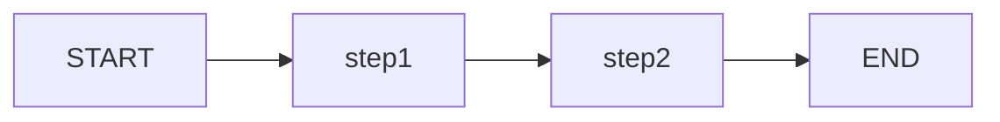

# Estado, Grafos e StateGraph

LangGraph é construído em torno do conceito de um **grafo direcionado stateful**. Entender como StateGraph funciona é essencial antes de escrever qualquer código de agente.

---

## O que é um StateGraph?

`StateGraph` é a classe principal para construir aplicações LangGraph. Ela gerencia:

- Um **schema de tipo** que define a forma do estado
- Uma coleção de **nós** que processam e atualizam o estado
- Um conjunto de **arestas** que definem a topologia de execução
- **Compilação** que valida e congela o grafo

```python
from langgraph.graph import StateGraph, START, END
from typing_extensions import TypedDict

class SearchState(TypedDict):
    query: str
    results: list[str]
    status: str

builder = StateGraph(SearchState)
```

[!IMPORTANT]
Sempre use `StateGraph` em vez da classe básica `Graph`. `StateGraph` fornece estado tipado, checkpointing e todos os recursos de produção. A classe básica `Graph` está depreciada para a maioria dos casos de uso.

---

## Schema de Estado

O **Estado** é um dicionário que flui através de cada nó. É definido usando `TypedDict`, `dataclass` ou `pydantic.BaseModel`.

### TypedDict (Recomendado para Iniciantes)

```python
from typing_extensions import TypedDict
from typing import List, Optional

class AgentState(TypedDict):
    messages: List[str]
    turn_count: int
    is_complete: bool
    final_answer: Optional[str]
```

Cada nó no grafo recebe um dict correspondente a este schema e retorna um **dict parcial** com apenas as chaves que deseja atualizar.

```python
def first_node(state: AgentState) -> dict:
    # Ler do estado
    current_turn = state["turn_count"]

    # Retornar apenas as atualizações
    return {
        "messages": state["messages"] + ["Hello from node 1"],
        "turn_count": current_turn + 1
        # is_complete e final_answer permanecem inalterados
    }
```

### Dataclass State

```python
from dataclasses import dataclass, field
from typing import List

@dataclass
class AgentState:
    messages: List[str] = field(default_factory=list)
    turn_count: int = 0
    is_complete: bool = False
```

[!NOTE]
Dataclasses fornecem valores padrão e estado mutável. Use `field(default_factory=...)` para valores padrão mutáveis como listas.

### Pydantic BaseModel State

```python
from pydantic import BaseModel, Field
from typing import List

class AgentState(BaseModel):
    messages: List[str] = Field(default_factory=list)
    turn_count: int = 0
    is_complete: bool = False
```

[!TIP]
Use `TypedDict` para prototipagem (menos boilerplate). Use `BaseModel` para produção (validação, serialização, schema JSON). As três abordagens funcionam de forma idêntica no nível do grafo.

---

## Como o Estado Flui Através do Grafo

```
Estado Inicial → Nó A → (atualiza estado) → Nó B → (atualiza estado) → Estado Final
                    ↑                                               |
                    └─────────── (loop de volta para A) ────────────┘
```

Cada nó:
1. **Recebe** o estado completo atual como um dict
2. **Processa** os dados (chama LLM, executa ferramentas, etc.)
3. **Retorna** um dict parcial de atualizações
4. LangGraph **mescla** as atualizações no estado compartilhado

### Regras de Mesclagem de Estado

| Valor de Retorno | Comportamento |
| :--- | :--- |
| `{"key": "value"}` | Atualiza `state["key"]` para `"value"` |
| `{"key": state["key"] + ["new"]}` | Substitui `state["key"]` com nova lista |
| `return None` | Nenhuma alteração no estado |
| `return {}` | Nenhuma alteração no estado |

[!WARNING]
Atualizações de estado usam uma **mesclagem superficial**. Se o estado tem dicts aninhados, retornar `{"nested": {"inner": 1}}` substitui a chave `nested` inteira — não faz mesclagem profunda. Para mesclagens profundas, você precisa de redutores personalizados (abordado no curso Intermediário).

---

## Nós

Nós são as unidades de processamento de um grafo. Um nó é simplesmente uma função Python que recebe estado e retorna atualizações.

### Assinatura da Função

```python
def node_function(state: StateType) -> dict:
    # Processar estado
    # Retornar atualizações
    return {"key": new_value}
```

### Registro de Nó

```python
builder = StateGraph(AgentState)

builder.add_node("process", node_function)
#                   ^nome    ^referência da função
```

[!TIP]
Nomes de nós devem ser únicos. Use nomes descritivos como `"analyze_query"`, `"search_database"`, `"generate_response"` em vez de `"node1"`, `"node2"`.

### Nós com Config

```python
def node_with_config(state: StateType, config: dict) -> dict:
    # Acessar parâmetros configuráveis
    user_id = config.get("configurable", {}).get("user_id")
    return {"processed": True}

builder.add_node("configurable", node_with_config)
```

### Nós com Argumentos de Palavra-chave Extras

```python
from langgraph.graph import StateGraph

def node_with_kwargs(state: StateType, **kwargs) -> dict:
    # kwargs contém parâmetros adicionais de tempo de execução
    return {"received": kwargs.get("extra_param", "default")}
```

---

## Arestas

Arestas conectam nós e definem o caminho de execução.

### Aresta Básica

```python
# Após o nó A terminar, execute o nó B
builder.add_edge("A", "B")
```

### Ponto de Entrada

```python
# Marcar o nó inicial
builder.set_entry_point("A")

# Ou usando a constante START
from langgraph.graph import START
builder.add_edge(START, "A")
```

### Ponto de Finalização

```python
# Marcar o nó final
builder.set_finish_point("C")

# Ou usando a constante END
from langgraph.graph import END
builder.add_edge("C", END)
```

[!NOTE]
Usar as constantes `START` e `END` é a abordagem moderna. Elas estão disponíveis em `langgraph.graph` e tornam a definição do grafo mais legível.

---

## Compilação

A compilação valida a estrutura do grafo e produz um objeto executável.

```python
# Compilar o grafo
app = builder.compile()

# O grafo agora está congelado — não é possível adicionar mais nós ou arestas
```

### O que a Compilação Faz

1. **Valida** que todos os nós referenciados existem
2. **Verifica** nós inalcançáveis (sem aresta de entrada)
3. **Verifica** se o grafo está conectado (todo nó alcançável a partir de START)
4. **Congela** a topologia para que possa ser invocada eficientemente
5. **Prepara** checkpointers se configurados

### Invocação

```python
# Invocar com estado inicial
result = app.invoke({
    "messages": [],
    "turn_count": 0,
    "is_complete": False,
    "final_answer": None
})

# Acessar o estado final
print(result["messages"])
print(result["turn_count"])
```

### Streaming

```python
# Stream para ver estados intermediários
for event in app.stream({
    "messages": [],
    "turn_count": 0,
    "is_complete": False,
    "final_answer": None
}):
    for node_name, state_update in event.items():
        if node_name != "__end__":
            print(f"[{node_name}]: {state_update}")
```

---

## Exemplo Mínimo Completo

```python
from langgraph.graph import StateGraph, START, END
from typing_extensions import TypedDict

class MyState(TypedDict):
    value: str
    step_count: int

def step_one(state: MyState) -> dict:
    print("Step 1")
    return {
        "value": f"Processed: {state['value']}",
        "step_count": state["step_count"] + 1
    }

def step_two(state: MyState) -> dict:
    print("Step 2")
    return {
        "value": f"Final: {state['value']}",
        "step_count": state["step_count"] + 1
    }

# Construir
builder = StateGraph(MyState)
builder.add_node("step1", step_one)
builder.add_node("step2", step_two)
builder.add_edge(START, "step1")
builder.add_edge("step1", "step2")
builder.add_edge("step2", END)

# Compilar
app = builder.compile()

# Executar
result = app.invoke({"value": "hello", "step_count": 0})
print(result["value"])       # Final: Processed: hello
print(result["step_count"])  # 2
```

[!SUCCESS]
Este padrão — definir estado, adicionar nós, adicionar arestas, compilar, invocar — é a fundação de toda aplicação LangGraph. Cada agente que você construir seguirá estes cinco passos.

---

## Visualizando o Grafo

LangGraph suporta gerar diagramas Mermaid a partir de grafos compilados:

```python
# Obter o diagrama Mermaid como string
mermaid_code = app.get_graph().draw_mermaid()
print(mermaid_code)

# Salvar em arquivo
with open("graph.md", "w") as f:
    f.write(app.get_graph().draw_mermaid())
```

Saída Mermaid:



[!TIP]
Use `app.get_graph().draw_mermaid()` durante o desenvolvimento para verificar se a topologia do seu grafo corresponde ao seu design.

---

## Tratamento de Erro no Nível do Grafo

```python
from langgraph.errors import GraphRecursionError

try:
    result = app.invoke(initial_state, {"recursion_limit": 10})
except GraphRecursionError:
    print("Graph hit recursion limit — possible infinite loop")
except Exception as e:
    print(f"Graph execution failed: {e}")
```

[!WARNING]
Sempre defina um `recursion_limit` para grafos com loops. O padrão é geralmente 25 passos. Sem ele, uma aresta condicional com bug pode causar um loop infinito.

---

## Perguntas de Prática

```question
{
  "id": "lg-beginner-03-q1",
  "type": "multiple-choice",
  "question": "O que uma função de nó em LangGraph recebe e retorna?",
  "options": [
    "Recebe o dict de estado completo, retorna um dict de atualização parcial",
    "Recebe um único valor, retorna um único valor",
    "Não recebe nada, retorna o estado completo",
    "Recebe a saída do nó anterior, retorna a entrada do próximo nó"
  ],
  "correct": 0,
  "explanation": "Cada nó recebe o estado completo atual e retorna um dict parcial de atualizações que LangGraph mescla no estado compartilhado."
}
```

```question
{
  "id": "lg-beginner-03-q2",
  "type": "multiple-choice",
  "question": "O que o método compile() faz?",
  "options": [
    "Valida e congela o grafo em um objeto executável",
    "Faz deploy do grafo para a nuvem",
    "Gera código Python a partir da definição do grafo",
    "Otimiza o grafo para execução mais rápida"
  ],
  "correct": 0,
  "explanation": "compile() valida a estrutura do grafo, verifica conectividade, congela a topologia e retorna um CompiledGraph pronto para invocação."
}
```

```question
{
  "id": "lg-beginner-03-q3",
  "type": "multiple-choice",
  "question": "Qual das seguintes é uma forma válida de definir estado em LangGraph?",
  "options": ["TypedDict", "dataclass", "pydantic.BaseModel", "Todas as acima"],
  "correct": 3,
  "explanation": "LangGraph suporta TypedDict, dataclass e pydantic.BaseModel para definição de estado."
}
```

```question
{
  "id": "lg-beginner-03-q4",
  "type": "multiple-choice",
  "question": "O que set_entry_point() faz?",
  "options": [
    "Especifica qual nó executa por último",
    "Especifica qual nó executa primeiro",
    "Define uma função de roteamento condicional",
    "Configura logging para o grafo"
  ],
  "correct": 1,
  "explanation": "set_entry_point() (ou add_edge(START, node)) marca qual nó executa primeiro quando o grafo é invocado."
}
```

```question
{
  "id": "lg-beginner-03-q5",
  "type": "multiple-choice",
  "question": "O que acontece se uma função de nó retorna None?",
  "options": [
    "O grafo lança um erro",
    "O nó é pulado na execução",
    "Nenhuma alteração é feita no estado",
    "O estado é resetado para valores iniciais"
  ],
  "correct": 2,
  "explanation": "Se um nó retorna None, nenhuma atualização de estado é aplicada. O estado passa inalterado para o próximo nó."
}
```

```question
{
  "id": "lg-beginner-03-q6",
  "type": "multiple-choice",
  "question": "Qual é o propósito da constante START?",
  "options": [
    "Marca o primeiro nó a executar",
    "Ativa o modo de debug",
    "Reseta o estado",
    "Define o nome do grafo"
  ],
  "correct": 0,
  "explanation": "START é uma constante de nó especial usada com add_edge() para definir onde a execução começa."
}
```

```question
{
  "id": "lg-beginner-03-q7",
  "type": "multiple-choice",
  "question": "Como LangGraph mescla atualizações de estado de um nó?",
  "options": [
    "Mescla profundamente dicionários aninhados",
    "Mesclagem superficial — substitui chaves de nível superior",
    "Adiciona a todos os valores de lista",
    "Sobrescreve o estado inteiro"
  ],
  "correct": 1,
  "explanation": "LangGraph realiza uma mesclagem superficial. Retornar {\"key\": value} substitui state[\"key\"]. Estruturas aninhadas são substituídas, não mescladas profundamente."
}
```

```question
{
  "id": "lg-beginner-03-q8",
  "type": "multiple-choice",
  "question": "Você pode adicionar nós a um grafo compilado?",
  "options": [
    "Sim, a qualquer momento",
    "Não, a compilação congela a definição do grafo",
    "Apenas se usar o método update_graph()",
    "Sim, mas apenas antes da primeira invocação"
  ],
  "correct": 1,
  "explanation": "Após compile(), o grafo está congelado. Você deve reconstruir o builder para adicionar nós ou arestas."
}
```

```question
{
  "id": "lg-beginner-03-q9",
  "type": "multiple-choice",
  "question": "O que recursion_limit controla?",
  "options": [
    "A profundidade do estado de dicionário aninhado",
    "O número máximo de execuções de nó antes de parar",
    "O número de threads paralelas",
    "O número de arestas no grafo"
  ],
  "correct": 1,
  "explanation": "recursion_limit define um limite máximo de execuções de nó para evitar loops infinitos. O padrão é tipicamente 25."
}
```

```question
{
  "id": "lg-beginner-03-q10",
  "type": "multiple-choice",
  "question": "Qual ferramenta LangGraph fornece para visualizar a estrutura do grafo?",
  "options": [
    "graphviz",
    "draw_mermaid() no grafo compilado",
    "matplotlib",
    "visualização networkx"
  ],
  "correct": 1,
  "explanation": "compiled_graph.get_graph().draw_mermaid() gera um diagrama Mermaid da topologia do grafo."
}
```

---

[!SUCCESS]
### Principais Conclusões
- StateGraph é a classe principal; gerencia estado tipado, nós, arestas e compilação
- Estado é um dict definido com TypedDict, dataclass ou BaseModel
- Nós são funções que recebem o estado completo e retornam atualizações parciais
- Arestas (add_edge, START, END) definem a topologia de execução
- compile() valida e congela o grafo em um objeto executável
- invoke() executa o grafo; stream() mostra estados intermediários
- Atualizações de estado usam mesclagem superficial — chaves de nível superior são substituídas
- Sempre defina recursion_limit para grafos com loops
- Use get_graph().draw_mermaid() para visualizar seu grafo
