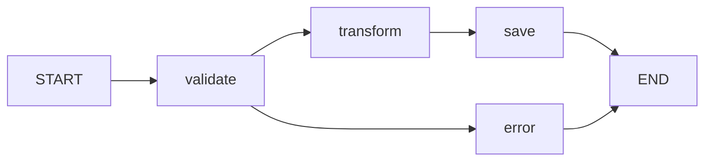
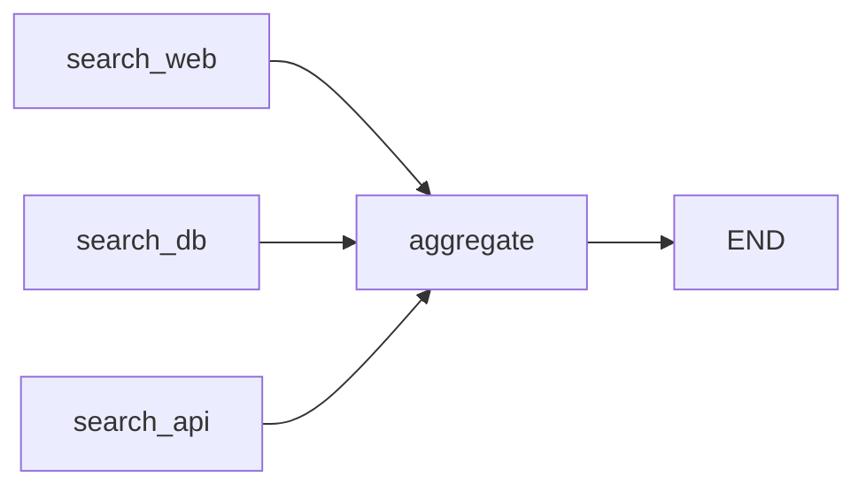

# Nós e Arestas

Nós e arestas são os blocos de construção de qualquer aplicação LangGraph. Nós fazem o trabalho, arestas definem o fluxo.

---

## Adicionando Nós com add_node

Cada nó é uma função Python registrada com um nome único:

```python
from langgraph.graph import StateGraph
from typing_extensions import TypedDict

class State(TypedDict):
    messages: list[str]
    count: int

builder = StateGraph(State)

def greet(state: State) -> dict:
    return {"messages": state["messages"] + ["Hello!"]}

def increment(state: State) -> dict:
    return {"count": state["count"] + 1}

builder.add_node("greet", greet)
builder.add_node("increment", increment)
```

### Regras de Nome de Nó

- Nomes devem ser **únicos** dentro do grafo
- Use **nomes descritivos** (`"analyze_query"` em vez de `"node_1"`)
- Nomes são usados em definições de arestas e saída de streaming
- Evite caracteres especiais e espaços

### Adicionando Múltiplos Nós

```python
def node_a(state: State) -> dict:
    return {"messages": state["messages"] + ["A"]}

def node_b(state: State) -> dict:
    return {"messages": state["messages"] + ["B"]}

def node_c(state: State) -> dict:
    return {"messages": state["messages"] + ["C"]}

builder.add_node("a", node_a)
builder.add_node("b", node_b)
builder.add_node("c", node_c)
```

[!TIP]
Você pode adicionar nós em qualquer ordem. A ordem de execução é determinada pelas arestas, não pela ordem em que você chama add_node().

---

## Valores de Retorno de Nó

Nós devem retornar um dos seguintes:

| Tipo de Retorno | Comportamento |
| :--- | :--- |
| `dict` | Chaves são mescladas no estado (mesclagem superficial) |
| `None` | Estado permanece inalterado |
| `{}` | Dict vazio, estado permanece inalterado |

### Padrão: Ler e Escrever Estado

```python
def node_with_side_effects(state: State) -> dict:
    # Ler estado atual
    previous = state["messages"]
    current_count = state["count"]

    # Processar (chamar LLM, executar lógica, etc.)
    new_message = f"Processed message #{current_count + 1}"

    # Retornar atualizações
    return {
        "messages": previous + [new_message],
        "count": current_count + 1
    }
```

[!IMPORTANT]
Nunca transforme o estado diretamente. Sempre retorne um novo dict com as atualizações. LangGraph lida com a mesclagem internamente.

---

## Arestas: Conectando Nós

Arestas definem quais nós executam e em que ordem.

### Aresta Simples

```python
# Após o nó A terminar, execute o nó B
builder.add_edge("A", "B")
```

### Arestas Paralelas (Fan-Out)

```python
# Após o nó A terminar, execute B e C em paralelo
builder.add_edge("A", "B")
builder.add_edge("A", "C")
```

Quando A completa, tanto B quanto C executam **simultaneamente** em threads separadas. Cada um recebe uma cópia do estado atual.

### Cadeia Sequencial

```python
# A → B → C → D (pipeline linear)
builder.add_edge("A", "B")
builder.add_edge("B", "C")
builder.add_edge("C", "D")
```

[!NOTE]
Fan-out paralelo é um dos superpoderes do LangGraph. Múltiplos nós leem o mesmo estado, processam independentemente, e suas atualizações são mescladas quando todos completam.

---

## Pontos de Entrada e Finalização

### Usando set_entry_point / set_finish_point

```python
builder = StateGraph(State)
builder.add_node("first", first_node)
builder.add_node("second", second_node)
builder.add_node("last", last_node)

builder.set_entry_point("first")
builder.add_edge("first", "second")
builder.add_edge("second", "last")
builder.set_finish_point("last")
```

### Usando Constantes START e END (Abordagem Moderna)

```python
from langgraph.graph import START, END

builder = StateGraph(State)
builder.add_node("first", first_node)
builder.add_node("second", second_node)

builder.add_edge(START, "first")
builder.add_edge("first", "second")
builder.add_edge("second", END)
```

[!TIP]
Use as constantes `START` e `END` em vez de `set_entry_point`/`set_finish_point`. Elas são mais explícitas e funcionam melhor em grafos complexos com múltiplos pontos de entrada ou saída.

### Múltiplos Pontos de Entrada (Avançado)

```python
# Grafo pode começar de qualquer nó
builder.add_edge(START, "ingest_api")
builder.add_edge(START, "ingest_file")
```

Ambos os nós de entrada executam em paralelo quando `invoke()` é chamado.

### Múltiplos Pontos de Finalização

```python
builder.add_edge("success_handler", END)
builder.add_edge("error_handler", END)
```

O grafo termina quando qualquer ramo atinge `END`.

---

## Exemplo Completo de Topologia de Grafo

```python
from langgraph.graph import StateGraph, START, END
from typing_extensions import TypedDict
from typing import List

class ProcessingState(TypedDict):
    data: str
    validated: bool
    transformed: str
    result: str

def validate(state: ProcessingState) -> dict:
    is_valid = len(state["data"]) > 0
    return {"validated": is_valid}

def transform(state: ProcessingState) -> dict:
    transformed = state["data"].upper().strip()
    return {"transformed": transformed}

def save(state: ProcessingState) -> dict:
    return {"result": f"Saved: {state['transformed']}"}

def report_error(state: ProcessingState) -> dict:
    return {"result": "Error: Invalid data"}

builder = StateGraph(ProcessingState)
builder.add_node("validate", validate)
builder.add_node("transform", transform)
builder.add_node("save", save)
builder.add_node("error", report_error)

builder.add_edge(START, "validate")
builder.add_edge("validate", "transform")
builder.add_edge("transform", "save")
builder.add_edge("save", END)
builder.add_edge("validate", "error")
builder.add_edge("error", END)

app = builder.compile()

# Visualizar
print(app.get_graph().draw_mermaid())
```



[!WARNING]
O exemplo acima tem um problema: após `validate`, o grafo executa tanto `transform` QUANTO `error` em paralelo porque há arestas para ambos. Use **arestas condicionais** (próxima lição) para rotear com base no resultado da validação.

---

## Fan-In: Múltiplos Nós Mesclando em Um

Quando múltiplos nós conectam ao mesmo destino:

```python
builder.add_edge("search_web", "aggregate")
builder.add_edge("search_db", "aggregate")
builder.add_edge("search_api", "aggregate")
```

O nó `aggregate` executa após **todos os três** nós de entrada completarem. Suas atualizações são mescladas antes de `aggregate` receber o estado.



[!SUCCESS]
Fan-out permite paralelizar trabalho. Fan-in permite sincronizar resultados. Juntos, eles permitem padrões poderosos de Map-Reduce dentro do seu grafo.

---

## Nós sem Valores de Retorno

Às vezes um nó realiza uma ação sem modificar o estado (ex.: logging, enviar notificação):

```python
def log_node(state: State) -> None:
    print(f"Current state messages: {state['messages']}")
    # Sem retorno — estado permanece inalterado

builder.add_node("logger", log_node)
```

[!NOTE]
Nós que retornam `None` são úteis para efeitos colaterais como logging, emissão de métricas ou chamadas webhook. Eles não modificam o estado mas podem acessá-lo.

---

## Melhores Práticas para Nós e Arestas

1. **Uma responsabilidade por nó**: Cada nó deve fazer uma coisa (validar, transformar, pesquisar, gerar)
2. **Nomes descritivos**: `"classify_intent"` é melhor que `"step_3"`
3. **Mantenha nós puros quando possível**: Evite efeitos colaterais na lógica principal; adicione nós de efeito colateral separados
4. **Limite a amplitude paralela**: Muitos nós paralelos podem sobrecarregar os pools de threads
5. **Teste nós independentemente**: Cada nó deve ser testável isoladamente

```python
# Ruim: Um nó gigante
def do_everything(state: State) -> dict:
    # valida, transforma, pesquisa, gera e salva
    # ... dezenas de linhas de lógica
    pass

# Bom: Nós compostáveis
def validate_input(state: State) -> dict: ...
def search_knowledge(state: State) -> dict: ...
def generate_response(state: State) -> dict: ...
def save_to_db(state: State) -> dict: ...
```

---

## Padrões Comuns de Arestas

### Pipeline (Sequencial)
```
START → A → B → C → END
```

### Fan-Out (Paralelo)
```
START → A → B → END
         ↓
         C → END
```

### Fan-In (Mesclar)
```
START → B → D → END
START → C → END
```

### Ramificação (Condicional)
```
START → A → B → END
         ↓
         C → END
```
(Arestas condicionais — abordadas na lição 9 — determinam qual caminho seguir)

---

## Perguntas de Prática

```question
{
  "id": "lg-beginner-04-q1",
  "type": "multiple-choice",
  "question": "Qual método é usado para registrar uma função como um nó em LangGraph?",
  "options": ["register_node()", "add_node()", "create_node()", "define_node()"],
  "correct": 1,
  "explanation": "builder.add_node('nome', função) registra uma função Python como um nó do grafo com o nome dado."
}
```

```question
{
  "id": "lg-beginner-04-q2",
  "type": "multiple-choice",
  "question": "O que acontece quando um nó retorna None?",
  "options": [
    "O grafo lança um erro",
    "O estado permanece inalterado",
    "Todos os valores de estado são resetados",
    "O nó é pulado e marcado como falho"
  ],
  "correct": 1,
  "explanation": "return None significa nenhuma atualização de estado. O estado passa inalterado para o próximo nó."
}
```

```question
{
  "id": "lg-beginner-04-q3",
  "type": "multiple-choice",
  "question": "O que add_edge('A', 'B') faz?",
  "options": [
    "Adiciona A como um subgrafo de B",
    "Cria uma conexão para que B execute após A completar",
    "Cria um roteamento condicional de A para B",
    "Define A e B como o mesmo nó"
  ],
  "correct": 1,
  "explanation": "add_edge('A', 'B') cria uma aresta direcionada: após o nó A terminar, o nó B inicia a execução."
}
```

```question
{
  "id": "lg-beginner-04-q4",
  "type": "multiple-choice",
  "question": "O que acontece quando duas arestas saem do mesmo nó?",
  "options": [
    "Apenas a primeira aresta é seguida",
    "Ambos os nós destino executam em paralelo",
    "Um erro é lançado",
    "O grafo pausa e pergunta qual seguir"
  ],
  "correct": 1,
  "explanation": "Quando um nó tem múltiplas arestas de saída, todos os nós destino executam simultaneamente em threads separadas."
}
```

```question
{
  "id": "lg-beginner-04-q5",
  "type": "multiple-choice",
  "question": "O que a constante END representa?",
  "options": [
    "Um nó especial que reseta o estado",
    "Um nó terminal que completa a execução do grafo",
    "Um manipulador de erro",
    "Um nó de logging"
  ],
  "correct": 1,
  "explanation": "END é uma constante especial que marca a conclusão do grafo. Atingir END de qualquer ramo termina a execução."
}
```

```question
{
  "id": "lg-beginner-04-q6",
  "type": "multiple-choice",
  "question": "Qual abordagem para definir pontos de entrada é recomendada para código LangGraph moderno?",
  "options": [
    "set_entry_point('node')",
    "add_edge(START, 'node')",
    "configure_entry('node')",
    "define_start('node')"
  ],
  "correct": 1,
  "explanation": "add_edge(START, 'node') é a abordagem moderna recomendada. É mais explícita e flexível para grafos complexos."
}
```

```question
{
  "id": "lg-beginner-04-q7",
  "type": "multiple-choice",
  "question": "Se os nós B e C ambos conectam ao nó D, quando D executa?",
  "options": [
    "Após B ou C completar",
    "Após ambos B e C completarem",
    "Após B completar (C é ignorado)",
    "D executa antes de B e C"
  ],
  "correct": 1,
  "explanation": "Fan-in: D espera até que todos os nós de entrada (B e C) tenham completado, então recebe o estado mesclado de ambos."
}
```

```question
{
  "id": "lg-beginner-04-q8",
  "type": "multiple-choice",
  "question": "Você pode ter múltiplos nós START?",
  "options": [
    "Sim, ambos executam em paralelo",
    "Não, apenas um ponto de entrada é permitido",
    "Sim, mas eles executam sequencialmente",
    "Não, START só pode conectar a um nó"
  ],
  "correct": 0,
  "explanation": "Você pode conectar START a múltiplos nós. Todos eles executam em paralelo quando o grafo é invocado."
}
```

```question
{
  "id": "lg-beginner-04-q9",
  "type": "multiple-choice",
  "question": "Qual é a melhor prática para nomear nós?",
  "options": [
    "Usar números sequenciais (node_1, node_2)",
    "Usar nomes descritivos (validate_input, generate_response)",
    "Letras únicas (a, b, c)",
    "Palavras-chave reservadas do Python"
  ],
  "correct": 1,
  "explanation": "Nomes descritivos tornam o grafo legível, mais fácil de debugar e mais claro na saída de streaming."
}
```

```question
{
  "id": "lg-beginner-04-q10",
  "type": "multiple-choice",
  "question": "O que significa fan-out no contexto de LangGraph?",
  "options": [
    "Remover um nó do grafo",
    "Um nó acionando múltiplos nós downstream em paralelo",
    "Combinar múltiplos nós em um",
    "Ordenar nós alfabeticamente"
  ],
  "correct": 1,
  "explanation": "Fan-out ocorre quando um nó tem múltiplas arestas de saída, fazendo com que todos os destinos executem em paralelo."
}
```

---

[!SUCCESS]
### Principais Conclusões
- `add_node('nome', func)` registra um nó; nomes devem ser únicos e descritivos
- Nós recebem o estado completo e retornam atualizações parciais (ou None para nenhuma alteração)
- Arestas definem topologia: `add_edge('A', 'B')` significa que B executa após A
- Constantes `START` e `END` marcam pontos de entrada e saída
- Fan-out permite execução paralela; fan-in sincroniza múltiplos ramos
- Nunca transforme o estado diretamente — sempre retorne um dict de atualizações
- Use uma única responsabilidade por nó para composabilidade e teste
- Múltiplas chamadas `add_edge(START, ...)` criam pontos de entrada paralelos
