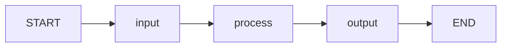

# Construindo um Grafo Simples

Nesta lição, vamos construir um LangGraph completo de 3 etapas: **entrada** → **processamento** → **saída**. Esta é a fundação para cada agente que você construirá.

---

## O Padrão de 3 Etapas

Toda aplicação LangGraph segue este padrão:

1. **Nó de entrada**: Aceita e valida a entrada bruta
2. **Nó de processamento**: Realiza a lógica principal (chamada LLM, computação, etc.)
3. **Nó de saída**: Formata e retorna o resultado final



---

## Passo 1: Definir o Estado

```python
from typing_extensions import TypedDict
from typing import Optional

class SimpleState(TypedDict):
    input_text: str          # Entrada bruta do usuário
    processed_text: str      # Valor processado intermediário
    output_text: str         # Saída final
    error: Optional[str]     # Mensagem de erro (se houver)
```

[!NOTE]
Inclua um campo `error` no seu estado desde o início. Isso torna o tratamento de erros muito mais limpo à medida que seu grafo cresce.

---

## Passo 2: Definir os Nós

### Nó de Entrada

```python
def input_node(state: SimpleState) -> dict:
    raw = state["input_text"].strip()

    if not raw:
        return {"error": "Input cannot be empty"}

    return {"input_text": raw}
```

### Nó de Processamento

```python
def process_node(state: SimpleState) -> dict:
    if state.get("error"):
        return {}  # Pular processamento se houver erro

    # Transformação de texto simples
    processed = state["input_text"].upper()
    word_count = len(state["input_text"].split())

    return {
        "processed_text": f"[{word_count} words] {processed}"
    }
```

### Nó de Saída

```python
def output_node(state: SimpleState) -> dict:
    if state.get("error"):
        return {"output_text": f"Error: {state['error']}"}

    return {
        "output_text": f"Result: {state['processed_text']}"
    }
```

[!TIP]
O padrão de verificar `state.get("error")` em cada nó é uma forma básica de propagação de erro. Mais tarde substituiremos isso por arestas condicionais para roteamento mais limpo.

---

## Passo 3: Construir o Grafo

```python
from langgraph.graph import StateGraph, START, END

builder = StateGraph(SimpleState)

# Adicionar nós
builder.add_node("input", input_node)
builder.add_node("process", process_node)
builder.add_node("output", output_node)

# Adicionar arestas
builder.add_edge(START, "input")
builder.add_edge("input", "process")
builder.add_edge("process", "output")
builder.add_edge("output", END)

# Compilar
app = builder.compile()
```

---

## Passo 4: Invocar o Grafo

```python
# Execução bem-sucedida
result = app.invoke({
    "input_text": "hello world",
    "processed_text": "",
    "output_text": "",
    "error": None
})

print(result["output_text"])
# Result: [2 words] HELLO WORLD

# Caso de erro
result = app.invoke({
    "input_text": "   ",
    "processed_text": "",
    "output_text": "",
    "error": None
})

print(result["output_text"])
# Error: Input cannot be empty
```

---

## Passo 5: Adicionar Streaming

Streaming permite observar a saída de cada nó enquanto executa:

```python
for event in app.stream({
    "input_text": "langgraph is awesome",
    "processed_text": "",
    "output_text": "",
    "error": None
}):
    for node_name, state_update in event.items():
        if node_name == "__end__":
            continue

        print(f"---[{node_name}]---")
        for key, value in state_update.items():
            if value:
                print(f"  {key}: {value}")
```

Saída:
```
---[input]---
  input_text: langgraph is awesome
---[process]---
  processed_text: [3 words] LANGGRAPH IS AWESOME
---[output]---
  output_text: Result: [3 words] LANGGRAPH IS AWESOME
```

[!SUCCESS]
Streaming oferece visibilidade em tempo real da execução do seu grafo. Use durante o desenvolvimento para verificar o comportamento de cada nó.

---

## Exemplo Completo

```python
from langgraph.graph import StateGraph, START, END
from typing_extensions import TypedDict
from typing import Optional

# 1. Estado
class SimpleState(TypedDict):
    input_text: str
    processed_text: str
    output_text: str
    error: Optional[str]

# 2. Nós
def input_node(state: SimpleState) -> dict:
    raw = state["input_text"].strip()
    if not raw:
        return {"error": "Input cannot be empty"}
    return {"input_text": raw}

def process_node(state: SimpleState) -> dict:
    if state.get("error"):
        return {}
    processed = state["input_text"].upper()
    word_count = len(state["input_text"].split())
    return {"processed_text": f"[{word_count} words] {processed}"}

def output_node(state: SimpleState) -> dict:
    if state.get("error"):
        return {"output_text": f"Error: {state['error']}"}
    return {"output_text": f"Result: {state['processed_text']}"}

# 3. Grafo
builder = StateGraph(SimpleState)
builder.add_node("input", input_node)
builder.add_node("process", process_node)
builder.add_node("output", output_node)
builder.add_edge(START, "input")
builder.add_edge("input", "process")
builder.add_edge("process", "output")
builder.add_edge("output", END)

app = builder.compile()

# 4. Executar
result = app.invoke({
    "input_text": "hello langgraph",
    "processed_text": "",
    "output_text": "",
    "error": None
})
print(result["output_text"])
# Result: [2 words] HELLO LANGGRAPH
```

---

## Adicionando um LLM ao Nó de Processamento

Vamos atualizar o nó de processamento para usar um LLM:

```python
from langchain_openai import ChatOpenAI
from langchain.prompts import ChatPromptTemplate
from langchain_core.output_parsers import StrOutputParser

llm = ChatOpenAI(model="gpt-4o", temperature=0.3)

def process_with_llm(state: SimpleState) -> dict:
    if state.get("error"):
        return {}

    prompt = ChatPromptTemplate.from_messages([
        ("system", "You are a text analyzer. Analyze the given text and provide:\n"
                   "1. A summary (1 sentence)\n"
                   "2. Sentiment (positive/negative/neutral)\n"
                   "3. Key topics"),
        ("human", "{text}")
    ])

    chain = prompt | llm | StrOutputParser()
    analysis = chain.invoke({"text": state["input_text"]})

    return {"processed_text": analysis}
```

Agora, em vez de transformação simples de string, seu nó de processamento realiza análise com IA.

[!NOTE]
Trocar um nó determinístico por um nó alimentado por LLM não requer alterações na estrutura do grafo. Apenas a função do nó muda. Este é o poder da abstração do grafo.

---

## Adicionando um Loop (Prévia)

Mesmo em um grafo simples, você pode adicionar um loop. Vamos fazer o nó de processamento repetir até que o texto esteja limpo:

```python
from langgraph.graph import START, END, StateGraph
from typing_extensions import TypedDict

class CleanState(TypedDict):
    text: str
    cleaned: bool
    attempts: int

def clean_text(state: CleanState) -> dict:
    original = state["text"]
    cleaned = original.strip().lower()
    is_clean = cleaned == original

    return {
        "text": cleaned,
        "cleaned": is_clean,
        "attempts": state["attempts"] + 1
    }

def should_continue(state: CleanState) -> str:
    if state["cleaned"] or state["attempts"] >= 3:
        return "end"
    return "continue"

builder = StateGraph(CleanState)
builder.add_node("clean", clean_text)
builder.add_edge(START, "clean")
builder.add_conditional_edges(
    "clean",
    should_continue,
    {
        "continue": "clean",  # Loop de volta
        "end": END
    }
)

app = builder.compile()

result = app.invoke({"text": "  HELLO WORLD  ", "cleaned": False, "attempts": 0})
print(result["text"])      # hello world
print(result["attempts"])  # 2 (primeira passagem limpa, segunda confirma)
```

[!WARNING]
Sempre tenha uma condição de terminação em loops. Sem a verificação `attempts >= 3`, um bug poderia causar um loop infinito. Sempre defina `recursion_limit` na configuração de invocação.

---

## Testando Seu Grafo

```python
# Teste 1: Entrada normal
result = app.invoke({"input_text": "Test", "processed_text": "", "output_text": "", "error": None})
assert "Error" not in result["output_text"]

# Teste 2: Entrada vazia
result = app.invoke({"input_text": "", "processed_text": "", "output_text": "", "error": None})
assert "Error" in result["output_text"]

# Teste 3: Entrada com espaços
result = app.invoke({"input_text": "   ", "processed_text": "", "output_text": "", "error": None})
assert "Error" in result["output_text"]
```

[!TIP]
Escreva testes para cada nó individualmente (testes de função pura) e para o grafo completo (testes de integração). Isso captura bugs tanto no nível do nó quanto problemas de topologia.

---

## Erros Comuns

### Erro 1: Esquecer de tratar o caso de erro
```python
def process_node(state: State) -> dict:
    # BUG: Se o estado tem um erro, isso ainda executa
    return {"result": expensive_computation(state["input"])}

# CORREÇÃO: Verificar erros primeiro
def process_node(state: State) -> dict:
    if state.get("error"):
        return {}
    return {"result": expensive_computation(state["input"])}
```

### Erro 2: Transformar o estado diretamente
```python
def bad_node(state: State) -> dict:
    state["value"] = "new"  # BUG: Não transforme o estado!
    return {"value": "new"}  # CORRETO: Retornar atualizações

def good_node(state: State) -> dict:
    return {"value": "new"}  # CORRETO
```

### Erro 3: Aresta faltando para END
```python
builder.add_edge("process", "output")
# BUG: Sem aresta de output para END — o grafo nunca termina!

builder.add_edge("output", END)  # CORREÇÃO
```

---

## Perguntas de Prática

```question
{
  "id": "lg-beginner-05-q1",
  "type": "multiple-choice",
  "question": "Qual é o padrão padrão de 3 etapas para um LangGraph simples?",
  "options": [
    "Treinar → Testar → Deploy",
    "Entrada → Processamento → Saída",
    "Buscar → Analisar → Exibir",
    "Conectar → Consultar → Fechar"
  ],
  "correct": 1,
  "explanation": "O padrão básico é Entrada (aceitar/validar), Processamento (realizar lógica), Saída (formatar/retornar resultados)."
}
```

```question
{
  "id": "lg-beginner-05-q2",
  "type": "multiple-choice",
  "question": "O que um nó deve retornar quando um erro ocorreu upstream?",
  "options": [
    "Lançar uma exceção",
    "Retornar um dict vazio {}",
    "Retornar None",
    "Retornar o estado original inalterado"
  ],
  "correct": 1,
  "explanation": "Retornar {} (dict vazio) significa nenhuma alteração de estado, efetivamente pulando o trabalho do nó quando há um erro upstream."
}
```

```question
{
  "id": "lg-beginner-05-q3",
  "type": "multiple-choice",
  "question": "Como você observa saídas intermediárias de nós durante a execução do grafo?",
  "options": [
    "Usando print() dentro dos nós",
    "Usando o método stream() em vez de invoke()",
    "Usando o método debug()",
    "Verificando os logs do grafo"
  ],
  "correct": 1,
  "explanation": "app.stream() produz eventos para cada nó conforme completam, mostrando atualizações de estado intermediárias."
}
```

```question
{
  "id": "lg-beginner-05-q4",
  "type": "multiple-choice",
  "question": "O que acontece se você esquecer de adicionar uma aresta do último nó para END?",
  "options": [
    "O grafo executa mas retorna None",
    "O grafo nunca termina",
    "O grafo termina automaticamente após o último nó",
    "Um erro é lançado durante a compilação"
  ],
  "correct": 1,
  "explanation": "Sem uma aresta para END, o grafo não tem caminho de terminação e eventualmente atingirá o limite de recursão."
}
```

```question
{
  "id": "lg-beginner-05-q5",
  "type": "multiple-choice",
  "question": "Qual é a melhor prática para lidar com erros em um grafo simples?",
  "options": [
    "Deixar exceções propagarem para o chamador",
    "Incluir um campo de erro no estado e verificá-lo em cada nó",
    "Ignorar erros no processamento",
    "Reiniciar o grafo em qualquer erro"
  ],
  "correct": 1,
  "explanation": "Adicionar um campo de erro ao estado e verificá-lo no início de cada nó fornece propagação de erro limpa."
}
```

```question
{
  "id": "lg-beginner-05-q6",
  "type": "multiple-choice",
  "question": "Você pode substituir um nó determinístico por um nó alimentado por LLM sem alterar a estrutura do grafo?",
  "options": [
    "Sim, apenas a função do nó muda",
    "Não, você precisa reconstruir o grafo",
    "Apenas se recompilar",
    "Não, nós LLM exigem configuração especial"
  ],
  "correct": 0,
  "explanation": "A estrutura do grafo (nós, arestas, estado) permanece a mesma. Apenas a lógica interna da função do nó muda."
}
```

```question
{
  "id": "lg-beginner-05-q7",
  "type": "multiple-choice",
  "question": "O que todo loop em LangGraph deve ter?",
  "options": [
    "Pelo menos 3 iterações",
    "Uma condição de terminação",
    "Uma thread separada",
    "Um checkpoint de memória"
  ],
  "correct": 1,
  "explanation": "Todo loop deve ter uma condição de terminação (ex.: máximo de iterações, flag de sucesso) para prevenir execução infinita."
}
```

```question
{
  "id": "lg-beginner-05-q8",
  "type": "multiple-choice",
  "question": "Qual é a maneira correta de atualizar o estado em um nó?",
  "options": [
    "state['key'] = 'value'; return state",
    "return {'key': 'value'}",
    "state.update({'key': 'value'}); return state",
    "return state"
  ],
  "correct": 1,
  "explanation": "Nós devem retornar um dict de atualizações. LangGraph lida com a mesclagem. Nunca transforme o estado diretamente."
}
```

```question
{
  "id": "lg-beginner-05-q9",
  "type": "multiple-choice",
  "question": "Qual é um bom uso para um nó que retorna None?",
  "options": [
    "Resetar o estado inteiro",
    "Para efeitos colaterais como logging ou métricas",
    "Para terminar o grafo",
    "Para acionar um erro"
  ],
  "correct": 1,
  "explanation": "Nós que retornam None são úteis para efeitos colaterais (logging, métricas, notificações) que não modificam o estado."
}
```

```question
{
  "id": "lg-beginner-05-q10",
  "type": "multiple-choice",
  "question": "O que o método stream() retorna para cada evento?",
  "options": [
    "Uma string com o nome do nó atual",
    "Um dict com nomes de nós como chaves e atualizações de estado como valores",
    "Apenas o estado final",
    "Um log de todos os erros encontrados"
  ],
  "correct": 1,
  "explanation": "stream() produz dicts onde as chaves são nomes de nós e os valores são as atualizações de estado daquele nó."
}
```

---

[!SUCCESS]
### Principais Conclusões
- O padrão Entrada → Processamento → Saída é a fundação de todas as apps LangGraph
- Inclua um campo `error` no seu estado para tratamento de erro limpo
- Use `stream()` durante o desenvolvimento para observar a execução dos nós
- Sempre adicione uma aresta do último nó para END
- Nós podem ser atualizados de determinísticos para alimentados por LLM sem alterações no grafo
- Loops precisam de condições de terminação
- Nunca transforme o estado diretamente — retorne um dict de atualizações
- Teste nós individualmente e o grafo completo como testes de integração
