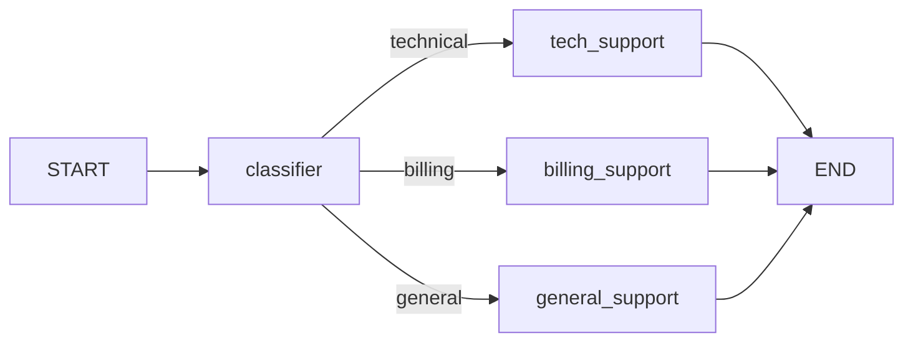

# Ramificação Condicional

Nem todos os grafos são lineares. A ramificação condicional permite que seu grafo tome decisões em tempo de execução, roteando a execução para diferentes caminhos com base no estado atual.

---

## O que é Ramificação Condicional?

Ramificação condicional significa que o próximo nó a executar depende do **estado atual**, não de uma topologia fixa.



O nó `classifier` analisa a entrada e decide qual caminho seguir.

---

## add_conditional_edges

`add_conditional_edges` é o método que permite o roteamento condicional:

```python
from langgraph.graph import StateGraph, START, END
from typing_extensions import TypedDict

class State(TypedDict):
    input_text: str
    category: str

def classifier(state: State) -> dict:
    # Classificação simplificada — na prática, use um LLM
    text = state["input_text"].lower()
    if "bill" in text or "payment" in text:
        return {"category": "billing"}
    elif "bug" in text or "error" in text:
        return {"category": "technical"}
    else:
        return {"category": "general"}

# Função de roteamento: recebe o estado, retorna um nome de nó
def route_by_category(state: State) -> str:
    return state["category"]

builder = StateGraph(State)
builder.add_node("classifier", classifier)
builder.add_node("tech_support", lambda s: {"tech_support": True})
builder.add_node("billing_support", lambda s: {"billing_support": True})
builder.add_node("general_support", lambda s: {"general_support": True})

builder.add_edge(START, "classifier")
builder.add_conditional_edges(
    "classifier",            # Nó de origem
    route_by_category,       # Função de roteamento
    {                        # Mapeamento: valor de retorno → nó alvo
        "technical": "tech_support",
        "billing": "billing_support",
        "general": "general_support"
    }
)
builder.add_edge("tech_support", END)
builder.add_edge("billing_support", END)
builder.add_edge("general_support", END)

app = builder.compile()
```

[!NOTE]
A função de roteamento recebe o dicionário de estado completo e retorna uma string. Essa string é usada como chave no dicionário de mapeamento para localizar o nome do nó alvo.

---

## Padrões de Função de Roteamento

### Retorno de String Simples

```python
def router(state: State) -> str:
    if state["is_complete"]:
        return "end"
    return "continue"
```

### Mapeamento de Dicionário

```python
builder.add_conditional_edges(
    "analyze",
    router,
    {
        "end": END,           # Mapear para a constante END
        "continue": "process" # Mapear para outro nó
    }
)
```

### Rota Padrão com Fallback

Se o roteador retornar um valor que não está no mapeamento, um erro é lançado. Sempre cubra todos os valores de retorno possíveis:

```python
def sentiment_router(state: State) -> str:
    sentiment = state["sentiment"]
    if sentiment == "positive":
        return "positive"
    elif sentiment == "negative":
        return "negative"
    return "neutral"  # Fallback padrão

builder.add_conditional_edges(
    "analyze",
    sentiment_router,
    {
        "positive": "handle_positive",
        "negative": "handle_negative",
        "neutral": "handle_neutral"
    }
)
```

---

## Roteamento com LLM

Use um LLM para classificar a entrada e determinar o roteamento:

```python
from langchain_openai import ChatOpenAI
from langchain.prompts import ChatPromptTemplate
from langchain_core.output_parsers import StrOutputParser

llm = ChatOpenAI(model="gpt-4o-mini")

class RouteState(TypedDict):
    query: str
    route: str

def classify_route(state: RouteState) -> dict:
    prompt = ChatPromptTemplate.from_messages([
        ("system", "Classifique a consulta em uma categoria: 'technical', 'billing' ou 'general'. "
                   "Responda apenas com o nome da categoria."),
        ("human", "{query}")
    ])
    chain = prompt | llm | StrOutputParser()
    route = chain.invoke({"query": state["query"]}).strip().lower()
    return {"route": route}

def dynamic_router(state: RouteState) -> str:
    return state["route"]

builder.add_conditional_edges(
    "classify",
    dynamic_router,
    {
        "technical": "tech_handler",
        "billing": "billing_handler",
        "general": "general_handler"
    }
)
```

[!TIP]
Ao usar LLMs para roteamento, adicione uma etapa de pós-processamento para limpar e validar o valor da rota. Defina um fallback padrão para saídas inesperadas.

---

## Loops Condicionais

O uso mais comum de arestas condicionais é **looping** — repetir um nó até que uma condição seja atendida:

```python
class LoopState(TypedDict):
    input: str
    result: str
    attempts: int
    is_valid: bool

def process(state: LoopState) -> dict:
    # Tenta processar a entrada
    result = attempt_processing(state["input"])
    is_valid = validate_result(result)
    return {
        "result": result,
        "is_valid": is_valid,
        "attempts": state["attempts"] + 1
    }

def loop_router(state: LoopState) -> str:
    if state["is_valid"]:
        return "valid"
    if state["attempts"] >= 3:
        return "max_retries"
    return "retry"

builder.add_conditional_edges(
    "process",
    loop_router,
    {
        "valid": "format_output",  # Sucesso — prosseguir
        "retry": "process",        # Tentar novamente — loop back
        "max_retries": "error_handler"  # Desistir
    }
)
```

[!WARNING]
Sempre inclua um número máximo de tentativas em loops. Sem ele, uma falha persistente causa um loop infinito que atinge o limite de recursão.

---

## Roteamento Multi-Condição

Route para diferentes nós com base em múltiplos campos de estado:

```python
def complex_router(state: State) -> str:
    if state.get("error"):
        return "error"

    if state["requires_tools"] and state["has_tool_results"]:
        return "synthesize"

    if state["requires_tools"] and not state["has_tool_results"]:
        return "execute_tools"

    return "generate"

builder.add_conditional_edges(
    "analyze",
    complex_router,
    {
        "error": "error_handler",
        "synthesize": "synthesizer",
        "execute_tools": "tool_executor",
        "generate": "generator"
    }
)
```

---

## Arestas Condicionais de Múltiplos Nós

Você pode adicionar arestas condicionais de qualquer nó, não apenas de um classificador:

```python
builder.add_conditional_edges("validate", validate_router, {...})
builder.add_conditional_edges("search", search_router, {...})
builder.add_conditional_edges("generate", quality_check_router, {...})
```

---

## Padrão de Roteamento Ternário

Uma decisão binária simples:

```python
def is_complete(state: State) -> str:
    return "done" if state.get("finished") else "continue"

builder.add_conditional_edges(
    "worker",
    is_complete,
    {
        "done": END,
        "continue": "worker"  # Loop back
    }
)
```

---

## Exemplo Completo: Roteador Inteligente de Consultas

```python
from langchain_openai import ChatOpenAI
from langchain.prompts import ChatPromptTemplate
from langchain_core.output_parsers import StrOutputParser
from langchain_core.tools import tool
from langgraph.graph import StateGraph, START, END
from typing_extensions import TypedDict
from typing import Annotated, List
from operator import add

llm = ChatOpenAI(model="gpt-4o-mini")

# Ferramentas
@tool
def search_web(query: str) -> str:
    """Pesquisar a web por informações."""
    return f"Resultados web para: {query}"

@tool
def calculate(expr: str) -> str:
    """Calcular expressões matemáticas."""
    return str(eval(expr, {"__builtins__": {}}, {}))

class RouterState(TypedDict):
    messages: Annotated[List, add]
    query: str
    route: str
    response: str

def classify_node(state: RouterState) -> dict:
    prompt = ChatPromptTemplate.from_messages([
        ("system", "Roteie a consulta para: 'web_search', 'calculator', ou 'chat'. "
                   "Responda apenas com o nome da rota."),
        ("human", "{query}")
    ])
    chain = prompt | llm | StrOutputParser()
    route = chain.invoke({"query": state["query"]}).strip().lower()
    return {"route": route}

def router_fn(state: RouterState) -> str:
    return state["route"]

def web_search_node(state: RouterState) -> dict:
    result = search_web.invoke({"query": state["query"]})
    return {"response": result, "messages": [f"[Web] {result}"]}

def calculator_node(state: RouterState) -> dict:
    result = calculate.invoke({"expr": state["query"]})
    return {"response": result, "messages": [f"[Calc] {result}"]}

def chat_node(state: RouterState) -> dict:
    response = llm.invoke(f"Responda isto: {state['query']}")
    return {"response": response.content, "messages": [f"[Chat] {response.content}"]}

builder = StateGraph(RouterState)
builder.add_node("classify", classify_node)
builder.add_node("web_search", web_search_node)
builder.add_node("calculator", calculator_node)
builder.add_node("chat", chat_node)

builder.add_edge(START, "classify")
builder.add_conditional_edges("classify", router_fn, {
    "web_search": "web_search",
    "calculator": "calculator",
    "chat": "chat"
})
builder.add_edge("web_search", END)
builder.add_edge("calculator", END)
builder.add_edge("chat", END)

app = builder.compile()

# Teste
result = app.invoke({
    "messages": [],
    "query": "Quanto é 15 * 7?",
    "route": "",
    "response": ""
})
print(result["response"])  # 105

result = app.invoke({
    "messages": [],
    "query": "Quem inventou o Python?",
    "route": "",
    "response": ""
})
print(result["response"])  # Chat ou resultado de busca web
```

[!SUCCESS]
Este padrão — classificar → rotear → executar manipulador especializado — é a base de todos os agentes de roteamento inteligente.

---

## Melhores Práticas de Roteamento

1. **Sempre trate todos os valores de rota possíveis** — faltar um mapeamento levanta um erro
2. **Adicione uma rota padrão/fallback** para saídas inesperadas do roteador
3. **Valide a saída do roteador** ao usar LLMs para roteamento
4. **Use nomes de rota descritivos** que correspondam aos nomes dos nós para clareza
5. **Limite a profundidade de roteamento** — cadeias condicionais profundamente aninhadas são difíceis de depurar
6. **Registre a decisão de rota** para depuração e observabilidade

---

## Perguntas de Prática

```question
{
  "id": "lg-beginner-09-q1",
  "type": "multiple-choice",
  "question": "Qual método é usado para ramificação condicional em LangGraph?",
  "options": ["add_edge()", "add_conditional_edges()", "set_conditional()", "branch()"],
  "correct": 1,
  "explanation": "add_conditional_edges() adiciona arestas que são determinadas em tempo de execução por uma função de roteamento."
}
```

```question
{
  "id": "lg-beginner-09-q2",
  "type": "multiple-choice",
  "question": "O que uma função de roteamento recebe e retorna?",
  "options": [
    "Recebe o estado completo, retorna uma chave de string",
    "Recebe apenas a consulta, retorna um booleano",
    "Recebe nada, retorna uma função de nó",
    "Recebe a saída do nó anterior, retorna um dicionário"
  ],
  "correct": 0,
  "explanation": "Uma função de roteamento recebe o dicionário de estado completo e retorna uma string que mapeia para um nó alvo no dicionário de mapeamento."
}
```

```question
{
  "id": "lg-beginner-09-q3",
  "type": "multiple-choice",
  "question": "O que acontece se um roteador retornar um valor que não está no dicionário de mapeamento?",
  "options": [
    "O grafo segue o caminho padrão",
    "Um erro é levantado",
    "O roteador é chamado novamente",
    "O grafo pausa"
  ],
  "correct": 1,
  "explanation": "Todos os valores de retorno do roteador devem ter entradas correspondentes no dicionário de mapeamento. Mapeamentos faltando levantam um erro."
}
```

```question
{
  "id": "lg-beginner-09-q4",
  "type": "multiple-choice",
  "question": "Qual é o uso mais comum de arestas condicionais em agentes?",
  "options": [
    "Formatar saída",
    "Criar loops que repetem até que uma condição seja atendida",
    "Adicionar logging",
    "Configurar o LLM"
  ],
  "correct": 1,
  "explanation": "Arestas condicionais permitem o loop ReAct: chamar LLM → executar ferramentas → verificar se concluído → loop back ou finalizar."
}
```

```question
{
  "id": "lg-beginner-09-q5",
  "type": "multiple-choice",
  "question": "Como criar uma aresta condicional binária simples (sim/não)?",
  "options": [
    "Use um roteador que retorna 'sim' ou 'não' com um mapeamento de duas entradas",
    "Use duas chamadas add_edge()",
    "Use um retorno booleano na função do nó",
    "Roteamento binário não é suportado"
  ],
  "correct": 0,
  "explanation": "Uma função de roteamento retornando 'sim'/'não' (ou 'done'/'continue') com um mapeamento de duas entradas é o padrão binário padrão."
}
```

```question
{
  "id": "lg-beginner-09-q6",
  "type": "multiple-choice",
  "question": "O que você deve sempre incluir em um loop com arestas condicionais?",
  "options": [
    "Um temporizador",
    "Um número máximo de tentativas como condição de terminação",
    "Uma conexão de banco de dados",
    "Pelo menos 10 nós"
  ],
  "correct": 1,
  "explanation": "Sempre inclua um número máximo de tentativas/iterações para evitar loops infinitos se a condição nunca for atendida."
}
```

```question
{
  "id": "lg-beginner-09-q7",
  "type": "multiple-choice",
  "question": "Você pode usar um LLM como roteador em LangGraph?",
  "options": [
    "Não, roteadores devem ser funções determinísticas",
    "Sim, use um LLM para classificar a entrada e escrever a decisão no estado",
    "Apenas com integrações específicas do LangChain",
    "LLMs são muito lentos para roteamento"
  ],
  "correct": 1,
  "explanation": "Roteamento com LLM é comum: um LLM classifica a entrada, escreve a categoria no estado, e uma função de roteamento simples a lê."
}
```

```question
{
  "id": "lg-beginner-09-q8",
  "type": "multiple-choice",
  "question": "Qual é a vantagem de usar add_conditional_edges em vez de múltiplas chamadas add_edge?",
  "options": [
    "É mais rápido",
    "Permite decisões de roteamento dinâmicas baseadas no estado",
    "Suporta mais nós",
    "Não requer registro de nó"
  ],
  "correct": 1,
  "explanation": "add_conditional_edges avalia o estado em tempo de execução para decidir qual caminho seguir, permitindo fluxos de trabalho dinâmicos e adaptativos."
}
```

```question
{
  "id": "lg-beginner-09-q9",
  "type": "multiple-choice",
  "question": "Como fazer uma aresta condicional fazer loop de volta ao nó de origem?",
  "options": [
    "Mapeie a rota para o nome do nó de origem no dicionário de mapeamento",
    "Use add_edge(self, source)",
    "Defina loop=True na aresta",
    "Crie um nó duplicado"
  ],
  "correct": 0,
  "explanation": "Mapeie um dos valores de rota para o nome do nó de origem (por exemplo, 'retry': 'process'). Isso cria um loop."
}
```

```question
{
  "id": "lg-beginner-09-q10",
  "type": "multiple-choice",
  "question": "Qual constante pode ser usada como alvo no mapeamento de aresta condicional?",
  "options": ["START", "END", "HALT", "BREAK"],
  "correct": 1,
  "explanation": "END é válido como alvo de aresta condicional, permitindo que o grafo termine a partir de uma ramificação condicional. START não é válido como alvo."
}
```

---

[!SUCCESS]
### Principais Conclusões
- `add_conditional_edges(origem, roteador, mapeamento)` permite roteamento dinâmico
- Funções de roteamento recebem o estado e retornam uma chave de string
- O dicionário de mapeamento traduz a saída do roteador em nomes de nós alvo
- Loops são criados mapeando uma rota de volta a um nó executado anteriormente
- Roteamento com LLM usa um LLM para classificar e escrever a rota no estado
- Sempre cubra todas as saídas possíveis do roteador no dicionário de mapeamento
- Inclua condições de terminação em loops para evitar execução infinita
- END pode ser um alvo em mapeamentos de aresta condicional
- Registre decisões de rota para depuração e observabilidade
