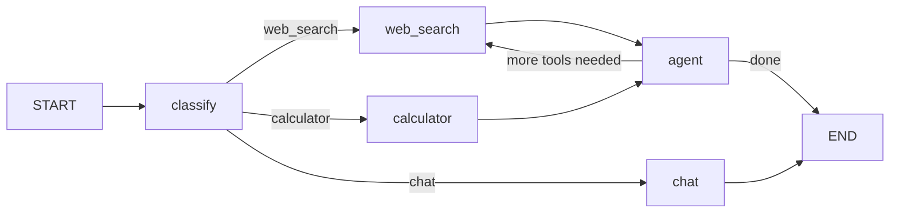

# Projeto Iniciante: Agente de Q&A com Uso de Ferramentas e Roteamento

Neste projeto final, você construirá um agente de Q&A completo que pode responder perguntas usando ferramentas e roteamento inteligente. Isso reúne tudo que você aprendeu: estado, nós, arestas, LLMs, ferramentas e ramificação condicional.

---

## Visão Geral do Projeto

O agente irá:

1. **Classificar** a pergunta do usuário em uma categoria
2. **Roteá-la** para o manipulador apropriado com base na categoria
3. **Executar** ferramentas ou gerar respostas conforme necessário
4. **Fazer loop** se ferramentas foram chamadas, para processar resultados
5. **Retornar** uma resposta final



---

## Passo 1: Configuração e Importações

```python
from langchain_openai import ChatOpenAI
from langchain_core.tools import tool
from langchain_core.messages import HumanMessage, AIMessage, ToolMessage
from langchain.prompts import ChatPromptTemplate
from langchain_core.output_parsers import StrOutputParser
from langgraph.graph import StateGraph, START, END
from langgraph.prebuilt import ToolExecutor
from typing_extensions import TypedDict, List, Annotated
from typing import Any
from operator import add
import json
```

---

## Passo 2: Definir Ferramentas

```python
@tool
def web_search(query: str) -> str:
    """Pesquisar na web por informações atuais. Use para notícias, fatos e conhecimento geral."""
    # Em produção, chame uma API de busca real
    return f"## Resultados Web para '{query}'\n"
           f"1. LangGraph é um framework para construir agentes de IA com estado.\n"
           f"2. Foi criado pela LangChain Inc.\n"
           f"3. A versão 0.2 foi lançada em 2024."

@tool
def calculator(expression: str) -> str:
    """Avaliar uma expressão matemática. Use sintaxe Python: +, -, *, /, **, //, %."""
    try:
        safe_dict = {"__builtins__": {}}
        result = eval(expression, safe_dict)
        return str(result)
    except Exception as e:
        return f"Erro de cálculo: {e}"

@tool
def get_timezone(city: str) -> str:
    """Obter o fuso horário para uma determinada cidade."""
    timezones = {
        "new york": "America/New_York (UTC-5)",
        "london": "Europe/London (UTC+0)",
        "tokyo": "Asia/Tokyo (UTC+9)",
        "paris": "Europe/Paris (UTC+1)",
        "sydney": "Australia/Sydney (UTC+11)"
    }
    return timezones.get(city.lower(), f"Fuso horário não encontrado para {city}")
```

[!NOTE]
Estas são ferramentas simuladas para o projeto. Em produção, substitua-as por chamadas reais de API para mecanismos de busca, calculadoras e bancos de dados de fusos horários.

---

## Passo 3: Inicializar LLM e Ligações de Ferramentas

```python
llm = ChatOpenAI(model="gpt-4o-mini")

all_tools = [web_search, calculator, get_timezone]
llm_with_tools = llm.bind_tools(all_tools)
tool_executor = ToolExecutor(all_tools)
```

---

## Passo 4: Definir Estado

```python
class AgentState(TypedDict):
    messages: Annotated[List[Any], add]
    question: str
    category: str
    tool_results: List[str]
    final_answer: str
    error: str
```

| Campo | Tipo | Propósito |
| :--- | :--- | :--- |
| `messages` | `Annotated[List, add]` | Histórico completo da conversa com anexação |
| `question` | `str` | A pergunta original do usuário |
| `category` | `str` | Resultado da classificação para roteamento |
| `tool_results` | `List[str]` | Saídas acumuladas das ferramentas |
| `final_answer` | `str` | A resposta final para o usuário |
| `error` | `str` | Rastreamento de erros |

---

## Passo 5: Definir Nós

### Nó de Classificação

```python
def classify_question(state: AgentState) -> dict:
    prompt = ChatPromptTemplate.from_messages([
        ("system", "Classifique a pergunta em exatamente uma categoria:\n"
                   "- 'web_search': perguntas sobre notícias, fatos, pessoas, conceitos\n"
                   "- 'calculator': problemas de matemática, cálculos, equações\n"
                   "- 'chat': conversa geral, opiniões, explicações\n\n"
                   "Responda APENAS com o nome da categoria."),
        ("human", "{question}")
    ])
    chain = prompt | llm | StrOutputParser()
    category = chain.invoke({"question": state["question"]}).strip().lower()

    if category not in ["web_search", "calculator", "chat"]:
        category = "chat"  # Fallback padrão

    return {"category": category, "messages": [HumanMessage(state["question"])]}
```

### Nó de Pesquisa Web

```python
def web_search_node(state: AgentState) -> dict:
    try:
        result = tool_executor.invoke({
            "name": "web_search",
            "args": {"query": state["question"]},
            "id": "search_1",
            "type": "tool_call"
        })
        return {
            "tool_results": state["tool_results"] + [str(result)],
            "messages": [ToolMessage(content=str(result), tool_call_id="search_1")]
        }
    except Exception as e:
        return {"error": f"Pesquisa web falhou: {e}"}
```

### Nó de Calculadora

```python
def calculator_node(state: AgentState) -> dict:
    try:
        result = tool_executor.invoke({
            "name": "calculator",
            "args": {"expression": state["question"]},
            "id": "calc_1",
            "type": "tool_call"
        })
        return {
            "tool_results": state["tool_results"] + [str(result)],
            "messages": [ToolMessage(content=str(result), tool_call_id="calc_1")]
        }
    except Exception as e:
        return {"error": f"Calculadora falhou: {e}"}
```

### Nó Agente (Lida com a Resposta Final)

```python
def agent_node(state: AgentState) -> dict:
    context = "\n".join(state["tool_results"]) if state["tool_results"] else "Nenhuma ferramenta foi necessária."

    prompt = ChatPromptTemplate.from_messages([
        ("system", "Você é um assistente de Q&A útil. Responda à pergunta do usuário "
                   "com base no contexto disponível. Seja conciso e preciso.\n\n"
                   "Contexto:\n{context}"),
        ("human", "{question}")
    ])

    chain = prompt | llm | StrOutputParser()
    answer = chain.invoke({
        "context": context,
        "question": state["question"]
    })

    return {
        "final_answer": answer,
        "messages": [AIMessage(content=answer)]
    }
```

[!TIP]
O nó agente lê `tool_results` do estado. Se ferramentas foram usadas, ele sintetiza uma resposta a partir de suas saídas. Se não, responde diretamente.

---

## Passo 6: Definir Funções de Roteamento

```python
def route_by_category(state: AgentState) -> str:
    return state["category"]

def should_continue(state: AgentState) -> str:
    if state.get("error"):
        return "error"
    if state["category"] in ("web_search", "calculator"):
        return "use_agent"  # Ferramenta foi chamada, agora sintetizar
    return "done"  # Chat não precisa de ferramentas
```

---

## Passo 7: Construir o Grafo

```python
builder = StateGraph(AgentState)

# Adicionar nós
builder.add_node("classify", classify_question)
builder.add_node("web_search", web_search_node)
builder.add_node("calculator", calculator_node)
builder.add_node("agent", agent_node)

# Adicionar arestas
builder.add_edge(START, "classify")

# Roteamento condicional do classificador
builder.add_conditional_edges(
    "classify",
    route_by_category,
    {
        "web_search": "web_search",
        "calculator": "calculator",
        "chat": "agent"  # Chat vai diretamente para o agente
    }
)

# Após ferramentas, vá para o agente para resposta final
builder.add_edge("web_search", "agent")
builder.add_edge("calculator", "agent")
builder.add_edge("agent", END)

# Compilar
app = builder.compile()
```

---

## Passo 8: Executar o Agente

```python
def ask_question(question: str) -> str:
    result = app.invoke({
        "messages": [],
        "question": question,
        "category": "",
        "tool_results": [],
        "final_answer": "",
        "error": ""
    })
    return result["final_answer"]

# Testar o agente
print(ask_question("O que é LangGraph?"))
# → Usa web_search e retorna resposta do contexto

print(ask_question("Quanto é 245 * 37?"))
# → Roteia para calculadora, retorna resultado via agente

print(ask_question("Qual fuso horário de Tóquio?"))
# → Usa web_search (palavra-chave: timezone), retorna resposta

print(ask_question("Qual é o sentido da vida?"))
# → Roteia para chat, LLM responde diretamente

print(ask_question("Resolva: (15 + 7) * 2"))
# → Roteia para calculadora, avalia expressão
```

[!SUCCESS]
Seu agente agora roteia perguntas inteligentemente para a ferramenta correta e sintetiza uma resposta final. Este é o padrão central por trás de todos os agentes LangGraph.

---

## Passo 9: Adicionar Streaming

```python
def ask_with_streaming(question: str) -> None:
    print(f"\nQ: {question}")
    print("-" * 40)

    for event in app.stream({
        "messages": [],
        "question": question,
        "category": "",
        "tool_results": [],
        "final_answer": "",
        "error": ""
    }):
        for node, update in event.items():
            if node == "__end__":
                continue
            if "category" in update:
                print(f"[Classificado como: {update['category']}]")
            if "tool_results" in update:
                for r in update["tool_results"]:
                    print(f"[Resultado de ferramenta]: {r[:100]}...")
            if "final_answer" in update:
                print(f"[Resposta]: {update['final_answer']}")
```

---

## Passo 10: Tratamento de Erros e Casos Limite

```python
def safe_ask(question: str) -> str:
    try:
        result = app.invoke(
            {
                "messages": [],
                "question": question,
                "category": "",
                "tool_results": [],
                "final_answer": "",
                "error": ""
            },
            {"recursion_limit": 10}
        )

        if result.get("error"):
            return f"Ocorreu um erro: {result['error']}"

        return result.get("final_answer", "Nenhuma resposta gerada.")

    except Exception as e:
        return f"Desculpe, ocorreu um erro: {str(e)}"

# Testar casos limite
print(safe_ask(""))                         # Pergunta vazia
print(safe_ask("123456" * 1000))            # Pergunta muito longa
print(safe_ask("∫ x² dx"))                  # Entrada não suportada
```

[!NOTE]
Sempre envolva `app.invoke()` em try/except e defina `recursion_limit`. Isso evita travamentos devido a entradas inesperadas e loops infinitos.

---

## Ideias de Extensão do Projeto

1. **Adicione mais ferramentas**: Integre uma API de busca real (Tavily, SerpAPI), ferramenta de consulta a banco de dados ou leitor de arquivos
2. **Adicione memória**: Use o redutor `add_messages` em `messages` para rastrear histórico de conversa entre turnos
3. **Adicione pontuação de confiança**: Faça o classificador retornar uma pontuação de confiança, roteie para fallback se baixa
4. **Chamadas paralelas de ferramentas**: Para perguntas que precisam de múltiplas ferramentas, chame-as em paralelo
5. **Intervenção humana**: Adicione um interrupt para perguntas que o agente não pode responder

---

## Código Completo do Projeto

```python
# Projeto completo — combine todas as etapas acima
from langchain_openai import ChatOpenAI
from langchain_core.tools import tool
from langchain_core.messages import HumanMessage, AIMessage, ToolMessage
from langchain.prompts import ChatPromptTemplate
from langchain_core.output_parsers import StrOutputParser
from langgraph.graph import StateGraph, START, END
from langgraph.prebuilt import ToolExecutor
from typing_extensions import TypedDict, List, Annotated
from typing import Any
from operator import add

# Ferramentas
@tool
def web_search(query: str) -> str:
    """Pesquisar na web por informações atuais."""
    return f"Resultados web para '{query}' — LangGraph é um framework para agentes com estado."

@tool
def calculator(expression: str) -> str:
    """Avaliar expressões matemáticas."""
    return str(eval(expression, {"__builtins__": {}}, {}))

# Configuração
llm = ChatOpenAI(model="gpt-4o-mini")
all_tools = [web_search, calculator]
tool_executor = ToolExecutor(all_tools)

# Estado
class AgentState(TypedDict):
    messages: Annotated[List[Any], add]
    question: str
    category: str
    tool_results: List[str]
    final_answer: str
    error: str

# Nós
def classify_question(state: AgentState) -> dict:
    prompt = ChatPromptTemplate.from_messages([
        ("system", "Classifique como 'web_search', 'calculator' ou 'chat'. Responda apenas com a categoria."),
        ("human", "{question}")
    ])
    chain = prompt | llm | StrOutputParser()
    cat = chain.invoke({"question": state["question"]}).strip().lower()
    return {"category": cat if cat in ("web_search", "calculator", "chat") else "chat",
            "messages": [HumanMessage(state["question"])]}

def web_search_node(state: AgentState) -> dict:
    result = tool_executor.invoke({"name": "web_search", "args": {"query": state["question"]}, "id": "s1", "type": "tool_call"})
    return {"tool_results": state["tool_results"] + [str(result)],
            "messages": [ToolMessage(content=str(result), tool_call_id="s1")]}

def calculator_node(state: AgentState) -> dict:
    result = tool_executor.invoke({"name": "calculator", "args": {"expression": state["question"]}, "id": "c1", "type": "tool_call"})
    return {"tool_results": state["tool_results"] + [str(result)],
            "messages": [ToolMessage(content=str(result), tool_call_id="c1")]}

def agent_node(state: AgentState) -> dict:
    context = "\n".join(state["tool_results"]) if state["tool_results"] else "Nenhuma ferramenta necessária."
    prompt = ChatPromptTemplate.from_messages([
        ("system", "Responda concisamente usando o contexto:\n{context}"),
        ("human", "{question}")
    ])
    answer = (prompt | llm | StrOutputParser()).invoke({"context": context, "question": state["question"]})
    return {"final_answer": answer, "messages": [AIMessage(content=answer)]}

# Roteador
def route_by_category(state: AgentState) -> str:
    return state["category"]

# Grafo
builder = StateGraph(AgentState)
builder.add_node("classify", classify_question)
builder.add_node("web_search", web_search_node)
builder.add_node("calculator", calculator_node)
builder.add_node("agent", agent_node)

builder.add_edge(START, "classify")
builder.add_conditional_edges("classify", route_by_category, {
    "web_search": "web_search",
    "calculator": "calculator",
    "chat": "agent"
})
builder.add_edge("web_search", "agent")
builder.add_edge("calculator", "agent")
builder.add_edge("agent", END)

app = builder.compile()

# Executar
if __name__ == "__main__":
    questions = [
        "O que é LangGraph?",
        "Quanto é 15 * 37?",
        "Qual fuso horário de Tóquio?",
        "Conte-me um fato divertido"
    ]
    for q in questions:
        result = app.invoke({"messages": [], "question": q, "category": "", "tool_results": [], "final_answer": "", "error": ""})
        print(f"Q: {q}\nA: {result['final_answer']}\n")
```

---

## Perguntas de Prática

```question
{
  "id": "lg-beginner-10-q1",
  "type": "multiple-choice",
  "question": "Qual é o primeiro nó executado no projeto do agente de Q&A?",
  "options": ["web_search", "agent", "classify", "calculator"],
  "correct": 2,
  "explanation": "O nó classify executa primeiro para determinar a categoria da pergunta do usuário."
}
```

```question
{
  "id": "lg-beginner-10-q2",
  "type": "multiple-choice",
  "question": "O que acontece depois que um nó de ferramenta (web_search ou calculator) executa?",
  "options": [
    "O grafo termina imediatamente",
    "A execução vai para o nó agente para síntese final",
    "A execução volta para classify",
    "O resultado da ferramenta é retornado diretamente ao usuário"
  ],
  "correct": 1,
  "explanation": "Após uma ferramenta executar, o nó agente recebe os resultados da ferramenta e sintetiza uma resposta final."
}
```

```question
{
  "id": "lg-beginner-10-q3",
  "type": "multiple-choice",
  "question": "Qual é a categoria de fallback padrão no nó de classificação?",
  "options": ["web_search", "calculator", "chat", "error"],
  "correct": 2,
  "explanation": "Se o LLM retornar uma categoria inesperada, o padrão é 'chat' para tratamento geral seguro."
}
```

```question
{
  "id": "lg-beginner-10-q4",
  "type": "multiple-choice",
  "question": "Qual redutor de estado é usado para o campo messages?",
  "options": ["replace", "add (append)", "merge", "overwrite"],
  "correct": 1,
  "explanation": "messages usa Annotated[List, add] para que cada mensagem seja anexada ao histórico da conversa."
}
```

```question
{
  "id": "lg-beginner-10-q5",
  "type": "multiple-choice",
  "question": "Por que você deve definir recursion_limit ao invocar o grafo?",
  "options": [
    "Para limitar o número de threads paralelas",
    "Para prevenir loops infinitos se a lógica de roteamento tiver um bug",
    "Para reduzir o uso de tokens",
    "Para acelerar a execução"
  ],
  "correct": 1,
  "explanation": "recursion_limit previne execução infinita limitando o número total de execuções de nós."
}
```

```question
{
  "id": "lg-beginner-10-q6",
  "type": "multiple-choice",
  "question": "Que tipo de aresta determina qual nó de ferramenta executa?",
  "options": ["add_edge()", "add_conditional_edges()", "set_entry_point()", "set_finish_point()"],
  "correct": 1,
  "explanation": "add_conditional_edges no nó classify roteia para a ferramenta apropriada com base na categoria."
}
```

```question
{
  "id": "lg-beginner-10-q7",
  "type": "multiple-choice",
  "question": "Como o nó agente acessa as saídas das ferramentas?",
  "options": [
    "Através do campo tool_results no estado",
    "Chamando as ferramentas novamente",
    "Através de uma API separada",
    "As saídas das ferramentas são armazenadas em um arquivo"
  ],
  "correct": 0,
  "explanation": "Nós de ferramenta escrevem em state['tool_results'], que o nó agente lê para sintetizar a resposta."
}
```

```question
{
  "id": "lg-beginner-10-q8",
  "type": "multiple-choice",
  "question": "Para qual categoria uma pergunta de matemática como 'Quanto é 2+2?' é roteada?",
  "options": ["web_search", "calculator", "chat", "classify"],
  "correct": 1,
  "explanation": "Perguntas de matemática são classificadas como 'calculator' e roteadas para o nó calculadora."
}
```

```question
{
  "id": "lg-beginner-10-q9",
  "type": "multiple-choice",
  "question": "Qual é o propósito de envolver app.invoke() em try/except?",
  "options": [
    "Para tornar o código mais lento",
    "Para tratar erros inesperados graciosamente e retornar uma mensagem amigável",
    "Para prevenir a compilação do grafo",
    "Para registrar execuções bem-sucedidas"
  ],
  "correct": 1,
  "explanation": "try/except em torno de invoke() captura exceções (falhas de LLM, erros de ferramenta, etc.) e retorna uma mensagem de erro amigável."
}
```

```question
{
  "id": "lg-beginner-10-q10",
  "type": "multiple-choice",
  "question": "O que o ToolExecutor faz neste projeto?",
  "options": [
    "Ele valida argumentos de ferramentas",
    "Ele roteia chamadas de ferramenta para a função de ferramenta correta pelo nome",
    "Ele gera esquemas de ferramenta para o LLM",
    "Ele executa ferramentas em um sandbox"
  ],
  "correct": 1,
  "explanation": "ToolExecutor recebe um dicionário tool_call e invoca automaticamente a função correta com base no campo 'name'."
}
```

---

[!SUCCESS]
### Principais Conclusões
- O agente de Q&A usa classificação → roteamento → execução de ferramentas → síntese como seu padrão central
- O estado flui através de cada nó, acumulando resultados ao longo do caminho
- O redutor `add` em messages anexa ao histórico da conversa
- Arestas condicionais permitem roteamento inteligente baseado na categoria da pergunta
- O nó agente sintetiza resultados de ferramentas em uma resposta final coerente
- Sempre use try/except e recursion_limit para tratamento robusto de erros
- Esta arquitetura é a fundação para todos os agentes LangGraph de produção
