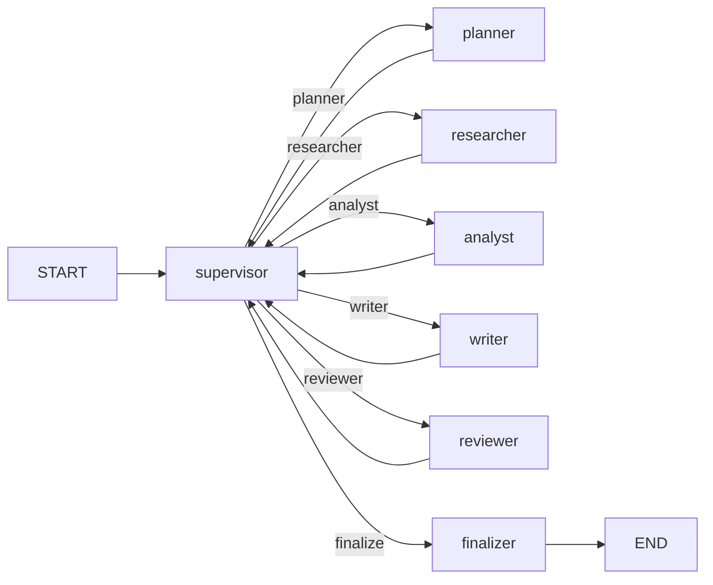

# Proyecto Intermedio: Sistema de Investigación Multi-Agente

Build a multi-agent research system that coordinates specialized agents to research topics, analyze findings, and generate comprehensive reports. This project brings together advanced state, persistence, multi-agent patterns, and streaming.

---

## Arquitectura del Sistema

```
User Query
    ↓
Supervisor Agent ──→ Planner Agent
    ↓                      ↓
Researcher Agent ←── Research Plan
    ↓
Analyst Agent ──→ Synthesizes findings
    ↓
Writer Agent ──→ Generates final report
    ↓
Reviewer Agent ──→ Quality check
    ↓
Final Report
```

---

## Paso 1: Definir Estado y Mensajes

```python
from langgraph.graph import StateGraph, START, END, add_messages
from langgraph.checkpoint.memory import MemorySaver
from langgraph.types import interrupt, Command
from langchain_openai import ChatOpenAI
from langchain_core.messages import HumanMessage, AIMessage, SystemMessage
from typing_extensions import TypedDict, Annotated
from typing import List, Any, Optional
from operator import add
from datetime import datetime
import json

# Structured agent message
class AgentMessage(TypedDict):
    sender: str
    recipient: str
    content: str
    message_type: str  # plan, research, analysis, draft, review, final
    timestamp: str

class ResearchState(TypedDict):
    query: str                                    # Original user query
    messages: Annotated[List[AgentMessage], add]  # Agent conversation log
    research_plan: str                            # Structured research plan
    research_findings: List[str]                  # Raw research data
    analysis: str                                 # Synthesized analysis
    draft_report: str                             # Written report
    review_feedback: str                          # Quality review
    final_report: str                             # Approved final report
    next_agent: str                               # Supervisor's decision
    errors: Annotated[List[str], add]             # Error log
    status: str                                   # Overall status
```

---

## Paso 2: Inicializar LLMs

```python
# Different models for different agents
planner_llm = ChatOpenAI(model="gpt-4o", temperature=0.3)
researcher_llm = ChatOpenAI(model="gpt-4o-mini", temperature=0.5)
analyst_llm = ChatOpenAI(model="gpt-4o", temperature=0.2)
writer_llm = ChatOpenAI(model="gpt-4o", temperature=0.7)
reviewer_llm = ChatOpenAI(model="gpt-4o-mini", temperature=0.0)
supervisor_llm = ChatOpenAI(model="gpt-4o-mini", temperature=0.0)
```

[!NOTA]
Different models optimize for cost. Simple tasks (research, review) use gpt-4o-mini. Complex reasoning (planning, analysis) uses gpt-4o.

---

## Paso 3: Definir Agentes

### Agente Supervisor

```python
def supervisor_agent(state: ResearchState) -> dict:
    context = "\n".join(
        f"{m['sender']} → {m['recipient']}: {m['content'][:200]}"
        for m in state["messages"][-5:]
    ) if state["messages"] else "No activity yet."

    prompt = f"""Research Query: {state['query']}

Current Status: {state.get('status', 'starting')}
Recent Activity:
{context}

Available agents and their order:
1. planner — Creates a research plan
2. researcher — Executes the research
3. analyst — Analyzes research findings
4. writer — Writes the report draft
5. reviewer — Reviews the draft for quality
6. complete — Task is finished

Which agent should work next? Respond with one word."""

    response = supervisor_llm.invoke(prompt)
    next_agent = response.content.strip().lower()

    if next_agent not in ["planner", "researcher", "analyst", "writer", "reviewer"]:
        next_agent = "complete"

    return {"next_agent": next_agent,
            "messages": [{"sender": "supervisor",
                          "recipient": next_agent,
                          "content": f"Proceed to {next_agent}",
                          "message_type": "instruction",
                          "timestamp": datetime.now().isoformat()}]}
```

### Agente Planificador

```python
def planner_agent(state: ResearchState) -> dict:
    prompt = f"""Create a detailed research plan for: {state['query']}

The plan should include:
1. Key topics to investigate
2. Search queries to execute
3. Data sources to consult
4. Analysis methodology

Format as a structured plan with numbered sections."""

    response = planner_llm.invoke(prompt)
    plan = response.content

    return {"research_plan": plan,
            "status": "planned",
            "messages": [{"sender": "planner",
                          "recipient": "supervisor",
                          "content": plan,
                          "message_type": "plan",
                          "timestamp": datetime.now().isoformat()}]}
```

### Agente Investigador

```python
def researcher_agent(state: ResearchState) -> dict:
    plan = state.get("research_plan", state["query"])

    prompt = f"""Research Plan: {plan}

Conduct thorough research on each topic. For each area:
1. Find key facts and statistics
2. Note different perspectives
3. Identify authoritative sources
4. Highlight recent developments

Provide detailed findings for each topic."""

    response = researcher_llm.invoke(prompt)

    return {"research_findings": state.get("research_findings", []) + [response.content],
            "status": "researched",
            "messages": [{"sender": "researcher",
                          "recipient": "supervisor",
                          "content": response.content[:500],
                          "message_type": "research",
                          "timestamp": datetime.now().isoformat()}]}
```

### Agente Analista

```python
def analyst_agent(state: ResearchState) -> dict:
    findings = "\n\n".join(state.get("research_findings", ["No findings"]))

    prompt = f"""Research Findings:
{findings}

Analyze these findings and provide:
1. Key insights and patterns
2. Contradictions or debates
3. Gaps in the research
4. Implications and conclusions
5. Recommendations for the report

Be critical and thorough."""

    response = analyst_llm.invoke(prompt)

    return {"analysis": response.content,
            "status": "analyzed",
            "messages": [{"sender": "analyst",
                          "recipient": "supervisor",
                          "content": response.content[:500],
                          "message_type": "analysis",
                          "timestamp": datetime.now().isoformat()}]}
```

### Agente Escritor

```python
def writer_agent(state: ResearchState) -> dict:
    report_prompt = f"""Write a comprehensive research report.

Query: {state['query']}
Analysis: {state['analysis']}
Research Findings: {json.dumps(state.get('research_findings', []))}

The report should include:
1. Executive Summary
2. Introduction
3. Methodology
4. Key Findings (with data and evidence)
5. Analysis and Discussion
6. Conclusions
7. Recommendations
8. References

Write in a professional, academic style. Use markdown formatting."""

    response = writer_llm.invoke(report_prompt)

    return {"draft_report": response.content,
            "status": "drafted",
            "messages": [{"sender": "writer",
                          "recipient": "supervisor",
                          "content": "Draft report completed",
                          "message_type": "draft",
                          "timestamp": datetime.now().isoformat()}]}
```

### Agente Revisor

```python
def reviewer_agent(state: ResearchState) -> dict:
    review_prompt = f"""Review this research report for quality:

Report Draft:
{state['draft_report']}

Original Query:
{state['query']}

Check for:
1. Accuracy of claims and data
2. Completeness — does it answer the query?
3. Clarity and organization
4. Grammar and style
5. Missing sections or information
6. Bias or unsupported statements

Provide specific, actionable feedback."""

    response = reviewer_llm.invoke(review_prompt)

    return {"review_feedback": response.content,
            "status": "reviewed",
            "messages": [{"sender": "reviewer",
                          "recipient": "supervisor",
                          "content": response.content[:500],
                          "message_type": "review",
                          "timestamp": datetime.now().isoformat()}]}
```

### Agente Finalizador

```python
def finalizer_agent(state: ResearchState) -> dict:
    final_prompt = f"""Based on the draft report and review feedback, produce the final report.

Draft: {state['draft_report']}
Review Feedback: {state['review_feedback']}

Incorporate the feedback and polish the report. Ensure it is comprehensive,
well-structured, and directly addresses the query: {state['query']}"""

    response = writer_llm.invoke(final_prompt)

    return {"final_report": response.content,
            "status": "completed",
            "messages": [{"sender": "finalizer",
                          "recipient": "supervisor",
                          "content": "Final report ready",
                          "message_type": "final",
                          "timestamp": datetime.now().isoformat()}]}
```

---

## Paso 4: Enrutador y Construcción del Grafo

```python
def supervisor_router(state: ResearchState) -> str:
    if state.get("status") == "completed":
        return "finalize"
    return state["next_agent"]

builder = StateGraph(ResearchState)

# Add nodes
builder.add_node("supervisor", supervisor_agent)
builder.add_node("planner", planner_agent)
builder.add_node("researcher", researcher_agent)
builder.add_node("analyst", analyst_agent)
builder.add_node("writer", writer_agent)
builder.add_node("reviewer", reviewer_agent)
builder.add_node("finalizer", finalizer_agent)

# Build edges
builder.add_edge(START, "supervisor")

# Supervisor routes to any agent
builder.add_conditional_edges(
    "supervisor",
    supervisor_router,
    {
        "planner": "planner",
        "researcher": "researcher",
        "analyst": "analyst",
        "writer": "writer",
        "reviewer": "reviewer",
        "finalize": "finalizer"
    }
)

# All agents return to supervisor
builder.add_edge("planner", "supervisor")
builder.add_edge("researcher", "supervisor")
builder.add_edge("analyst", "supervisor")
builder.add_edge("writer", "supervisor")
builder.add_edge("reviewer", "supervisor")
builder.add_edge("finalizer", END)

# Compile with persistence
app = builder.compile(checkpointer=MemorySaver())
```

[!ÉXITO]
The supervisor loop pattern: START → supervisor → agent → supervisor → agent → ... → finalizer → END. Each agent returns control to the supervisor after completing its work.

---

## Paso 5: Ejecutar el Sistema

```python
def research_topic(query: str, thread_id: str = "research-1") -> str:
    config = {"configurable": {"thread_id": thread_id}}

    # Stream the execution
    for event in app.stream(
        {
            "query": query,
            "messages": [],
            "research_plan": "",
            "research_findings": [],
            "analysis": "",
            "draft_report": "",
            "review_feedback": "",
            "final_report": "",
            "next_agent": "",
            "errors": [],
            "status": "starting"
        },
        config,
        stream_mode="updates"
    ):
        for node, update in event.items():
            if node == "__end__":
                continue
            if "status" in update:
                print(f"[{update['status'].upper()}] {node} completed")

    # Get the final result
    final = app.get_state(config)
    return final.values.get("final_report", "No report generated.")


# Run the research system
report = research_topic(
    "What are the environmental impacts of quantum computing?",
    "research-quantum-1"
)
print(report)
```

---

## Paso 6: Agregando Revisión Humana

Add an optional human review step:

```python
def human_review_node(state: ResearchState) -> dict:
    response = interrupt({
        "draft": state["draft_report"],
        "prompt": "Review the draft. Approve or request changes."
    })

    if response.get("approved"):
        return {"status": "approved"}
    return {"status": "rejected",
            "review_feedback": response.get("feedback", "Revise")}

def review_router(state: ResearchState) -> str:
    if state.get("status") == "approved":
        return "finalize"
    return "revise"

# Add human review to graph
builder.add_node("human_review", human_review_node)
builder.add_edge("reviewer", "human_review")
builder.add_conditional_edges("human_review", review_router, {
    "finalize": "finalizer",
    "revise": "writer"  # Send back to writer with feedback
})
```

[!CONSEJO]
Adding human review at strategic points (before finalization) catches errors while keeping most of the workflow autonomous.

---

## Diagrama del Sistema



---

## Preguntas Prácticas

```question
{
  "id": "lg-intermediate-10-q1",
  "type": "multiple-choice",
  "question": "What pattern does the multi-agent research system use?",
  "options": [
    "Sequential chain (no supervisor)",
    "Supervisor loop — supervisor routes to agents, agents return to supervisor",
    "Parallel execution of all agents",
    "Random agent selection"
  ],
  "correct": 1,
  "explanation": "The supervisor decides which agent works next. After each agent completes, control returns to the supervisor for the next decision."
}
```

```question
{
  "id": "lg-intermediate-10-q2",
  "type": "multiple-choice",
  "question": "How does the supervisor communicate its decision?",
  "options": [
    "By raising a special exception",
    "By writing to state['next_agent'], which a conditional edge reads",
    "By calling the next agent directly",
    "Via a separate message queue"
  ],
  "correct": 1,
  "explanation": "The supervisor writes the next agent name to state['next_agent']. The supervisor_router conditional edge reads this and routes accordingly."
}
```

```question
{
  "id": "lg-intermediate-10-q3",
  "type": "multiple-choice",
  "question": "Why does the project use different LLMs for different agents?",
  "options": [
    "For variety",
    "To optimize cost — cheaper models for simple tasks, advanced models for complex reasoning",
    "Because each agent requires a unique API key",
    "Different models are not used"
  ],
  "correct": 1,
  "explanation": "Cheaper models (gpt-4o-mini) handle simpler tasks. Advanced models (gpt-4o) handle planning and analysis, optimizing cost vs. quality."
}
```

```question
{
  "id": "lg-intermediate-10-q4",
  "type": "multiple-choice",
  "question": "What is the role of the planner agent?",
  "options": [
    "To write the final report",
    "To create a structured research plan with topics and queries",
    "To review the draft",
    "To supervise other agents"
  ],
  "correct": 1,
  "explanation": "The planner creates a detailed research plan that guides the researcher on what to investigate."
}
```

```question
{
  "id": "lg-intermediate-10-q5",
  "type": "multiple-choice",
  "question": "Where does the analyst agent get its input from?",
  "options": [
    "The original user query",
    "The research_findings stored in state by the researcher",
    "The supervisor's instructions",
    "External APIs"
  ],
  "correct": 1,
  "explanation": "The analyst reads research_findings from shared state, which was populated by the researcher agent."
}
```

```question
{
  "id": "lg-intermediate-10-q6",
  "type": "multiple-choice",
  "question": "What terminates the supervisor loop?",
  "options": [
    "A fixed number of iterations",
    "The supervisor returning 'complete' or routing to 'finalize'",
    "When all agents have run once",
    "A timeout"
  ],
  "correct": 1,
  "explanation": "The supervisor decides when the task is complete and routes to 'finalize', which breaks the loop and generates the final report."
}
```

```question
{
  "id": "lg-intermediate-10-q7",
  "type": "multiple-choice",
  "question": "What type of message structure enables agent communication tracking?",
  "options": [
    "A single string per agent",
    "Structured AgentMessage with sender, recipient, content, type, and timestamp",
    "A JSON file per conversation",
    "Email messages"
  ],
  "correct": 1,
  "explanation": "AgentMessage is a structured dict with sender, recipient, content, message_type, and timestamp fields for full traceability."
}
```

```question
{
  "id": "lg-intermediate-10-q8",
  "type": "multiple-choice",
  "question": "What advantage does streaming ('updates' mode) provide in this system?",
  "options": [
    "Faster execution",
    "Real-time visibility into which agent is working and what they produced",
    "Lower API costs",
    "No advantage"
  ],
  "correct": 1,
  "explanation": "Streaming shows each agent's updates in real-time, letting you monitor progress and see intermediate results as they're produced."
}
```

```question
{
  "id": "lg-intermediate-10-q9",
  "type": "multiple-choice",
  "question": "How can you add a human review step to the research workflow?",
  "options": [
    "It's not possible",
    "Add an interrupt() node between reviewer and finalizer, with conditional routing based on approval",
    "Use a separate graph for review",
    "Email the draft to stakeholders"
  ],
  "correct": 1,
  "explanation": "Add a human_review node with interrupt(). Conditional edges route to finalize (if approved) or back to writer (if revisions needed)."
}
```

```question
{
  "id": "lg-intermediate-10-q10",
  "type": "multiple-choice",
  "question": "What is the purpose of the errors field in the research state?",
  "options": [
    "To store successful results",
    "To accumulate error messages from agents for debugging and monitoring",
    "To track user feedback",
    "To log successful completions"
  ],
  "correct": 1,
  "explanation": "The errors field with the add reducer accumulates error messages from all agents, making debugging easier."
}
```

---

[!ÉXITO]
### Conclusiones Clave
- Multi-agent research system with supervisor loop pattern
- Each agent specializes in one task (planning, research, analysis, writing, review)
- Structured AgentMessage enables full communication traceability
- Different LLM models for different agents optimizes cost vs. quality
- Streaming provides real-time visibility into agent progress
- Human review can be added with interrupt() for quality control
- The supervisor decides when the work is complete, breaking the loop
- Checkpointing enables pause/resume for long-running research tasks
