# Mermaid Diagram Test

## Simple Flowchart
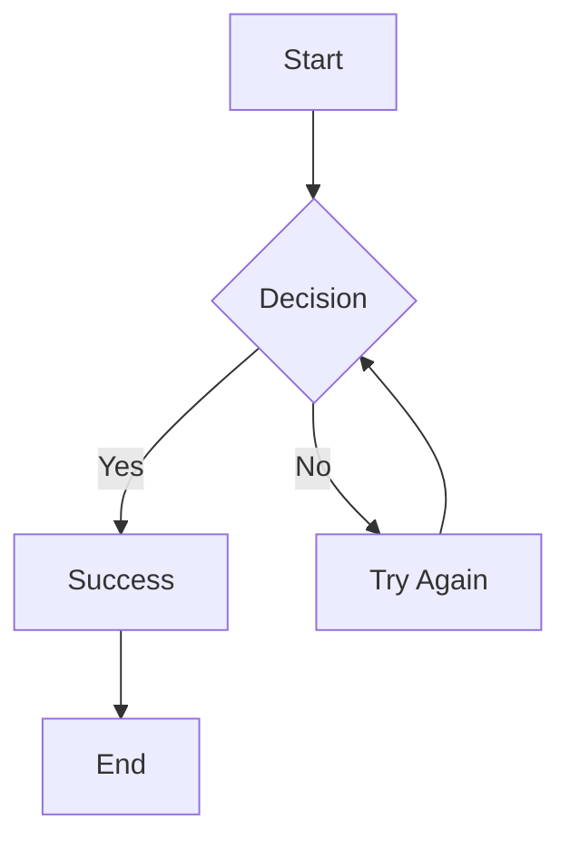

## Sequence Diagram
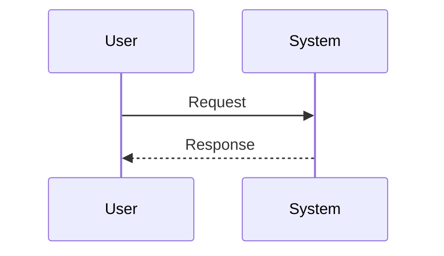

This lesson tests both author display and Mermaid rendering.

# Mermaid Diagram Examples

Complete reference guide for using Mermaid diagrams in your lessons.

## 1. Flowcharts

### Basic Flowchart
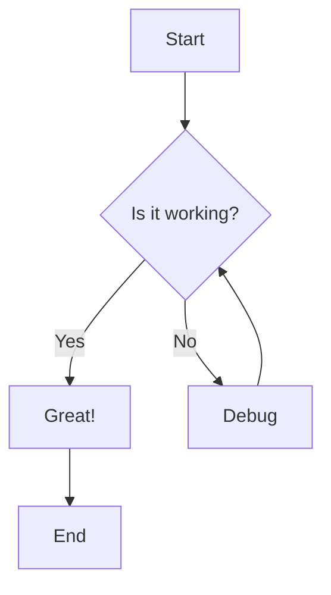

### Horizontal Flowchart
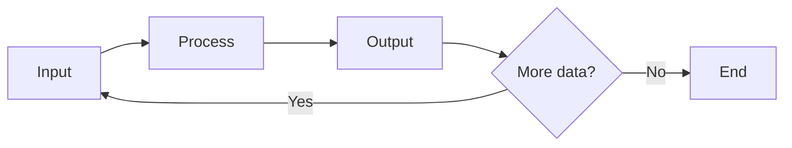

### Software Architecture
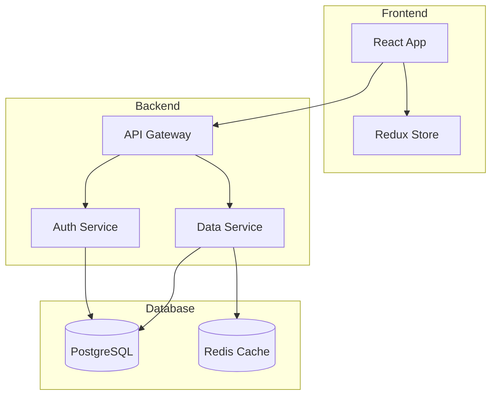

## 2. Sequence Diagrams

### User Authentication Flow
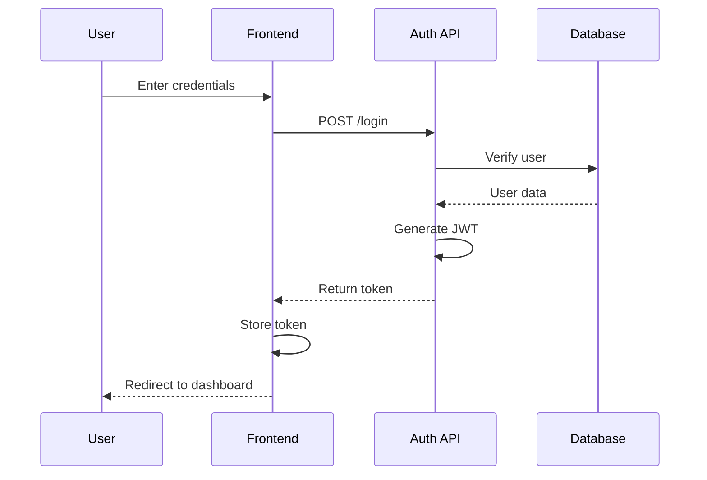

### Payment Process
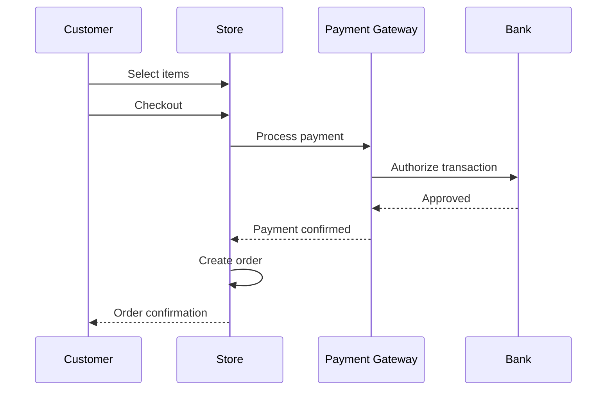

## 3. Class Diagrams

### Object-Oriented Design
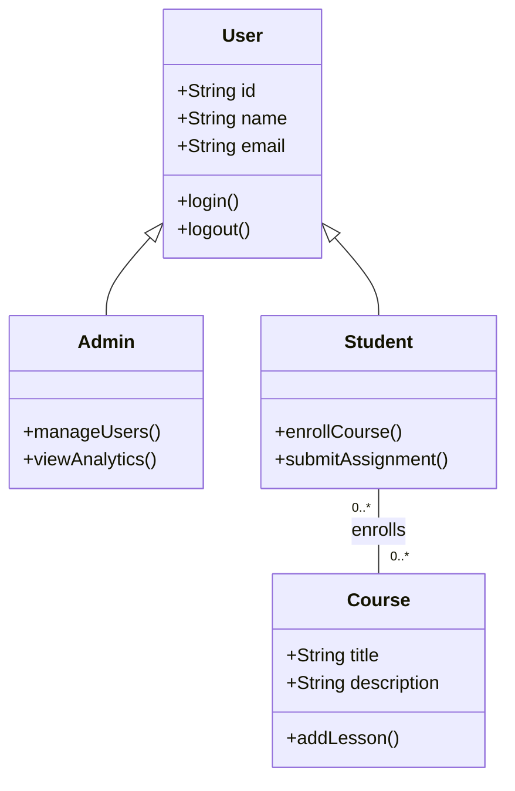

### E-commerce System
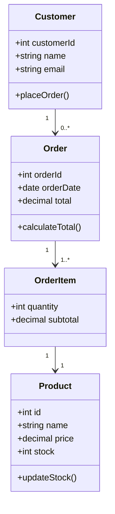

## 4. Entity Relationship Diagrams

### Database Schema
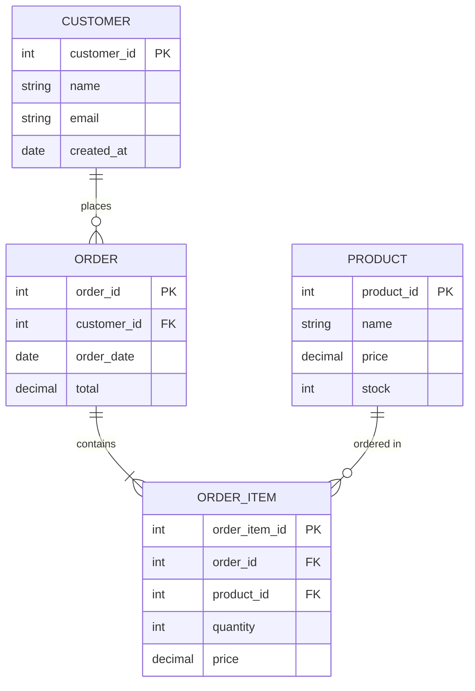

### Blog System

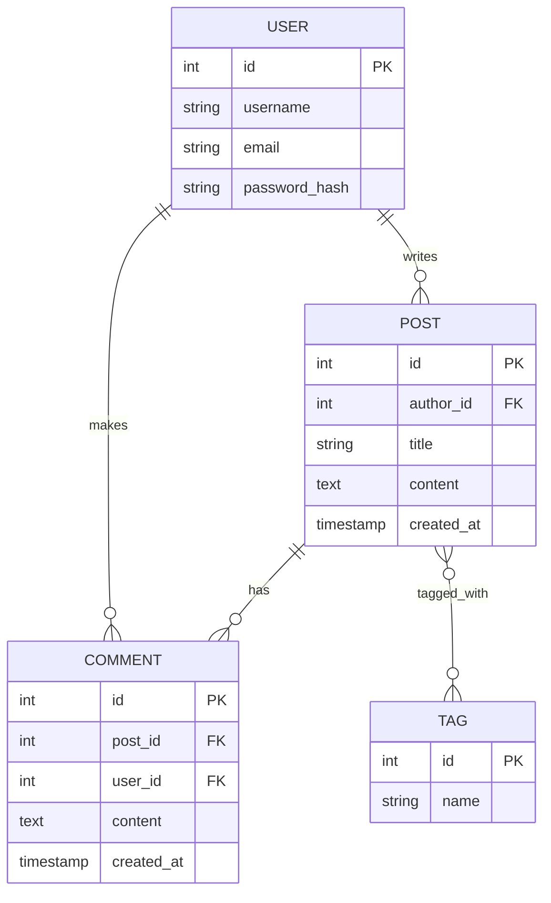

## 5. State Diagrams

### Order Status Flow
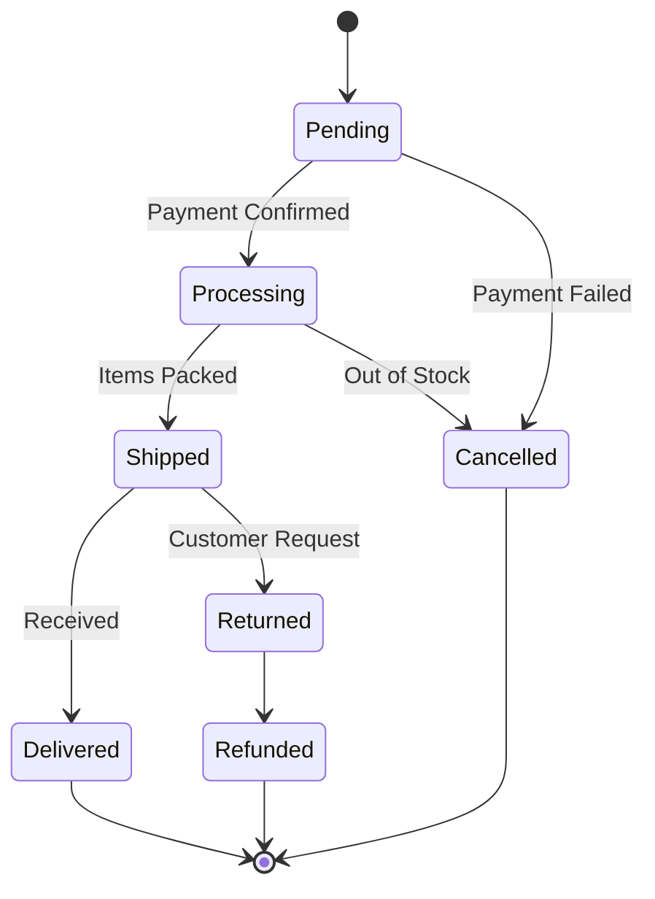

### User Session States
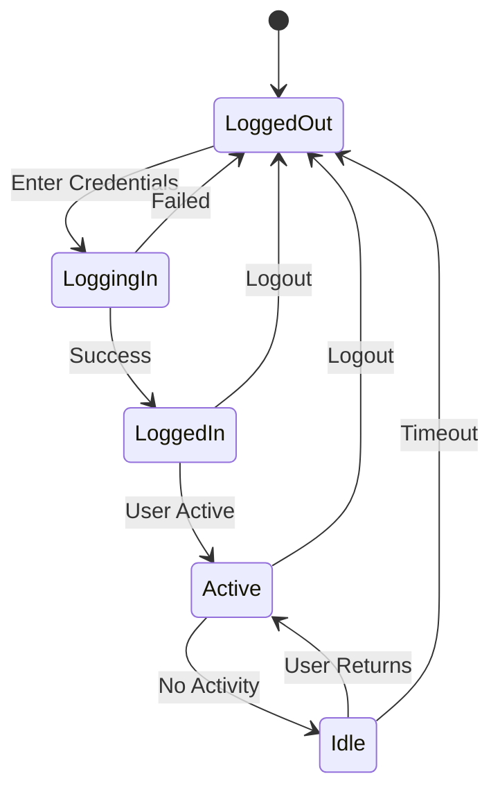

## 6. Gantt Charts

### Project Timeline
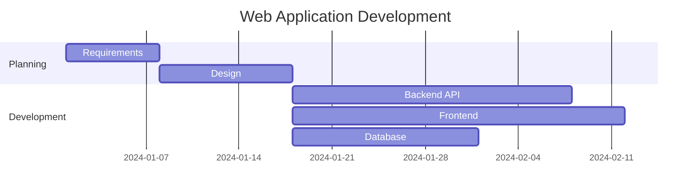

### Course Development
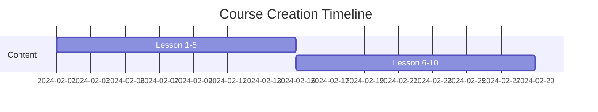

## 7. Pie Charts

### Market Share
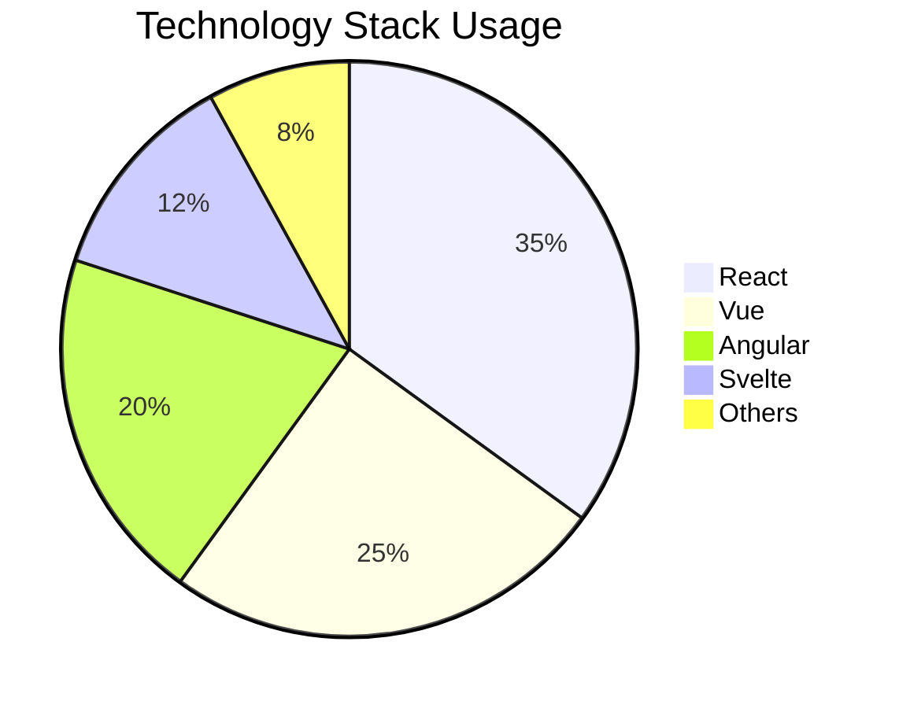

### Course Completion Rates
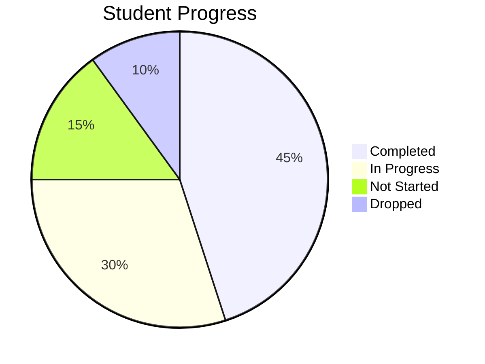

## 8. Git Graphs

### Feature Development
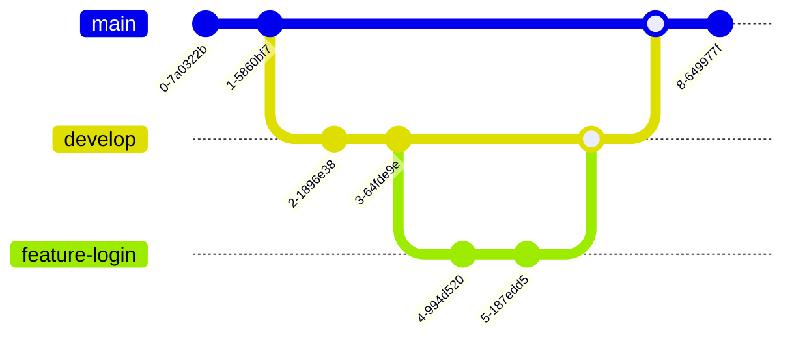

## 9. Advanced Examples

### Microservices Architecture
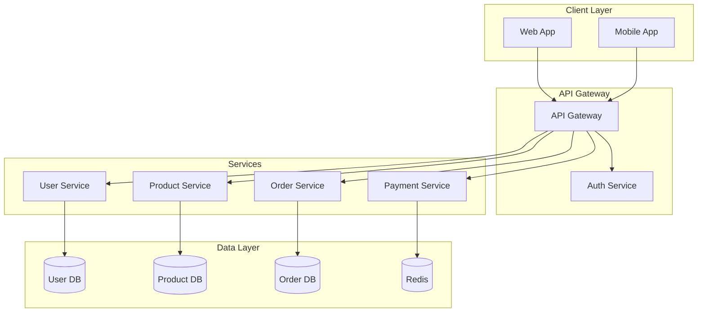

### CI/CD Pipeline
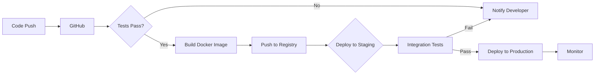

## Tips for Effective Diagrams

1. **Keep it Simple**: Don't overcrowd diagrams with too many nodes
2. **Use Subgraphs**: Group related components for clarity
3. **Consistent Naming**: Use clear, descriptive labels
4. **Color Coding**: Use styling to highlight important paths (when supported)
5. **Test First**: Always verify syntax in a Mermaid editor before publishing

## Styling Notes

Some Mermaid features support styling:

```mermaid
graph TD
    A[Normal Node]
    B[Important Node]
    style B fill:#f96,stroke:#333,stroke-width:4px
```

## Common Issues

1. **Syntax Errors**: Use Mermaid Live Editor to validate
2. **Complex Diagrams**: Break into multiple simpler diagrams
3. **Long Labels**: Use abbreviations or break into multiple lines
4. **Direction**: Choose appropriate direction (TD, LR, RL, BT)

# TEST

```mermaid
architecture-beta
    group api(cloud)[API]
    service db(database)[Database] in api
    service disk1(disk)[Storage] in api
    service disk2(disk)[Storage] in api
    service server(server)[Server] in api
    db:L -- R:server
    disk1:T -- B:server
    disk2:T -- B:db
```

## Resources

- [Mermaid Official Documentation](https://mermaid.js.org/)
- [Mermaid Live Editor](https://mermaid.live/)
- [GitHub Mermaid Support](https://github.blog/2022-02-14-include-diagrams-markdown-files-mermaid/)