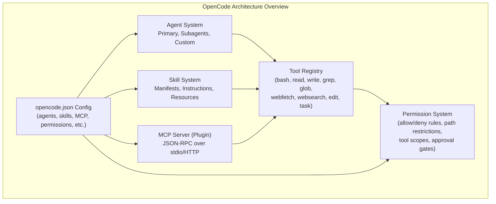
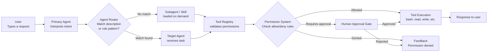
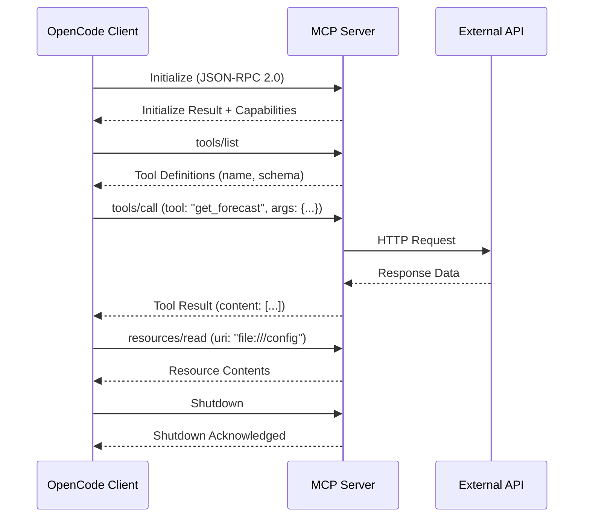

# OpenCode Architecture: Agents, Skills and MCP

## What is OpenCode?

OpenCode is an open-source CLI framework for AI-assisted software engineering. It bridges large language models with development environments through a structured system of agents, skills, and the Model Context Protocol (MCP).

> [!NOTE]
> OpenCode is configured via a single file: `opencode.json` at the project root or `.opencode/config.json` inside the `.opencode/` directory. Both locations are equivalent, though `.opencode/config.json` keeps your configuration isolated.



> [!TIP]
> Think of OpenCode as an operating system for AI coding assistants. Agents are the users, skills are the installed programs, MCP servers are peripheral devices, and permissions are the security policies.

---

## Request Lifecycle

Every user interaction flows through a well-defined pipeline. Understanding this lifecycle is crucial for debugging and optimization.



> [!TIP]
> When an agent behaves unexpectedly, trace the request lifecycle. The issue is often in the permission system (a denied tool) or the agent routing (wrong agent matched).

---

## Agent System Overview

Agents are AI-powered assistants configured with specific models, prompts, and capabilities. OpenCode supports multiple agent types:

- **Primary agent**: The main coding assistant that interacts with the user
- **Subagents**: Specialized agents (e.g., `customize-opencode`) that handle domain-specific tasks
- **Custom agents**: User-defined agents with tailored configurations

Each agent operates within a permission scope and has access to a defined set of tools and skills.

> [!WARNING]
> Subagents inherit the parent's permission scope unless explicitly overridden. This means a subagent with a powerful parent could accidentally perform destructive operations. Always review subagent permissions when delegating sensitive tasks.

---

## Skills System

Skills are reusable instruction packages that teach an agent how to perform specific tasks. A skill includes:

- **Instructions**: Natural language guidance for the agent
- **Tools**: Optional tool definitions or constraints
- **Resources**: Bundled files (scripts, templates, references)

Skills are loaded automatically when an agent detects a matching task pattern.

```yaml
# skill.yaml
name: customize-opencode
description: Editing or creating opencode configuration
instructions: |
  When the user asks to edit opencode.json or related config files,
  follow these steps:
  1. Read the existing configuration
  2. Validate JSON/YAML syntax
  3. Apply changes safely
tools:
  - read
  - write
  - edit
resources:
  - schema/opencode-schema.json
```

```bash
# Skills are auto-loaded when query matches their description
# Example: typing "edit my opencode config" triggers customize-opencode
# You can also force-load with: opencode --skill customize-opencode
```

---

## MCP (Model Context Protocol)

MCP is a standard protocol for connecting LLMs with external tools and data sources. It allows OpenCode to integrate with:

- **File systems** (local and remote)
- **Databases** (SQL, vector stores)
- **Web APIs** (REST, GraphQL)
- **Custom services** (internal tools)

MCP servers run as separate processes and communicate via JSON-RPC over stdin/stdout or HTTP.

### How MCP Communication Works



```json
{
  "mcpServers": {
    "filesystem": {
      "command": "node",
      "args": ["mcp-server-fs.js"],
      "env": {
        "ALLOWED_PATHS": "/home/user/projects"
      }
    }
  }
}
```

> [!IMPORTANT]
> MCP servers are long-running processes. They start when OpenCode launches and shut down when the session ends. Resource-intensive servers should be carefully managed to avoid memory bloat.

---

## Configuration via opencode.json

All OpenCode behavior is controlled through `opencode.json` (or `.opencode/config.json`).

> [!NOTE]
> The `.opencode/` directory approach is preferred for team projects because you can add it to `.gitignore` selectively or version-control just the config file without cluttering the project root.

```json
{
  "agents": {
    "default": {
      "model": "gpt-4o",
      "description": "Main coding assistant"
    },
    "reviewer": {
      "model": "claude-sonnet-4-20250514",
      "description": "Code review specialist",
      "prompt": "You are a senior code reviewer focusing on security and performance."
    }
  },
  "skills": {
    "customize-opencode": {
      "manifest": "skills/customize-opencode/skill.yaml"
    },
    "react-component": {
      "manifest": "skills/react-component/skill.yaml",
      "autoLoad": true,
      "matchPattern": "react component|jsx"
    }
  },
  "mcpServers": {
    "filesystem": {
      "command": "node",
      "args": ["mcp-server-fs.js", "/home/user/projects"]
    },
    "github": {
      "command": "node",
      "args": ["mcp-github-server.js"],
      "env": {
        "GITHUB_TOKEN": "${GITHUB_TOKEN}"
      }
    }
  },
  "permissions": [
    {
      "tool": "bash",
      "allow": ["npm *", "git *", "pip *"],
      "deny": ["rm -rf /", "sudo *"]
    },
    {
      "tool": "write",
      "allow": ["src/**", "docs/**"],
      "deny": [".env", "secrets/**"]
    }
  ],
  "agentRouting": {
    "mode": "auto",
    "defaultAgent": "default",
    "rules": [
      {
        "pattern": "security|vulnerability|CVE",
        "agent": "reviewer"
      }
    ]
  }
}
```

---

## Tool Registry

The tool registry manages all available tools and their capabilities:

| Tool         | Purpose                    | Requires Permission | Category        |
|--------------|----------------------------|:-------------------:|-----------------|
| `bash`       | Execute shell commands     | Yes                 | Execution       |
| `read`       | Read files                 | No                  | Read            |
| `write`      | Write files                | Yes                 | Write           |
| `edit`       | Edit files                 | Yes                 | Write           |
| `grep`       | Search file contents       | No                  | Read            |
| `glob`       | Find files by pattern      | No                  | Read            |
| `webfetch`   | Fetch URLs                 | Optional            | Network         |
| `websearch`  | Search the web             | Optional            | Network         |
| `task`       | Delegate to subagent/skill | Yes                 | Orchestration   |
| `question`   | Ask user for input         | No                  | Interaction     |

> [!WARNING]
| Tools marked as "Optional" for permissions can be used without rules but their behavior may be restricted. For example, `webfetch` without allow rules may be limited to certain domains.

```typescript
// Tools are registered programmatically in the OpenCode SDK
import { ToolRegistry } from "opencode";

const registry = new ToolRegistry();

registry.register({
  name: "bash",
  description: "Execute shell commands",
  requiresPermission: true,
  handler: async (args: { command: string }) => {
    // Execution logic with permission checks
  }
});

registry.register({
  name: "grep",
  description: "Search file contents with regex",
  requiresPermission: false,
  handler: async (args: { pattern: string; path?: string }) => {
    // Search logic
  }
});
```

---

## Permission System

Permissions control what actions agents can perform. Rules are defined in `opencode.json`:

```json
{
  "permissions": [
    {
      "tool": "bash",
      "allow": ["npm *", "git *"],
      "deny": ["rm -rf *", "sudo *"]
    },
    {
      "tool": "write",
      "allow": ["src/**", "docs/**"],
      "deny": [".env", "secrets/**"]
    }
  ]
}
```

> [!WARNING]
> Permission rules are evaluated in order: deny rules are checked first, then allow rules. If a command matches both an allow and a deny pattern, the deny rule takes precedence. This prevents accidental bypasses through overlapping patterns.

### Comparison: Agents vs Skills vs Plugins

| Aspect          | Agent                    | Skill                      | Plugin (MCP)                |
|-----------------|--------------------------|----------------------------|-----------------------------|
| **Purpose**     | AI assistant instance    | Task instruction package   | External tool/service       |
| **Config**      | `opencode.json`          | YAML/JSON manifest         | `opencode.json` MCP entry   |
| **Lifecycle**   | Session-based            | On-demand loading          | Long-running process        |
| **Scope**       | Full conversation        | Specific task              | Tool/service access         |
| **Language**    | Model-dependent          | Natural language           | Any (Node, Python, Go)      |
| **State**       | Stateful (conversation)  | Stateless (instructions)   | Stateful (process)          |
| **Example**     | Default coding agent     | `customize-opencode`       | MCP filesystem server       |
| **Dependencies**| None                     | None (self-contained)      | Runtime (Node, Python, etc.)|

> [!TIP]
| Choose an agent when you need a persistent conversational partner with a specific expertise. Choose a skill when you want to teach any agent a repeatable procedure. Choose a plugin when you need to connect to an external system or API.

---

## Practice Questions

```question
{
  "id": "oc-01-q1",
  "type": "multiple-choice",
  "question": "A team wants to enable their LLM-powered coding assistant to query a company's internal REST API. Which OpenCode mechanism should they use?",
  "options": [
    "The Skill System with a custom manifest",
    "The Tool Registry with built-in tools",
    "The MCP protocol to create a server wrapping the API",
    "The Agent Routing system with pattern matching"
  ],
  "correct": 2,
  "explanation": "MCP (Model Context Protocol) is designed specifically for connecting LLMs with external tools and data sources. By creating an MCP server that wraps the REST API, the team exposes the API as callable tools that the agent can invoke through the standard JSON-RPC protocol."
}
```

```question
{
  "id": "oc-01-q2",
  "type": "multiple-choice",
  "question": "A developer is creating a reusable package that teaches an agent how to scaffold React components. What three components must this package include?",
  "options": [
    "Model, prompt, and constraints",
    "Instructions, tools, and resources",
    "Name, version, and author",
    "Code, tests, and documentation"
  ],
  "correct": 1,
  "explanation": "A skill package is defined by three required components: instructions (step-by-step guidance for the agent), tools (declared capabilities the skill needs), and resources (bundled files like templates and reference documents)."
}
```

```question
{
  "id": "oc-01-q3",
  "type": "multiple-choice",
  "question": "According to the tool registry, which two operations can modify files and always require an explicit permission rule?",
  "options": [
    "read and grep",
    "bash and webfetch",
    "write and edit",
    "glob and websearch"
  ],
  "correct": 2,
  "explanation": "The `write` and `edit` tools both modify files and are classified as write operations. They always require explicit permission rules. In contrast, `read`, `grep`, and `glob` are read-only operations that typically do not require permissions."
}
```

```question
{
  "id": "oc-01-q4",
  "type": "multiple-choice",
  "question": "A user has a primary coding agent and wants to add a specialized agent for database migration tasks. How does this specialized agent relate to the primary one?",
  "options": [
    "It runs independently with no connection to the primary agent",
    "It is a subagent that can be invoked by the primary agent for delegation",
    "It replaces the primary agent for all database operations",
    "It requires a separate opencode.json file to run"
  ],
  "correct": 1,
  "explanation": "Specialized agents are configured as subagents nested within the primary agent's definition. The primary agent delegates tasks to them via the agent routing system, which uses description-based matching and rule patterns to dispatch work."
}
```

```question
{
  "id": "oc-01-q5",
  "type": "multiple-choice",
  "question": "You type a request and OpenCode's primary agent tries to use `bash` to install a package, but the command is denied. According to the request lifecycle, what is the most likely reason?",
  "options": [
    "The bash tool is not registered in the tool registry",
    "The permission system checked the rule and found a deny pattern matching the command",
    "The MCP server for bash is not running",
    "The agent routing module dispatched the task to the wrong agent"
  ],
  "correct": 1,
  "explanation": "The request lifecycle shows that after the tool registry validates the agent's capabilities, the permission system checks allow/deny rules. If a deny pattern matches the bash command (e.g., 'sudo apt install' matching 'sudo *'), the permission system returns a 'denied' response before the tool ever executes."
}
```

---

[!SUCCESS] **Key Takeaways**

- OpenCode is an open-source CLI framework for AI-assisted software engineering with a layered architecture
- Agents provide AI-powered assistance through configurable model and prompt settings
- Skills are reusable instruction packages that guide agents through specific tasks
- MCP (Model Context Protocol) connects LLMs with external tools and data sources via JSON-RPC
- The tool registry centralizes access to all capabilities (bash, read, write, edit, grep, etc.)
- `opencode.json` is the single configuration file controlling agents, skills, MCP, and permissions
- The permission system enforces security with allow/deny rules and path restrictions
- The request lifecycle traces user input through agent routing, tool registry, permission checks, and execution
- MCP communication follows a structured sequence of initialize, list, call, and shutdown over JSON-RPC 2.0
