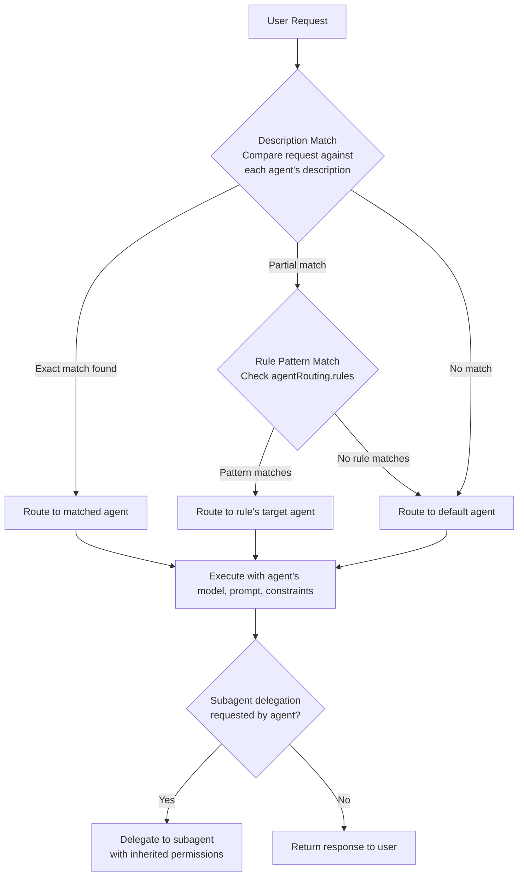
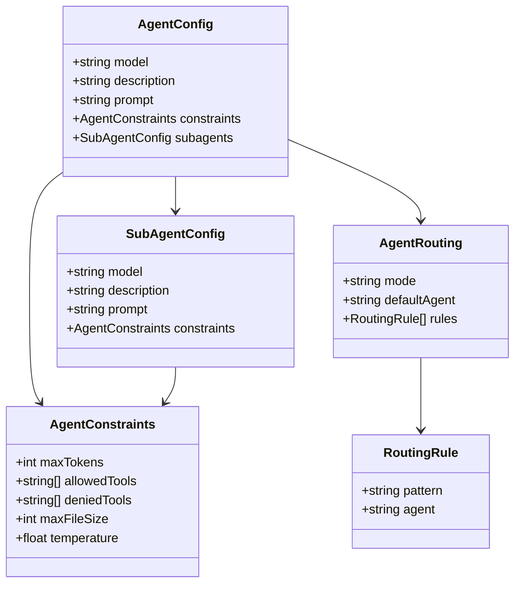

# Creating and Configuring Custom Agents

## Agent Configuration in opencode.json

Custom agents are defined in the `agents` section of `opencode.json`. Each agent entry specifies the model, behavior, and capabilities for that assistant.

```json
{
  "agents": {
    "default": {
      "model": "gpt-4o",
      "description": "General-purpose coding assistant"
    },
    "reviewer": {
      "model": "claude-sonnet-4-20250514",
      "description": "Code review specialist",
      "prompt": "You are a senior code reviewer. Focus on security, performance, and readability."
    }
  }
}
```

> [!TIP]
> Use descriptive agent names and descriptions — they serve as the primary routing mechanism. A well-named agent like "security-auditor" with a clear description is easier for both humans and the routing system to target.

---

## Agent Routing Decision Flow

Understanding how OpenCode decides which agent handles a request is key to designing effective multi-agent setups.



> [!NOTE]
> Agent routing uses fuzzy description matching by default. If you need precise control, use `agentRouting.rules` with explicit regex patterns to guarantee specific requests go to specific agents.

---

## Specifying Models

Each agent can use a different LLM. OpenCode supports multiple model providers:

```json
{
  "agents": {
    "frontend": {
      "model": "gpt-4o",
      "description": "Frontend development agent — React, CSS, TypeScript"
    },
    "backend": {
      "model": "claude-sonnet-4-20250514",
      "description": "Backend architecture agent — APIs, databases, services"
    },
    "fast-prototype": {
      "model": "gpt-4o-mini",
      "description": "Quick prototyping — lower cost, faster responses"
    }
  }
}
```

> [!TIP]
> Choosing the right model is a trade-off between capability, cost, and speed. Use `gpt-4o-mini` or similar small models for routine tasks (linting, simple refactors) and reserve premium models for complex reasoning (architecture design, security audits).

### Agent Configuration Schema



---

## Setting Agent Descriptions

Descriptions help OpenCode route tasks to the correct agent. They act as metadata for agent selection.

```json
{
  "agents": {
    "docs-writer": {
      "model": "gpt-4o",
      "description": "Specialist in writing documentation, READMEs, and API references"
    },
    "test-generator": {
      "model": "gpt-4o",
      "description": "Creates unit tests, integration tests, and test fixtures"
    }
  }
}
```

> [!IMPORTANT]
> Agent descriptions are not just documentation — they are actively used at runtime for routing. A vague description like "helps with coding" may cause requests to be misrouted. Be specific: "Handles database schema design and SQL optimization."

---

## Agent Prompts

Prompts define the system message and behavioral instructions for an agent.

```json
{
  "agents": {
    "security-auditor": {
      "model": "claude-opus-4-20250514",
      "description": "Security-focused code auditor",
      "prompt": "You are a security auditor. Identify vulnerabilities, suggest fixes, and explain risks. Prioritize OWASP Top 10 issues. Always check for: SQL injection, XSS, CSRF, insecure deserialization, and known vulnerable dependencies."
    },
    "code-formatter": {
      "model": "gpt-4o-mini",
      "description": "Formats code according to project style guides",
      "prompt": "You format code according to the project's style guide. Never change logic — only whitespace, indentation, and formatting rules. Run the linter after formatting to verify compliance."
    }
  }
}
```

> [!WARNING]
> Agent prompts are injected into the system message of the LLM call. Malicious prompt injection in shared configurations could alter agent behavior. Always review prompt content from untrusted sources, especially when the agent has broad permissions.

```typescript
// Agents can be customized programmatically via the OpenCode SDK
import { OpenCode } from "opencode";

const opencode = new OpenCode();

opencode.registerAgent({
  name: "security-auditor",
  model: "claude-opus-4-20250514",
  description: "Security-focused code auditor",
  prompt: `You are a security auditor. Focus on OWASP Top 10.`,
  constraints: {
    allowedTools: ["read", "grep", "glob", "bash"],
    deniedTools: ["write", "edit"],
    temperature: 0.3
  }
});

await opencode.run();
```

---

## Subagent Types

Subagents are nested agents that handle specialized subtasks. They are invoked when a primary agent delegates work.

```json
{
  "agents": {
    "default": {
      "model": "gpt-4o",
      "description": "Primary coding assistant — orchestrates complex workflows",
      "subagents": {
        "customize-opencode": {
          "model": "gpt-4o",
          "description": "Handles OpenCode configuration changes"
        },
        "deployment": {
          "model": "gpt-4o-mini",
          "description": "Manages deployment pipelines and CI/CD",
          "prompt": "You are a deployment engineer. Always verify the deployment target before proceeding."
        }
      }
    }
  }
}
```

> [!WARNING]
> Subagents inherit the parent's permission scope unless explicitly overridden. Always review subagent permissions when delegating sensitive operations. A code-writing subagent should not have access to production deployment tools unless specifically intended.

---

## Agent Routing

Agent routing controls how tasks are dispatched to the appropriate agent. OpenCode uses description-based matching to select the best agent for a given task.

```json
{
  "agentRouting": {
    "mode": "auto",
    "defaultAgent": "default",
    "rules": [
      {
        "pattern": "security|vulnerability|CVE|OWASP",
        "agent": "security-auditor"
      },
      {
        "pattern": "documentation|readme|api docs|wiki",
        "agent": "docs-writer"
      },
      {
        "pattern": "deploy|release|CI/CD|pipeline",
        "agent": "deployment"
      },
      {
        "pattern": "test|unit test|integration test|jest|pytest",
        "agent": "test-generator"
      }
    ]
  }
}
```

> [!IMPORTANT]
> Routing rules are evaluated in order. The first matching rule wins. Place more specific rules before general ones. For example, a rule matching "deploy production" should come before a generic "deploy" rule.

---

## Agent Constraints

Constraints limit what an agent can do, preventing misuse or accidental damage.

```json
{
  "agents": {
    "sandboxed": {
      "model": "gpt-4o-mini",
      "description": "Restricted agent for safe experimentation",
      "constraints": {
        "maxTokens": 4096,
        "allowedTools": ["read", "grep", "glob", "websearch"],
        "deniedTools": ["bash", "write", "edit"],
        "maxFileSize": 1048576,
        "temperature": 0.7
      }
    },
    "production-deployer": {
      "model": "gpt-4o",
      "description": "Production deployment agent — requires approval",
      "constraints": {
        "allowedTools": ["bash", "read", "glob"],
        "temperature": 0.2,
        "maxTokens": 8192
      }
    }
  }
}
```

> [!TIP]
> Use `temperature` constraints to control agent creativity. Low values (0.1–0.3) produce deterministic, focused outputs ideal for code review and deployment. Higher values (0.7–1.0) encourage creative solutions for brainstorming and architecture design.

### Comparison: Agent Configuration Options

| Option          | Type      | Required | Default       | Description                                |
|-----------------|-----------|:--------:|---------------|--------------------------------------------|
| `model`         | string    | Yes      | —             | Model identifier (e.g., `gpt-4o`)          |
| `description`   | string    | Yes      | —             | Task routing description                   |
| `prompt`         | string    | No       | Default agent prompt | System prompt / behavioral instructions    |
| `subagents`     | object    | No       | `{}`          | Nested specialized agents                  |
| `constraints`   | object    | No       | `{}`          | Resource and tool usage limits             |
| `allowedTools`  | string[]  | No       | All tools     | Whitelist of permitted tools               |
| `deniedTools`   | string[]  | No       | `[]`          | Blacklist of prohibited tools              |
| `maxTokens`     | integer   | No       | Model default | Maximum response token count               |
| `temperature`   | float     | No       | Model default | Response randomness (0.0–2.0)              |
| `maxFileSize`   | integer   | No       | 10MB          | Maximum file size agent can read           |

> [!IMPORTANT]
> `allowedTools` and `deniedTools` are mutually exclusive patterns. If you specify `allowedTools`, all other tools are implicitly denied. If you specify `deniedTools`, all tools except those listed are implicitly allowed. Do not use both in the same constraint block — behavior is undefined.

---

## Practice Questions

```question
{
  "id": "oc-02-q1",
  "type": "multiple-choice",
  "question": "What are the minimum required fields to define a custom agent in `opencode.json`?",
  "options": [
    "model, description, and prompt",
    "model and description",
    "name and version",
    "model and allowedTools"
  ],
  "correct": 1,
  "explanation": "An agent definition requires at minimum a `model` (which LLM to use) and a `description` (used for routing). All other fields including `prompt`, `constraints`, and `subagents` are optional."
}
```

```question
{
  "id": "oc-02-q2",
  "type": "multiple-choice",
  "question": "When a user asks 'audit this codebase for security vulnerabilities,' which field does OpenCode use to route the task to the correct agent?",
  "options": [
    "The model field to match capability",
    "The subagents field to check nesting",
    "The description field for pattern-based matching",
    "The constraints field to verify permission"
  ],
  "correct": 2,
  "explanation": "OpenCode compares the user's request against each agent's `description` field and the routing rules' `pattern` field. If a security-auditor agent has 'security' or 'vulnerability' in its description, or a routing rule matches those terms, the request is routed there."
}
```

```question
{
  "id": "oc-02-q3",
  "type": "multiple-choice",
  "question": "A primary agent has a subagent for deployment tasks. The subagent is configured without explicit permission rules. What happens when the subagent tries to run a bash command?",
  "options": [
    "The command is denied because subagents have no default permissions",
    "The primary agent is prompted to approve each command manually",
    "The subagent inherits the permission scope of the primary agent",
    "The subagent creates its own permission scope automatically"
  ],
  "correct": 2,
  "explanation": "Subagents inherit the parent agent's permission scope by default. This means if the primary agent has permission to run bash commands, the subagent can also run them. This is a security consideration — always explicitly scope subagent permissions for sensitive operations."
}
```

```question
{
  "id": "oc-02-q4",
  "type": "multiple-choice",
  "question": "An administrator wants to create a read-only agent that can only search files and browse the web, without executing commands or modifying files. Which constraint configuration should they use?",
  "options": [
    "maxTokens: 2048",
    "allowedTools: ['grep', 'glob', 'websearch']",
    "maxFileSize: 1048576",
    "subagents: {}"
  ],
  "correct": 1,
  "explanation": "Using `allowedTools: ['grep', 'glob', 'websearch']` creates a whitelist that permits only these read/web operations. All other tools including `bash`, `write`, and `edit` are implicitly denied, making the agent effectively read-only."
}
```

```question
{
  "id": "oc-02-q5",
  "type": "multiple-choice",
  "question": "A team has two routing rules: one matching 'deploy' to deploy-agent, and another matching 'deploy production' to prod-deploy-agent. A user types 'deploy to production'. Which agent handles the request and why?",
  "options": [
    "deploy-agent, because it matches first",
    "prod-deploy-agent, because more specific patterns take priority",
    "deploy-agent, because 'deploy production' triggers both but 'deploy' comes first",
    "The default agent, because the query doesn't exactly match any rule"
  ],
  "correct": 0,
  "explanation": "Routing rules are evaluated in order. If 'deploy' to deploy-agent is defined before 'deploy production' to prod-deploy-agent, the first matching rule wins. The query 'deploy to production' contains 'deploy', so it matches the first rule. Order matters — place more specific rules before general ones."
}
```

---

[!SUCCESS] **Key Takeaways**

- Custom agents are defined in `opencode.json` with at least a `model` and `description`
- Agent prompts serve as system messages that define behavioral instructions and personality
- Subagents allow hierarchical delegation of specialized tasks within a primary agent session
- Agent routing uses description-based matching and rule patterns to dispatch tasks automatically
- Constraints limit agent capabilities through tool whitelists, blacklists, resource caps, and temperature
- The `prompt` field is optional but essential for guiding agent behavior beyond the default
- Multiple agents can use different models from different providers in the same configuration
- Routing rules are evaluated in order — place specific patterns before general ones
- Subagents inherit parent permissions by default, requiring careful security review
- Temperature constraints control creativity vs. determinism in agent responses
