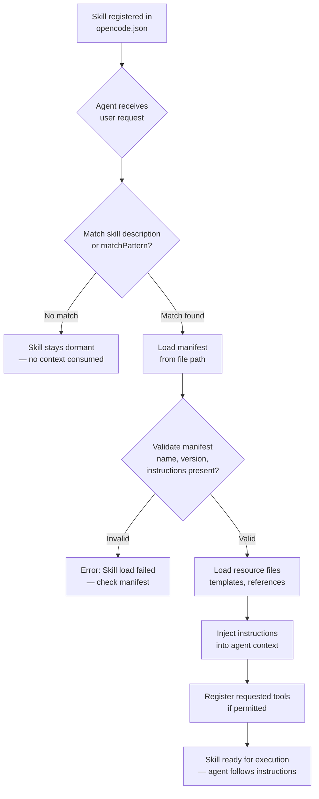
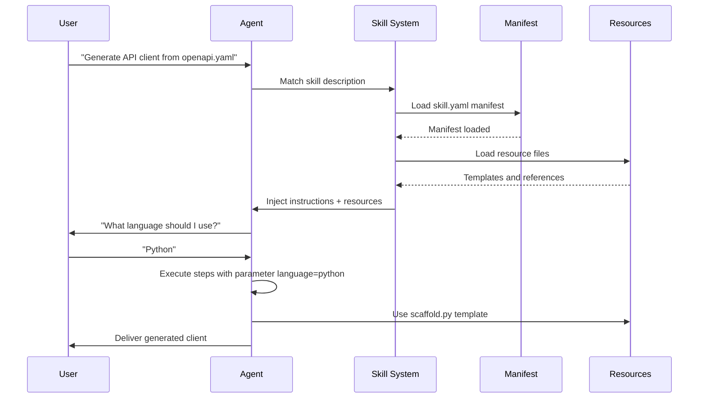

# Building and Registering Custom Skills

## Skill Structure

A skill is a directory containing a manifest file and optional resources:

```
skills/
  my-custom-skill/
    skill.yaml        # Manifest (required)
    instructions.md   # Extended instructions (optional)
    templates/        # Resource files (optional)
       scaffold.py
    references/       # Reference documents (optional)
       api-guide.md
```

> [!NOTE]
> While `skill.yaml` is the conventional format, OpenCode also supports JSON manifests (`skill.json`). YAML is recommended for readability, especially for long instruction blocks. JSON is preferable when you need to generate manifests programmatically or validate them with JSON Schema.

---

## Skill Loading Lifecycle

Understanding how skills are loaded helps you design efficient skills that don't waste context window.



> [!TIP]
> Skills with overly broad descriptions may be loaded unintentionally, consuming context window and tokens. Keep descriptions specific and focused. Use `matchPattern` for precise control over when a skill activates.

---

## Skill Manifest

The manifest defines the skill's identity, purpose, and components.

```yaml
# skill.yaml
name: my-custom-skill
description: Guides the agent in performing custom scaffold generation
author: NUniversity
version: 1.0.0
instructions: |
  When the user asks to scaffold a new Python project:
  1. Use the template files in the `templates/` directory
  2. Ask the user for the project name and package name
  3. Generate the directory structure with pyproject.toml, src/, tests/
  4. Initialize a git repository
tools:
  - bash
  - write
  - read
  - glob
resources:
  - templates/scaffold.py
  - references/api-guide.md
```

> [!IMPORTANT]
> The `instructions` field is the most critical part of a skill. It is injected directly into the agent's context. Keep instructions concise and actionable — every token consumed by the skill is a token not available for the conversation. Aim for no more than 500-1000 words per skill.

### Comparison: YAML vs JSON Manifest Formats

| Aspect            | YAML (`skill.yaml`)                | JSON (`skill.json`)                |
|-------------------|-------------------------------------|-------------------------------------|
| **Readability**   | Excellent — natural for long text   | Good — familiar to JS/TS devs      |
| **Comments**      | Supported (`# comment`)             | Not supported                       |
| **Multi-line**    | Native (`|` and `>` block scalars) | Escape `\n` or use arrays          |
| **Schema validate**| Limited tooling                     | JSON Schema, many validators       |
| **Best for**      | Hand-written skills with instructions | Auto-generated or validated skills |
| **File size**     | Typically smaller                   | Slightly larger (quotes, commas)   |
| **Tooling**       | YAML linters available              | Native JSON in most editors        |

---

## Writing Skill Instructions

Instructions are the core of a skill. They guide the agent step by step.

```markdown
# instructions.md

## Goal
Scaffold a production-ready Python project.

## Steps
1. Ask the user for: project name, package name, Python version
2. Create directory: `{project_name}/`
3. Generate `pyproject.toml` with:
   - Project metadata
   - Dependencies (click, pytest, black)
   - Build system config
4. Create `src/{package_name}/__init__.py` with version string
5. Create `tests/test_{package_name}.py` with a placeholder test
6. Run `git init` and `git add -A`

## Constraints
- Do not overwrite existing files without asking
- Use the latest Python packaging standards (PEP 621)
```

```bash
# Instructions can reference scripts bundled as resources
# Example: running the scaffold template
python skills/my-custom-skill/templates/scaffold.py \
  --project-name "$PROJECT_NAME" \
  --package-name "$PACKAGE_NAME"
```

---

## Skill Tools and Resources

Skills can declare required tools and bundle resource files:

```json
{
  "name": "db-migration-skill",
  "description": "Database migration generation and management",
  "version": "2.1.0",
  "instructions": "When managing database migrations...",
  "tools": ["bash", "read", "write", "grep"],
  "resources": [
    "templates/migration_template.sql",
    "templates/rollback_template.sql",
    "config/migration.config.json"
  ],
  "parameters": {
    "db_type": {
      "type": "string",
      "description": "Database type (postgres, mysql, sqlite)",
      "required": true
    },
    "migration_name": {
      "type": "string",
      "description": "Descriptive name for the migration",
      "required": true
    }
  }
}
```

> [!WARNING]
> Each resource file loaded into context consumes tokens. Bundle only essential files. Large reference documents should be linked rather than embedded. A 100KB reference file consumes roughly 25,000 tokens of context window.

---

## Skill Parameters

Parameters allow skills to be configurable and reusable:

```yaml
name: api-client-generator
description: Generates API client libraries from OpenAPI specs
version: 1.0.0
instructions: |
  Generate an API client based on the provided OpenAPI specification.
  Use the language parameter to determine the output format.
parameters:
  language:
    type: string
    description: "Target language (python, typescript, go)"
    required: true
    default: python
  spec_path:
    type: string
    description: "Path to OpenAPI specification file"
    required: true
  output_dir:
    type: string
    description: "Output directory for generated client"
    required: false
    default: "./generated"
```

> [!TIP]
> Use `required: false` with a sensible `default` value for parameters that have obvious defaults. This reduces friction when using the skill while still allowing customization. Parameters are passed when the skill is invoked through agent instructions.

### Skill Execution Flow



---

## Registering Skills in Config

Skills must be registered in `opencode.json` to be discoverable:

```json
{
  "skills": {
    "scaffold-python": {
      "manifest": "skills/scaffold-python/skill.yaml"
    },
    "db-migration": {
      "manifest": "skills/db-migration/skill.json"
    },
    "api-client-gen": {
      "manifest": "skills/api-client-generator/skill.yaml"
    }
  }
}
```

```typescript
// Skills can also be registered programmatically
import { OpenCode } from "opencode";

const opencode = new OpenCode();

opencode.registerSkill({
  name: "react-component",
  manifest: "skills/react-component/skill.yaml",
  autoLoad: true,
  matchPattern: "react component|jsx|tsx"
});

await opencode.run();
```

---

## Skill Discovery

OpenCode discovers skills through registration and pattern matching. When a user query matches a skill's description, the skill is automatically loaded.

> [!WARNING]
> Skills with overly broad descriptions may be loaded unintentionally, consuming context window and tokens. Keep descriptions specific and focused. A skill described as "helps with development" will match nearly every request.

```json
{
  "skills": {
    "react-component": {
      "manifest": "skills/react-component/skill.yaml",
      "autoLoad": true,
      "matchPattern": "react component|jsx|tsx component|react hook"
    }
  }
}
```

> [!TIP]
> The `autoLoad` field combined with `matchPattern` gives you precise control. Without `autoLoad`, the skill is only loaded when explicitly requested. This is useful for niche skills that shouldn't activate on every vaguely related query. Use `autoLoad: false` for rarely-used skills to save context.

---

### Comparison: Skill Manifest Fields

| Field          | Type    | Required | Description                                |
|----------------|---------|:--------:|--------------------------------------------|
| `name`         | string  | Yes      | Unique skill identifier                    |
| `description`  | string  | Yes      | Short description for discovery matching  |
| `version`      | string  | Yes      | Semantic version (e.g., `1.0.0`)          |
| `instructions` | string  | Yes      | Step-by-step guidance for the agent       |
| `tools`        | string[]| No       | List of required tools                    |
| `resources`    | string[]| No       | Bundled file paths relative to skill dir  |
| `parameters`   | object  | No       | Configurable parameters with defaults     |
| `author`       | string  | No       | Creator name for attribution              |
| `matchPattern` | string  | No       | Regex pattern for auto-load triggering    |
| `autoLoad`     | boolean | No       | Whether skill activates on pattern match  |

> [!NOTE]
> A skill can have both `instructions` inline in the manifest and an external `instructions.md` file. If both exist, the external file takes precedence. Use inline instructions for short skills and external files for complex, multi-step procedures.

---

## Practice Questions

```question
{
  "id": "oc-03-q1",
  "type": "multiple-choice",
  "question": "A developer wants to create the smallest possible custom skill. What is the minimum requirement?",
  "options": [
    "A directory with both skill.yaml and instructions.md",
    "A single skill.yaml manifest file with at least name, description, version, and instructions",
    "A directory containing skill.yaml, templates/, and references/",
    "A JSON entry in opencode.json with no separate files"
  ],
  "correct": 1,
  "explanation": "The minimum requirement for a skill is a single YAML manifest file (`skill.yaml`) containing at minimum: `name`, `description`, `version`, and `instructions`. All other components (external instructions files, resources, parameters) are optional extensions."
}
```

```question
{
  "id": "oc-03-q2",
  "type": "multiple-choice",
  "question": "How do skill parameters differ from skill tools in a manifest?",
  "options": [
    "Parameters define the skill's version, while tools define its name",
    "Parameters make skills reusable with configurable inputs, while tools declare required capabilities",
    "Parameters are required fields, while tools are optional",
    "Parameters are written in YAML, while tools must be in JSON"
  ],
  "correct": 1,
  "explanation": "Parameters make skills reusable by accepting configurable inputs (like language selection or output paths). Tools declare which capabilities (bash, read, write) the skill requires the agent to have. Parameters customize behavior; tools ensure the agent can execute the steps."
}
```

```question
{
  "id": "oc-03-q3",
  "type": "multiple-choice",
  "question": "When registering a skill in opencode.json, which two optional fields control whether the skill loads automatically when a user query matches?",
  "options": [
    "manifest and name",
    "autoLoad and matchPattern",
    "version and author",
    "resources and parameters"
  ],
  "correct": 1,
  "explanation": "The `autoLoad` field (boolean) determines whether the skill activates automatically on pattern match, and `matchPattern` (regex string) defines the query patterns that trigger loading. Without `autoLoad: true`, the skill only loads when explicitly requested."
}
```

```question
{
  "id": "oc-03-q4",
  "type": "multiple-choice",
  "question": "A skill's description is 'handles various development tasks.' Why is this problematic?",
  "options": [
    "The description is too long and will be truncated",
    "It may cause the skill to load for unrelated queries, wasting context tokens",
    "The description lacks emoji formatting",
    "It does not include version information"
  ],
  "correct": 1,
  "explanation": "A vague description like 'handles various development tasks' would match nearly any development-related query, causing the skill to load and consume context window tokens even when the task has nothing to do with the skill's actual purpose. Descriptions should be specific and narrowly scoped."
}
```

```question
{
  "id": "oc-03-q5",
  "type": "multiple-choice",
  "question": "A skill bundles a 500KB API reference PDF as a resource. What is the likely consequence when this skill loads?",
  "options": [
    "The PDF is ignored because skills only support text files",
    "The skill loads faster because PDFs are optimized for context",
    "It may consume excessive context window tokens, potentially exceeding limits or crowding out the conversation",
    "The skill automatically compresses the PDF to save tokens"
  ],
  "correct": 2,
  "explanation": "Resource files bundled with a skill are loaded into the agent's context. A 500KB PDF would consume an enormous number of tokens (roughly 125,000 tokens), likely exceeding context limits or leaving no room for the actual conversation. Only bundle small, essential reference files with skills."
}
```

---

[!SUCCESS] **Key Takeaways**

- A skill is a directory with a manifest file (YAML or JSON) and optional resource files
- The manifest defines name, description, version, instructions, tools, resources, and parameters
- Instructions provide step-by-step guidance that directs agent behavior during a task
- Skills are registered in `opencode.json` under the `skills` key with a path to the manifest
- Parameters make skills reusable across different contexts with configurable inputs
- Resources bundle reference files, templates, and scripts alongside the skill
- Skill discovery uses description matching and optional `matchPattern` fields for auto-loading
- Overly broad descriptions cause skills to load unnecessarily, consuming context tokens
- YAML is recommended for hand-written skills; JSON is better for auto-generated ones
- The skill loading lifecycle goes: registration, matching, manifest validation, resource loading, instruction injection
