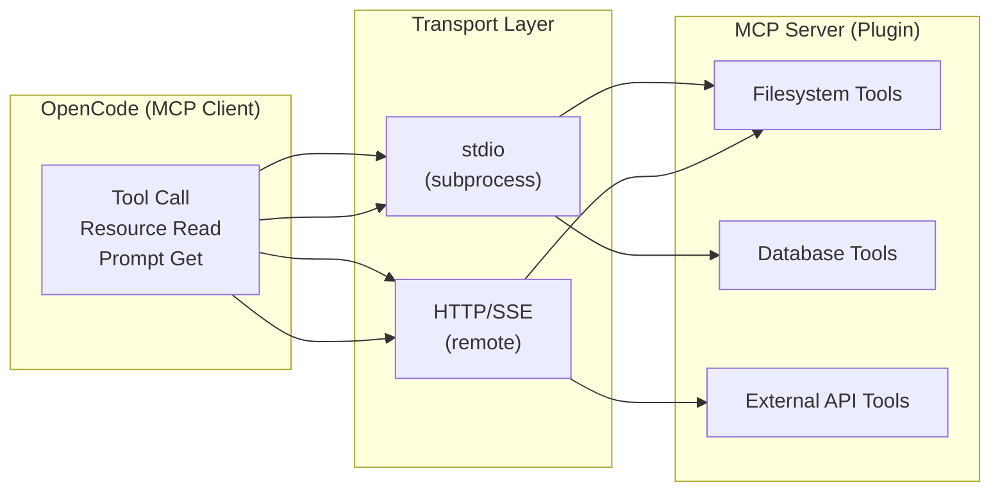
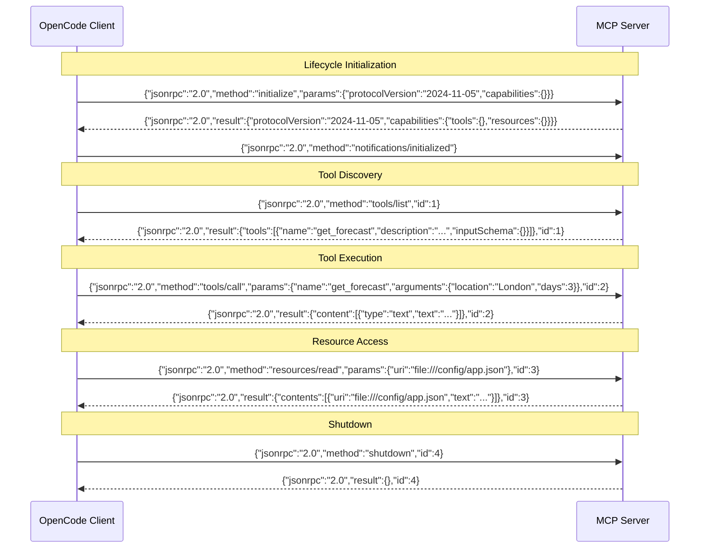
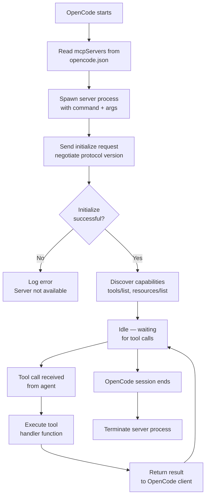

# MCP Servers, Plugins and External Tool Integration

## What is MCP?

The Model Context Protocol (MCP) is an open standard that defines how LLM applications communicate with external tools and data sources. It uses JSON-RPC 2.0 as its wire protocol.

> [!NOTE]
> MCP was designed specifically for LLM-tool interaction patterns. Unlike REST APIs which are designed for humans and CRUD operations, MCP uses a bidirectional JSON-RPC protocol that supports tool discovery, resource access, and prompt templates — all primitives that LLMs naturally understand.



---

## MCP JSON-RPC Protocol Exchange

Every interaction between OpenCode and an MCP server follows a structured JSON-RPC 2.0 conversation. Understanding this protocol is essential for debugging and building custom MCP servers.



> [!TIP]
> When debugging MCP issues, enable verbose logging to see the raw JSON-RPC messages. This is invaluable for identifying malformed tool schemas, incorrect response formats, or authentication failures.

### MCP Server Lifecycle



---

## MCP Server Configuration

MCP servers are configured in the `mcpServers` section of `opencode.json`:

```json
{
  "mcpServers": {
    "filesystem": {
      "command": "npx",
      "args": [
        "-y",
        "@modelcontextprotocol/server-filesystem",
        "/home/user/projects"
      ],
      "env": {
        "NODE_ENV": "production"
      }
    },
    "github": {
      "command": "node",
      "args": ["mcp-github-server.js"],
      "env": {
        "GITHUB_TOKEN": "${GITHUB_TOKEN}"
      }
    },
    "database": {
      "command": "python",
      "args": ["mcp-db-server.py"],
      "env": {
        "DATABASE_URL": "${DATABASE_URL}"
      }
    }
  }
}
```

> [!WARNING]
> MCP servers have full access to the environment variables they are configured with. Never hardcode secrets in `opencode.json` — always use environment variable interpolation (`${VAR_NAME}`). The env block is passed directly to the spawned process, and any tool running in that process can read these values.

---

## Connecting External APIs via MCP

MCP servers wrap external APIs into tool interfaces that LLMs can call:

```json
{
  "mcpServers": {
    "slack": {
      "command": "python",
      "args": ["mcp-slack-server.py"],
      "env": {
        "SLACK_BOT_TOKEN": "${SLACK_BOT_TOKEN}",
        "SLACK_SIGNING_SECRET": "${SLACK_SIGNING_SECRET}"
      }
    }
  }
}
```

```python
# mcp-slack-server.py
# MCP server that wraps the Slack API into callable tools
import os
import httpx
from mcp import Server

server = Server("slack")

@server.tool()
async def send_message(channel: str, text: str) -> str:
    """Send a message to a Slack channel"""
    async with httpx.AsyncClient() as client:
        resp = await client.post(
            f"https://slack.com/api/chat.postMessage",
            headers={
                "Authorization": f"Bearer {os.environ['SLACK_BOT_TOKEN']}",
                "Content-Type": "application/json"
            },
            json={"channel": channel, "text": text}
        )
        data = resp.json()
        if not data.get("ok"):
            raise Exception(f"Slack API error: {data.get('error')}")
        return data["message"]["text"]

@server.tool()
async def list_channels(limit: int = 20) -> list:
    """List public channels in the workspace"""
    async with httpx.AsyncClient() as client:
        resp = await client.get(
            "https://slack.com/api/conversations.list",
            headers={"Authorization": f"Bearer {os.environ['SLACK_BOT_TOKEN']}"},
            params={"limit": limit}
        )
        return resp.json()["channels"]

server.run()
```

---

## Writing MCP Server Implementations

An MCP server exposes three primitives:

- **Tools**: Callable functions the LLM can invoke
- **Resources**: Read-only data the LLM can access
- **Prompts**: Pre-written prompt templates

### TypeScript MCP Server

```typescript
// mcp-weather-server.ts
import { Server } from "@modelcontextprotocol/sdk/server/index.js";
import { StdioServerTransport } from "@modelcontextprotocol/sdk/server/stdio.js";

const server = new Server(
  { name: "weather-server", version: "1.0.0" },
  { capabilities: { tools: {}, resources: {} } }
);

// Define a tool with JSON Schema input validation
server.setRequestHandler("tools/list", async () => ({
  tools: [{
    name: "get_forecast",
    description: "Get weather forecast for a location",
    inputSchema: {
      type: "object",
      properties: {
        location: {
          type: "string",
          description: "City name or coordinates"
        },
        days: {
          type: "number",
          description: "Number of forecast days",
          default: 3
        }
      },
      required: ["location"]
    }
  }]
}));

// Handle tool execution with error handling
server.setRequestHandler("tools/call", async (request) => {
  const { name, arguments: args } = request.params;

  if (name === "get_forecast") {
    try {
      const data = await fetchWeather(args.location, args.days);
      return {
        content: [{ type: "text", text: JSON.stringify(data, null, 2) }]
      };
    } catch (error) {
      // Return structured error to the LLM
      return {
        content: [{
          type: "text",
          text: `Error fetching forecast: ${error.message}`
        }],
        isError: true
      };
    }
  }

  throw new Error(`Unknown tool: ${name}`);
});

// Connect using stdio transport
const transport = new StdioServerTransport();
await server.connect(transport);
```

### Python MCP Server

```python
# mcp-weather-server.py
# Equivalent MCP server in Python
import json
import sys
import httpx
from mcp import Server, StdioServerTransport

server = Server("weather-server")

@server.list_tools()
async def list_tools():
    return [
        {
            "name": "get_forecast",
            "description": "Get weather forecast for a location",
            "inputSchema": {
                "type": "object",
                "properties": {
                    "location": {"type": "string", "description": "City name"},
                    "days": {"type": "number", "description": "Forecast days", "default": 3}
                },
                "required": ["location"]
            }
        }
    ]

@server.call_tool()
async def call_tool(name: str, arguments: dict):
    if name == "get_forecast":
        async with httpx.AsyncClient() as client:
            resp = await client.get(
                f"https://api.weather.gov/points/{arguments['location']}/forecast"
            )
            data = resp.json()
        return {"content": [{"type": "text", "text": json.dumps(data, indent=2)}]}

async def main():
    transport = StdioServerTransport()
    await server.connect(transport)

if __name__ == "__main__":
    import asyncio
    asyncio.run(main())
```

> [!IMPORTANT]
> Tool schemas define the contract between the LLM and your server. Always include clear `description` fields for each parameter — the LLM uses these descriptions to determine how to populate arguments. A poorly described parameter will result in the LLM passing incorrect values.

---

## Plugin Architecture

MCP servers serve as the plugin system for OpenCode. Any external capability can be wrapped as an MCP server.

### Comparison: Transport Mechanisms

| Aspect              | stdio (subprocess)                  | HTTP/SSE (remote)                    |
|---------------------|--------------------------------------|--------------------------------------|
| **Process**         | Spawned by OpenCode                 | Runs independently                   |
| **Latency**         | Low (local IPC)                     | Higher (network I/O)                 |
| **Security**        | Process isolation, local only        | Requires network auth, TLS            |
| **Deployment**      | Bundled with project                | Running service or container         |
| **Lifecycle**       | Tied to OpenCode session            | Independent daemon                   |
| **Use case**        | Local tools (filesystem, git)       | Remote APIs (Slack, GitHub, DB)      |
| **Debugging**       | Check server logs                   | Check endpoints + network            |
| **Scalability**     | One per session                     | Multiple clients                     |

| Component     | Role                                      |
|---------------|-------------------------------------------|
| OpenCode      | MCP client — initiates requests           |
| MCP Server    | Plugin — processes requests and returns   |
| Transport     | stdin/stdout or HTTP/SSE                  |
| Protocol      | JSON-RPC 2.0                              |

> [!TIP]
> Use stdio transport for local development tools that need low latency (filesystem access, code analysis). Use HTTP/SSE for shared services that multiple team members need to access (shared databases, team APIs). HTTP servers can be deployed in Docker containers for consistent environments.

---

## Tool Permission Scopes

Each MCP tool can have permission scopes defined in the configuration:

```json
{
  "permissions": [
    {
      "mcpServer": "filesystem",
      "tools": ["read", "write"],
      "allow": ["/home/user/projects/*"],
      "deny": ["/etc/**", "/home/user/.ssh/**"]
    },
    {
      "mcpServer": "github",
      "tools": ["create_pr", "list_repos"],
      "allow": ["*"],
      "requireApproval": true
    }
  ]
}
```

```bash
# Test MCP server connectivity from command line
echo '{"jsonrpc":"2.0","method":"tools/list","id":1}' | \
  node mcp-weather-server.js

# Expected output: JSON-RPC response with tool definitions
# You can pipe this to jq for formatted viewing:
# ... | jq '.result.tools[].name'
```

> [!WARNING]
> When configuring permissions for an MCP server, remember that the server runs as a separate process. Even if OpenCode's permission system blocks a tool call, the server process itself is still running. For sensitive servers, implement authentication within the server as a defense-in-depth measure.

---

## Practice Questions

```question
{
  "id": "oc-04-q1",
  "type": "multiple-choice",
  "question": "An MCP server needs to communicate with the OpenCode client. What wire protocol do they use?",
  "options": [
    "HTTP/1.1 with RESTful endpoints",
    "gRPC with Protocol Buffers",
    "JSON-RPC 2.0",
    "WebSocket with binary frames"
  ],
  "correct": 2,
  "explanation": "MCP uses JSON-RPC 2.0 as its wire protocol for all communication. This includes initialization, tool listing, tool calls, resource reads, and shutdown. The JSON-RPC format is simple, language-agnostic, and maps naturally to LLM tool-calling patterns."
}
```

```question
{
  "id": "oc-04-q2",
  "type": "multiple-choice",
  "question": "A developer is building an MCP server for a weather API. What three primitives must the server expose to the OpenCode client?",
  "options": [
    "Endpoints, middleware, and routes",
    "Tools, resources, and prompts",
    "Models, vectors, and embeddings",
    "GET, POST, and DELETE handlers"
  ],
  "correct": 1,
  "explanation": "MCP servers expose three primitives: Tools (callable functions that perform actions), Resources (read-only data the LLM can access), and Prompts (pre-written prompt templates). These primitives are designed specifically for LLM interaction patterns."
}
```

```question
{
  "id": "oc-04-q3",
  "type": "multiple-choice",
  "question": "A team needs to connect their PostgreSQL database to OpenCode using an MCP server. The server script is mcp-db-server.py and uses DATABASE_URL. How should this be configured?",
  "options": [
    "Store the database URL directly in the command field",
    "Set DATABASE_URL using environment variable interpolation in the env section",
    "Hardcode the credentials in skill.yaml",
    "Pass the database URL as a command-line flag"
  ],
  "correct": 1,
  "explanation": "The correct approach is to use environment variable interpolation in the `env` section of the MCP server configuration: `\"DATABASE_URL\": \"${DATABASE_URL}\"`. This keeps secrets out of configuration files and allows different environments to use different credentials."
}
```

```question
{
  "id": "oc-04-q4",
  "type": "multiple-choice",
  "question": "What is the key difference between running an MCP server via stdin/stdout versus HTTP/SSE?",
  "options": [
    "stdin/stdout is slower but more secure",
    "stdin/stdout uses a subprocess spawned by OpenCode, while HTTP/SSE allows remote server communication",
    "HTTP/SSE only works with JavaScript servers",
    "stdin/stdout requires a database connection"
  ],
  "correct": 1,
  "explanation": "stdin/stdout transport spawns the MCP server as a subprocess of OpenCode, making it ideal for local tools. HTTP/SSE runs the server independently, enabling remote/server-based deployments. The choice depends on whether you need local low-latency access or remote shared access."
}
```

```question
{
  "id": "oc-04-q5",
  "type": "multiple-choice",
  "question": "An MCP server tool has a parameter without a description field in its inputSchema. What is the likely consequence?",
  "options": [
    "The LLM will refuse to call the tool",
    "The LLM may pass incorrect or missing values for that parameter",
    "The parameter becomes optional automatically",
    "The MCP server will crash on startup"
  ],
  "correct": 1,
  "explanation": "LLMs rely on parameter descriptions to understand what values to pass. Without a description, the LLM has no context about what the parameter expects and may guess incorrectly or omit it. Always provide clear descriptions for every parameter in your tool schemas."
}
```

---

[!SUCCESS] **Key Takeaways**

- MCP is an open standard using JSON-RPC 2.0 for LLM-to-tool communication
- MCP servers expose tools (callable), resources (readable data), and prompts (templates)
- Servers are configured in `opencode.json` under `mcpServers` with command, args, and env
- External APIs (Slack, GitHub, databases) are wrapped as MCP server tools for LLM access
- MCP servers can use stdio or HTTP/SSE as transport mechanisms
- Permission scopes control which tools and paths each MCP server can access
- Environment variable interpolation (`${VAR_NAME}`) prevents secret leakage in config files
- The JSON-RPC protocol exchange follows a structured lifecycle: initialize, discover, execute, shutdown
- Tool schemas must have well-described parameters for the LLM to use them correctly
- MCP servers can be implemented in any language (TypeScript, Python, Go, etc.)
