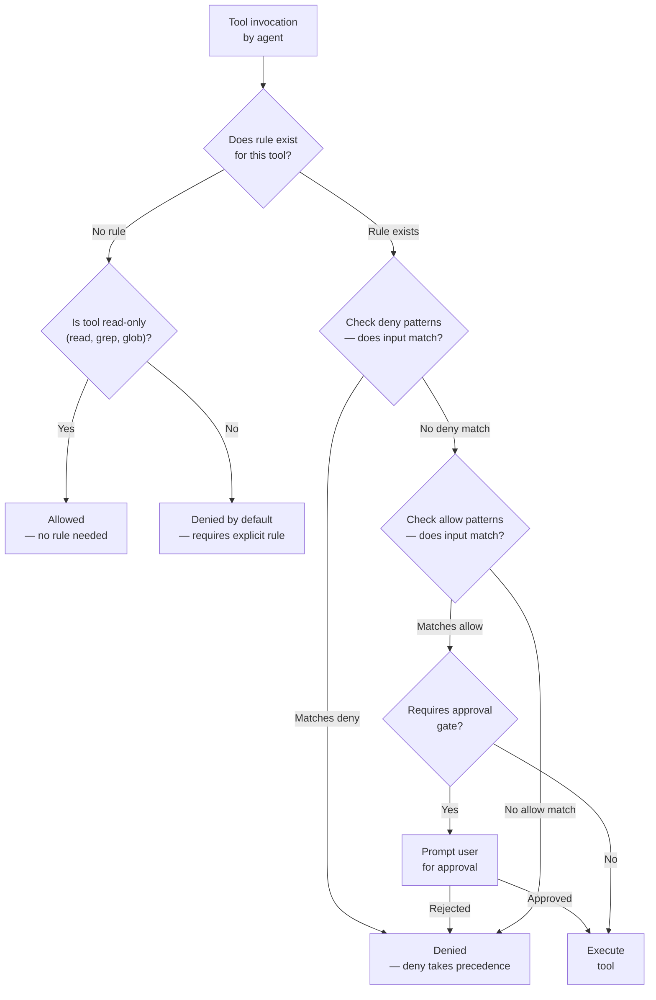
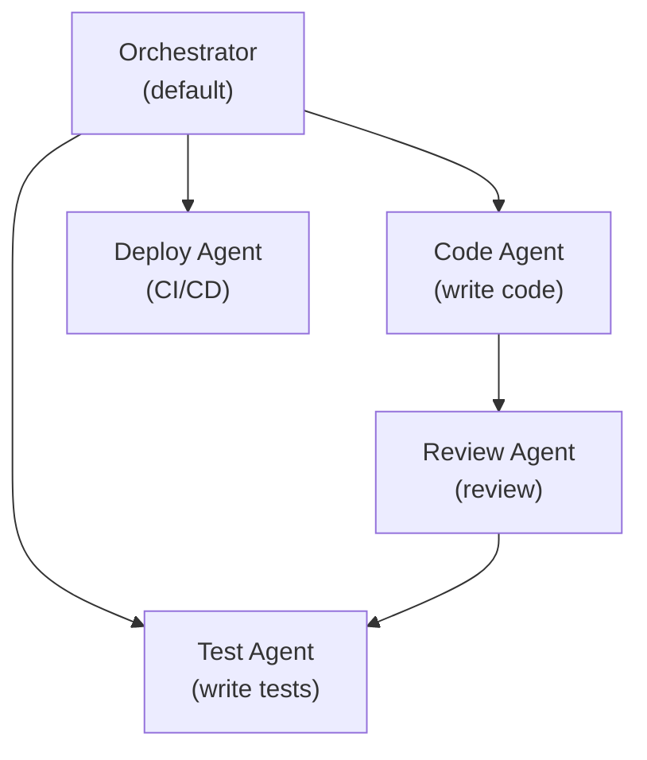
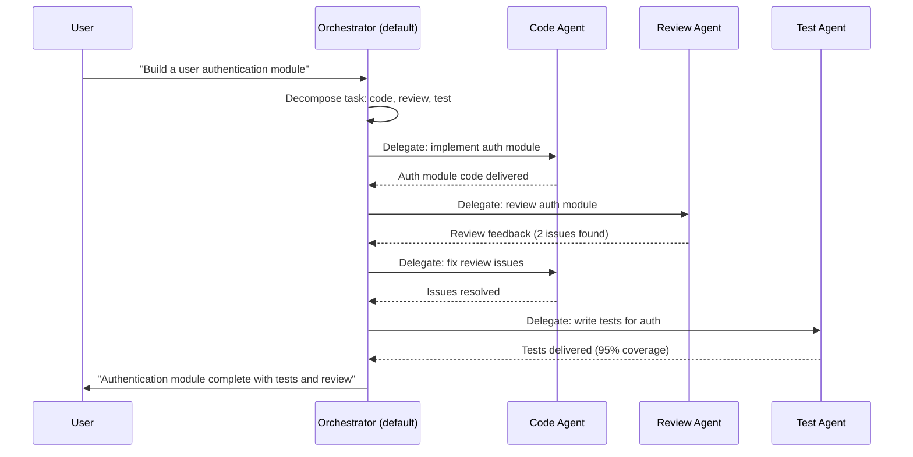

# Permissions, Security Rules and Multi-Agent Collaboration

## Permission Rules in opencode.json

Permissions define what actions agents can perform. They are structured as allow/deny rules applied to specific tools or MCP servers.

```json
{
  "permissions": [
    {
      "tool": "bash",
      "allow": ["npm *", "git *", "pip *", "cargo *"],
      "deny": ["rm -rf *", "sudo *", "chmod *", "> *", "| *"]
    },
    {
      "tool": "write",
      "allow": ["src/**", "docs/**", "tests/**"],
      "deny": [".env", "*.key", "node_modules/**"]
    }
  ]
}
```

> [!IMPORTANT]
> Permission rules are evaluated at runtime for every tool invocation. Deny rules are checked first — if a command matches any deny pattern, it is rejected immediately regardless of whether it also matches an allow pattern. This fail-safe design prevents accidental bypasses.

### Permission Evaluation Logic

Understanding the exact evaluation order is critical for writing secure permission rules.



> [!NOTE]
> The default behavior for tools without permission rules depends on the tool type. Read-only tools (read, grep, glob) are allowed by default. Write and execution tools (bash, write, edit, task) are denied by default unless explicitly permitted.

---

## Allow/Deny Patterns

Patterns support glob-style wildcards for flexible rule matching:

| Pattern         | Matches                                  | Example Match            |
|-----------------|------------------------------------------|--------------------------|
| `src/**`        | All files and directories under `src/`   | `src/components/button.tsx` |
| `*.env`         | Any `.env` file at any level             | `/project/.env`          |
| `**/secrets/*`  | Any file inside a `secrets/` directory   | `config/secrets/keys.json` |
| `npm *`         | Any command starting with `npm`          | `npm install express`    |
| `git *`         | Any command starting with `git`          | `git push origin main`   |
| `rm -rf *`      | Recursive force delete                   | `rm -rf node_modules`    |

> [!WARNING]
> Glob patterns are case-sensitive on Linux and case-insensitive on macOS by default. Be careful with file extensions — `*.KEY` will NOT match `secret.key` on Linux. Use lowercase patterns for cross-platform compatibility.

---

## Tool Access Control

Each tool can have fine-grained access rules:

```json
{
  "permissions": [
    {
      "tool": "read",
      "allow": ["*"],
      "description": "Read is allowed everywhere"
    },
    {
      "tool": "edit",
      "allow": ["src/**/*.ts", "src/**/*.tsx"],
      "deny": ["src/generated/**"],
      "requireApproval": true
    },
    {
      "tool": "bash",
      "deny": ["curl *", "wget *", "ssh *"],
      "requireApproval": "always"
    }
  ]
}
```

> [!TIP]
> Use `requireApproval: true` for destructive or sensitive operations. This creates a human-in-the-loop gate that prevents automated agents from performing irreversible actions like deployments, data deletion, or configuration changes without explicit user confirmation.

---

## File Path Restrictions

Path restrictions limit which files agents can access:

```json
{
  "permissions": [
    {
      "tool": "bash",
      "allow": [
        "/home/user/projects/*",
        "/tmp/*"
      ],
      "deny": [
        "/etc/**",
        "/home/user/.ssh/**",
        "/home/user/projects/secret-repo/**"
      ]
    }
  ]
}
```

> [!WARNING]
> File path restrictions only apply when the tool is invoked through OpenCode's tool registry. Direct shell access bypasses these restrictions — always combine with bash command allow/deny rules. An agent with permission to run `bash` but no path restrictions could access any file by running shell commands directly.

---

## Multi-Agent Workflows

Multi-agent workflows enable complex task decomposition:



> [!TIP]
> In multi-agent workflows, start with a simple orchestrator-plus-specialists pattern. Each specialist should have a narrowly scoped description and constrained permissions. The orchestrator decomposes high-level requests into subtasks and delegates to the appropriate specialist.

```json
{
  "agents": {
    "default": {
      "model": "gpt-4o",
      "description": "Orchestrator — decomposes tasks and delegates to specialists"
    },
    "code-agent": {
      "model": "gpt-4o",
      "description": "Implements feature code following project patterns",
      "constraints": {
        "allowedTools": ["read", "write", "edit", "glob", "bash"]
      }
    },
    "review-agent": {
      "model": "claude-sonnet-4-20250514",
      "description": "Reviews code for security, performance, and style issues",
      "constraints": {
        "allowedTools": ["read", "grep", "glob"],
        "deniedTools": ["write", "edit", "bash"]
      }
    },
    "test-agent": {
      "model": "gpt-4o",
      "description": "Writes unit and integration tests",
      "constraints": {
        "maxTokens": 4096
      }
    },
    "deploy-agent": {
      "model": "gpt-4o-mini",
      "description": "Handles deployment pipelines with approval gates",
      "constraints": {
        "allowedTools": ["bash", "read", "glob"]
      }
    }
  }
}
```

---

## Agent-to-Agent Delegation

Agents can delegate subtasks to other agents. Delegation respects the target agent's permissions and constraints.

> [!IMPORTANT]
> When an orchestrator delegates to a specialist, the specialist operates under its own permission scope. This means a specialist can have tighter restrictions than the orchestrator, providing defense in depth. Always design delegation chains so that each agent has the minimum permissions needed for its role.



```json
{
  "agentRouting": {
    "mode": "delegation",
    "delegationRules": [
      {
        "sourceAgent": "default",
        "targetAgent": "review-agent",
        "trigger": "after code changes",
        "conditions": {
          "filePattern": "src/**/*.ts"
        }
      },
      {
        "sourceAgent": "default",
        "targetAgent": "test-agent",
        "trigger": "after implementation",
        "conditions": {
          "required": true
        }
      }
    ]
  }
}
```

---

## Audit Logging

Audit logging tracks all agent actions for security and debugging:

```json
{
  "audit": {
    "enabled": true,
    "logPath": ".opencode/audit.log",
    "events": [
      "tool.call",
      "tool.call.result",
      "agent.delegation",
      "permission.denied",
      "permission.approved"
    ],
    "retention": "30d"
  }
}
```

> [!IMPORTANT]
> Audit logs are critical for incident response and compliance. If a security breach occurs, the audit log is your primary source of truth for reconstructing what happened. Set appropriate retention periods based on your compliance requirements (SOX, HIPAA, SOC2 typically require 90 days to 7 years).

```bash
# Analyze audit logs for security insights
# Count denied permissions by tool
grep "permission.denied" .opencode/audit.log | \
  jq -r '.data.tool' | sort | uniq -c | sort -rn

# Find all delegation events with timestamps
grep "agent.delegation" .opencode/audit.log | \
  jq -r '[.timestamp, .data.source, .data.target] | @tsv'

# Track approval gate activity
grep "permission.approved\|permission.denied" .opencode/audit.log | \
  jq -r '[.timestamp, .event, .data.tool, .data.command] | @tsv'
```

### Comparison: Permission Rule Types

| Rule Type         | Scope          | Example                                    | Use Case                          |
|-------------------|----------------|--------------------------------------------|-----------------------------------|
| Tool allow/deny   | Tool-level     | `"allow": ["npm *"]`                       | Safe command restrictions         |
| Path allow/deny   | File access    | `"allow": ["src/**"]`                      | Restrict file modifications       |
| MCP server rule   | Server-level   | `"mcpServer": "github"`                   | External service access control   |
| Require approval  | Action-level   | `"requireApproval": true`                  | Sensitive operations gate         |
| Agent constraint  | Agent-level    | `"deniedTools": ["bash"]`                  | Per-agent capability limits       |
| Subagent scope    | Inheritance    | Inherited from parent by default           | Hierarchical permission boundaries|
| Audit event filter| Logging-level  | `"events": ["tool.call", "permission.denied"]` | Selective audit log capture |

> [!TIP]
| Follow the principle of least privilege: start with no permissions and grant only what each agent needs. Use agent-level constraints for broad capability limits, tool-level allow/deny for specific command control, and MCP server rules for external service access. Layer these for defense in depth.

---

## Practice Questions

```question
{
  "id": "oc-05-q1",
  "type": "multiple-choice",
  "question": "A security engineer is writing a permission rule. What three components must every permission rule specify?",
  "options": [
    "name, version, and enabled",
    "tool, allow, and deny",
    "agent, command, and timeout",
    "source, target, and trigger"
  ],
  "correct": 1,
  "explanation": "Every permission rule must specify the `tool` it applies to (e.g., bash, write, edit), an `allow` array of permitted patterns, and a `deny` array of blocked patterns. Without all three, the rule is incomplete and may not behave as expected."
}
```

```question
{
  "id": "oc-05-q2",
  "type": "multiple-choice",
  "question": "What is the practical difference between a tool-level `deny: ['rm -rf *']` rule and an agent-level `deniedTools: ['bash']` constraint?",
  "options": [
    "They are functionally identical and interchangeable",
    "Tool-level rules block specific commands for all agents, agent-level constraints block entire tools for one agent",
    "Agent-level constraints override all tool-level rules",
    "Tool-level rules only apply to MCP servers, not built-in tools"
  ],
  "correct": 1,
  "explanation": "Tool-level deny rules block specific command patterns (like `rm -rf *`) across all agents for a given tool. Agent-level `deniedTools` constraints block an entire tool (like all `bash` commands) for a single agent. Use tool-level rules for global safety and agent-level constraints for per-agent capability reduction."
}
```

```question
{
  "id": "oc-05-q3",
  "type": "multiple-choice",
  "question": "In a multi-agent workflow with an orchestrator and specialist agents, how does the orchestrator decide which agent should handle a subtask?",
  "options": [
    "It randomly assigns tasks to available agents",
    "It uses delegation rules with triggers and conditions like file patterns",
    "All specialist agents work on every task simultaneously",
    "The user must manually specify the agent for each subtask"
  ],
  "correct": 1,
  "explanation": "The orchestrator uses delegation rules defined in `agentRouting.delegationRules`. Each rule specifies a trigger condition (like 'after code changes') and optional conditions (like file patterns). When conditions are met, the orchestrator delegates the subtask to the target agent."
}
```

```question
{
  "id": "oc-05-q4",
  "type": "multiple-choice",
  "question": "A security team wants to audit every tool invocation, delegation, and permission decision in OpenCode. Which set of audit events should they enable?",
  "options": [
    "tool.call, tool.call.result, agent.delegation, permission.denied, permission.approved",
    "Only tool.call to minimize log volume",
    "agent.delegation and permission.denied only",
    "session.start and session.end"
  ],
  "correct": 0,
  "explanation": "To capture the complete security picture, enable all five event types: tool.call (every tool invocation), tool.call.result (outcome of each call), agent.delegation (task handoffs between agents), permission.denied (blocked operations), and permission.approved (approved operations). This provides full traceability for security incidents."
}
```

```question
{
  "id": "oc-05-q5",
  "type": "multiple-choice",
  "question": "An administrator configured file path restrictions to block access to `/etc/` but did not add any bash allow/deny rules. Why is this configuration incomplete?",
  "options": [
    "File path restrictions only apply to read and write tools, not bash",
    "A user could bypass the restriction by running shell commands directly, since path restrictions only apply to the tool registry",
    "File path restrictions are automatically inherited from the parent configuration",
    "The /etc/ path is never accessible through OpenCode anyway"
  ],
  "correct": 1,
  "explanation": "File path restrictions only apply to tools invoked through OpenCode's tool registry. If the agent has access to the `bash` tool without command-level restrictions, it can bypass path restrictions by running shell commands like `cat /etc/shadow` or `ls /etc/`. Always combine path restrictions with bash command allow/deny rules for complete protection."
}
```

---

[!SUCCESS] **Key Takeaways**

- Permission rules use allow/deny patterns with glob-style wildcards for flexible access control
- Deny rules are evaluated first and take precedence over allow rules
- Tool-level rules control what commands and file operations agents can execute
- File path restrictions must be combined with bash command rules to prevent bypasses
- Multi-agent workflows decompose complex tasks through orchestrator-to-specialist delegation
- Agent-to-agent delegation respects each target agent's independent permission scope
- Audit logging captures tool calls, delegations, and permission events for security review
- Approval gates add a human-in-the-loop for sensitive operations like deployments
- The permission evaluation logic follows a structured flow: tool check, deny check, allow check, approval gate
- Principle of least privilege: start with no permissions and grant only what each agent needs
