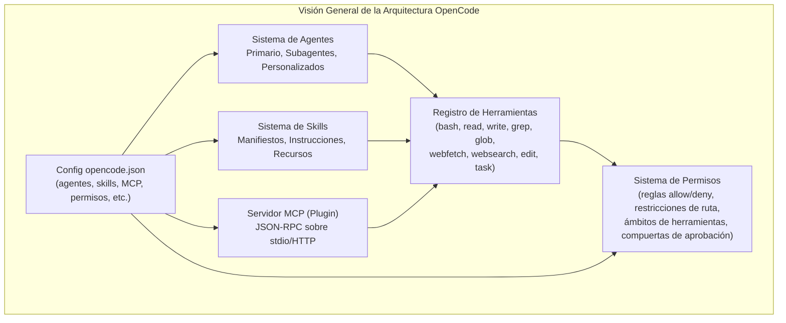
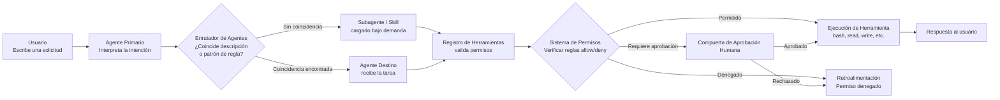
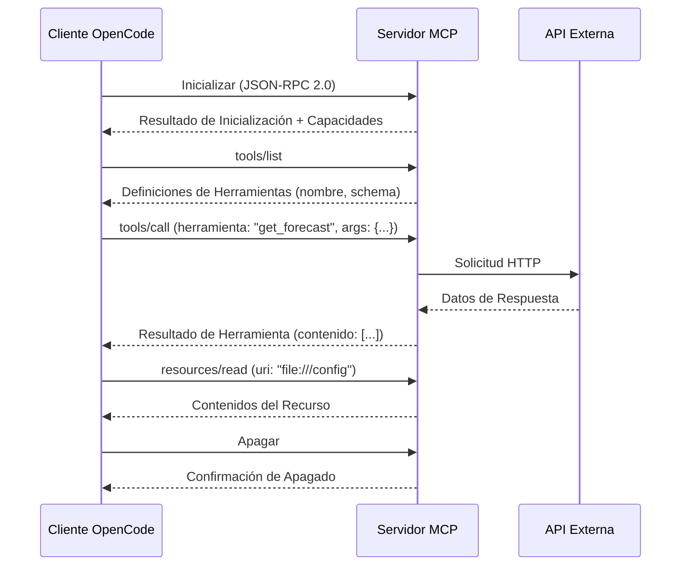

# Arquitectura de OpenCode: Agentes, Skills y MCP

## ¿Qué es OpenCode?

OpenCode es un framework CLI de código abierto para ingeniería de software asistida por IA. Conecta modelos de lenguaje de gran tamaño (LLMs) con entornos de desarrollo a través de un sistema estructurado de agentes, skills y el Model Context Protocol (MCP).

> [!NOTE]
> OpenCode se configura mediante un único archivo: `opencode.json` en la raíz del proyecto o `.opencode/config.json` dentro del directorio `.opencode/`. Ambas ubicaciones son equivalentes, aunque `.opencode/config.json` mantiene tu configuración aislada.



> [!TIP]
> Piensa en OpenCode como un sistema operativo para asistentes de codificación de IA. Los agentes son los usuarios, las skills son los programas instalados, los servidores MCP son dispositivos periféricos y los permisos son las políticas de seguridad.

---

## Ciclo de Vida de la Solicitud

Cada interacción del usuario fluye a través de un pipeline bien definido. Comprender este ciclo de vida es crucial para la depuración y optimización.



> [!TIP]
> Cuando un agente se comporta inesperadamente, traza el ciclo de vida de la solicitud. A menudo el problema está en el sistema de permisos (una herramienta denegada) o en el enrutamiento de agentes (agente incorrecto seleccionado).

---

## Visión General del Sistema de Agentes

Los agentes son asistentes basados en IA configurados con modelos, prompts y capacidades específicas. OpenCode soporta múltiples tipos de agentes:

- **Agente primario**: El asistente de codificación principal que interactúa con el usuario
- **Subagentes**: Agentes especializados (ej.: `customize-opencode`) para tareas específicas
- **Agentes personalizados**: Agentes definidos por el usuario con configuraciones a medida

Cada agente opera dentro de un ámbito de permisos y tiene acceso a un conjunto definido de herramientas y skills.

> [!WARNING]
> Los subagentes heredan el ámbito de permisos del padre a menos que se sobrescriba explícitamente. Esto significa que un subagente con un padre poderoso podría realizar accidentalmente operaciones destructivas. Siempre revisa los permisos del subagente al delegar tareas sensibles.

---

## Sistema de Skills

Las skills son paquetes reutilizables de instrucciones que enseñan a un agente cómo realizar tareas específicas. Una skill incluye:

- **Instrucciones**: Guía en lenguaje natural para el agente
- **Herramientas**: Definiciones opcionales de herramientas o restricciones
- **Recursos**: Archivos empaquetados (scripts, plantillas, referencias)

Las skills se cargan automáticamente cuando un agente detecta un patrón de tarea correspondiente.

```yaml
# skill.yaml
name: customize-opencode
description: Editar o crear configuración de OpenCode
instructions: |
  Cuando el usuario pida editar opencode.json o archivos de
  configuración relacionados, sigue estos pasos:
  1. Lee la configuración existente
  2. Valida la sintaxis JSON/YAML
  3. Aplica los cambios de forma segura
tools:
  - read
  - write
  - edit
resources:
  - schema/opencode-schema.json
```

```bash
# Las skills se cargan automáticamente cuando la consulta coincide con la descripción
# Ejemplo: escribir "editar mi configuración opencode" activa customize-opencode
# También puedes forzar la carga con: opencode --skill customize-opencode
```

---

## MCP (Model Context Protocol)

MCP es un protocolo estándar para conectar LLMs con herramientas externas y fuentes de datos. Permite que OpenCode se integre con:

- **Sistemas de archivos** (locales y remotos)
- **Bases de datos** (SQL, vectoriales)
- **APIs web** (REST, GraphQL)
- **Servicios personalizados** (herramientas internas)

Los servidores MCP se ejecutan como procesos separados y se comunican mediante JSON-RPC sobre stdin/stdout o HTTP.

### Cómo Funciona la Comunicación MCP



```json
{
  "mcpServers": {
    "filesystem": {
      "command": "node",
      "args": ["mcp-server-fs.js"],
      "env": {
        "ALLOWED_PATHS": "/home/usuario/proyectos"
      }
    }
  }
}
```

> [!IMPORTANT]
> Los servidores MCP son procesos de larga duración. Se inician cuando OpenCode se lanza y se apagan cuando la sesión termina. Los servidores con uso intensivo de recursos deben gestionarse cuidadosamente para evitar inflado de memoria.

---

## Configuración mediante opencode.json

Todo el comportamiento de OpenCode se controla a través de `opencode.json` (o `.opencode/config.json`).

> [!NOTE]
> El enfoque del directorio `.opencode/` es preferido para proyectos en equipo porque puedes agregarlo a `.gitignore` selectivamente o versionar solo el archivo de configuración sin saturar la raíz del proyecto.

```json
{
  "agents": {
    "default": {
      "model": "gpt-4o",
      "description": "Asistente principal de codificación"
    },
    "reviewer": {
      "model": "claude-sonnet-4-20250514",
      "description": "Especialista en revisión de código",
      "prompt": "Eres un revisor de código senior enfocado en seguridad y rendimiento."
    }
  },
  "skills": {
    "customize-opencode": {
      "manifest": "skills/customize-opencode/skill.yaml"
    },
    "react-component": {
      "manifest": "skills/react-component/skill.yaml",
      "autoLoad": true,
      "matchPattern": "react component|jsx"
    }
  },
  "mcpServers": {
    "filesystem": {
      "command": "node",
      "args": ["mcp-server-fs.js", "/home/usuario/proyectos"]
    },
    "github": {
      "command": "node",
      "args": ["mcp-github-server.js"],
      "env": {
        "GITHUB_TOKEN": "${GITHUB_TOKEN}"
      }
    }
  },
  "permissions": [
    {
      "tool": "bash",
      "allow": ["npm *", "git *", "pip *"],
      "deny": ["rm -rf /", "sudo *"]
    },
    {
      "tool": "write",
      "allow": ["src/**", "docs/**"],
      "deny": [".env", "secrets/**"]
    }
  ],
  "agentRouting": {
    "mode": "auto",
    "defaultAgent": "default",
    "rules": [
      {
        "pattern": "seguridad|vulnerabilidad|CVE",
        "agent": "reviewer"
      }
    ]
  }
}
```

---

## Registro de Herramientas

El registro de herramientas gestiona todas las herramientas disponibles y sus capacidades:

| Herramienta  | Propósito                    | Requiere Permiso | Categoría       |
|--------------|------------------------------|:----------------:|-----------------|
| `bash`       | Ejecutar comandos shell      | Sí               | Ejecución       |
| `read`       | Leer archivos                | No               | Lectura         |
| `write`      | Escribir archivos            | Sí               | Escritura       |
| `edit`       | Editar archivos              | Sí               | Escritura       |
| `grep`       | Buscar contenido             | No               | Lectura         |
| `glob`       | Buscar archivos por patrón   | No               | Lectura         |
| `webfetch`   | Obtener URLs                 | Opcional         | Red             |
| `websearch`  | Buscar en la web             | Opcional         | Red             |
| `task`       | Delegar a subagente/skill    | Sí               | Orquestación    |
| `question`   | Preguntar al usuario         | No               | Interacción     |

> [!WARNING]
> Las herramientas marcadas como "Opcional" para permisos pueden usarse sin reglas, pero su comportamiento puede estar restringido. Por ejemplo, `webfetch` sin reglas allow puede limitarse a ciertos dominios.

```typescript
// Las herramientas se registran programáticamente en el SDK de OpenCode
import { ToolRegistry } from "opencode";

const registry = new ToolRegistry();

registry.register({
  name: "bash",
  description: "Ejecutar comandos shell",
  requiresPermission: true,
  handler: async (args: { command: string }) => {
    // Lógica de ejecución con verificaciones de permisos
  }
});

registry.register({
  name: "grep",
  description: "Buscar contenido con regex",
  requiresPermission: false,
  handler: async (args: { pattern: string; path?: string }) => {
    // Lógica de búsqueda
  }
});
```

---

## Sistema de Permisos

Los permisos controlan qué acciones pueden realizar los agentes. Las reglas se definen en `opencode.json`:

```json
{
  "permissions": [
    {
      "tool": "bash",
      "allow": ["npm *", "git *"],
      "deny": ["rm -rf *", "sudo *"]
    },
    {
      "tool": "write",
      "allow": ["src/**", "docs/**"],
      "deny": [".env", "secrets/**"]
    }
  ]
}
```

> [!WARNING]
> Las reglas de permiso se evalúan en orden: las reglas deny se verifican primero, luego las reglas allow. Si un comando coincide tanto con un patrón allow como deny, la regla deny tiene prioridad. Esto evita desvíos accidentales a través de patrones superpuestos.

### Comparación: Agentes vs Skills vs Plugins

| Aspecto          | Agente                    | Skill                      | Plugin (MCP)                |
|------------------|---------------------------|----------------------------|-----------------------------|
| **Propósito**    | Instancia de asistente    | Paquete de instrucciones   | Herramienta/servicio externo|
| **Config**       | `opencode.json`           | Manifiesto YAML/JSON       | Entrada MCP en config       |
| **Ciclo**        | Basado en sesión          | Carga bajo demanda         | Proceso de larga duración   |
| **Ámbito**       | Conversación completa     | Tarea específica           | Acceso a herramientas       |
| **Lenguaje**     | Dependiente del modelo    | Lenguaje natural           | Cualquiera (Node, Python, Go)|
| **Estado**       | Stateful (conversación)   | Stateless (instrucciones)  | Stateful (proceso)          |
| **Ejemplo**      | Agente de codificación    | `customize-opencode`       | Servidor MCP filesystem     |
| **Dependencias** | Ninguna                   | Ninguna (autocontenido)    | Runtime (Node, Python, etc.)|

> [!TIP]
> Elige un agente cuando necesites un compañero de conversación persistente con experiencia específica. Elige una skill cuando quieras enseñar a cualquier agente un procedimiento repetible. Elige un plugin cuando necesites conectarte a un sistema o API externa.

---

## Preguntas de Práctica

```question
{
  "id": "oc-01-q1",
  "type": "multiple-choice",
  "question": "Un equipo quiere que su asistente de codificación basado en LLM pueda consultar una API REST interna de la empresa. ¿Qué mecanismo de OpenCode deberían usar?",
  "options": [
    "El sistema de Skills con un manifiesto personalizado",
    "El Registro de Herramientas con herramientas integradas",
    "El protocolo MCP para crear un servidor que envuelva la API",
    "El sistema de Enrutamiento de Agentes con coincidencia de patrones"
  ],
  "correct": 2,
  "explanation": "MCP (Model Context Protocol) está diseñado específicamente para conectar LLMs con herramientas externas y fuentes de datos. Al crear un servidor MCP que envuelve la API REST, el equipo expone la API como herramientas invocables que el agente puede llamar a través del protocolo JSON-RPC estándar."
}
```

```question
{
  "id": "oc-01-q2",
  "type": "multiple-choice",
  "question": "Un desarrollador crea un paquete reutilizable que enseña a un agente cómo generar componentes React. ¿Qué tres componentes debe incluir este paquete?",
  "options": [
    "Modelo, prompt y restricciones",
    "Instrucciones, herramientas y recursos",
    "Nombre, versión y autor",
    "Código, pruebas y documentación"
  ],
  "correct": 1,
  "explanation": "Un paquete de skill se define por tres componentes obligatorios: instrucciones (guía paso a paso para el agente), herramientas (capacidades declaradas que la skill necesita) y recursos (archivos empaquetados como plantillas y documentos de referencia)."
}
```

```question
{
  "id": "oc-01-q3",
  "type": "multiple-choice",
  "question": "Según el registro de herramientas, ¿qué dos operaciones pueden modificar archivos y siempre requieren una regla de permiso explícita?",
  "options": [
    "read y grep",
    "bash y webfetch",
    "write y edit",
    "glob y websearch"
  ],
  "correct": 2,
  "explanation": "Las herramientas `write` y `edit` modifican archivos y están clasificadas como operaciones de escritura. Siempre requieren reglas de permiso explícitas. En contraste, `read`, `grep` y `glob` son operaciones de solo lectura que típicamente no requieren permisos."
}
```

```question
{
  "id": "oc-01-q4",
  "type": "multiple-choice",
  "question": "Un usuario tiene un agente de codificación principal y quiere añadir un agente especializado para tareas de migración de bases de datos. ¿Cómo se relaciona este agente especializado con el principal?",
  "options": [
    "Se ejecuta de forma independiente sin conexión con el agente principal",
    "Es un subagente que puede ser invocado por el agente principal para delegación",
    "Reemplaza al agente principal para todas las operaciones de base de datos",
    "Requiere un archivo opencode.json separado para ejecutarse"
  ],
  "correct": 1,
  "explanation": "Los agentes especializados se configuran como subagentes anidados dentro de la definición del agente principal. El agente principal delega tareas a ellos a través del sistema de enrutamiento de agentes, que utiliza coincidencia basada en descripción y patrones de reglas para despachar el trabajo."
}
```

```question
{
  "id": "oc-01-q5",
  "type": "multiple-choice",
  "question": "Escribes una solicitud y el agente principal de OpenCode intenta usar `bash` para instalar un paquete, pero el comando es denegado. Según el ciclo de vida de la solicitud, ¿cuál es la razón más probable?",
  "options": [
    "La herramienta bash no está registrada en el registro de herramientas",
    "El sistema de permisos verificó la regla y encontró un patrón deny que coincide con el comando",
    "El servidor MCP para bash no está en ejecución",
    "El módulo de enrutamiento de agentes despachó la tarea al agente incorrecto"
  ],
  "correct": 1,
  "explanation": "El ciclo de vida de la solicitud muestra que después de que el registro de herramientas valida las capacidades del agente, el sistema de permisos verifica las reglas allow/deny. Si un patrón deny coincide con el comando bash (ej.: 'sudo apt install' coincidiendo con 'sudo *'), el sistema de permisos devuelve una respuesta 'denegada' antes de que la herramienta se ejecute."
}
```

---

[!SUCCESS] **Conclusiones Clave**

- OpenCode es un framework CLI de código abierto para ingeniería de software asistida por IA con arquitectura en capas
- Los agentes proporcionan asistencia basada en IA mediante configuraciones de modelo y prompt
- Las skills son paquetes reutilizables de instrucciones que guían a los agentes en tareas específicas
- MCP (Model Context Protocol) conecta LLMs con herramientas externas y fuentes de datos vía JSON-RPC
- El registro de herramientas centraliza el acceso a todas las capacidades (bash, read, write, etc.)
- `opencode.json` es el archivo de configuración único que controla agentes, skills, MCP y permisos
- El sistema de permisos aplica seguridad con reglas de allow/deny y restricciones de ruta
- El ciclo de vida de la solicitud traza la entrada del usuario a través del enrutamiento de agentes, registro de herramientas, verificaciones de permisos y ejecución
- La comunicación MCP sigue una secuencia estructurada de inicialización, listado, llamada y apagado sobre JSON-RPC 2.0
