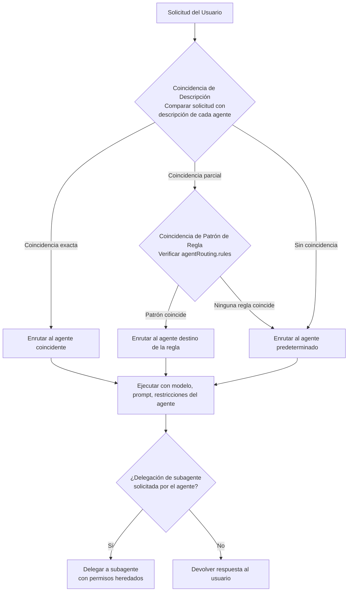
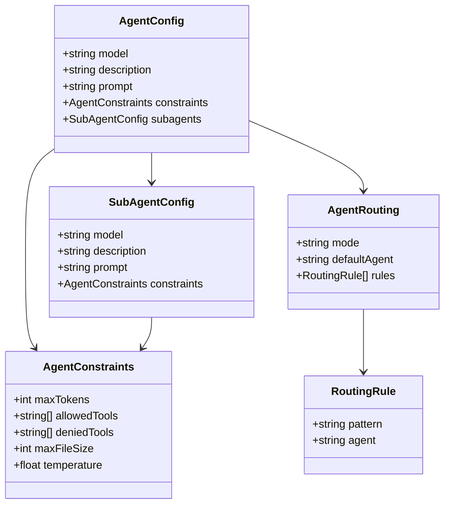

# Creando y Configurando Agentes Personalizados

## Configuración de Agentes en opencode.json

Los agentes personalizados se definen en la sección `agents` de `opencode.json`. Cada entrada de agente especifica el modelo, comportamiento y capacidades para ese asistente.

```json
{
  "agents": {
    "default": {
      "model": "gpt-4o",
      "description": "Asistente de codificación de uso general"
    },
    "reviewer": {
      "model": "claude-sonnet-4-20250514",
      "description": "Especialista en revisión de código",
      "prompt": "Eres un revisor de código senior. Enfócate en seguridad, rendimiento y legibilidad."
    }
  }
}
```

> [!TIP]
> Usa nombres y descripciones de agentes descriptivos — sirven como el mecanismo principal de enrutamiento. Un agente bien nombrado como "security-auditor" con una descripción clara es más fácil de seleccionar tanto para humanos como para el sistema de enrutamiento.

---

## Flujo de Decisión de Enrutamiento de Agentes

Entender cómo OpenCode decide qué agente maneja una solicitud es clave para diseñar configuraciones multi-agente efectivas.



> [!NOTE]
> El enrutamiento de agentes usa coincidencia difusa de descripción por defecto. Si necesitas control preciso, usa `agentRouting.rules` con patrones regex explícitos para garantizar que solicitudes específicas vayan a agentes específicos.

---

## Especificando Modelos

Cada agente puede usar un LLM diferente. OpenCode soporta múltiples proveedores de modelo:

```json
{
  "agents": {
    "frontend": {
      "model": "gpt-4o",
      "description": "Agente de desarrollo frontend — React, CSS, TypeScript"
    },
    "backend": {
      "model": "claude-sonnet-4-20250514",
      "description": "Agente de arquitectura backend — APIs, bases de datos, servicios"
    },
    "fast-prototype": {
      "model": "gpt-4o-mini",
      "description": "Prototipado rápido — menor costo, respuestas más rápidas"
    }
  }
}
```

> [!TIP]
> Elegir el modelo correcto es un equilibrio entre capacidad, costo y velocidad. Usa `gpt-4o-mini` o modelos pequeños similares para tareas rutinarias (linting, refactorizaciones simples) y reserva modelos premium para razonamiento complejo (diseño de arquitectura, auditorías de seguridad).

### Esquema de Configuración de Agente



---

## Definiendo Descripciones de Agentes

Las descripciones ayudan a OpenCode a enrutar tareas al agente correcto. Actúan como metadatos para la selección de agentes.

```json
{
  "agents": {
    "docs-writer": {
      "model": "gpt-4o",
      "description": "Especialista en escribir documentación, READMEs y referencias de API"
    },
    "test-generator": {
      "model": "gpt-4o",
      "description": "Crea pruebas unitarias, pruebas de integración y fixtures de prueba"
    }
  }
}
```

> [!IMPORTANT]
> Las descripciones de los agentes no son solo documentación — se usan activamente en tiempo de ejecución para enrutamiento. Una descripción vaga como "ayuda con codificación" puede hacer que las solicitudes se enruten incorrectamente. Sé específico: "Maneja diseño de esquema de base de datos y optimización SQL."

---

## Prompts de Agentes

Los prompts definen el mensaje del sistema y las instrucciones de comportamiento para un agente.

```json
{
  "agents": {
    "security-auditor": {
      "model": "claude-opus-4-20250514",
      "description": "Auditor de código enfocado en seguridad",
      "prompt": "Eres un auditor de seguridad. Identifica vulnerabilidades, sugiere correcciones y explica riesgos. Prioriza issues OWASP Top 10. Siempre verifica: SQL injection, XSS, CSRF, deserialización insegura y dependencias vulnerables conocidas."
    },
    "code-formatter": {
      "model": "gpt-4o-mini",
      "description": "Formatea código según guías de estilo del proyecto",
      "prompt": "Formateas código según la guía de estilo del proyecto. Nunca cambies la lógica — solo espacios, indentación y reglas de formato. Ejecuta el linter después de formatear para verificar cumplimiento."
    }
  }
}
```

> [!WARNING]
> Los prompts de agente se inyectan en el mensaje del sistema de la llamada LLM. La inyección maliciosa de prompts en configuraciones compartidas podría alterar el comportamiento del agente. Siempre revisa el contenido del prompt de fuentes no confiables, especialmente cuando el agente tiene permisos amplios.

```typescript
// Los agentes pueden personalizarse programáticamente mediante el SDK de OpenCode
import { OpenCode } from "opencode";

const opencode = new OpenCode();

opencode.registerAgent({
  name: "security-auditor",
  model: "claude-opus-4-20250514",
  description: "Auditor de código enfocado en seguridad",
  prompt: `Eres un auditor de seguridad. Enfócate en OWASP Top 10.`,
  constraints: {
    allowedTools: ["read", "grep", "glob", "bash"],
    deniedTools: ["write", "edit"],
    temperature: 0.3
  }
});

await opencode.run();
```

---

## Tipos de Subagentes

Los subagentes son agentes anidados que manejan subtareas especializadas. Se invocan cuando un agente primario delega trabajo.

```json
{
  "agents": {
    "default": {
      "model": "gpt-4o",
      "description": "Asistente principal de codificación — orquesta flujos complejos",
      "subagents": {
        "customize-opencode": {
          "model": "gpt-4o",
          "description": "Maneja cambios en la configuración de OpenCode"
        },
        "deployment": {
          "model": "gpt-4o-mini",
          "description": "Gestiona pipelines de despliegue y CI/CD",
          "prompt": "Eres un ingeniero de despliegue. Siempre verifica el destino del despliegue antes de proceder."
        }
      }
    }
  }
}
```

> [!WARNING]
> Los subagentes heredan el ámbito de permisos del padre a menos que se sobrescriba explícitamente. Siempre revisa los permisos del subagente al delegar operaciones sensibles. Un subagente de escritura de código no debería tener acceso a herramientas de despliegue de producción a menos que sea específicamente intencionado.

---

## Enrutamiento de Agentes

El enrutamiento de agentes controla cómo se despachan las tareas al agente apropiado. OpenCode usa coincidencia basada en descripción para seleccionar el mejor agente para una tarea determinada.

```json
{
  "agentRouting": {
    "mode": "auto",
    "defaultAgent": "default",
    "rules": [
      {
        "pattern": "seguridad|vulnerabilidad|CVE|OWASP",
        "agent": "security-auditor"
      },
      {
        "pattern": "documentación|readme|docs api|wiki",
        "agent": "docs-writer"
      },
      {
        "pattern": "despliegue|release|CI/CD|pipeline",
        "agent": "deployment"
      },
      {
        "pattern": "prueba|prueba unitaria|prueba integración|jest|pytest",
        "agent": "test-generator"
      }
    ]
  }
}
```

> [!IMPORTANT]
> Las reglas de enrutamiento se evalúan en orden. La primera regla coincidente gana. Coloca reglas más específicas antes que las generales. Por ejemplo, una regla que coincide con "despliegue producción" debería venir antes de una regla genérica "despliegue".

---

## Restricciones de Agentes

Las restricciones limitan lo que un agente puede hacer, previniendo mal uso o daños accidentales.

```json
{
  "agents": {
    "sandboxed": {
      "model": "gpt-4o-mini",
      "description": "Agente restringido para experimentación segura",
      "constraints": {
        "maxTokens": 4096,
        "allowedTools": ["read", "grep", "glob", "websearch"],
        "deniedTools": ["bash", "write", "edit"],
        "maxFileSize": 1048576,
        "temperature": 0.7
      }
    },
    "production-deployer": {
      "model": "gpt-4o",
      "description": "Agente de despliegue de producción — requiere aprobación",
      "constraints": {
        "allowedTools": ["bash", "read", "glob"],
        "temperature": 0.2,
        "maxTokens": 8192
      }
    }
  }
}
```

> [!TIP]
> Usa restricciones de `temperature` para controlar la creatividad del agente. Valores bajos (0.1–0.3) producen salidas determinísticas y enfocadas, ideales para revisión de código y despliegue. Valores más altos (0.7–1.0) fomentan soluciones creativas para lluvia de ideas y diseño de arquitectura.

### Comparación: Opciones de Configuración de Agentes

| Opción           | Tipo      | Obligatorio | Valor Pred.   | Descripción                              |
|------------------|-----------|:-----------:|---------------|------------------------------------------|
| `model`          | string    | Sí          | —             | Identificador del modelo (ej.: `gpt-4o`) |
| `description`    | string    | Sí          | —             | Descripción para enrutamiento            |
| `prompt`         | string    | No          | Prompt por def.| Mensaje del sistema / instrucciones       |
| `subagents`      | object    | No          | `{}`          | Agentes especializados anidados          |
| `constraints`    | object    | No          | `{}`          | Límites de recursos y herramientas       |
| `allowedTools`   | string[]  | No          | Todas         | Lista blanca de herramientas permitidas  |
| `deniedTools`    | string[]  | No          | `[]`          | Lista negra de herramientas prohibidas   |
| `maxTokens`      | integer   | No          | Por defecto   | Máximo de tokens de respuesta            |
| `temperature`    | float     | No          | Por defecto   | Aleatoriedad de respuesta (0.0–2.0)     |
| `maxFileSize`    | integer   | No          | 10MB          | Tamaño máximo de archivo que el agente lee|

> [!IMPORTANT]
> `allowedTools` y `deniedTools` son patrones mutuamente excluyentes. Si especificas `allowedTools`, todas las demás herramientas están implícitamente denegadas. Si especificas `deniedTools`, todas las herramientas excepto las listadas están implícitamente permitidas. No uses ambos en el mismo bloque de restricciones — el comportamiento es indefinido.

---

## Preguntas de Práctica

```question
{
  "id": "oc-02-q1",
  "type": "multiple-choice",
  "question": "¿Cuáles son los campos mínimos requeridos para definir un agente personalizado en `opencode.json`?",
  "options": [
    "model, description y prompt",
    "model y description",
    "name y version",
    "model y allowedTools"
  ],
  "correct": 1,
  "explanation": "Una definición de agente requiere como mínimo un `model` (qué LLM usar) y una `description` (usada para enrutamiento). Todos los demás campos incluyendo `prompt`, `constraints` y `subagents` son opcionales."
}
```

```question
{
  "id": "oc-02-q2",
  "type": "multiple-choice",
  "question": "Cuando un usuario pregunta 'audita este código en busca de vulnerabilidades de seguridad', ¿qué campo usa OpenCode para enrutar la tarea al agente correcto?",
  "options": [
    "El campo model para coincidir con la capacidad",
    "El campo subagents para verificar anidamiento",
    "El campo description para coincidencia basada en patrón",
    "El campo constraints para verificar permiso"
  ],
  "correct": 2,
  "explanation": "OpenCode compara la solicitud del usuario con el campo `description` de cada agente y el campo `pattern` de las reglas de enrutamiento. Si un agente security-auditor tiene 'seguridad' o 'vulnerabilidad' en su descripción, o una regla de enrutamiento coincide con esos términos, la solicitud se enruta allí."
}
```

```question
{
  "id": "oc-02-q3",
  "type": "multiple-choice",
  "question": "Un agente primario tiene un subagente para tareas de despliegue. El subagente está configurado sin reglas de permiso explícitas. ¿Qué sucede cuando el subagente intenta ejecutar un comando bash?",
  "options": [
    "El comando se deniega porque los subagentes no tienen permisos predeterminados",
    "Se solicita al agente primario que apruebe cada comando manualmente",
    "El subagente hereda el ámbito de permisos del agente primario",
    "El subagente crea su propio ámbito de permisos automáticamente"
  ],
  "correct": 2,
  "explanation": "Los subagentes heredan el ámbito de permisos del agente padre por defecto. Esto significa que si el agente primario tiene permiso para ejecutar comandos bash, el subagente también puede ejecutarlos. Esta es una consideración de seguridad — siempre delimita explícitamente los permisos del subagente para operaciones sensibles."
}
```

```question
{
  "id": "oc-02-q4",
  "type": "multiple-choice",
  "question": "Un administrador quiere crear un agente de solo lectura que pueda solo buscar archivos y navegar por la web, sin ejecutar comandos o modificar archivos. ¿Qué configuración de restricción debería usar?",
  "options": [
    "maxTokens: 2048",
    "allowedTools: ['grep', 'glob', 'websearch']",
    "maxFileSize: 1048576",
    "subagents: {}"
  ],
  "correct": 1,
  "explanation": "Usar `allowedTools: ['grep', 'glob', 'websearch']` crea una lista blanca que permite solo estas operaciones de lectura/web. Todas las demás herramientas incluyendo `bash`, `write` y `edit` están implícitamente denegadas, haciendo que el agente sea efectivamente de solo lectura."
}
```

```question
{
  "id": "oc-02-q5",
  "type": "multiple-choice",
  "question": "Un equipo tiene dos reglas de enrutamiento: una que coincide con 'despliegue' para deploy-agent, y otra que coincide con 'despliegue producción' para prod-deploy-agent. Un usuario escribe 'hacer despliegue a producción'. ¿Qué agente maneja la solicitud y por qué?",
  "options": [
    "deploy-agent, porque coincide primero",
    "prod-deploy-agent, porque los patrones más específicos tienen prioridad",
    "deploy-agent, porque 'despliegue producción' activa ambas pero 'despliegue' viene primero",
    "El agente predeterminado, porque la consulta no coincide exactamente con ninguna regla"
  ],
  "correct": 0,
  "explanation": "Las reglas de enrutamiento se evalúan en orden. Si 'despliegue' para deploy-agent se define antes que 'despliegue producción' para prod-deploy-agent, la primera regla coincidente gana. La consulta 'hacer despliegue a producción' contiene 'despliegue', por lo que coincide con la primera regla. El orden importa — coloca reglas más específicas antes que las generales."
}
```

---

[!SUCCESS] **Conclusiones Clave**

- Los agentes personalizados se definen en `opencode.json` con al menos `model` y `description`
- Los prompts de agente sirven como mensajes del sistema que definen instrucciones de comportamiento
- Los subagentes permiten delegación jerárquica de tareas especializadas dentro de una sesión de agente primario
- El enrutamiento de agentes usa coincidencia basada en descripción y patrones de reglas para despachar tareas automáticamente
- Las restricciones limitan las capacidades del agente mediante listas blancas, listas negras, límites de recursos y temperatura
- El campo `prompt` es opcional pero esencial para guiar el comportamiento del agente más allá del predeterminado
- Múltiples agentes pueden usar diferentes modelos de diferentes proveedores en la misma configuración
- Las reglas de enrutamiento se evalúan en orden — coloca patrones específicos antes que los generales
- Los subagentes heredan permisos del padre por defecto, requiriendo revisión cuidadosa de seguridad
- Las restricciones de temperatura controlan creatividad vs. determinismo en las respuestas del agente
