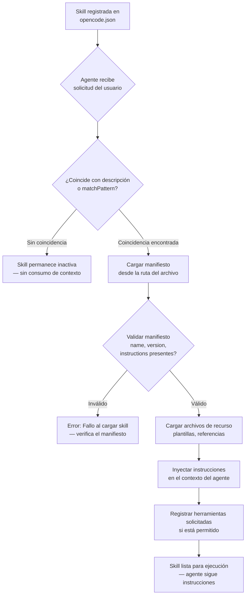
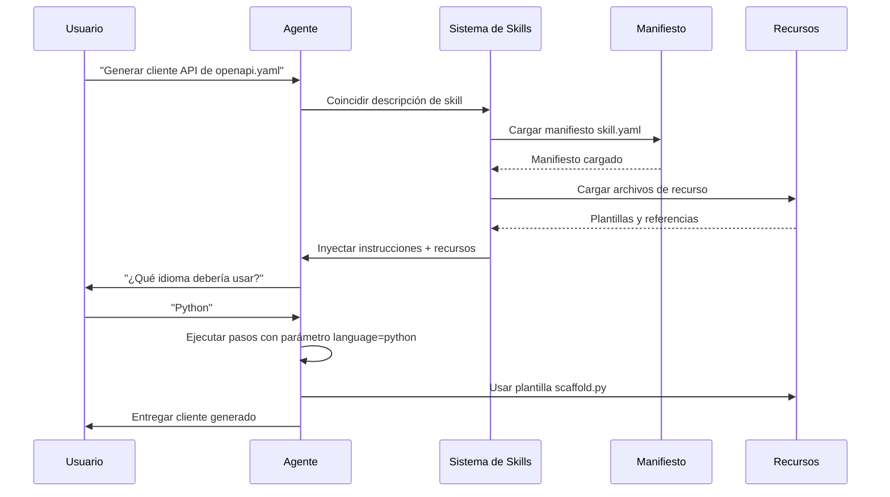

# Construyendo y Registrando Skills Personalizadas

## Estructura de la Skill

Una skill es un directorio que contiene un archivo de manifiesto y recursos opcionales:

```
skills/
  mi-skill-personalizada/
    skill.yaml        # Manifiesto (obligatorio)
    instructions.md   # Instrucciones extendidas (opcional)
    templates/        # Archivos de recurso (opcional)
       scaffold.py
    references/       # Documentos de referencia (opcional)
       api-guide.md
```

> [!NOTE]
> Aunque `skill.yaml` es el formato convencional, OpenCode también soporta manifiestos JSON (`skill.json`). YAML es recomendado para legibilidad, especialmente para bloques largos de instrucciones. JSON es preferible cuando necesitas generar manifiestos programáticamente o validarlos con JSON Schema.

---

## Ciclo de Vida de Carga de Skill

Entender cómo se cargan las skills te ayuda a diseñar skills eficientes que no desperdicien la ventana de contexto.



> [!TIP]
> Las skills con descripciones excesivamente amplias pueden cargarse no intencionalmente, consumiendo ventana de contexto y tokens. Mantén las descripciones específicas y enfocadas. Usa `matchPattern` para control preciso sobre cuándo se activa una skill.

---

## Manifiesto de la Skill

El manifiesto define la identidad, propósito y componentes de la skill.

```yaml
# skill.yaml
name: mi-skill-personalizada
description: Guía al agente en la realización de generación personalizada de scaffolds
author: NUniversity
version: 1.0.0
instructions: |
  Cuando el usuario pida generar scaffold de un nuevo proyecto Python:
  1. Usa los archivos de plantilla en el directorio `templates/`
  2. Pregunta al usuario el nombre del proyecto y nombre del paquete
  3. Genera la estructura de directorios con pyproject.toml, src/, tests/
  4. Inicializa un repositorio git
tools:
  - bash
  - write
  - read
  - glob
resources:
  - templates/scaffold.py
  - references/api-guide.md
```

> [!IMPORTANT]
> El campo `instructions` es la parte más crítica de una skill. Se inyecta directamente en el contexto del agente. Mantén las instrucciones concisas y accionables — cada token consumido por la skill es un token no disponible para la conversación. Apunta a no más de 500-1000 palabras por skill.

### Comparación: Formatos de Manifiesto YAML vs JSON

| Aspecto            | YAML (`skill.yaml`)                | JSON (`skill.json`)                |
|--------------------|-------------------------------------|-------------------------------------|
| **Legibilidad**    | Excelente — natural para texto largo | Buena — familiar para devs JS/TS  |
| **Comentarios**    | Soportados (`# comment`)            | No soportados                      |
| **Multi-línea**    | Nativo (`|` y `>` block scalars)  | Escape `\n` o usa arrays          |
| **Validación schema**| Herramientas limitadas           | JSON Schema, muchos validadores   |
| **Mejor para**     | Skills escritas manualmente        | Skills generadas o validadas       |
| **Tamaño archivo** | Generalmente menor                 | Ligeramente mayor (comillas, comas)|
| **Herramientas**   | Linters YAML disponibles           | JSON nativo en la mayoría de editores|

---

## Escribiendo Instrucciones de Skill

Las instrucciones son el núcleo de una skill. Guían al agente paso a paso.

```markdown
# instructions.md

## Objetivo
Generar scaffold de un proyecto Python listo para producción.

## Pasos
1. Pregunta al usuario: nombre del proyecto, nombre del paquete, versión Python
2. Crea directorio: `{nombre_del_proyecto}/`
3. Genera `pyproject.toml` con:
   - Metadatos del proyecto
   - Dependencias (click, pytest, black)
   - Configuración del sistema de build
4. Crea `src/{nombre_del_paquete}/__init__.py` con string de versión
5. Crea `tests/test_{nombre_del_paquete}.py` con prueba placeholder
6. Ejecuta `git init` y `git add -A`

## Restricciones
- No sobrescribas archivos existentes sin preguntar
- Usa los estándares más recientes de empaquetado Python (PEP 621)
```

```bash
# Las instrucciones pueden referenciar scripts empaquetados como recursos
# Ejemplo: ejecutando la plantilla de scaffold
python skills/mi-skill-personalizada/templates/scaffold.py \
  --project-name "$NOMBRE_DEL_PROYECTO" \
  --package-name "$NOMBRE_DEL_PAQUETE"
```

---

## Herramientas y Recursos de Skill

Las skills pueden declarar herramientas necesarias y empaquetar archivos de recurso:

```json
{
  "name": "db-migration-skill",
  "description": "Generación y gestión de migraciones de base de datos",
  "version": "2.1.0",
  "instructions": "Al gestionar migraciones de base de datos...",
  "tools": ["bash", "read", "write", "grep"],
  "resources": [
    "templates/migration_template.sql",
    "templates/rollback_template.sql",
    "config/migration.config.json"
  ],
  "parameters": {
    "db_type": {
      "type": "string",
      "description": "Tipo de base de datos (postgres, mysql, sqlite)",
      "required": true
    },
    "migration_name": {
      "type": "string",
      "description": "Nombre descriptivo para la migración",
      "required": true
    }
  }
}
```

> [!WARNING]
> Cada archivo de recurso cargado en el contexto consume tokens. Empaqueta solo archivos esenciales. Los documentos de referencia grandes deben ser vinculados en lugar de incrustados. Un archivo de referencia de 100KB consume aproximadamente 25.000 tokens de la ventana de contexto.

---

## Parámetros de Skill

Los parámetros permiten que las skills sean configurables y reutilizables:

```yaml
name: api-client-generator
description: Genera bibliotecas de cliente API a partir de especificaciones OpenAPI
version: 1.0.0
instructions: |
  Genera un cliente API basado en la especificación OpenAPI proporcionada.
  Usa el parámetro language para determinar el formato de salida.
parameters:
  language:
    type: string
    description: "Idioma destino (python, typescript, go)"
    required: true
    default: python
  spec_path:
    type: string
    description: "Ruta al archivo de especificación OpenAPI"
    required: true
  output_dir:
    type: string
    description: "Directorio de salida para el cliente generado"
    required: false
    default: "./generated"
```

> [!TIP]
> Usa `required: false` con un valor `default` sensato para parámetros que tienen valores predeterminados obvios. Esto reduce la fricción al usar la skill mientras aún permite personalización. Los parámetros se pasan cuando la skill se invoca a través de instrucciones del agente.

### Flujo de Ejecución de la Skill



---

## Registrando Skills en Config

Las skills deben registrarse en `opencode.json` para ser descubiertas:

```json
{
  "skills": {
    "scaffold-python": {
      "manifest": "skills/scaffold-python/skill.yaml"
    },
    "db-migration": {
      "manifest": "skills/db-migration/skill.json"
    },
    "api-client-gen": {
      "manifest": "skills/api-client-generator/skill.yaml"
    }
  }
}
```

```typescript
// Las skills también pueden registrarse programáticamente
import { OpenCode } from "opencode";

const opencode = new OpenCode();

opencode.registerSkill({
  name: "react-component",
  manifest: "skills/react-component/skill.yaml",
  autoLoad: true,
  matchPattern: "react component|jsx|tsx"
});

await opencode.run();
```

---

## Descubrimiento de Skills

OpenCode descubre skills a través de registro y coincidencia de patrones. Cuando una consulta del usuario coincide con la descripción de una skill, la skill se carga automáticamente.

> [!WARNING]
> Las skills con descripciones excesivamente amplias pueden cargarse no intencionalmente, consumiendo ventana de contexto y tokens. Mantén las descripciones específicas y enfocadas. Una skill descrita como "ayuda con desarrollo" coincidirá con casi todas las solicitudes.

```json
{
  "skills": {
    "react-component": {
      "manifest": "skills/react-component/skill.yaml",
      "autoLoad": true,
      "matchPattern": "react component|jsx|tsx component|react hook"
    }
  }
}
```

> [!TIP]
> El campo `autoLoad` combinado con `matchPattern` te da control preciso. Sin `autoLoad`, la skill solo se carga cuando se solicita explícitamente. Esto es útil para skills de nicho que no deberían activarse en cada consulta vagamente relacionada. Usa `autoLoad: false` para skills usadas raramente para ahorrar contexto.

---

### Comparación: Campos del Manifiesto de Skill

| Campo           | Tipo    | Obligatorio | Descripción                                |
|-----------------|---------|:-----------:|--------------------------------------------|
| `name`          | string  | Sí          | Identificador único de la skill            |
| `description`   | string  | Sí          | Descripción corta para coincidencia        |
| `version`       | string  | Sí          | Versión semántica (ej.: `1.0.0`)           |
| `instructions`  | string  | Sí          | Guía paso a paso para el agente            |
| `tools`         | string[]| No          | Lista de herramientas necesarias           |
| `resources`     | string[]| No          | Rutas de archivos relativas al directorio  |
| `parameters`    | object  | No          | Parámetros configurables con valores pred.|
| `author`        | string  | No          | Nombre del creador para atribución         |
| `matchPattern`  | string  | No          | Patrón regex para activación automática    |
| `autoLoad`      | boolean | No          | Si la skill se activa en coincidencia      |

> [!NOTE]
> Una skill puede tener tanto `instructions` en línea en el manifiesto como un archivo externo `instructions.md`. Si ambos existen, el archivo externo tiene prioridad. Usa instrucciones en línea para skills cortas y archivos externos para procedimientos complejos de múltiples pasos.

---

## Preguntas de Práctica

```question
{
  "id": "oc-03-q1",
  "type": "multiple-choice",
  "question": "Un desarrollador quiere crear la skill personalizada más pequeña posible. ¿Cuál es el requisito mínimo?",
  "options": [
    "Un directorio con skill.yaml e instructions.md",
    "Un único archivo skill.yaml con al menos name, description, version e instructions",
    "Un directorio que contenga skill.yaml, templates/ y references/",
    "Una entrada JSON en opencode.json sin archivos separados"
  ],
  "correct": 1,
  "explanation": "El requisito mínimo para una skill es un único archivo de manifiesto YAML (`skill.yaml`) que contenga como mínimo: `name`, `description`, `version` e `instructions`. Todos los demás componentes (archivos de instrucciones externos, recursos, parámetros) son extensiones opcionales."
}
```

```question
{
  "id": "oc-03-q2",
  "type": "multiple-choice",
  "question": "¿Cómo se diferencian los parámetros de skill de las herramientas de skill en un manifiesto?",
  "options": [
    "Los parámetros definen la versión de la skill, mientras que las herramientas definen su nombre",
    "Los parámetros hacen que las skills sean reutilizables con entradas configurables, mientras que las herramientas declaran capacidades requeridas",
    "Los parámetros son campos obligatorios, mientras que las herramientas son opcionales",
    "Los parámetros se escriben en YAML, mientras que las herramientas deben estar en JSON"
  ],
  "correct": 1,
  "explanation": "Los parámetros hacen que las skills sean reutilizables al aceptar entradas configurables (como selección de idioma o rutas de salida). Las herramientas declaran qué capacidades (bash, read, write) la skill requiere que el agente tenga. Los parámetros personalizan el comportamiento; las herramientas aseguran que el agente pueda ejecutar los pasos."
}
```

```question
{
  "id": "oc-03-q3",
  "type": "multiple-choice",
  "question": "Al registrar una skill en opencode.json, ¿qué dos campos opcionales controlan si la skill se carga automáticamente cuando una consulta del usuario coincide?",
  "options": [
    "manifest y name",
    "autoLoad y matchPattern",
    "version y author",
    "resources y parameters"
  ],
  "correct": 1,
  "explanation": "El campo `autoLoad` (booleano) determina si la skill se activa automáticamente en coincidencia de patrón, y `matchPattern` (string regex) define los patrones de consulta que desencadenan la carga. Sin `autoLoad: true`, la skill solo se carga cuando se solicita explícitamente."
}
```

```question
{
  "id": "oc-03-q4",
  "type": "multiple-choice",
  "question": "La descripción de una skill es 'maneja varias tareas de desarrollo.' ¿Por qué esto es problemático?",
  "options": [
    "La descripción es demasiado larga y se truncará",
    "Puede hacer que la skill se cargue para consultas no relacionadas, desperdiciando tokens de contexto",
    "La descripción carece de formato de emoji",
    "No incluye información de versión"
  ],
  "correct": 1,
  "explanation": "Una descripción vaga como 'maneja varias tareas de desarrollo' coincidiría con casi cualquier consulta relacionada con desarrollo, haciendo que la skill se cargue y consuma tokens de la ventana de contexto incluso cuando la tarea no tiene nada que ver con el propósito real de la skill. Las descripciones deben ser específicas y de alcance estrecho."
}
```

```question
{
  "id": "oc-03-q5",
  "type": "multiple-choice",
  "question": "Una skill empaqueta un PDF de referencia de API de 500KB como recurso. ¿Cuál es la probable consecuencia cuando esta skill se carga?",
  "options": [
    "El PDF se ignora porque las skills solo soportan archivos de texto",
    "La skill se carga más rápido porque los PDFs están optimizados para contexto",
    "Puede consumir tokens excesivos de la ventana de contexto, potencialmente excediendo límites o desplazando la conversación",
    "La skill comprime automáticamente el PDF para ahorrar tokens"
  ],
  "correct": 2,
  "explanation": "Los archivos de recurso empaquetados con una skill se cargan en el contexto del agente. Un PDF de 500KB consumiría un número enorme de tokens (aproximadamente 125.000 tokens), probablemente excediendo los límites de contexto o dejando poco espacio para la conversación real. Solo empaqueta archivos de referencia pequeños y esenciales con las skills."
}
```

---

[!SUCCESS] **Conclusiones Clave**

- Una skill es un directorio con un archivo de manifiesto (YAML o JSON) y archivos de recurso opcionales
- El manifiesto define name, description, version, instructions, tools, resources y parameters
- Las instrucciones proporcionan guía paso a paso que dirige el comportamiento del agente durante una tarea
- Las skills se registran en `opencode.json` bajo la clave `skills` con una ruta al manifiesto
- Los parámetros hacen que las skills sean reutilizables en diferentes contextos con entradas configurables
- Los recursos empaquetan archivos de referencia, plantillas y scripts junto con la skill
- El descubrimiento de skills usa coincidencia de descripción y campos opcionales `matchPattern`
- Las descripciones excesivamente amplias hacen que las skills se carguen innecesariamente, consumiendo tokens de contexto
- YAML es recomendado para skills escritas a mano; JSON es mejor para skills generadas automáticamente
- El ciclo de vida de carga de skill va: registro, coincidencia, validación del manifiesto, carga de recursos, inyección de instrucciones
