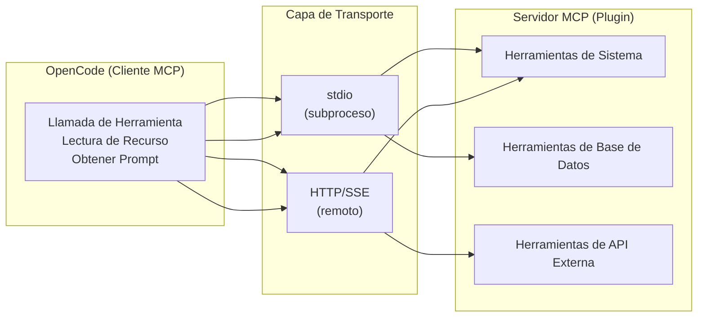
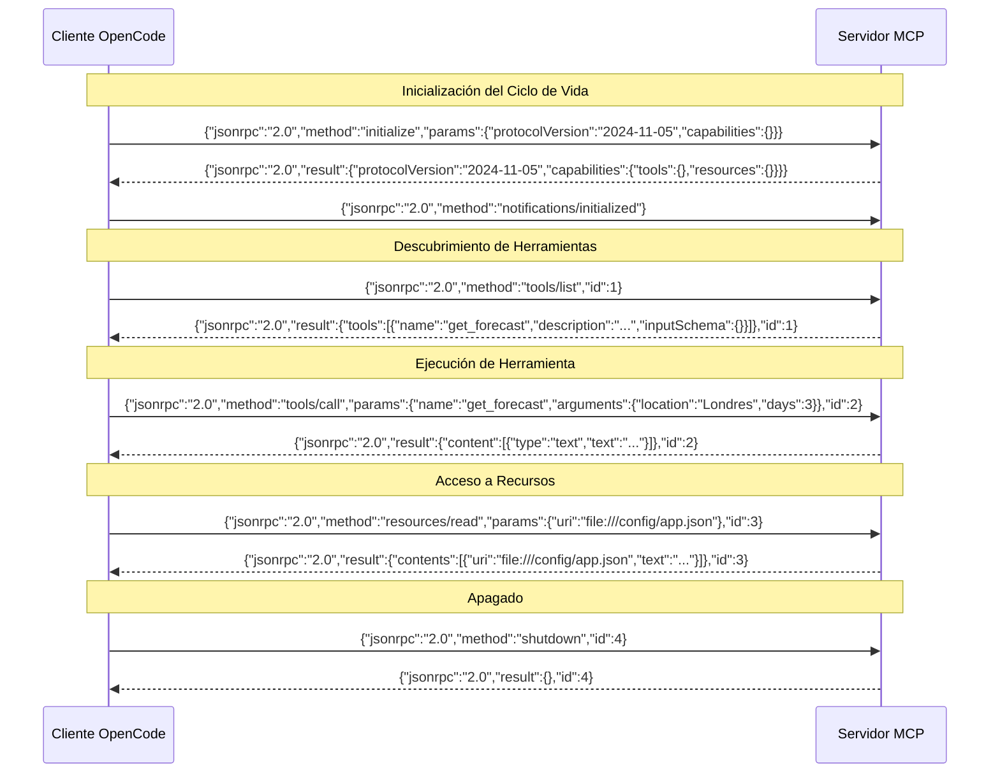
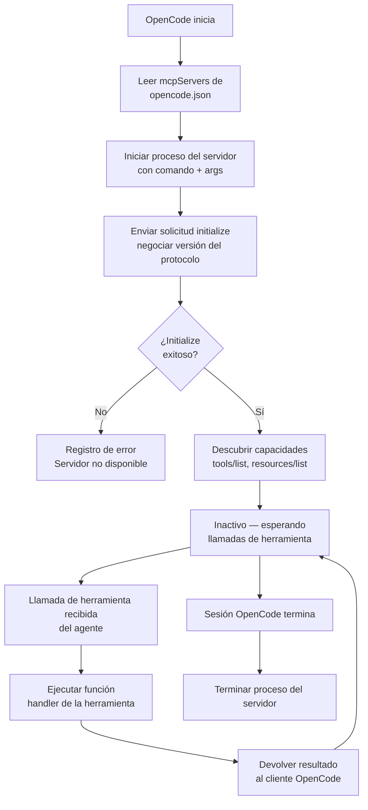

# Servidores MCP, Plugins e Integración de Herramientas Externas

## ¿Qué es MCP?

El Model Context Protocol (MCP) es un estándar abierto que define cómo las aplicaciones LLM se comunican con herramientas externas y fuentes de datos. Utiliza JSON-RPC 2.0 como su protocolo de transporte.

> [!NOTE]
> MCP fue diseñado específicamente para patrones de interacción LLM-herramienta. A diferencia de las APIs REST que están diseñadas para humanos y operaciones CRUD, MCP utiliza un protocolo JSON-RPC bidireccional que soporta descubrimiento de herramientas, acceso a recursos y plantillas de prompt — primitivas que los LLMs entienden naturalmente.



---

## Intercambio de Protocolo JSON-RPC MCP

Cada interacción entre OpenCode y un servidor MCP sigue una conversación JSON-RPC 2.0 estructurada. Comprender este protocolo es esencial para depurar y construir servidores MCP personalizados.



> [!TIP]
> Al depurar problemas MCP, activa el registro verbose para ver los mensajes JSON-RPC brutos. Esto es invaluable para identificar esquemas de herramientas malformados, formatos de respuesta incorrectos o fallos de autenticación.

### Ciclo de Vida del Servidor MCP



---

## Configuración del Servidor MCP

Los servidores MCP se configuran en la sección `mcpServers` de `opencode.json`:

```json
{
  "mcpServers": {
    "filesystem": {
      "command": "npx",
      "args": [
        "-y",
        "@modelcontextprotocol/server-filesystem",
        "/home/usuario/proyectos"
      ],
      "env": {
        "NODE_ENV": "production"
      }
    },
    "github": {
      "command": "node",
      "args": ["mcp-github-server.js"],
      "env": {
        "GITHUB_TOKEN": "${GITHUB_TOKEN}"
      }
    },
    "database": {
      "command": "python",
      "args": ["mcp-db-server.py"],
      "env": {
        "DATABASE_URL": "${DATABASE_URL}"
      }
    }
  }
}
```

> [!WARNING]
> Los servidores MCP tienen acceso completo a las variables de entorno con las que se configuran. Nunca endurezcas secretos en `opencode.json` — siempre usa interpolación de variables de entorno (`${VAR_NAME}`). El bloque env se pasa directamente al proceso iniciado, y cualquier herramienta que se ejecute en ese proceso puede leer estos valores.

---

## Conectando APIs Externas via MCP

Los servidores MCP envuelven APIs externas en interfaces de herramientas que los LLMs pueden llamar:

```json
{
  "mcpServers": {
    "slack": {
      "command": "python",
      "args": ["mcp-slack-server.py"],
      "env": {
        "SLACK_BOT_TOKEN": "${SLACK_BOT_TOKEN}",
        "SLACK_SIGNING_SECRET": "${SLACK_SIGNING_SECRET}"
      }
    }
  }
}
```

```python
# mcp-slack-server.py
# Servidor MCP que envuelve la API de Slack en herramientas invocables
import os
import httpx
from mcp import Server

server = Server("slack")

@server.tool()
async def send_message(channel: str, text: str) -> str:
    """Envía un mensaje a un canal de Slack"""
    async with httpx.AsyncClient() as client:
        resp = await client.post(
            f"https://slack.com/api/chat.postMessage",
            headers={
                "Authorization": f"Bearer {os.environ['SLACK_BOT_TOKEN']}",
                "Content-Type": "application/json"
            },
            json={"channel": channel, "text": text}
        )
        data = resp.json()
        if not data.get("ok"):
            raise Exception(f"Error API de Slack: {data.get('error')}")
        return data["message"]["text"]

@server.tool()
async def list_channels(limit: int = 20) -> list:
    """Lista canales públicos en el workspace"""
    async with httpx.AsyncClient() as client:
        resp = await client.get(
            "https://slack.com/api/conversations.list",
            headers={"Authorization": f"Bearer {os.environ['SLACK_BOT_TOKEN']}"},
            params={"limit": limit}
        )
        return resp.json()["channels"]

server.run()
```

---

## Escribiendo Implementaciones de Servidor MCP

Un servidor MCP expone tres primitivas:

- **Tools**: Funciones invocables que el LLM puede llamar
- **Resources**: Datos de solo lectura que el LLM puede acceder
- **Prompts**: Plantillas de prompt pre-escritas

### Servidor MCP en TypeScript

```typescript
// mcp-weather-server.ts
import { Server } from "@modelcontextprotocol/sdk/server/index.js";
import { StdioServerTransport } from "@modelcontextprotocol/sdk/server/stdio.js";

const server = new Server(
  { name: "weather-server", version: "1.0.0" },
  { capabilities: { tools: {}, resources: {} } }
);

// Define una herramienta con validación de entrada JSON Schema
server.setRequestHandler("tools/list", async () => ({
  tools: [{
    name: "get_forecast",
    description: "Obtener pronóstico del tiempo para una ubicación",
    inputSchema: {
      type: "object",
      properties: {
        location: {
          type: "string",
          description: "Nombre de la ciudad o coordenadas"
        },
        days: {
          type: "number",
          description: "Número de días de pronóstico",
          default: 3
        }
      },
      required: ["location"]
    }
  }]
}));

// Maneja la ejecución de herramientas con manejo de errores
server.setRequestHandler("tools/call", async (request) => {
  const { name, arguments: args } = request.params;

  if (name === "get_forecast") {
    try {
      const data = await fetchWeather(args.location, args.days);
      return {
        content: [{ type: "text", text: JSON.stringify(data, null, 2) }]
      };
    } catch (error) {
      return {
        content: [{
          type: "text",
          text: `Error al obtener pronóstico: ${error.message}`
        }],
        isError: true
      };
    }
  }

  throw new Error(`Herramienta desconocida: ${name}`);
});

const transport = new StdioServerTransport();
await server.connect(transport);
```

### Servidor MCP en Python

```python
# mcp-weather-server.py
# Servidor MCP equivalente en Python
import json
import httpx
from mcp import Server, StdioServerTransport

server = Server("weather-server")

@server.list_tools()
async def list_tools():
    return [
        {
            "name": "get_forecast",
            "description": "Obtener pronóstico del tiempo para una ubicación",
            "inputSchema": {
                "type": "object",
                "properties": {
                    "location": {"type": "string", "description": "Nombre de la ciudad"},
                    "days": {"type": "number", "description": "Días de pronóstico", "default": 3}
                },
                "required": ["location"]
            }
        }
    ]

@server.call_tool()
async def call_tool(name: str, arguments: dict):
    if name == "get_forecast":
        async with httpx.AsyncClient() as client:
            resp = await client.get(
                f"https://api.weather.gov/points/{arguments['location']}/forecast"
            )
            data = resp.json()
        return {"content": [{"type": "text", "text": json.dumps(data, indent=2)}]}

async def main():
    transport = StdioServerTransport()
    await server.connect(transport)

if __name__ == "__main__":
    import asyncio
    asyncio.run(main())
```

> [!IMPORTANT]
> Los esquemas de herramientas definen el contrato entre el LLM y tu servidor. Siempre incluye campos `description` claros para cada parámetro — el LLM usa estas descripciones para determinar cómo completar los argumentos. Un parámetro mal descrito resultará en que el LLM pase valores incorrectos.

---

## Arquitectura de Plugin

Los servidores MCP sirven como el sistema de plugins para OpenCode. Cualquier capacidad externa puede ser envuelta como un servidor MCP.

### Comparación: Mecanismos de Transporte

| Aspecto             | stdio (subproceso)                 | HTTP/SSE (remoto)                    |
|---------------------|-------------------------------------|--------------------------------------|
| **Proceso**         | Iniciado por OpenCode              | Se ejecuta independientemente       |
| **Latencia**        | Baja (IPC local)                   | Más alta (I/O de red)               |
| **Seguridad**       | Aislamiento de proceso, local      | Requiere autenticación de red, TLS   |
| **Despliegue**      | Empaquetado con el proyecto        | Servicio o contenedor en ejecución  |
| **Ciclo de vida**   | Vinculado a la sesión OpenCode     | Daemon independiente                |
| **Caso de uso**     | Herramientas locales (fs, git)     | APIs remotas (Slack, GitHub, DB)    |
| **Depuración**      | Verificar logs del servidor        | Verificar endpoints + red           |
| **Escalabilidad**   | Uno por sesión                     | Múltiples clientes                  |

| Componente     | Rol                                      |
|----------------|------------------------------------------|
| OpenCode       | Cliente MCP — inicia solicitudes         |
| Servidor MCP   | Plugin — procesa solicitudes y devuelve  |
| Transporte     | stdin/stdout o HTTP/SSE                  |
| Protocolo      | JSON-RPC 2.0                             |

> [!TIP]
> Usa transporte stdio para herramientas de desarrollo local que necesitan baja latencia (acceso a sistema de archivos, análisis de código). Usa HTTP/SSE para servicios compartidos que múltiples miembros del equipo necesitan acceder (bases de datos compartidas, APIs de equipo). Los servidores HTTP pueden desplegarse en contenedores Docker para entornos consistentes.

---

## Ámbitos de Permiso de Herramientas

Cada herramienta MCP puede tener ámbitos de permiso definidos en la configuración:

```json
{
  "permissions": [
    {
      "mcpServer": "filesystem",
      "tools": ["read", "write"],
      "allow": ["/home/usuario/proyectos/*"],
      "deny": ["/etc/**", "/home/usuario/.ssh/**"]
    },
    {
      "mcpServer": "github",
      "tools": ["create_pr", "list_repos"],
      "allow": ["*"],
      "requireApproval": true
    }
  ]
}
```

```bash
# Probar conectividad del servidor MCP desde la línea de comandos
echo '{"jsonrpc":"2.0","method":"tools/list","id":1}' | \
  node mcp-weather-server.js

# Salida esperada: respuesta JSON-RPC con definiciones de herramientas
# ... | jq '.result.tools[].name'
```

> [!WARNING]
> Al configurar permisos para un servidor MCP, recuerda que el servidor se ejecuta como un proceso separado. Incluso si el sistema de permisos de OpenCode bloquea una llamada de herramienta, el proceso del servidor en sí sigue ejecutándose. Para servidores sensibles, implementa autenticación dentro del servidor como una medida de defensa en profundidad.

---

## Preguntas de Práctica

```question
{
  "id": "oc-04-q1",
  "type": "multiple-choice",
  "question": "Un servidor MCP necesita comunicarse con el cliente OpenCode. ¿Qué protocolo de transporte utilizan?",
  "options": [
    "HTTP/1.1 con endpoints RESTful",
    "gRPC con Protocol Buffers",
    "JSON-RPC 2.0",
    "WebSocket con tramas binarias"
  ],
  "correct": 2,
  "explanation": "MCP utiliza JSON-RPC 2.0 como su protocolo de transporte para toda la comunicación. Esto incluye inicialización, listado de herramientas, llamadas de herramientas, lecturas de recursos y apagado. El formato JSON-RPC es simple, independiente del lenguaje y se mapea naturalmente a patrones de llamada de herramientas de LLM."
}
```

```question
{
  "id": "oc-04-q2",
  "type": "multiple-choice",
  "question": "Un desarrollador está construyendo un servidor MCP para una API del clima. ¿Qué tres primitivas debe exponer el servidor al cliente OpenCode?",
  "options": [
    "Endpoints, middleware y rutas",
    "Herramientas, recursos y prompts",
    "Modelos, vectores y embeddings",
    "Manejadores GET, POST y DELETE"
  ],
  "correct": 1,
  "explanation": "Los servidores MCP exponen tres primitivas: Herramientas (funciones invocables que realizan acciones), Recursos (datos de solo lectura que el LLM puede acceder) y Prompts (plantillas de prompt pre-escritas). Estas primitivas están diseñadas específicamente para patrones de interacción con LLM."
}
```

```question
{
  "id": "oc-04-q3",
  "type": "multiple-choice",
  "question": "Un equipo necesita conectar su base de datos PostgreSQL a OpenCode usando un servidor MCP. El script del servidor es mcp-db-server.py y usa DATABASE_URL. ¿Cómo debería configurarse esto?",
  "options": [
    "Almacenar la URL de la base de datos directamente en el campo command",
    "Establecer DATABASE_URL usando interpolación de variable de entorno en la sección env",
    "Endurecer las credenciales en skill.yaml",
    "Pasar la URL de la base de datos como una bandera de línea de comandos"
  ],
  "correct": 1,
  "explanation": "El enfoque correcto es usar interpolación de variable de entorno en la sección `env` de la configuración del servidor MCP: `\"DATABASE_URL\": \"${DATABASE_URL}\"`. Esto mantiene los secretos fuera de los archivos de configuración y permite que diferentes entornos usen diferentes credenciales."
}
```

```question
{
  "id": "oc-04-q4",
  "type": "multiple-choice",
  "question": "¿Cuál es la diferencia clave entre ejecutar un servidor MCP mediante stdin/stdout versus HTTP/SSE?",
  "options": [
    "stdin/stdout es más lento pero más seguro",
    "stdin/stdout usa un subproceso iniciado por OpenCode, mientras que HTTP/SSE permite comunicación remota con servidores",
    "HTTP/SSE solo funciona con servidores JavaScript",
    "stdin/stdout requiere una conexión de base de datos"
  ],
  "correct": 1,
  "explanation": "El transporte stdin/stdout inicia el servidor MCP como un subproceso de OpenCode, lo que lo hace ideal para herramientas locales. HTTP/SSE ejecuta el servidor de forma independiente, permitiendo despliegues remotos/basados en servidor. La elección depende de si necesitas acceso local de baja latencia o acceso remoto compartido."
}
```

```question
{
  "id": "oc-04-q5",
  "type": "multiple-choice",
  "question": "Una herramienta de servidor MCP tiene un parámetro sin campo de descripción en su inputSchema. ¿Cuál es la probable consecuencia?",
  "options": [
    "El LLM se negará a llamar a la herramienta",
    "El LLM puede pasar valores incorrectos o faltantes para ese parámetro",
    "El parámetro se vuelve opcional automáticamente",
    "El servidor MCP fallará al iniciar"
  ],
  "correct": 1,
  "explanation": "Los LLMs dependen de las descripciones de los parámetros para entender qué valores pasar. Sin una descripción, el LLM no tiene contexto sobre qué espera el parámetro y puede adivinarlo incorrectamente u omitirlo. Siempre proporciona descripciones claras para cada parámetro en tus esquemas de herramientas."
}
```

---

[!SUCCESS] **Conclusiones Clave**

- MCP es un estándar abierto que usa JSON-RPC 2.0 para comunicación LLM-herramienta
- Los servidores MCP exponen herramientas (invocables), recursos (datos legibles) y prompts (plantillas)
- Los servidores se configuran en `opencode.json` bajo `mcpServers` con comando, args y env
- Las APIs externas (Slack, GitHub, bases de datos) se envuelven como herramientas MCP
- Los servidores MCP pueden usar stdio o HTTP/SSE como mecanismos de transporte
- Los ámbitos de permiso controlan qué herramientas y rutas puede acceder cada servidor MCP
- La interpolación de variables de entorno (`${VAR_NAME}`) previene la filtración de secretos
- El intercambio de protocolo JSON-RPC sigue un ciclo de vida estructurado: inicializar, descubrir, ejecutar, apagar
- Los esquemas de herramientas deben tener parámetros bien descritos para que el LLM los use correctamente
- Los servidores MCP pueden implementarse en cualquier lenguaje (TypeScript, Python, Go, etc.)
