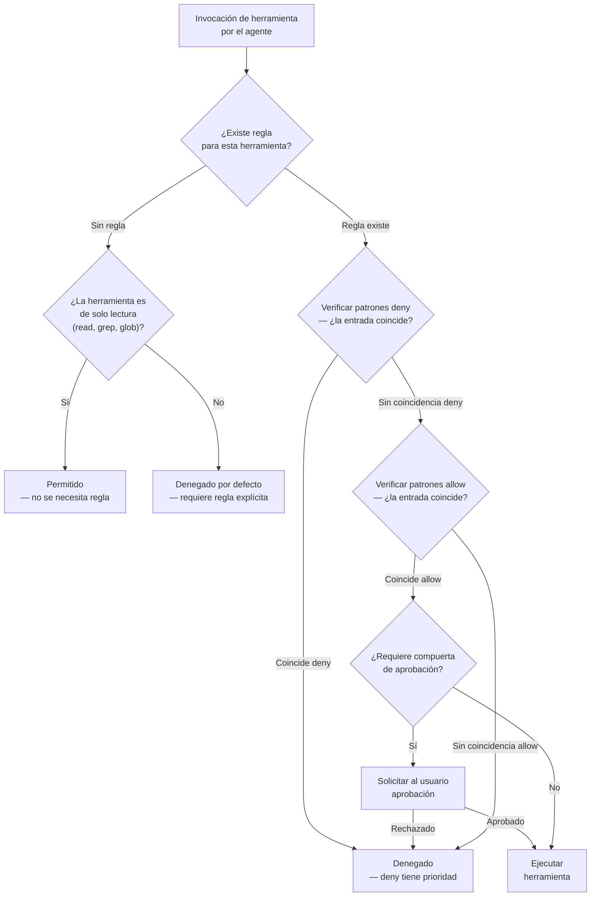
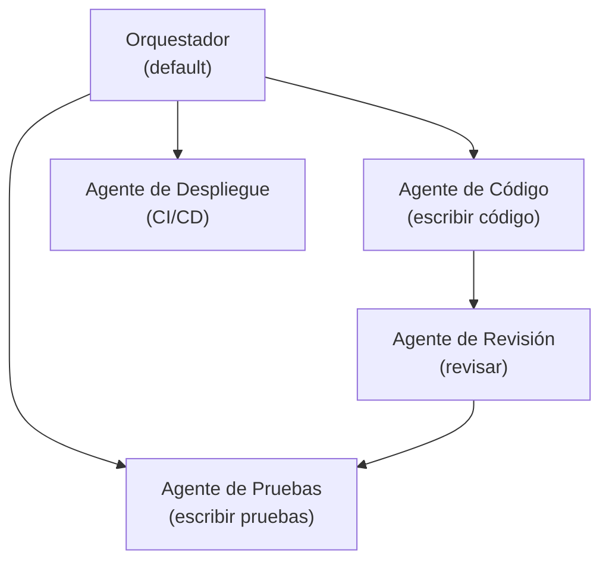
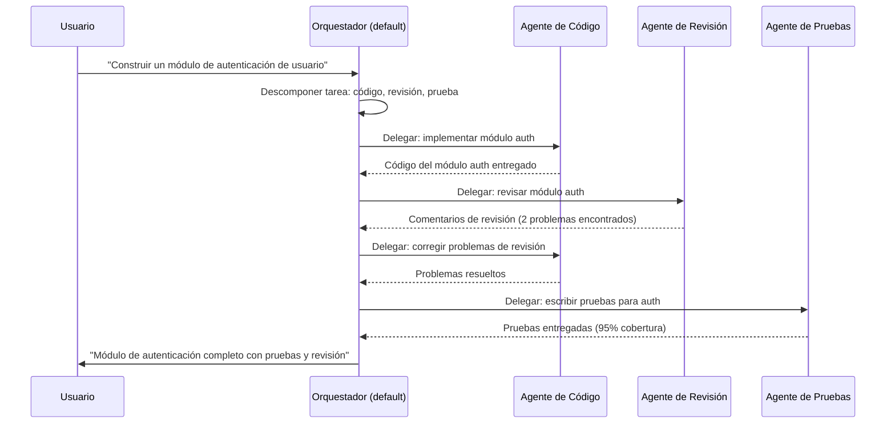

# Permisos, Reglas de Seguridad y Colaboración Multi-Agente

## Reglas de Permiso en opencode.json

Los permisos definen qué acciones pueden realizar los agentes. Están estructurados como reglas allow/deny aplicadas a herramientas específicas o servidores MCP.

```json
{
  "permissions": [
    {
      "tool": "bash",
      "allow": ["npm *", "git *", "pip *", "cargo *"],
      "deny": ["rm -rf *", "sudo *", "chmod *", "> *", "| *"]
    },
    {
      "tool": "write",
      "allow": ["src/**", "docs/**", "tests/**"],
      "deny": [".env", "*.key", "node_modules/**"]
    }
  ]
}
```

> [!IMPORTANT]
> Las reglas de permiso se evalúan en tiempo de ejecución para cada invocación de herramienta. Las reglas deny se verifican primero — si un comando coincide con cualquier patrón deny, se rechaza inmediatamente independientemente de si también coincide con un patrón allow. Este diseño a prueba de fallos previene desvíos accidentales.

### Lógica de Evaluación de Permisos

Comprender el orden exacto de evaluación es crítico para escribir reglas de permiso seguras.



> [!NOTE]
> El comportamiento predeterminado para herramientas sin reglas de permiso depende del tipo de herramienta. Las herramientas de solo lectura (read, grep, glob) están permitidas por defecto. Las herramientas de escritura y ejecución (bash, write, edit, task) están denegadas por defecto a menos que se permitan explícitamente.

---

## Patrones Allow/Deny

Los patrones admiten comodines estilo glob para coincidencia flexible de reglas:

| Patrón           | Coincide con                              | Ejemplo de Coincidencia    |
|------------------|-------------------------------------------|----------------------------|
| `src/**`         | Todos los archivos bajo `src/`            | `src/components/button.tsx`|
| `*.env`          | Cualquier archivo `.env` en cualquier nivel| `/project/.env`            |
| `**/secrets/*`   | Cualquier archivo dentro de `secrets/`    | `config/secrets/keys.json` |
| `npm *`          | Cualquier comando que comience con `npm`  | `npm install express`      |
| `git *`          | Cualquier comando que comience con `git`  | `git push origin main`     |
| `rm -rf *`       | Eliminación recursiva forzada             | `rm -rf node_modules`      |

> [!WARNING]
> Los patrones glob distinguen entre mayúsculas y minúsculas en Linux y no los distinguen en macOS por defecto. Ten cuidado con las extensiones de archivo — `*.KEY` NO coincidirá con `secret.key` en Linux. Usa patrones en minúsculas para compatibilidad entre plataformas.

---

## Control de Acceso a Herramientas

Cada herramienta puede tener reglas de acceso granulares:

```json
{
  "permissions": [
    {
      "tool": "read",
      "allow": ["*"],
      "description": "La lectura está permitida en todas partes"
    },
    {
      "tool": "edit",
      "allow": ["src/**/*.ts", "src/**/*.tsx"],
      "deny": ["src/generated/**"],
      "requireApproval": true
    },
    {
      "tool": "bash",
      "deny": ["curl *", "wget *", "ssh *"],
      "requireApproval": "always"
    }
  ]
}
```

> [!TIP]
> Usa `requireApproval: true` para operaciones destructivas o sensibles. Esto crea una compuerta humano-en-el-bucle que evita que agentes automatizados realicen acciones irreversibles como despliegues, eliminación de datos o cambios de configuración sin confirmación explícita del usuario.

---

## Restricciones de Ruta de Archivo

Las restricciones de ruta limitan qué archivos pueden acceder los agentes:

```json
{
  "permissions": [
    {
      "tool": "bash",
      "allow": [
        "/home/usuario/proyectos/*",
        "/tmp/*"
      ],
      "deny": [
        "/etc/**",
        "/home/usuario/.ssh/**",
        "/home/usuario/proyectos/repo-secreto/**"
      ]
    }
  ]
}
```

> [!WARNING]
> Las restricciones de ruta de archivo solo se aplican cuando la herramienta se invoca a través del registro de herramientas de OpenCode. El acceso directo al shell evita estas restricciones — siempre combínalas con reglas allow/deny de comando bash. Un agente con permiso para ejecutar `bash` pero sin restricciones de ruta podría acceder a cualquier archivo ejecutando comandos shell directamente.

---

## Flujos de Trabajo Multi-Agente

Los flujos de trabajo multi-agente permiten descomposición compleja de tareas:



> [!TIP]
> En flujos de trabajo multi-agente, comienza con un patrón simple de orquestador más especialistas. Cada especialista debe tener una descripción de alcance estrecho y permisos restringidos. El orquestador descompone solicitudes de alto nivel en subtareas y delega al especialista apropiado.

```json
{
  "agents": {
    "default": {
      "model": "gpt-4o",
      "description": "Orquestador — descompone tareas y delega a especialistas"
    },
    "code-agent": {
      "model": "gpt-4o",
      "description": "Implementa código de funcionalidades siguiendo patrones del proyecto",
      "constraints": {
        "allowedTools": ["read", "write", "edit", "glob", "bash"]
      }
    },
    "review-agent": {
      "model": "claude-sonnet-4-20250514",
      "description": "Revisa código por seguridad, rendimiento y estilo",
      "constraints": {
        "allowedTools": ["read", "grep", "glob"],
        "deniedTools": ["write", "edit", "bash"]
      }
    },
    "test-agent": {
      "model": "gpt-4o",
      "description": "Escribe pruebas unitarias y de integración",
      "constraints": {
        "maxTokens": 4096
      }
    },
    "deploy-agent": {
      "model": "gpt-4o-mini",
      "description": "Gestiona pipelines de despliegue con compuertas de aprobación",
      "constraints": {
        "allowedTools": ["bash", "read", "glob"]
      }
    }
  }
}
```

---

## Delegación Agente-a-Agente

Los agentes pueden delegar subtareas a otros agentes. La delegación respeta los permisos y restricciones del agente destino.

> [!IMPORTANT]
> Cuando un orquestador delega a un especialista, el especialista opera bajo su propio ámbito de permisos. Esto significa que un especialista puede tener restricciones más estrictas que el orquestador, proporcionando defensa en profundidad. Siempre diseña cadenas de delegación para que cada agente tenga los permisos mínimos necesarios para su rol.



```json
{
  "agentRouting": {
    "mode": "delegation",
    "delegationRules": [
      {
        "sourceAgent": "default",
        "targetAgent": "review-agent",
        "trigger": "después de cambios de código",
        "conditions": {
          "filePattern": "src/**/*.ts"
        }
      },
      {
        "sourceAgent": "default",
        "targetAgent": "test-agent",
        "trigger": "después de implementación",
        "conditions": {
          "required": true
        }
      }
    ]
  }
}
```

---

## Registro de Auditoría

El registro de auditoría rastrea todas las acciones de los agentes para seguridad y depuración:

```json
{
  "audit": {
    "enabled": true,
    "logPath": ".opencode/audit.log",
    "events": [
      "tool.call",
      "tool.call.result",
      "agent.delegation",
      "permission.denied",
      "permission.approved"
    ],
    "retention": "30d"
  }
}
```

> [!IMPORTANT]
> Los registros de auditoría son críticos para la respuesta a incidentes y el cumplimiento normativo. Si ocurre una violación de seguridad, el registro de auditoría es tu principal fuente de verdad para reconstruir lo que sucedió. Establece períodos de retención apropiados basados en tus requisitos de cumplimiento (SOX, HIPAA, SOC2 típicamente requieren 90 días a 7 años).

```bash
# Analizar registros de auditoría para información de seguridad
# Contar permisos denegados por herramienta
grep "permission.denied" .opencode/audit.log | \
  jq -r '.data.tool' | sort | uniq -c | sort -rn

# Encontrar todos los eventos de delegación con marcas de tiempo
grep "agent.delegation" .opencode/audit.log | \
  jq -r '[.timestamp, .data.source, .data.target] | @tsv'

# Rastrear actividad de compuerta de aprobación
grep "permission.approved\|permission.denied" .opencode/audit.log | \
  jq -r '[.timestamp, .event, .data.tool, .data.command] | @tsv'
```

### Comparación: Tipos de Regla de Permiso

| Tipo de Regla        | Ámbito          | Ejemplo                                    | Caso de Uso                      |
|----------------------|-----------------|--------------------------------------------|----------------------------------|
| Tool allow/deny     | Nivel herramienta| `"allow": ["npm *"]`                       | Restricciones seguras de comando |
| Path allow/deny     | Acceso archivo  | `"allow": ["src/**"]`                      | Restringir modificaciones de archivo|
| Regla MCP server   | Nivel servidor  | `"mcpServer": "github"`                   | Control de acceso externo        |
| Requerir aprobación | Nivel acción    | `"requireApproval": true`                  | Compuerta de operaciones sensibles|
| Restricción agente  | Nivel agente    | `"deniedTools": ["bash"]`                  | Límites de capacidad por agente  |
| Ámbito subagente    | Herencia        | Heredado del padre por defecto             | Límites jerárquicos de permisos  |
| Filtro evento audit | Nivel registro  | `"events": ["tool.call", "permission.denied"]` | Captura selectiva de registro |

> [!TIP]
> Sigue el principio de mínimo privilegio: comienza sin permisos y concede solo lo que cada agente necesita. Usa restricciones de nivel de agente para límites amplios de capacidad, allow/deny de nivel de herramienta para control específico de comandos, y reglas de servidor MCP para acceso a servicios externos. Capas para defensa en profundidad.

---

## Preguntas de Práctica

```question
{
  "id": "oc-05-q1",
  "type": "multiple-choice",
  "question": "Un ingeniero de seguridad está escribiendo una regla de permiso. ¿Qué tres componentes debe especificar toda regla de permiso?",
  "options": [
    "name, version y enabled",
    "tool, allow y deny",
    "agent, command y timeout",
    "source, target y trigger"
  ],
  "correct": 1,
  "explanation": "Toda regla de permiso debe especificar la `tool` a la que se aplica (ej.: bash, write, edit), un array `allow` de patrones permitidos y un array `deny` de patrones bloqueados. Sin los tres, la regla está incompleta y puede no comportarse como se espera."
}
```

```question
{
  "id": "oc-05-q2",
  "type": "multiple-choice",
  "question": "¿Cuál es la diferencia práctica entre una regla de nivel de herramienta `deny: ['rm -rf *']` y una restricción de nivel de agente `deniedTools: ['bash']`?",
  "options": [
    "Son funcionalmente idénticas e intercambiables",
    "Las reglas de nivel de herramienta bloquean comandos específicos para todos los agentes, las restricciones de nivel de agente bloquean herramientas enteras para un agente",
    "Las restricciones de nivel de agente anulan todas las reglas de nivel de herramienta",
    "Las reglas de nivel de herramienta solo se aplican a servidores MCP, no a herramientas integradas"
  ],
  "correct": 1,
  "explanation": "Las reglas deny de nivel de herramienta bloquean patrones de comando específicos (como `rm -rf *`) en todos los agentes para una herramienta determinada. Las restricciones `deniedTools` de nivel de agente bloquean una herramienta completa (como todos los comandos `bash`) para un solo agente. Usa reglas de nivel de herramienta para seguridad global y restricciones de nivel de agente para reducción de capacidad por agente."
}
```

```question
{
  "id": "oc-05-q3",
  "type": "multiple-choice",
  "question": "En un flujo de trabajo multi-agente con un orquestador y agentes especialistas, ¿cómo decide el orquestador qué agente debe manejar una subtarea?",
  "options": [
    "Asigna tareas aleatoriamente a los agentes disponibles",
    "Usa reglas de delegación con disparadores y condiciones como patrones de archivo",
    "Todos los agentes especialistas trabajan en cada tarea simultáneamente",
    "El usuario debe especificar manualmente el agente para cada subtarea"
  ],
  "correct": 1,
  "explanation": "El orquestador usa reglas de delegación definidas en `agentRouting.delegationRules`. Cada regla especifica una condición de disparador (como 'después de cambios de código') y condiciones opcionales (como patrones de archivo). Cuando se cumplen las condiciones, el orquestador delega la subtarea al agente destino."
}
```

```question
{
  "id": "oc-05-q4",
  "type": "multiple-choice",
  "question": "Un equipo de seguridad quiere auditar cada invocación de herramienta, delegación y decisión de permiso en OpenCode. ¿Qué conjunto de eventos de auditoría deberían habilitar?",
  "options": [
    "tool.call, tool.call.result, agent.delegation, permission.denied, permission.approved",
    "Solo tool.call para minimizar el volumen de registro",
    "Solo agent.delegation y permission.denied",
    "session.start y session.end"
  ],
  "correct": 0,
  "explanation": "Para capturar la imagen completa de seguridad, habilita los cinco tipos de evento: tool.call (cada invocación de herramienta), tool.call.result (resultado de cada llamada), agent.delegation (transferencias de tarea entre agentes), permission.denied (operaciones bloqueadas) y permission.approved (operaciones aprobadas). Esto proporciona trazabilidad completa para incidentes de seguridad."
}
```

```question
{
  "id": "oc-05-q5",
  "type": "multiple-choice",
  "question": "Un administrador configuró restricciones de ruta de archivo para bloquear el acceso a `/etc/` pero no agregó ninguna regla allow/deny de bash. ¿Por qué esta configuración está incompleta?",
  "options": [
    "Las restricciones de ruta de archivo solo se aplican a las herramientas read y write, no a bash",
    "Un usuario podría eludir la restricción ejecutando comandos shell directamente, ya que las restricciones de ruta solo se aplican al registro de herramientas",
    "Las restricciones de ruta de archivo se heredan automáticamente de la configuración padre",
    "La ruta /etc/ nunca es accesible a través de OpenCode de todos modos"
  ],
  "correct": 1,
  "explanation": "Las restricciones de ruta de archivo solo se aplican a las herramientas invocadas a través del registro de herramientas de OpenCode. Si el agente tiene acceso a la herramienta `bash` sin restricciones de nivel de comando, puede eludir las restricciones de ruta ejecutando comandos shell como `cat /etc/shadow` o `ls /etc/`. Siempre combina restricciones de ruta con reglas allow/deny de comando bash para protección completa."
}
```

---

[!SUCCESS] **Conclusiones Clave**

- Las reglas de permiso usan patrones allow/deny con comodines estilo glob para control de acceso flexible
- Las reglas deny se evalúan primero y tienen prioridad sobre las reglas allow
- Las reglas de nivel de herramienta controlan qué comandos y operaciones de archivo pueden ejecutar los agentes
- Las restricciones de ruta de archivo deben combinarse con reglas de comando bash para evitar elusión
- Los flujos de trabajo multi-agente descomponen tareas complejas mediante delegación orquestador-especialista
- La delegación agente-a-agente respeta el ámbito de permisos independiente de cada agente destino
- El registro de auditoría captura llamadas de herramienta, delegaciones y eventos de permiso para revisión de seguridad
- Las compuertas de aprobación añaden un humano-en-el-bucle para operaciones sensibles como despliegues
- La lógica de evaluación de permisos sigue un flujo estructurado: verificación de herramienta, verificación deny, verificación allow, compuerta de aprobación
- Principio de mínimo privilegio: comienza sin permisos y concede solo lo que cada agente necesita
