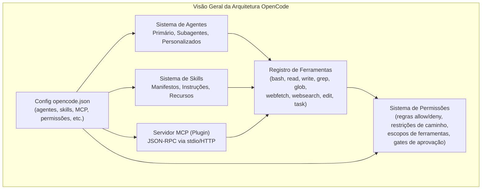
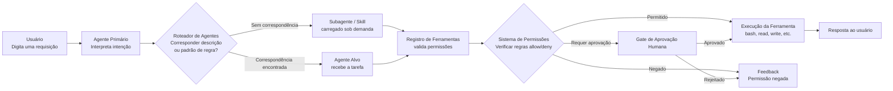
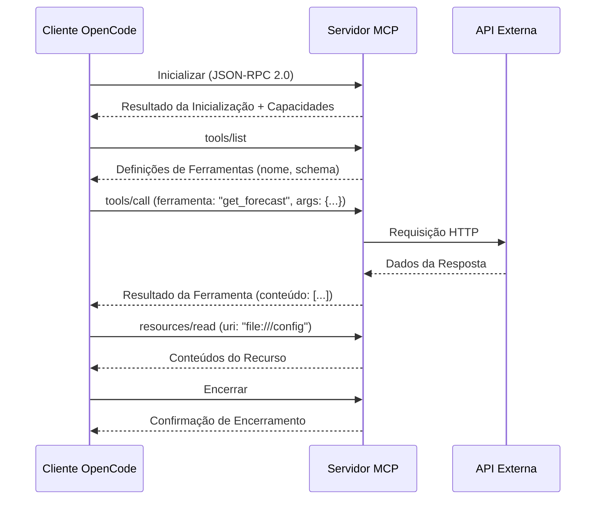

# Arquitetura do OpenCode: Agentes, Skills e MCP

## O que é o OpenCode?

OpenCode é um framework CLI de código aberto para engenharia de software assistida por IA. Ele conecta modelos de linguagem de grande porte (LLMs) com ambientes de desenvolvimento através de um sistema estruturado de agentes, skills e o Model Context Protocol (MCP).

> [!NOTE]
> O OpenCode é configurado via um único arquivo: `opencode.json` na raiz do projeto ou `.opencode/config.json` dentro do diretório `.opencode/`. Ambos os locais são equivalentes, embora `.opencode/config.json` mantenha sua configuração isolada.



> [!TIP]
> Pense no OpenCode como um sistema operacional para assistentes de codificação de IA. Agentes são os usuários, skills são os programas instalados, servidores MCP são dispositivos periféricos e permissões são as políticas de segurança.

---

## Ciclo de Vida da Requisição

Cada interação do usuário flui através de um pipeline bem definido. Entender este ciclo é crucial para depuração e otimização.



> [!TIP]
> Quando um agente se comporta inesperadamente, trace o ciclo de vida da requisição. Frequentemente o problema está no sistema de permissões (uma ferramenta negada) ou no roteamento de agentes (agente errado selecionado).

---

## Visão Geral do Sistema de Agentes

Agentes são assistentes baseados em IA configurados com modelos, prompts e capacidades específicas. O OpenCode suporta vários tipos de agentes:

- **Agente primário**: O principal assistente de codificação que interage com o usuário
- **Subagentes**: Agentes especializados (ex.: `customize-opencode`) para tarefas específicas
- **Agentes personalizados**: Agentes definidos pelo usuário com configurações sob medida

Cada agente opera dentro de um escopo de permissão e tem acesso a um conjunto definido de ferramentas e skills.

> [!WARNING]
> Subagentes herdam o escopo de permissão do pai a menos que explicitamente sobrescrito. Isto significa que um subagente com um pai poderoso pode acidentalmente realizar operações destrutivas. Sempre revise as permissões do subagente ao delegar tarefas sensíveis.

---

## Sistema de Skills

Skills são pacotes reutilizáveis de instruções que ensinam um agente a executar tarefas específicas. Uma skill inclui:

- **Instruções**: Guia em linguagem natural para o agente
- **Ferramentas**: Definições opcionais de ferramentas ou restrições
- **Recursos**: Arquivos empacotados (scripts, templates, referências)

Skills são carregadas automaticamente quando um agente detecta um padrão de tarefa correspondente.

```yaml
# skill.yaml
name: customize-opencode
description: Editar ou criar configuração do OpenCode
instructions: |
  Quando o usuário pedir para editar opencode.json ou arquivos de
  configuração relacionados, siga estes passos:
  1. Leia a configuração existente
  2. Valide a sintaxe JSON/YAML
  3. Aplique as alterações com segurança
tools:
  - read
  - write
  - edit
resources:
  - schema/opencode-schema.json
```

```bash
# Skills são carregadas automaticamente quando a consulta corresponde à descrição
# Exemplo: digitar "editar minha config opencode" ativa customize-opencode
# Você também pode forçar o carregamento com: opencode --skill customize-opencode
```

---

## MCP (Model Context Protocol)

MCP é um protocolo padrão para conectar LLMs com ferramentas externas e fontes de dados. Ele permite que o OpenCode se integre com:

- **Sistemas de arquivos** (locais e remotos)
- **Bancos de dados** (SQL, vetoriais)
- **APIs web** (REST, GraphQL)
- **Serviços personalizados** (ferramentas internas)

Servidores MCP executam como processos separados e se comunicam via JSON-RPC sobre stdin/stdout ou HTTP.

### Como a Comunicação MCP Funciona



```json
{
  "mcpServers": {
    "filesystem": {
      "command": "node",
      "args": ["mcp-server-fs.js"],
      "env": {
        "ALLOWED_PATHS": "/home/usuario/projetos"
      }
    }
  }
}
```

> [!IMPORTANT]
> Servidores MCP são processos de longa duração. Eles iniciam quando o OpenCode é lançado e são encerrados quando a sessão termina. Servidores com uso intensivo de recursos devem ser gerenciados cuidadosamente para evitar inchaço de memória.

---

## Configuração via opencode.json

Todo o comportamento do OpenCode é controlado através do `opencode.json` (ou `.opencode/config.json`).

> [!NOTE]
> A abordagem do diretório `.opencode/` é preferida para projetos em equipe porque você pode adicioná-lo ao `.gitignore` seletivamente ou versionar apenas o arquivo de configuração sem poluir a raiz do projeto.

```json
{
  "agents": {
    "default": {
      "model": "gpt-4o",
      "description": "Assistente principal de codificação"
    },
    "reviewer": {
      "model": "claude-sonnet-4-20250514",
      "description": "Especialista em revisão de código",
      "prompt": "Você é um revisor de código sênior focado em segurança e desempenho."
    }
  },
  "skills": {
    "customize-opencode": {
      "manifest": "skills/customize-opencode/skill.yaml"
    },
    "react-component": {
      "manifest": "skills/react-component/skill.yaml",
      "autoLoad": true,
      "matchPattern": "react component|jsx"
    }
  },
  "mcpServers": {
    "filesystem": {
      "command": "node",
      "args": ["mcp-server-fs.js", "/home/usuario/projetos"]
    },
    "github": {
      "command": "node",
      "args": ["mcp-github-server.js"],
      "env": {
        "GITHUB_TOKEN": "${GITHUB_TOKEN}"
      }
    }
  },
  "permissions": [
    {
      "tool": "bash",
      "allow": ["npm *", "git *", "pip *"],
      "deny": ["rm -rf /", "sudo *"]
    },
    {
      "tool": "write",
      "allow": ["src/**", "docs/**"],
      "deny": [".env", "secrets/**"]
    }
  ],
  "agentRouting": {
    "mode": "auto",
    "defaultAgent": "default",
    "rules": [
      {
        "pattern": "segurança|vulnerabilidade|CVE",
        "agent": "reviewer"
      }
    ]
  }
}
```

---

## Registro de Ferramentas

O registro de ferramentas gerencia todas as ferramentas disponíveis e suas capacidades:

| Ferramenta   | Propósito                     | Requer Permissão | Categoria       |
|--------------|-------------------------------|:----------------:|-----------------|
| `bash`       | Executar comandos shell       | Sim              | Execução        |
| `read`       | Ler arquivos                  | Não              | Leitura         |
| `write`      | Escrever arquivos             | Sim              | Escrita         |
| `edit`       | Editar arquivos               | Sim              | Escrita         |
| `grep`       | Pesquisar conteúdo            | Não              | Leitura         |
| `glob`       | Buscar arquivos por padrão    | Não              | Leitura         |
| `webfetch`   | Buscar URLs                   | Opcional         | Rede            |
| `websearch`  | Pesquisar na web              | Opcional         | Rede            |
| `task`       | Delegar para subagente/skill  | Sim              | Orquestração    |
| `question`   | Perguntar ao usuário          | Não              | Interação       |

> [!WARNING]
> Ferramentas marcadas como "Opcional" para permissões podem ser usadas sem regras, mas seu comportamento pode ser restrito. Por exemplo, `webfetch` sem regras allow pode ser limitado a certos domínios.

```typescript
// Ferramentas são registradas programaticamente no SDK do OpenCode
import { ToolRegistry } from "opencode";

const registry = new ToolRegistry();

registry.register({
  name: "bash",
  description: "Executar comandos shell",
  requiresPermission: true,
  handler: async (args: { command: string }) => {
    // Lógica de execução com verificações de permissão
  }
});

registry.register({
  name: "grep",
  description: "Pesquisar conteúdo com regex",
  requiresPermission: false,
  handler: async (args: { pattern: string; path?: string }) => {
    // Lógica de pesquisa
  }
});
```

---

## Sistema de Permissões

Permissões controlam quais ações os agentes podem realizar. As regras são definidas no `opencode.json`:

```json
{
  "permissions": [
    {
      "tool": "bash",
      "allow": ["npm *", "git *"],
      "deny": ["rm -rf *", "sudo *"]
    },
    {
      "tool": "write",
      "allow": ["src/**", "docs/**"],
      "deny": [".env", "secrets/**"]
    }
  ]
}
```

> [!WARNING]
> As regras de permissão são avaliadas em ordem: regras deny são verificadas primeiro, depois regras allow. Se um comando corresponde tanto a um padrão allow quanto deny, a regra deny tem precedência. Isso evita desvios acidentais através de padrões sobrepostos.

### Comparação: Agentes vs Skills vs Plugins

| Aspecto           | Agente                    | Skill                      | Plugin (MCP)                |
|-------------------|---------------------------|----------------------------|-----------------------------|
| **Propósito**     | Instância de assistente   | Pacote de instruções       | Ferramenta/serviço externo  |
| **Config**        | `opencode.json`           | Manifesto YAML/JSON        | Entrada MCP no config       |
| **Ciclo**         | Baseado em sessão         | Carregamento sob demanda   | Processo de longa duração   |
| **Escopo**        | Conversação completa      | Tarefa específica          | Acesso a ferramentas        |
| **Linguagem**     | Dependente do modelo      | Linguagem natural          | Qualquer (Node, Python, Go) |
| **Estado**        | Stateful (conversação)    | Stateless (instruções)     | Stateful (processo)         |
| **Exemplo**       | Agente de codificação     | `customize-opencode`       | Servidor MCP filesystem     |
| **Dependências**  | Nenhuma                   | Nenhuma (autocontido)      | Runtime (Node, Python, etc.)|

> [!TIP]
> Escolha um agente quando você precisa de um parceiro de conversação persistente com expertise específica. Escolha uma skill quando quiser ensinar a qualquer agente um procedimento repetível. Escolha um plugin quando precisar se conectar a um sistema ou API externa.

---

## Perguntas de Prática

```question
{
  "id": "oc-01-q1",
  "type": "multiple-choice",
  "question": "Uma equipe quer que seu assistente de codificação baseado em LLM possa consultar uma API REST interna da empresa. Qual mecanismo do OpenCode eles devem usar?",
  "options": [
    "O sistema de Skills com um manifesto personalizado",
    "O Registro de Ferramentas com ferramentas integradas",
    "O protocolo MCP para criar um servidor que encapsule a API",
    "O sistema de Roteamento de Agentes com correspondência de padrões"
  ],
  "correct": 2,
  "explanation": "MCP (Model Context Protocol) é projetado especificamente para conectar LLMs com ferramentas externas e fontes de dados. Ao criar um servidor MCP que encapsula a API REST, a equipe expõe a API como ferramentas chamáveis que o agente pode invocar através do protocolo JSON-RPC padrão."
}
```

```question
{
  "id": "oc-01-q2",
  "type": "multiple-choice",
  "question": "Um desenvolvedor está criando um pacote reutilizável que ensina um agente a gerar componentes React. Quais três componentes este pacote deve incluir?",
  "options": [
    "Modelo, prompt e restrições",
    "Instruções, ferramentas e recursos",
    "Nome, versão e autor",
    "Código, testes e documentação"
  ],
  "correct": 1,
  "explanation": "Um pacote de skill é definido por três componentes obrigatórios: instruções (guia passo a passo para o agente), ferramentas (capacidades declaradas que a skill precisa) e recursos (arquivos empacotados como templates e documentos de referência)."
}
```

```question
{
  "id": "oc-01-q3",
  "type": "multiple-choice",
  "question": "De acordo com o registro de ferramentas, quais duas operações podem modificar arquivos e sempre exigem uma regra de permissão explícita?",
  "options": [
    "read e grep",
    "bash e webfetch",
    "write e edit",
    "glob e websearch"
  ],
  "correct": 2,
  "explanation": "As ferramentas `write` e `edit` ambas modificam arquivos e são classificadas como operações de escrita. Elas sempre exigem regras de permissão explícitas. Em contraste, `read`, `grep` e `glob` são operações somente leitura que tipicamente não requerem permissões."
}
```

```question
{
  "id": "oc-01-q4",
  "type": "multiple-choice",
  "question": "Um usuário tem um agente de codificação principal e quer adicionar um agente especializado para tarefas de migração de banco de dados. Como este agente especializado se relaciona com o principal?",
  "options": [
    "Ele executa independentemente sem conexão com o agente principal",
    "É um subagente que pode ser invocado pelo agente principal para delegação",
    "Ele substitui o agente principal para todas as operações de banco de dados",
    "Requer um arquivo opencode.json separado para executar"
  ],
  "correct": 1,
  "explanation": "Agentes especializados são configurados como subagentes aninhados dentro da definição do agente principal. O agente principal delega tarefas para eles através do sistema de roteamento de agentes, que usa correspondência baseada em descrição e padrões de regras para despachar o trabalho."
}
```

```question
{
  "id": "oc-01-q5",
  "type": "multiple-choice",
  "question": "Você digita uma requisição e o agente principal do OpenCode tenta usar `bash` para instalar um pacote, mas o comando é negado. De acordo com o ciclo de vida da requisição, qual é o motivo mais provável?",
  "options": [
    "A ferramenta bash não está registrada no registro de ferramentas",
    "O sistema de permissões verificou a regra e encontrou um padrão deny correspondente ao comando",
    "O servidor MCP para bash não está em execução",
    "O módulo de roteamento de agentes despachou a tarefa para o agente errado"
  ],
  "correct": 1,
  "explanation": "O ciclo de vida da requisição mostra que após o registro de ferramentas validar as capacidades do agente, o sistema de permissões verifica as regras allow/deny. Se um padrão deny corresponder ao comando bash (ex.: 'sudo apt install' correspondendo a 'sudo *'), o sistema de permissões retorna uma resposta 'negada' antes da ferramenta ser executada."
}
```

---

[!SUCCESS] **Principais Conclusões**

- OpenCode é um framework CLI de código aberto para engenharia de software assistida por IA com arquitetura em camadas
- Agentes fornecem assistência baseada em IA através de configurações de modelo e prompt
- Skills são pacotes reutilizáveis de instruções que guiam agentes em tarefas específicas
- MCP (Model Context Protocol) conecta LLMs a ferramentas externas via JSON-RPC
- O registro de ferramentas centraliza o acesso a todas as capacidades (bash, read, write, etc.)
- `opencode.json` é o arquivo de configuração único que controla agentes, skills, MCP e permissões
- O sistema de permissões aplica segurança com regras de allow/deny e restrições de caminho
- O ciclo de vida da requisição traça a entrada do usuário através do roteamento de agentes, registro de ferramentas, verificações de permissão e execução
- A comunicação MCP segue uma sequência estruturada de inicialização, listagem, chamada e encerramento via JSON-RPC 2.0
