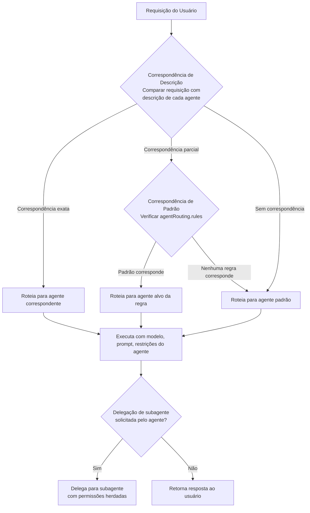
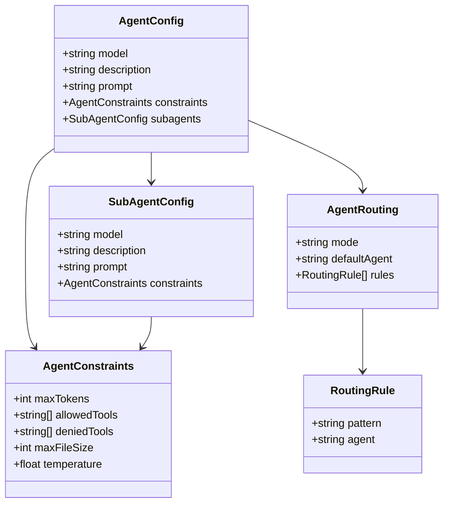

# Criando e Configurando Agentes Personalizados

## Configuração de Agentes no opencode.json

Agentes personalizados são definidos na seção `agents` do `opencode.json`. Cada entrada de agente especifica o modelo, comportamento e capacidades para aquele assistente.

```json
{
  "agents": {
    "default": {
      "model": "gpt-4o",
      "description": "Assistente de codificação de uso geral"
    },
    "reviewer": {
      "model": "claude-sonnet-4-20250514",
      "description": "Especialista em revisão de código",
      "prompt": "Você é um revisor de código sênior. Foco em segurança, desempenho e legibilidade."
    }
  }
}
```

> [!TIP]
> Use nomes e descrições de agentes descritivos — eles servem como o principal mecanismo de roteamento. Um agente bem nomeado como "security-auditor" com uma descrição clara é mais fácil de ser alvo tanto para humanos quanto para o sistema de roteamento.

---

## Fluxo de Decisão de Roteamento de Agentes

Entender como o OpenCode decide qual agente manipula uma requisição é fundamental para projetar configurações multi-agente eficazes.



> [!NOTE]
> O roteamento de agentes usa correspondência difusa de descrição por padrão. Se você precisa de controle preciso, use `agentRouting.rules` com padrões regex explícitos para garantir que requisições específicas vão para agentes específicos.

---

## Especificando Modelos

Cada agente pode usar um LLM diferente. O OpenCode suporta múltiplos provedores de modelo:

```json
{
  "agents": {
    "frontend": {
      "model": "gpt-4o",
      "description": "Agente de desenvolvimento frontend — React, CSS, TypeScript"
    },
    "backend": {
      "model": "claude-sonnet-4-20250514",
      "description": "Agente de arquitetura backend — APIs, bancos de dados, serviços"
    },
    "fast-prototype": {
      "model": "gpt-4o-mini",
      "description": "Prototipagem rápida — menor custo, respostas mais rápidas"
    }
  }
}
```

> [!TIP]
> Escolher o modelo certo é um trade-off entre capacidade, custo e velocidade. Use `gpt-4o-mini` ou modelos pequenos similares para tarefas rotineiras (linting, refatorações simples) e reserve modelos premium para raciocínio complexo (design de arquitetura, auditorias de segurança).

### Schema de Configuração de Agente



---

## Definindo Descrições de Agentes

Descrições ajudam o OpenCode a rotear tarefas para o agente correto. Elas atuam como metadados para seleção de agentes.

```json
{
  "agents": {
    "docs-writer": {
      "model": "gpt-4o",
      "description": "Especialista em escrever documentação, READMEs e referências de API"
    },
    "test-generator": {
      "model": "gpt-4o",
      "description": "Cria testes unitários, testes de integração e fixtures de teste"
    }
  }
}
```

> [!IMPORTANT]
> As descrições dos agentes não são apenas documentação — elas são usadas ativamente em tempo de execução para roteamento. Uma descrição vaga como "ajuda com codificação" pode fazer com que requisições sejam roteadas incorretamente. Seja específico: "Lida com design de schema de banco de dados e otimização SQL."

---

## Prompts de Agentes

Prompts definem a mensagem do sistema e as instruções comportamentais para um agente.

```json
{
  "agents": {
    "security-auditor": {
      "model": "claude-opus-4-20250514",
      "description": "Auditor de código focado em segurança",
      "prompt": "Você é um auditor de segurança. Identifique vulnerabilidades, sugira correções e explique riscos. Priorize questões OWASP Top 10. Sempre verifique: SQL injection, XSS, CSRF, desserialização insegura e dependências vulneráveis conhecidas."
    },
    "code-formatter": {
      "model": "gpt-4o-mini",
      "description": "Formata código de acordo com guias de estilo do projeto",
      "prompt": "Você formata código de acordo com o guia de estilo do projeto. Nunca mude a lógica — apenas espaçamento, indentação e regras de formatação. Execute o linter após formatar para verificar conformidade."
    }
  }
}
```

> [!WARNING]
> Prompts de agente são injetados na mensagem do sistema da chamada LLM. Injeção maliciosa de prompt em configurações compartilhadas poderia alterar o comportamento do agente. Sempre revise o conteúdo do prompt de fontes não confiáveis, especialmente quando o agente tem permissões amplas.

```typescript
// Agentes podem ser personalizados programaticamente via SDK do OpenCode
import { OpenCode } from "opencode";

const opencode = new OpenCode();

opencode.registerAgent({
  name: "security-auditor",
  model: "claude-opus-4-20250514",
  description: "Auditor de código focado em segurança",
  prompt: `Você é um auditor de segurança. Foco em OWASP Top 10.`,
  constraints: {
    allowedTools: ["read", "grep", "glob", "bash"],
    deniedTools: ["write", "edit"],
    temperature: 0.3
  }
});

await opencode.run();
```

---

## Tipos de Subagentes

Subagentes são agentes aninhados que lidam com subtarefas especializadas. Eles são invocados quando um agente primário delega trabalho.

```json
{
  "agents": {
    "default": {
      "model": "gpt-4o",
      "description": "Assistente principal de codificação — orquestra fluxos complexos",
      "subagents": {
        "customize-opencode": {
          "model": "gpt-4o",
          "description": "Lida com mudanças na configuração do OpenCode"
        },
        "deployment": {
          "model": "gpt-4o-mini",
          "description": "Gerencia pipelines de deploy e CI/CD",
          "prompt": "Você é um engenheiro de deploy. Sempre verifique o alvo do deploy antes de prosseguir."
        }
      }
    }
  }
}
```

> [!WARNING]
> Subagentes herdam o escopo de permissão do pai a menos que explicitamente sobrescrito. Sempre revise as permissões do subagente ao delegar operações sensíveis. Um subagente de escrita de código não deve ter acesso a ferramentas de deploy de produção a menos que especificamente intencionado.

---

## Roteamento de Agentes

O roteamento de agentes controla como as tarefas são despachadas para o agente apropriado. O OpenCode usa correspondência baseada em descrição para selecionar o melhor agente para uma determinada tarefa.

```json
{
  "agentRouting": {
    "mode": "auto",
    "defaultAgent": "default",
    "rules": [
      {
        "pattern": "segurança|vulnerabilidade|CVE|OWASP",
        "agent": "security-auditor"
      },
      {
        "pattern": "documentação|readme|docs api|wiki",
        "agent": "docs-writer"
      },
      {
        "pattern": "deploy|release|CI/CD|pipeline",
        "agent": "deployment"
      },
      {
        "pattern": "teste|teste unitário|teste integração|jest|pytest",
        "agent": "test-generator"
      }
    ]
  }
}
```

> [!IMPORTANT]
> As regras de roteamento são avaliadas em ordem. A primeira regra correspondente vence. Coloque regras mais específicas antes das gerais. Por exemplo, uma regra correspondendo a "deploy produção" deve vir antes de uma regra genérica "deploy".

---

## Restrições de Agentes

Restrições limitam o que um agente pode fazer, prevenindo uso indevido ou danos acidentais.

```json
{
  "agents": {
    "sandboxed": {
      "model": "gpt-4o-mini",
      "description": "Agente restrito para experimentação segura",
      "constraints": {
        "maxTokens": 4096,
        "allowedTools": ["read", "grep", "glob", "websearch"],
        "deniedTools": ["bash", "write", "edit"],
        "maxFileSize": 1048576,
        "temperature": 0.7
      }
    },
    "production-deployer": {
      "model": "gpt-4o",
      "description": "Agente de deploy de produção — requer aprovação",
      "constraints": {
        "allowedTools": ["bash", "read", "glob"],
        "temperature": 0.2,
        "maxTokens": 8192
      }
    }
  }
}
```

> [!TIP]
> Use restrições de `temperature` para controlar a criatividade do agente. Valores baixos (0.1–0.3) produzem saídas determinísticas e focadas, ideais para revisão de código e deploy. Valores mais altos (0.7–1.0) incentivam soluções criativas para brainstorming e design de arquitetura.

### Comparação: Opções de Configuração de Agentes

| Opção            | Tipo      | Obrigatório | Padrão         | Descrição                                   |
|------------------|-----------|:-----------:|----------------|---------------------------------------------|
| `model`          | string    | Sim         | —              | Identificador do modelo (ex.: `gpt-4o`)     |
| `description`    | string    | Sim         | —              | Descrição para roteamento de tarefas        |
| `prompt`         | string    | Não         | Prompt padrão  | Mensagem do sistema / instruções            |
| `subagents`      | object    | Não         | `{}`           | Agentes especializados aninhados            |
| `constraints`    | object    | Não         | `{}`           | Limites de recursos e uso de ferramentas    |
| `allowedTools`   | string[]  | Não         | Todas          | Whitelist de ferramentas permitidas         |
| `deniedTools`    | string[]  | Não         | `[]`           | Blacklist de ferramentas proibidas          |
| `maxTokens`      | integer   | Não         | Padrão modelo  | Contagem máxima de tokens de resposta       |
| `temperature`    | float     | Não         | Padrão modelo  | Aleatoriedade da resposta (0.0–2.0)        |
| `maxFileSize`    | integer   | Não         | 10MB           | Tamanho máximo de arquivo que o agente lê  |

> [!IMPORTANT]
> `allowedTools` e `deniedTools` são padrões mutuamente exclusivos. Se você especificar `allowedTools`, todas as outras ferramentas são implicitamente negadas. Se você especificar `deniedTools`, todas as ferramentas exceto as listadas são implicitamente permitidas. Não use ambos no mesmo bloco de restrições — o comportamento é indefinido.

---

## Perguntas de Prática

```question
{
  "id": "oc-02-q1",
  "type": "multiple-choice",
  "question": "Quais são os campos mínimos obrigatórios para definir um agente personalizado no `opencode.json`?",
  "options": [
    "model, description e prompt",
    "model e description",
    "name e version",
    "model e allowedTools"
  ],
  "correct": 1,
  "explanation": "Uma definição de agente requer no mínimo um `model` (qual LLM usar) e uma `description` (usada para roteamento). Todos os outros campos incluindo `prompt`, `constraints` e `subagents` são opcionais."
}
```

```question
{
  "id": "oc-02-q2",
  "type": "multiple-choice",
  "question": "Quando um usuário pergunta 'audite este código em busca de vulnerabilidades de segurança', qual campo o OpenCode usa para rotear a tarefa para o agente correto?",
  "options": [
    "O campo model para corresponder à capacidade",
    "O campo subagents para verificar aninhamento",
    "O campo description para correspondência baseada em padrão",
    "O campo constraints para verificar permissão"
  ],
  "correct": 2,
  "explanation": "O OpenCode compara a requisição do usuário com o campo `description` de cada agente e o campo `pattern` das regras de roteamento. Se um agente security-auditor tem 'segurança' ou 'vulnerabilidade' em sua descrição, ou uma regra de roteamento corresponde a esses termos, a requisição é roteada para lá."
}
```

```question
{
  "id": "oc-02-q3",
  "type": "multiple-choice",
  "question": "Um agente primário tem um subagente para tarefas de deploy. O subagente está configurado sem regras de permissão explícitas. O que acontece quando o subagente tenta executar um comando bash?",
  "options": [
    "O comando é negado porque subagentes não têm permissões padrão",
    "O agente primário é solicitado a aprovar cada comando manualmente",
    "O subagente herda o escopo de permissão do agente primário",
    "O subagente cria seu próprio escopo de permissão automaticamente"
  ],
  "correct": 2,
  "explanation": "Subagentes herdam o escopo de permissão do agente pai por padrão. Isso significa que se o agente primário tem permissão para executar comandos bash, o subagente também pode executá-los. Esta é uma consideração de segurança — sempre escope explicitamente as permissões do subagente para operações sensíveis."
}
```

```question
{
  "id": "oc-02-q4",
  "type": "multiple-choice",
  "question": "Um administrador quer criar um agente somente leitura que possa apenas pesquisar arquivos e navegar na web, sem executar comandos ou modificar arquivos. Qual configuração de restrição deve ser usada?",
  "options": [
    "maxTokens: 2048",
    "allowedTools: ['grep', 'glob', 'websearch']",
    "maxFileSize: 1048576",
    "subagents: {}"
  ],
  "correct": 1,
  "explanation": "Usar `allowedTools: ['grep', 'glob', 'websearch']` cria uma whitelist que permite apenas estas operações de leitura/web. Todas as outras ferramentas incluindo `bash`, `write` e `edit` são implicitamente negadas, tornando o agente efetivamente somente leitura."
}
```

```question
{
  "id": "oc-02-q5",
  "type": "multiple-choice",
  "question": "Uma equipe tem duas regras de roteamento: uma correspondendo 'deploy' para deploy-agent, e outra correspondendo 'deploy produção' para prod-deploy-agent. Um usuário digita 'fazer deploy para produção'. Qual agente lida com a requisição e por quê?",
  "options": [
    "deploy-agent, porque corresponde primeiro",
    "prod-deploy-agent, porque padrões mais específicos têm prioridade",
    "deploy-agent, porque 'deploy produção' aciona ambos mas 'deploy' vem primeiro",
    "O agente padrão, porque a consulta não corresponde exatamente a nenhuma regra"
  ],
  "correct": 0,
  "explanation": "As regras de roteamento são avaliadas em ordem. Se 'deploy' para deploy-agent é definida antes de 'deploy produção' para prod-deploy-agent, a primeira regra correspondente vence. A consulta 'fazer deploy para produção' contém 'deploy', então corresponde à primeira regra. A ordem importa — coloque regras mais específicas antes das gerais."
}
```

---

[!SUCCESS] **Principais Conclusões**

- Agentes personalizados são definidos em `opencode.json` com pelo menos `model` e `description`
- Prompts de agente servem como mensagens do sistema que definem instruções comportamentais
- Subagentes permitem delegação hierárquica de tarefas especializadas dentro de uma sessão de agente primário
- O roteamento de agentes usa correspondência baseada em descrição e padrões de regras para despachar tarefas automaticamente
- Restrições limitam capacidades do agente através de whitelists, blacklists, limites de recursos e temperatura
- O campo `prompt` é opcional mas essencial para guiar o comportamento do agente além do padrão
- Múltiplos agentes podem usar diferentes modelos de diferentes provedores na mesma configuração
- Regras de roteamento são avaliadas em ordem — coloque padrões específicos antes dos gerais
- Subagentes herdam permissões dos pais por padrão, exigindo revisão cuidadosa de segurança
- Restrições de temperatura controlam criatividade vs. determinismo nas respostas do agente
