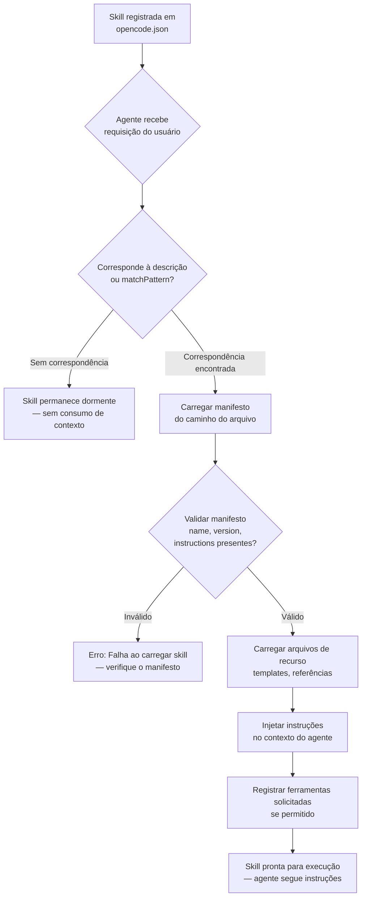
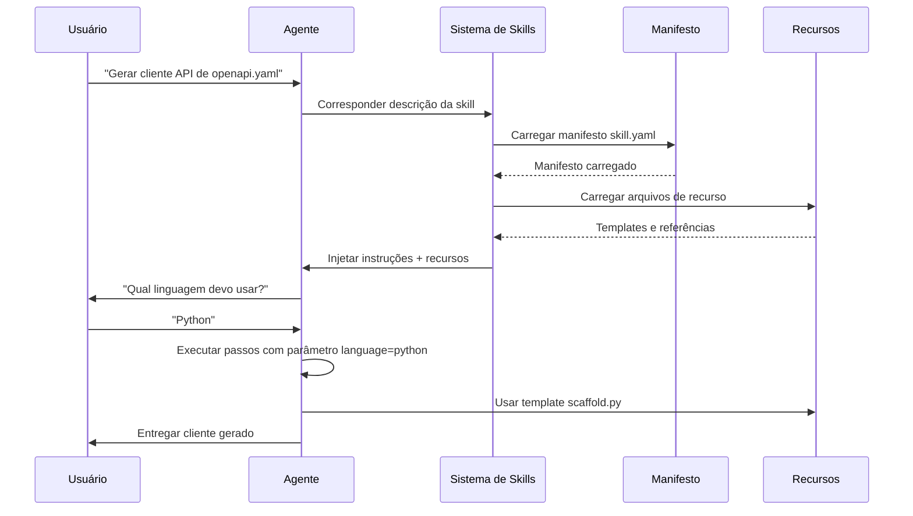

# Construindo e Registrando Skills Personalizadas

## Estrutura da Skill

Uma skill é um diretório contendo um arquivo de manifesto e recursos opcionais:

```
skills/
  minha-skill-personalizada/
    skill.yaml        # Manifesto (obrigatório)
    instructions.md   # Instruções estendidas (opcional)
    templates/        # Arquivos de recurso (opcional)
       scaffold.py
    references/       # Documentos de referência (opcional)
       api-guide.md
```

> [!NOTE]
> Embora `skill.yaml` seja o formato convencional, o OpenCode também suporta manifestos JSON (`skill.json`). YAML é recomendado para legibilidade, especialmente para longos blocos de instruções. JSON é preferível quando você precisa gerar manifestos programaticamente ou validá-los com JSON Schema.

---

## Ciclo de Vida de Carregamento de Skill

Entender como as skills são carregadas ajuda você a projetar skills eficientes que não desperdiçam janela de contexto.



> [!TIP]
> Skills com descrições excessivamente amplas podem ser carregadas não intencionalmente, consumindo janela de contexto e tokens. Mantenha descrições específicas e focadas. Use `matchPattern` para controle preciso sobre quando uma skill ativa.

---

## Manifesto da Skill

O manifesto define a identidade, propósito e componentes da skill.

```yaml
# skill.yaml
name: minha-skill-personalizada
description: Guia o agente na realização de geração personalizada de scaffolds
author: NUniversity
version: 1.0.0
instructions: |
  Quando o usuário pedir para gerar scaffold de um novo projeto Python:
  1. Use os arquivos de template no diretório `templates/`
  2. Pergunte ao usuário o nome do projeto e nome do pacote
  3. Gere a estrutura de diretórios com pyproject.toml, src/, tests/
  4. Inicialize um repositório git
tools:
  - bash
  - write
  - read
  - glob
resources:
  - templates/scaffold.py
  - references/api-guide.md
```

> [!IMPORTANT]
> O campo `instructions` é a parte mais crítica de uma skill. Ele é injetado diretamente no contexto do agente. Mantenha as instruções concisas e acionáveis — cada token consumido pela skill é um token não disponível para a conversação. Busque no máximo 500-1000 palavras por skill.

### Comparação: Formatos de Manifesto YAML vs JSON

| Aspecto            | YAML (`skill.yaml`)                | JSON (`skill.json`)                |
|--------------------|-------------------------------------|-------------------------------------|
| **Legibilidade**   | Excelente — natural para texto longo | Boa — familiar para devs JS/TS    |
| **Comentários**    | Suportados (`# comment`)            | Não suportados                     |
| **Multi-linha**    | Nativo (`|` e `>` block scalars)  | Escape `\n` ou use arrays         |
| **Validação schema**| Ferramentas limitadas              | JSON Schema, muitos validadores    |
| **Melhor para**    | Skills escritas manualmente        | Skills geradas ou validadas        |
| **Tamanho arquivo**| Tipicamente menor                  | Ligeiramente maior (aspas, vírgulas)|
| **Ferramentas**    | Linters YAML disponíveis           | JSON nativo na maioria dos editores|

---

## Escrevendo Instruções de Skill

Instruções são o núcleo de uma skill. Elas guiam o agente passo a passo.

```markdown
# instructions.md

## Objetivo
Gerar scaffold de um projeto Python pronto para produção.

## Passos
1. Pergunte ao usuário: nome do projeto, nome do pacote, versão Python
2. Crie diretório: `{nome_do_projeto}/`
3. Gere `pyproject.toml` com:
   - Metadados do projeto
   - Dependências (click, pytest, black)
   - Configuração do sistema de build
4. Crie `src/{nome_do_pacote}/__init__.py` com string de versão
5. Crie `tests/test_{nome_do_pacote}.py` com teste placeholder
6. Execute `git init` e `git add -A`

## Restrições
- Não sobrescreva arquivos existentes sem perguntar
- Use os padrões mais recentes de empacotamento Python (PEP 621)
```

```bash
# Instruções podem referenciar scripts bundled como recursos
# Exemplo: executando o template de scaffold
python skills/minha-skill-personalizada/templates/scaffold.py \
  --project-name "$NOME_DO_PROJETO" \
  --package-name "$NOME_DO_PACOTE"
```

---

## Ferramentas e Recursos de Skill

Skills podem declarar ferramentas necessárias e empacotar arquivos de recurso:

```json
{
  "name": "db-migration-skill",
  "description": "Geração e gerenciamento de migrações de banco de dados",
  "version": "2.1.0",
  "instructions": "Ao gerenciar migrações de banco de dados...",
  "tools": ["bash", "read", "write", "grep"],
  "resources": [
    "templates/migration_template.sql",
    "templates/rollback_template.sql",
    "config/migration.config.json"
  ],
  "parameters": {
    "db_type": {
      "type": "string",
      "description": "Tipo de banco (postgres, mysql, sqlite)",
      "required": true
    },
    "migration_name": {
      "type": "string",
      "description": "Nome descritivo para a migração",
      "required": true
    }
  }
}
```

> [!WARNING]
> Cada arquivo de recurso carregado no contexto consome tokens. Empacote apenas arquivos essenciais. Documentos de referência grandes devem ser vinculados em vez de incorporados. Um arquivo de referência de 100KB consome aproximadamente 25.000 tokens da janela de contexto.

---

## Parâmetros de Skill

Parâmetros permitem que skills sejam configuráveis e reutilizáveis:

```yaml
name: api-client-generator
description: Gera bibliotecas de cliente API a partir de especificações OpenAPI
version: 1.0.0
instructions: |
  Gere um cliente API baseado na especificação OpenAPI fornecida.
  Use o parâmetro language para determinar o formato de saída.
parameters:
  language:
    type: string
    description: "Linguagem alvo (python, typescript, go)"
    required: true
    default: python
  spec_path:
    type: string
    description: "Caminho para o arquivo de especificação OpenAPI"
    required: true
  output_dir:
    type: string
    description: "Diretório de saída para o cliente gerado"
    required: false
    default: "./generated"
```

> [!TIP]
> Use `required: false` com um valor `default` sensato para parâmetros que têm padrões óbvios. Isso reduz o atrito ao usar a skill enquanto ainda permite personalização. Parâmetros são passados quando a skill é invocada através de instruções do agente.

### Fluxo de Execução da Skill



---

## Registrando Skills no Config

Skills devem ser registradas no `opencode.json` para serem descobertas:

```json
{
  "skills": {
    "scaffold-python": {
      "manifest": "skills/scaffold-python/skill.yaml"
    },
    "db-migration": {
      "manifest": "skills/db-migration/skill.json"
    },
    "api-client-gen": {
      "manifest": "skills/api-client-generator/skill.yaml"
    }
  }
}
```

```typescript
// Skills podem ser registradas programaticamente
import { OpenCode } from "opencode";

const opencode = new OpenCode();

opencode.registerSkill({
  name: "react-component",
  manifest: "skills/react-component/skill.yaml",
  autoLoad: true,
  matchPattern: "react component|jsx|tsx"
});

await opencode.run();
```

---

## Descoberta de Skills

O OpenCode descobre skills através de registro e correspondência de padrões. Quando uma consulta do usuário corresponde à descrição de uma skill, a skill é carregada automaticamente.

> [!WARNING]
> Skills com descrições excessivamente amplas podem ser carregadas não intencionalmente, consumindo janela de contexto e tokens. Mantenha descrições específicas e focadas. Uma skill descrita como "ajuda com desenvolvimento" corresponderá a quase todas as requisições.

```json
{
  "skills": {
    "react-component": {
      "manifest": "skills/react-component/skill.yaml",
      "autoLoad": true,
      "matchPattern": "react component|jsx|tsx component|react hook"
    }
  }
}
```

> [!TIP]
> O campo `autoLoad` combinado com `matchPattern` dá a você controle preciso. Sem `autoLoad`, a skill só é carregada quando explicitamente solicitada. Isso é útil para skills de nicho que não devem ativar em toda consulta vagamente relacionada. Use `autoLoad: false` para skills raramente usadas para economizar contexto.

---

### Comparação: Campos do Manifesto de Skill

| Campo           | Tipo    | Obrigatório | Descrição                                   |
|-----------------|---------|:-----------:|---------------------------------------------|
| `name`          | string  | Sim         | Identificador único da skill                |
| `description`   | string  | Sim         | Descrição curta para correspondência        |
| `version`       | string  | Sim         | Versão semântica (ex.: `1.0.0`)             |
| `instructions`  | string  | Sim         | Guia passo a passo para o agente            |
| `tools`         | string[]| Não         | Lista de ferramentas necessárias            |
| `resources`     | string[]| Não         | Caminhos de arquivos relativos ao diretório |
| `parameters`    | object  | Não         | Parâmetros configuráveis com defaults       |
| `author`        | string  | Não         | Nome do criador para atribuição             |
| `matchPattern`  | string  | Não         | Padrão regex para ativação automática       |
| `autoLoad`      | boolean | Não         | Se a skill ativa na correspondência         |

> [!NOTE]
> Uma skill pode ter tanto `instructions` inline no manifesto quanto um arquivo externo `instructions.md`. Se ambos existirem, o arquivo externo tem precedência. Use instruções inline para skills curtas e arquivos externos para procedimentos complexos de múltiplos passos.

---

## Perguntas de Prática

```question
{
  "id": "oc-03-q1",
  "type": "multiple-choice",
  "question": "Um desenvolvedor quer criar a menor skill personalizada possível. Qual é o requisito mínimo?",
  "options": [
    "Um diretório com skill.yaml e instructions.md",
    "Um único arquivo skill.yaml com pelo menos name, description, version e instructions",
    "Um diretório contendo skill.yaml, templates/ e references/",
    "Uma entrada JSON no opencode.json sem arquivos separados"
  ],
  "correct": 1,
  "explanation": "O requisito mínimo para uma skill é um único arquivo de manifesto YAML (`skill.yaml`) contendo no mínimo: `name`, `description`, `version` e `instructions`. Todos os outros componentes (arquivos de instruções externos, recursos, parâmetros) são extensões opcionais."
}
```

```question
{
  "id": "oc-03-q2",
  "type": "multiple-choice",
  "question": "Como os parâmetros de skill diferem das ferramentas de skill em um manifesto?",
  "options": [
    "Parâmetros definem a versão da skill, enquanto ferramentas definem seu nome",
    "Parâmetros tornam skills reutilizáveis com entradas configuráveis, enquanto ferramentas declaram capacidades necessárias",
    "Parâmetros são campos obrigatórios, enquanto ferramentas são opcionais",
    "Parâmetros são escritos em YAML, enquanto ferramentas devem estar em JSON"
  ],
  "correct": 1,
  "explanation": "Parâmetros tornam as skills reutilizáveis aceitando entradas configuráveis (como seleção de linguagem ou caminhos de saída). Ferramentas declaram quais capacidades (bash, read, write) a skill requer que o agente tenha. Parâmetros personalizam o comportamento; ferramentas garantem que o agente pode executar os passos."
}
```

```question
{
  "id": "oc-03-q3",
  "type": "multiple-choice",
  "question": "Ao registrar uma skill no opencode.json, quais dois campos opcionais controlam se a skill carrega automaticamente quando uma consulta do usuário corresponde?",
  "options": [
    "manifest e name",
    "autoLoad e matchPattern",
    "version e author",
    "resources e parameters"
  ],
  "correct": 1,
  "explanation": "O campo `autoLoad` (booleano) determina se a skill ativa automaticamente na correspondência de padrão, e `matchPattern` (string regex) define os padrões de consulta que acionam o carregamento. Sem `autoLoad: true`, a skill só carrega quando explicitamente solicitada."
}
```

```question
{
  "id": "oc-03-q4",
  "type": "multiple-choice",
  "question": "A descrição de uma skill é 'lida com várias tarefas de desenvolvimento.' Por que isso é problemático?",
  "options": [
    "A descrição é muito longa e será truncada",
    "Pode fazer a skill carregar para consultas não relacionadas, desperdiçando tokens de contexto",
    "A descrição não tem formatação de emoji",
    "Não inclui informação de versão"
  ],
  "correct": 1,
  "explanation": "Uma descrição vaga como 'lida com várias tarefas de desenvolvimento' corresponderia a quase qualquer consulta relacionada a desenvolvimento, fazendo a skill carregar e consumir tokens da janela de contexto mesmo quando a tarefa não tem nada a ver com o propósito real da skill. Descrições devem ser específicas e de escopo estreito."
}
```

```question
{
  "id": "oc-03-q5",
  "type": "multiple-choice",
  "question": "Uma skill empacota um PDF de referência de API de 500KB como recurso. Qual é a provável consequência quando esta skill carrega?",
  "options": [
    "O PDF é ignorado porque skills só suportam arquivos de texto",
    "A skill carrega mais rápido porque PDFs são otimizados para contexto",
    "Pode consumir tokens excessivos da janela de contexto, potencialmente excedendo limites ou sufocando a conversação",
    "A skill automaticamente comprime o PDF para economizar tokens"
  ],
  "correct": 2,
  "explanation": "Arquivos de recurso empacotados com uma skill são carregados no contexto do agente. Um PDF de 500KB consumiria um número enorme de tokens (aproximadamente 125.000 tokens), provavelmente excedendo limites de contexto ou não deixando espaço para a conversação real. Apenas empacote arquivos de referência pequenos e essenciais com skills."
}
```

---

[!SUCCESS] **Principais Conclusões**

- Uma skill é um diretório com um arquivo de manifesto (YAML ou JSON) e arquivos de recurso opcionais
- O manifesto define name, description, version, instructions, tools, resources e parameters
- Instruções fornecem guia passo a passo que direciona o comportamento do agente durante uma tarefa
- Skills são registradas no `opencode.json` sob a chave `skills` com um caminho para o manifesto
- Parâmetros tornam skills reutilizáveis em diferentes contextos com entradas configuráveis
- Recursos empacotam arquivos de referência, templates e scripts junto com a skill
- A descoberta de skills usa correspondência de descrição e campos opcionais `matchPattern`
- Descrições excessivamente amplas fazem skills carregarem desnecessariamente, consumindo tokens de contexto
- YAML é recomendado para skills escritas à mão; JSON é melhor para skills geradas automaticamente
- O ciclo de vida de carregamento de skill vai: registro, correspondência, validação do manifesto, carregamento de recursos, injeção de instruções
