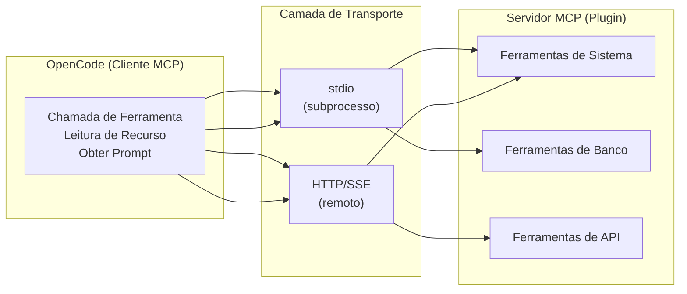
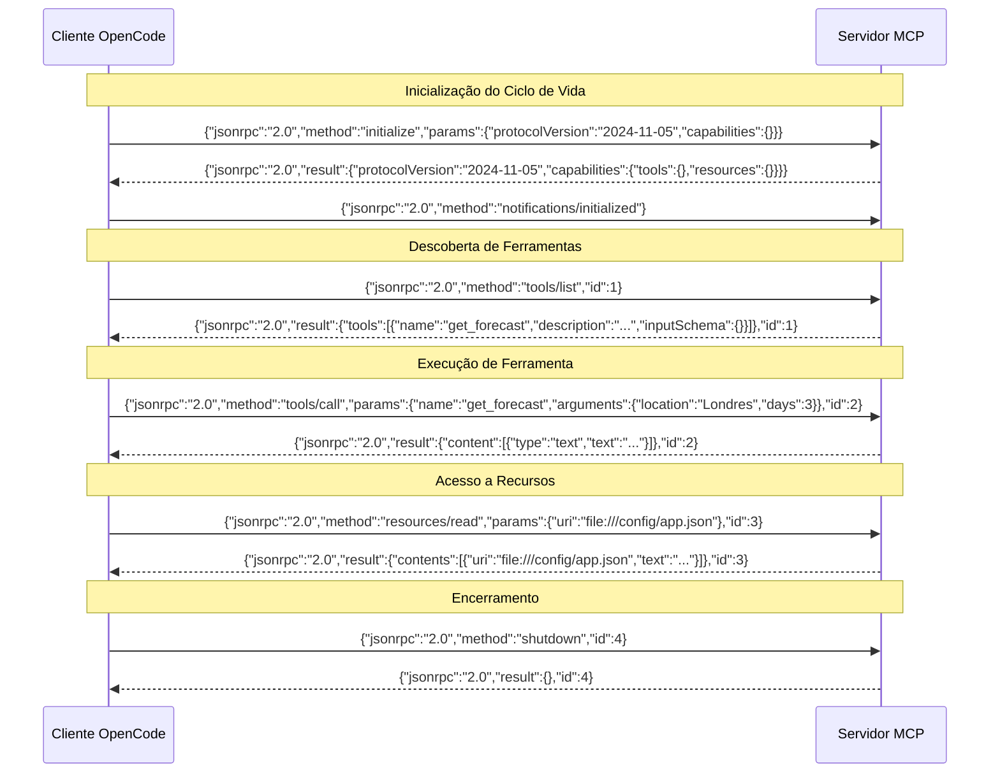
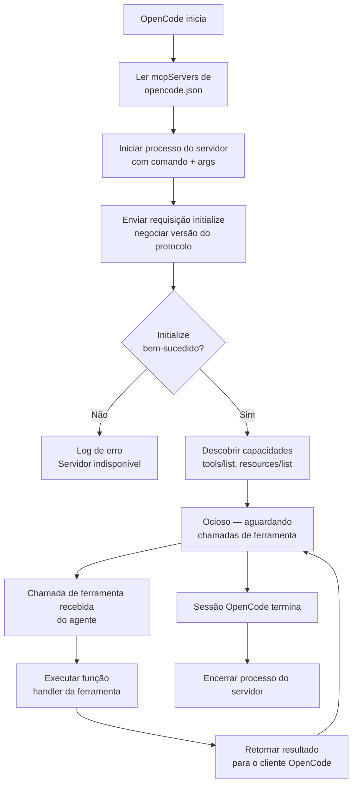

# Servidores MCP, Plugins e Integração de Ferramentas Externas

## O que é MCP?

O Model Context Protocol (MCP) é um padrão aberto que define como aplicações LLM se comunicam com ferramentas externas e fontes de dados. Ele usa JSON-RPC 2.0 como seu protocolo de transporte.

> [!NOTE]
> MCP foi projetado especificamente para padrões de interação LLM-ferramenta. Diferente de APIs REST que são projetadas para humanos e operações CRUD, MCP usa um protocolo JSON-RPC bidirecional que suporta descoberta de ferramentas, acesso a recursos e templates de prompt — primitivas que LLMs entendem naturalmente.



---

## Troca de Protocolo JSON-RPC MCP

Cada interação entre OpenCode e um servidor MCP segue uma conversa JSON-RPC 2.0 estruturada. Entender este protocolo é essencial para depurar e construir servidores MCP personalizados.



> [!TIP]
> Ao depurar problemas MCP, ative o logging verbose para ver as mensagens JSON-RPC brutas. Isso é inestimável para identificar schemas de ferramentas malformados, formatos de resposta incorretos ou falhas de autenticação.

### Ciclo de Vida do Servidor MCP



---

## Configuração do Servidor MCP

Servidores MCP são configurados na seção `mcpServers` do `opencode.json`:

```json
{
  "mcpServers": {
    "filesystem": {
      "command": "npx",
      "args": [
        "-y",
        "@modelcontextprotocol/server-filesystem",
        "/home/usuario/projetos"
      ],
      "env": {
        "NODE_ENV": "production"
      }
    },
    "github": {
      "command": "node",
      "args": ["mcp-github-server.js"],
      "env": {
        "GITHUB_TOKEN": "${GITHUB_TOKEN}"
      }
    },
    "database": {
      "command": "python",
      "args": ["mcp-db-server.py"],
      "env": {
        "DATABASE_URL": "${DATABASE_URL}"
      }
    }
  }
}
```

> [!WARNING]
> Servidores MCP têm acesso total às variáveis de ambiente com as quais são configurados. Nunca hardcode secrets no `opencode.json` — sempre use interpolação de variáveis de ambiente (`${VAR_NAME}`). O bloco env é passado diretamente para o processo iniciado, e qualquer ferramenta executando naquele processo pode ler esses valores.

---

## Conectando APIs Externas via MCP

Servidores MCP encapsulam APIs externas em interfaces de ferramentas que LLMs podem chamar:

```json
{
  "mcpServers": {
    "slack": {
      "command": "python",
      "args": ["mcp-slack-server.py"],
      "env": {
        "SLACK_BOT_TOKEN": "${SLACK_BOT_TOKEN}",
        "SLACK_SIGNING_SECRET": "${SLACK_SIGNING_SECRET}"
      }
    }
  }
}
```

```python
# mcp-slack-server.py
# Servidor MCP que encapsula a API Slack em ferramentas chamáveis
import os
import httpx
from mcp import Server

server = Server("slack")

@server.tool()
async def send_message(channel: str, text: str) -> str:
    """Envia uma mensagem para um canal do Slack"""
    async with httpx.AsyncClient() as client:
        resp = await client.post(
            f"https://slack.com/api/chat.postMessage",
            headers={
                "Authorization": f"Bearer {os.environ['SLACK_BOT_TOKEN']}",
                "Content-Type": "application/json"
            },
            json={"channel": channel, "text": text}
        )
        data = resp.json()
        if not data.get("ok"):
            raise Exception(f"Erro API Slack: {data.get('error')}")
        return data["message"]["text"]

@server.tool()
async def list_channels(limit: int = 20) -> list:
    """Lista canais públicos no workspace"""
    async with httpx.AsyncClient() as client:
        resp = await client.get(
            "https://slack.com/api/conversations.list",
            headers={"Authorization": f"Bearer {os.environ['SLACK_BOT_TOKEN']}"},
            params={"limit": limit}
        )
        return resp.json()["channels"]

server.run()
```

---

## Escrevendo Implementações de Servidor MCP

Um servidor MCP expõe três primitivas:

- **Tools**: Funções chamáveis que o LLM pode invocar
- **Resources**: Dados somente leitura que o LLM pode acessar
- **Prompts**: Templates de prompt pré-escritos

### Servidor MCP em TypeScript

```typescript
// mcp-weather-server.ts
import { Server } from "@modelcontextprotocol/sdk/server/index.js";
import { StdioServerTransport } from "@modelcontextprotocol/sdk/server/stdio.js";

const server = new Server(
  { name: "weather-server", version: "1.0.0" },
  { capabilities: { tools: {}, resources: {} } }
);

// Define uma ferramenta com validação de entrada JSON Schema
server.setRequestHandler("tools/list", async () => ({
  tools: [{
    name: "get_forecast",
    description: "Obter previsão do tempo para uma localização",
    inputSchema: {
      type: "object",
      properties: {
        location: {
          type: "string",
          description: "Nome da cidade ou coordenadas"
        },
        days: {
          type: "number",
          description: "Número de dias de previsão",
          default: 3
        }
      },
      required: ["location"]
    }
  }]
}));

// Lida com execução de ferramenta com tratamento de erro
server.setRequestHandler("tools/call", async (request) => {
  const { name, arguments: args } = request.params;

  if (name === "get_forecast") {
    try {
      const data = await fetchWeather(args.location, args.days);
      return {
        content: [{ type: "text", text: JSON.stringify(data, null, 2) }]
      };
    } catch (error) {
      return {
        content: [{
          type: "text",
          text: `Erro ao buscar previsão: ${error.message}`
        }],
        isError: true
      };
    }
  }

  throw new Error(`Ferramenta desconhecida: ${name}`);
});

const transport = new StdioServerTransport();
await server.connect(transport);
```

### Servidor MCP em Python

```python
# mcp-weather-server.py
# Servidor MCP equivalente em Python
import json
import httpx
from mcp import Server, StdioServerTransport

server = Server("weather-server")

@server.list_tools()
async def list_tools():
    return [
        {
            "name": "get_forecast",
            "description": "Obter previsão do tempo para uma localização",
            "inputSchema": {
                "type": "object",
                "properties": {
                    "location": {"type": "string", "description": "Nome da cidade"},
                    "days": {"type": "number", "description": "Dias de previsão", "default": 3}
                },
                "required": ["location"]
            }
        }
    ]

@server.call_tool()
async def call_tool(name: str, arguments: dict):
    if name == "get_forecast":
        async with httpx.AsyncClient() as client:
            resp = await client.get(
                f"https://api.weather.gov/points/{arguments['location']}/forecast"
            )
            data = resp.json()
        return {"content": [{"type": "text", "text": json.dumps(data, indent=2)}]}

async def main():
    transport = StdioServerTransport()
    await server.connect(transport)

if __name__ == "__main__":
    import asyncio
    asyncio.run(main())
```

> [!IMPORTANT]
> Schemas de ferramenta definem o contrato entre o LLM e seu servidor. Sempre inclua campos `description` claros para cada parâmetro — o LLM usa estas descrições para determinar como preencher argumentos. Um parâmetro mal descrito resultará no LLM passando valores incorretos.

---

## Arquitetura de Plugin

Servidores MCP servem como o sistema de plugins para OpenCode. Qualquer capacidade externa pode ser encapsulada como um servidor MCP.

### Comparação: Mecanismos de Transporte

| Aspecto             | stdio (subprocesso)                 | HTTP/SSE (remoto)                    |
|---------------------|--------------------------------------|--------------------------------------|
| **Processo**        | Iniciado pelo OpenCode              | Executa independentemente           |
| **Latência**        | Baixa (IPC local)                   | Mais alta (I/O de rede)             |
| **Segurança**       | Isolamento de processo, local       | Requer auth de rede, TLS             |
| **Deploy**          | Empacotado com o projeto            | Serviço ou contêiner em execução    |
| **Ciclo de vida**   | Vinculado à sessão OpenCode         | Daemon independente                 |
| **Caso de uso**     | Ferramentas locais (fs, git)        | APIs remotas (Slack, GitHub, DB)    |
| **Depuração**       | Verificar logs do servidor          | Verificar endpoints + rede          |
| **Escalabilidade**  | Um por sessão                       | Múltiplos clientes                  |

| Componente     | Função                                      |
|----------------|---------------------------------------------|
| OpenCode       | Cliente MCP — inicia requisições            |
| Servidor MCP   | Plugin — processa requisições e retorna     |
| Transporte     | stdin/stdout ou HTTP/SSE                    |
| Protocolo      | JSON-RPC 2.0                                |

> [!TIP]
> Use transporte stdio para ferramentas de desenvolvimento local que precisam de baixa latência (acesso a sistema de arquivos, análise de código). Use HTTP/SSE para serviços compartilhados que múltiplos membros da equipe precisam acessar (bancos de dados compartilhados, APIs de equipe). Servidores HTTP podem ser implantados em contêineres Docker para ambientes consistentes.

---

## Escopos de Permissão de Ferramentas

Cada ferramenta MCP pode ter escopos de permissão definidos na configuração:

```json
{
  "permissions": [
    {
      "mcpServer": "filesystem",
      "tools": ["read", "write"],
      "allow": ["/home/usuario/projetos/*"],
      "deny": ["/etc/**", "/home/usuario/.ssh/**"]
    },
    {
      "mcpServer": "github",
      "tools": ["create_pr", "list_repos"],
      "allow": ["*"],
      "requireApproval": true
    }
  ]
}
```

```bash
# Testar conectividade do servidor MCP a partir da linha de comando
echo '{"jsonrpc":"2.0","method":"tools/list","id":1}' | \
  node mcp-weather-server.js

# Saída esperada: resposta JSON-RPC com definições de ferramentas
# ... | jq '.result.tools[].name'
```

> [!WARNING]
> Ao configurar permissões para um servidor MCP, lembre-se de que o servidor executa como um processo separado. Mesmo que o sistema de permissões do OpenCode bloqueie uma chamada de ferramenta, o processo do servidor em si ainda está em execução. Para servidores sensíveis, implemente autenticação dentro do servidor como uma medida de defesa em profundidade.

---

## Perguntas de Prática

```question
{
  "id": "oc-04-q1",
  "type": "multiple-choice",
  "question": "Um servidor MCP precisa se comunicar com o cliente OpenCode. Qual protocolo de transporte eles usam?",
  "options": [
    "HTTP/1.1 com endpoints RESTful",
    "gRPC com Protocol Buffers",
    "JSON-RPC 2.0",
    "WebSocket com quadros binários"
  ],
  "correct": 2,
  "explanation": "MCP usa JSON-RPC 2.0 como seu protocolo de transporte para toda comunicação. Isso inclui inicialização, listagem de ferramentas, chamadas de ferramenta, leituras de recurso e encerramento. O formato JSON-RPC é simples, independente de linguagem e mapeia naturalmente para padrões de chamada de ferramenta de LLM."
}
```

```question
{
  "id": "oc-04-q2",
  "type": "multiple-choice",
  "question": "Um desenvolvedor está construindo um servidor MCP para uma API de clima. Quais três primitivas o servidor deve expor ao cliente OpenCode?",
  "options": [
    "Endpoints, middleware e rotas",
    "Ferramentas, recursos e prompts",
    "Modelos, vetores e embeddings",
    "Handlers GET, POST e DELETE"
  ],
  "correct": 1,
  "explanation": "Servidores MCP expõem três primitivas: Ferramentas (funções chamáveis que realizam ações), Recursos (dados somente leitura que o LLM pode acessar) e Prompts (templates de prompt pré-escritos). Estas primitivas são projetadas especificamente para padrões de interação LLM."
}
```

```question
{
  "id": "oc-04-q3",
  "type": "multiple-choice",
  "question": "Uma equipe precisa conectar seu banco de dados PostgreSQL ao OpenCode usando um servidor MCP. O script do servidor é mcp-db-server.py e usa DATABASE_URL. Como isso deve ser configurado?",
  "options": [
    "Armazenar a URL do banco diretamente no campo command",
    "Definir DATABASE_URL usando interpolação de variável de ambiente na seção env",
    "Hardcode as credenciais no skill.yaml",
    "Passar a URL do banco como uma flag de linha de comando"
  ],
  "correct": 1,
  "explanation": "A abordagem correta é usar interpolação de variável de ambiente na seção `env` da configuração do servidor MCP: `\"DATABASE_URL\": \"${DATABASE_URL}\"`. Isso mantém segredos fora dos arquivos de configuração e permite que diferentes ambientes usem credenciais diferentes."
}
```

```question
{
  "id": "oc-04-q4",
  "type": "multiple-choice",
  "question": "Qual é a diferença chave entre executar um servidor MCP via stdin/stdout versus HTTP/SSE?",
  "options": [
    "stdin/stdout é mais lento mas mais seguro",
    "stdin/stdout usa um subprocesso iniciado pelo OpenCode, enquanto HTTP/SSE permite comunicação remota com servidores",
    "HTTP/SSE só funciona com servidores JavaScript",
    "stdin/stdout requer uma conexão de banco de dados"
  ],
  "correct": 1,
  "explanation": "O transporte stdin/stdout inicia o servidor MCP como um subprocesso do OpenCode, tornando-o ideal para ferramentas locais. HTTP/SSE executa o servidor independentemente, permitindo implantações remotas/baseadas em servidor. A escolha depende se você precisa de acesso local de baixa latência ou acesso remoto compartilhado."
}
```

```question
{
  "id": "oc-04-q5",
  "type": "multiple-choice",
  "question": "Uma ferramenta de servidor MCP tem um parâmetro sem campo de descrição em seu inputSchema. Qual é a provável consequência?",
  "options": [
    "O LLM se recusará a chamar a ferramenta",
    "O LLM pode passar valores incorretos ou ausentes para aquele parâmetro",
    "O parâmetro se torna opcional automaticamente",
    "O servidor MCP falhará ao iniciar"
  ],
  "correct": 1,
  "explanation": "LLMs dependem de descrições de parâmetros para entender quais valores passar. Sem uma descrição, o LLM não tem contexto sobre o que o parâmetro espera e pode adivinhar incorretamente ou omiti-lo. Sempre forneça descrições claras para cada parâmetro em seus schemas de ferramenta."
}
```

---

[!SUCCESS] **Principais Conclusões**

- MCP é um padrão aberto usando JSON-RPC 2.0 para comunicação LLM-ferramenta
- Servidores MCP expõem ferramentas (chamáveis), recursos (dados legíveis) e prompts (templates)
- Servidores são configurados em `opencode.json` sob `mcpServers` com comando, args e env
- APIs externas (Slack, GitHub, bancos de dados) são encapsuladas como ferramentas MCP
- Servidores MCP podem usar stdio ou HTTP/SSE como mecanismos de transporte
- Escopos de permissão controlam quais ferramentas e caminhos cada servidor MCP pode acessar
- Interpolação de variáveis de ambiente (`${VAR_NAME}`) previne vazamento de segredos
- A troca de protocolo JSON-RPC segue um ciclo de vida estruturado: inicializar, descobrir, executar, encerrar
- Schemas de ferramenta devem ter parâmetros bem descritos para o LLM usá-los corretamente
- Servidores MCP podem ser implementados em qualquer linguagem (TypeScript, Python, Go, etc.)
