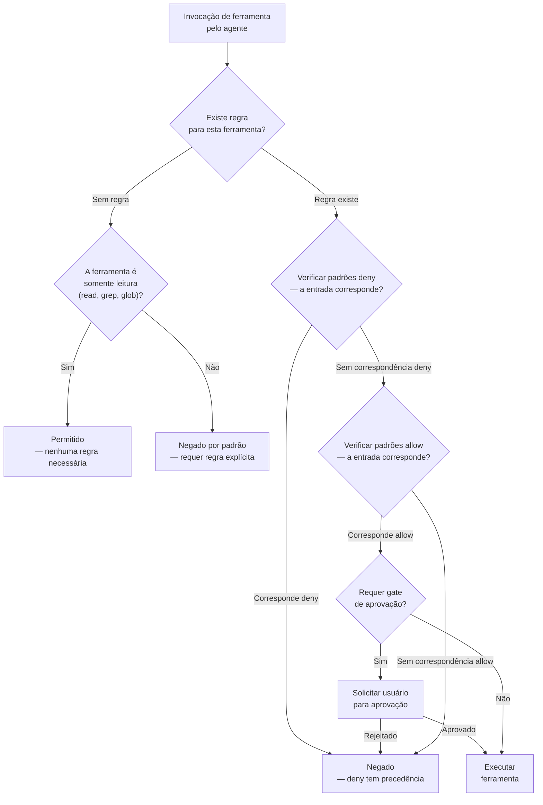
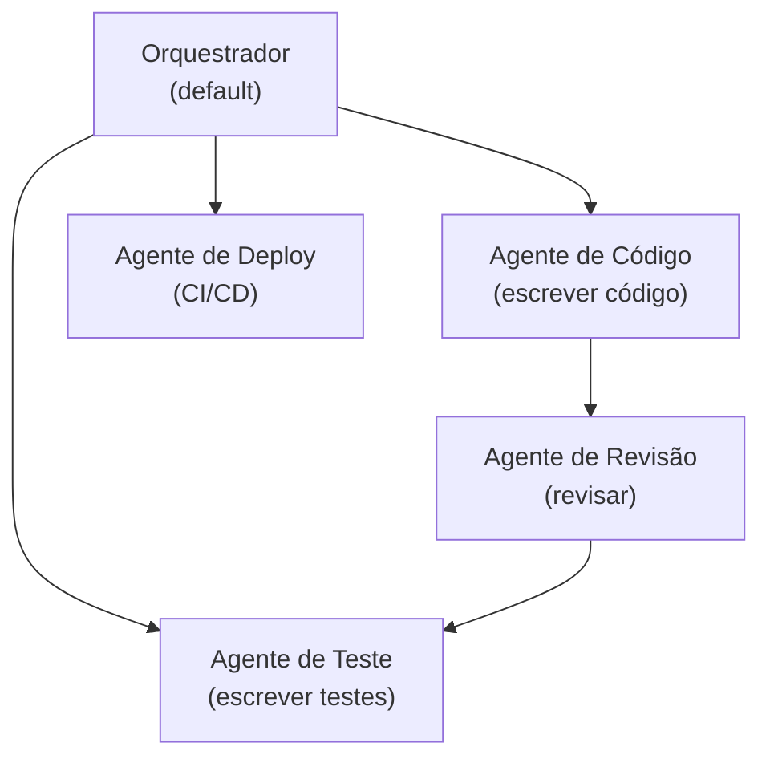
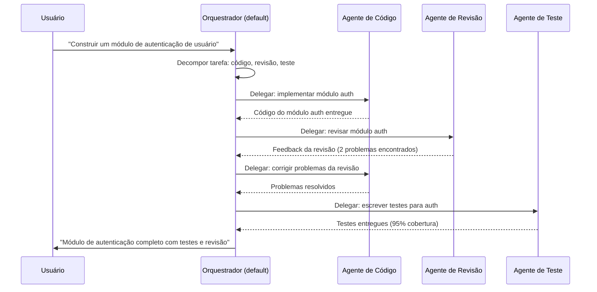

# Permissões, Regras de Segurança e Colaboração Multi-Agente

## Regras de Permissão no opencode.json

Permissões definem quais ações os agentes podem realizar. Elas são estruturadas como regras allow/deny aplicadas a ferramentas específicas ou servidores MCP.

```json
{
  "permissions": [
    {
      "tool": "bash",
      "allow": ["npm *", "git *", "pip *", "cargo *"],
      "deny": ["rm -rf *", "sudo *", "chmod *", "> *", "| *"]
    },
    {
      "tool": "write",
      "allow": ["src/**", "docs/**", "tests/**"],
      "deny": [".env", "*.key", "node_modules/**"]
    }
  ]
}
```

> [!IMPORTANT]
> As regras de permissão são avaliadas em tempo de execução para cada invocação de ferramenta. Regras deny são verificadas primeiro — se um comando corresponder a qualquer padrão deny, ele é rejeitado imediatamente independentemente de também corresponder a um padrão allow. Este design à prova de falhas previne desvios acidentais.

### Lógica de Avaliação de Permissão

Entender a ordem exata de avaliação é crítico para escrever regras de permissão seguras.



> [!NOTE]
> O comportamento padrão para ferramentas sem regras de permissão depende do tipo de ferramenta. Ferramentas somente leitura (read, grep, glob) são permitidas por padrão. Ferramentas de escrita e execução (bash, write, edit, task) são negadas por padrão a menos que explicitamente permitidas.

---

## Padrões Allow/Deny

Padrões suportam curingas no estilo glob para correspondência flexível de regras:

| Padrão           | Corresponde a                              | Exemplo de Correspondência  |
|------------------|--------------------------------------------|-----------------------------|
| `src/**`         | Todos arquivos sob `src/`                  | `src/components/button.tsx` |
| `*.env`          | Qualquer arquivo `.env` em qualquer nível  | `/project/.env`             |
| `**/secrets/*`   | Qualquer arquivo dentro de `secrets/`      | `config/secrets/keys.json`  |
| `npm *`          | Qualquer comando começando com `npm`       | `npm install express`       |
| `git *`          | Qualquer comando começando com `git`       | `git push origin main`      |
| `rm -rf *`       | Exclusão recursiva forçada                 | `rm -rf node_modules`       |

> [!WARNING]
> Padrões glob são sensíveis a maiúsculas/minúsculas no Linux e insensíveis no macOS por padrão. Cuidado com extensões de arquivo — `*.KEY` NÃO corresponde a `secret.key` no Linux. Use padrões em minúsculas para compatibilidade entre plataformas.

---

## Controle de Acesso a Ferramentas

Cada ferramenta pode ter regras de acesso granulares:

```json
{
  "permissions": [
    {
      "tool": "read",
      "allow": ["*"],
      "description": "Leitura é permitida em qualquer lugar"
    },
    {
      "tool": "edit",
      "allow": ["src/**/*.ts", "src/**/*.tsx"],
      "deny": ["src/generated/**"],
      "requireApproval": true
    },
    {
      "tool": "bash",
      "deny": ["curl *", "wget *", "ssh *"],
      "requireApproval": "always"
    }
  ]
}
```

> [!TIP]
> Use `requireApproval: true` para operações destrutivas ou sensíveis. Isso cria um gate humano-no-loop que previne que agentes automatizados realizem ações irreversíveis como deploys, exclusão de dados ou mudanças de configuração sem confirmação explícita do usuário.

---

## Restrições de Caminho de Arquivo

Restrições de caminho limitam quais arquivos os agentes podem acessar:

```json
{
  "permissions": [
    {
      "tool": "bash",
      "allow": [
        "/home/usuario/projetos/*",
        "/tmp/*"
      ],
      "deny": [
        "/etc/**",
        "/home/usuario/.ssh/**",
        "/home/usuario/projetos/repo-secreto/**"
      ]
    }
  ]
}
```

> [!WARNING]
> Restrições de caminho de arquivo só se aplicam quando a ferramenta é invocada através do registro de ferramentas do OpenCode. Acesso direto ao shell desvia estas restrições — sempre combine com regras allow/deny de comando bash. Um agente com permissão para executar `bash` mas sem restrições de caminho poderia acessar qualquer arquivo executando comandos shell diretamente.

---

## Fluxos de Trabalho Multi-Agente

Fluxos de trabalho multi-agente permitem decomposição complexa de tarefas:



> [!TIP]
> Em fluxos de trabalho multi-agente, comece com um padrão simples de orquestrador mais especialistas. Cada especialista deve ter uma descrição de escopo estreito e permissões restritas. O orquestrador decompõe requisições de alto nível em subtarefas e delega para o especialista apropriado.

```json
{
  "agents": {
    "default": {
      "model": "gpt-4o",
      "description": "Orquestrador — decompõe tarefas e delega para especialistas"
    },
    "code-agent": {
      "model": "gpt-4o",
      "description": "Implementa código de funcionalidades seguindo padrões do projeto",
      "constraints": {
        "allowedTools": ["read", "write", "edit", "glob", "bash"]
      }
    },
    "review-agent": {
      "model": "claude-sonnet-4-20250514",
      "description": "Revisa código por segurança, desempenho e estilo",
      "constraints": {
        "allowedTools": ["read", "grep", "glob"],
        "deniedTools": ["write", "edit", "bash"]
      }
    },
    "test-agent": {
      "model": "gpt-4o",
      "description": "Escreve testes unitários e de integração",
      "constraints": {
        "maxTokens": 4096
      }
    },
    "deploy-agent": {
      "model": "gpt-4o-mini",
      "description": "Gerencia pipelines de deploy com gates de aprovação",
      "constraints": {
        "allowedTools": ["bash", "read", "glob"]
      }
    }
  }
}
```

---

## Delegação Agente-a-Agente

Agentes podem delegar subtarefas a outros agentes. A delegação respeita as permissões e restrições do agente alvo.

> [!IMPORTANT]
> Quando um orquestrador delega para um especialista, o especialista opera sob seu próprio escopo de permissão. Isto significa que um especialista pode ter restrições mais rigorosas que o orquestrador, fornecendo defesa em profundidade. Sempre projete cadeias de delegação para que cada agente tenha as permissões mínimas necessárias para seu papel.



```json
{
  "agentRouting": {
    "mode": "delegation",
    "delegationRules": [
      {
        "sourceAgent": "default",
        "targetAgent": "review-agent",
        "trigger": "após mudanças de código",
        "conditions": {
          "filePattern": "src/**/*.ts"
        }
      },
      {
        "sourceAgent": "default",
        "targetAgent": "test-agent",
        "trigger": "após implementação",
        "conditions": {
          "required": true
        }
      }
    ]
  }
}
```

---

## Logging de Auditoria

O logging de auditoria rastreia todas as ações dos agentes para segurança e depuração:

```json
{
  "audit": {
    "enabled": true,
    "logPath": ".opencode/audit.log",
    "events": [
      "tool.call",
      "tool.call.result",
      "agent.delegation",
      "permission.denied",
      "permission.approved"
    ],
    "retention": "30d"
  }
}
```

> [!IMPORTANT]
> Logs de auditoria são críticos para resposta a incidentes e conformidade. Se uma violação de segurança ocorrer, o log de auditoria é sua principal fonte de verdade para reconstruir o que aconteceu. Defina períodos de retenção apropriados baseados em seus requisitos de conformidade (SOX, HIPAA, SOC2 tipicamente requerem 90 dias a 7 anos).

```bash
# Analisar logs de auditoria para insights de segurança
# Contar permissões negadas por ferramenta
grep "permission.denied" .opencode/audit.log | \
  jq -r '.data.tool' | sort | uniq -c | sort -rn

# Encontrar todos os eventos de delegação com timestamps
grep "agent.delegation" .opencode/audit.log | \
  jq -r '[.timestamp, .data.source, .data.target] | @tsv'

# Rastrear atividade de gate de aprovação
grep "permission.approved\|permission.denied" .opencode/audit.log | \
  jq -r '[.timestamp, .event, .data.tool, .data.command] | @tsv'
```

### Comparação: Tipos de Regra de Permissão

| Tipo de Regra        | Escopo          | Exemplo                                    | Caso de Uso                       |
|----------------------|-----------------|--------------------------------------------|-----------------------------------|
| Tool allow/deny      | Nível ferramenta| `"allow": ["npm *"]`                       | Restrições seguras de comando     |
| Path allow/deny      | Acesso arquivo  | `"allow": ["src/**"]`                      | Restringir modificações de arquivo|
| Regra MCP server     | Nível servidor  | `"mcpServer": "github"`                   | Controle de acesso externo        |
| Requer aprovação     | Nível ação      | `"requireApproval": true`                  | Gate de operações sensíveis       |
| Restrição de agente  | Nível agente    | `"deniedTools": ["bash"]`                  | Limites de capacidade por agente  |
| Escopo de subagente  | Herança         | Herdado do pai por padrão                  | Fronteiras hierárquicas de perm.  |
| Filtro evento audit | Nível logging   | `"events": ["tool.call", "permission.denied"]` | Captura seletiva de log     |

> [!TIP]
> Siga o princípio do menor privilégio: comece sem permissões e conceda apenas o que cada agente precisa. Use restrições de nível de agente para limites amplos de capacidade, allow/deny de nível de ferramenta para controle específico de comando e regras de servidor MCP para acesso a serviços externos. Camadas para defesa em profundidade.

---

## Perguntas de Prática

```question
{
  "id": "oc-05-q1",
  "type": "multiple-choice",
  "question": "Um engenheiro de segurança está escrevendo uma regra de permissão. Quais três componentes toda regra de permissão deve especificar?",
  "options": [
    "name, version e enabled",
    "tool, allow e deny",
    "agent, command e timeout",
    "source, target e trigger"
  ],
  "correct": 1,
  "explanation": "Toda regra de permissão deve especificar a `tool` à qual se aplica (ex.: bash, write, edit), um array `allow` de padrões permitidos e um array `deny` de padrões bloqueados. Sem todos os três, a regra está incompleta e pode não se comportar como esperado."
}
```

```question
{
  "id": "oc-05-q2",
  "type": "multiple-choice",
  "question": "Qual é a diferença prática entre uma regra de nível de ferramenta `deny: ['rm -rf *']` e uma restrição de nível de agente `deniedTools: ['bash']`?",
  "options": [
    "Elas são funcionalmente idênticas e intercambiáveis",
    "Regras de nível de ferramenta bloqueiam comandos específicos para todos os agentes, restrições de nível de agente bloqueiam ferramentas inteiras para um agente",
    "Restrições de nível de agente sobrescrevem todas as regras de nível de ferramenta",
    "Regras de nível de ferramenta só se aplicam a servidores MCP, não a ferramentas integradas"
  ],
  "correct": 1,
  "explanation": "Regras deny de nível de ferramenta bloqueiam padrões de comando específicos (como `rm -rf *`) em todos os agentes para uma determinada ferramenta. Restrições `deniedTools` de nível de agente bloqueiam uma ferramenta inteira (como todos os comandos `bash`) para um único agente. Use regras de nível de ferramenta para segurança global e restrições de nível de agente para redução de capacidade por agente."
}
```

```question
{
  "id": "oc-05-q3",
  "type": "multiple-choice",
  "question": "Em um fluxo de trabalho multi-agente com um orquestrador e agentes especialistas, como o orquestrador decide qual agente deve lidar com uma subtarefa?",
  "options": [
    "Ele atribui tarefas aleatoriamente aos agentes disponíveis",
    "Ele usa regras de delegação com gatilhos e condições como padrões de arquivo",
    "Todos os agentes especialistas trabalham em cada tarefa simultaneamente",
    "O usuário deve especificar manualmente o agente para cada subtarefa"
  ],
  "correct": 1,
  "explanation": "O orquestrador usa regras de delegação definidas em `agentRouting.delegationRules`. Cada regra especifica uma condição de gatilho (como 'após mudanças de código') e condições opcionais (como padrões de arquivo). Quando as condições são atendidas, o orquestrador delega a subtarefa para o agente alvo."
}
```

```question
{
  "id": "oc-05-q4",
  "type": "multiple-choice",
  "question": "Uma equipe de segurança quer auditar toda invocação de ferramenta, delegação e decisão de permissão no OpenCode. Qual conjunto de eventos de auditoria eles devem habilitar?",
  "options": [
    "tool.call, tool.call.result, agent.delegation, permission.denied, permission.approved",
    "Apenas tool.call para minimizar volume de log",
    "Apenas agent.delegation e permission.denied",
    "session.start e session.end"
  ],
  "correct": 0,
  "explanation": "Para capturar a imagem completa de segurança, habilite todos os cinco tipos de evento: tool.call (toda invocação de ferramenta), tool.call.result (resultado de cada chamada), agent.delegation (transferências de tarefa entre agentes), permission.denied (operações bloqueadas) e permission.approved (operações aprovadas). Isso fornece rastreabilidade completa para incidentes de segurança."
}
```

```question
{
  "id": "oc-05-q5",
  "type": "multiple-choice",
  "question": "Um administrador configurou restrições de caminho de arquivo para bloquear acesso a `/etc/` mas não adicionou nenhuma regra allow/deny de bash. Por que esta configuração está incompleta?",
  "options": [
    "Restrições de caminho de arquivo só se aplicam a ferramentas read e write, não bash",
    "Um usuário poderia desviar da restrição executando comandos shell diretamente, já que restrições de caminho só se aplicam ao registro de ferramentas",
    "Restrições de caminho de arquivo são herdadas automaticamente da configuração pai",
    "O caminho /etc/ nunca é acessível através do OpenCode de qualquer forma"
  ],
  "correct": 1,
  "explanation": "Restrições de caminho de arquivo só se aplicam a ferramentas invocadas através do registro de ferramentas do OpenCode. Se o agente tem acesso à ferramenta `bash` sem restrições de nível de comando, ele pode desviar das restrições de caminho executando comandos shell como `cat /etc/shadow` ou `ls /etc/`. Sempre combine restrições de caminho com regras allow/deny de comando bash para proteção completa."
}
```

---

[!SUCCESS] **Principais Conclusões**

- Regras de permissão usam padrões allow/deny com curingas estilo glob para controle flexível de acesso
- Regras deny são avaliadas primeiro e têm precedência sobre regras allow
- Regras de nível de ferramenta controlam quais comandos e operações de arquivo agentes podem executar
- Restrições de caminho de arquivo devem ser combinadas com regras de comando bash para prevenir desvios
- Fluxos de trabalho multi-agente decompõem tarefas complexas através de delegação orquestrador-especialista
- Delegação agente-a-agente respeita o escopo de permissão independente de cada agente alvo
- Logging de auditoria captura chamadas de ferramenta, delegações e eventos de permissão para revisão de segurança
- Gates de aprovação adicionam um humano-no-loop para operações sensíveis como deploys
- A lógica de avaliação de permissão segue um fluxo estruturado: verificação de ferramenta, verificação deny, verificação allow, gate de aprovação
- Princípio do menor privilégio: comece sem permissões e conceda apenas o que cada agente precisa
