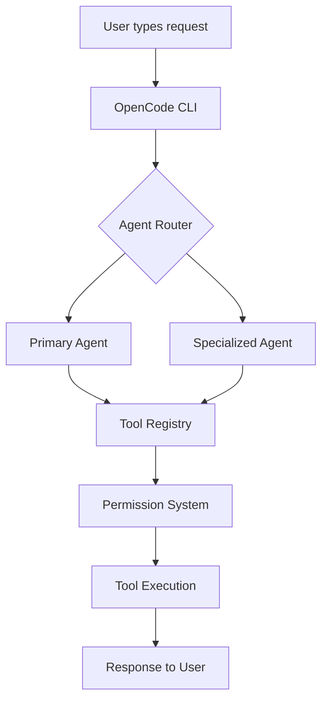

# What is OpenCode and Why Use It

## Introduction

OpenCode is an open-source command-line interface (CLI) framework designed for AI-assisted software engineering. It acts as a bridge between large language models (LLMs) and your development environment, enabling intelligent code assistance through a structured system of agents, skills, and tools.

> [!NOTE]
> OpenCode is completely free and open-source. You only need to provide your own API keys for the LLM providers you choose to use (OpenAI, Anthropic, Google, etc.).

---

## Why OpenCode Exists

Traditional AI coding assistants are often limited to specific editors or platforms. OpenCode takes a different approach:

| Feature | Traditional Assistants | OpenCode |
|---------|----------------------|----------|
| **Platform** | Tied to specific IDE | Works in any terminal |
| **Provider Lock-in** | Single LLM provider | Multiple providers supported |
| **Extensibility** | Limited customization | Skills, plugins, hooks |
| **Transparency** | Black box | Open-source, auditable |
| **Cost** | Subscription required | Free (pay only for API usage) |

> [!TIP]
> Think of OpenCode as the "VS Code of AI coding assistants" — a flexible, extensible platform that adapts to your workflow rather than forcing you into a specific way of working.

---

## Core Concepts

### Agents

Agents are AI-powered assistants configured with specific models, prompts, and capabilities. Each agent specializes in different tasks:

- **Primary Agent**: Your main coding assistant
- **Subagents**: Specialized helpers for specific domains
- **Custom Agents**: User-defined assistants with tailored behavior

### Skills

Skills are reusable instruction packages that teach agents how to perform specific tasks. They contain:

- **Instructions**: Step-by-step guidance
- **Tools**: Required capabilities
- **Resources**: Templates and references

### MCP (Model Context Protocol)

MCP is a standard protocol for connecting LLMs with external tools and data sources. It allows OpenCode to integrate with:

- File systems
- Databases
- Web APIs
- Custom services

### Tools

OpenCode provides built-in tools that agents can use:

| Tool | Purpose |
|------|---------|
| `bash` | Execute shell commands |
| `read` | Read files |
| `write` | Create/modify files |
| `edit` | Edit specific parts of files |
| `grep` | Search file contents |
| `glob` | Find files by pattern |
| `webfetch` | Fetch web content |
| `websearch` | Search the internet |

---

## How OpenCode Works



The request lifecycle follows these steps:

1. **User Input**: You type a request in the terminal
2. **Agent Routing**: OpenCode selects the best agent for the task
3. **Tool Selection**: The agent decides which tools to use
4. **Permission Check**: OpenCode verifies the action is allowed
5. **Execution**: The tool runs and returns results
6. **Response**: The agent formats and returns the answer

---

## Who Should Use OpenCode?

OpenCode is ideal for:

- **Developers** who want AI assistance in any project
- **Teams** that need consistent, auditable AI workflows
- **Organizations** requiring data privacy and control
- **Open-source contributors** who want to extend AI capabilities
- **Students** learning about AI-assisted development

> [!WARNING]
> OpenCode requires basic command-line knowledge. If you're new to terminals, consider learning basic shell commands first.

---

## Comparison with Alternatives

| Tool | Type | Open Source | Multi-Provider | CLI Support |
|------|------|:-----------:|:--------------:|:-----------:|
| OpenCode | CLI Framework | ✅ | ✅ | ✅ |
| GitHub Copilot | IDE Plugin | ❌ | ❌ | ❌ |
| Cursor | IDE | ❌ | Limited | ❌ |
| Aider | CLI Tool | ✅ | ✅ | ✅ |
| Continue | IDE Extension | ✅ | ✅ | ❌ |

---

## Practice Questions

```question
{
  "id": "oc-fund-q1",
  "type": "multiple-choice",
  "question": "What is the primary purpose of OpenCode?",
  "options": [
    "To replace your code editor",
    "To provide AI-assisted software engineering through a CLI framework",
    "To manage Git repositories",
    "To compile and run code"
  ],
  "correct": 1,
  "explanation": "OpenCode is a CLI framework that bridges LLMs with development environments, enabling AI-assisted coding through agents, skills, and tools."
}
```

```question
{
  "id": "oc-fund-q2",
  "type": "multiple-choice",
  "question": "Which of the following is NOT a core component of OpenCode?",
  "options": [
    "Agents",
    "Skills",
    "Plugins",
    "Compilers"
  ],
  "correct": 3,
  "explanation": "OpenCode uses Agents, Skills, MCP (plugins), and Tools. Compilers are not part of the OpenCode architecture."
}
```

```question
{
  "id": "oc-fund-q3",
  "type": "multiple-choice",
  "question": "What does MCP stand for in the context of OpenCode?",
  "options": [
    "Multi-Core Processing",
    "Model Context Protocol",
    "Managed Code Pipeline",
    "Modular Component Platform"
  ],
  "correct": 1,
  "explanation": "MCP stands for Model Context Protocol, a standard for connecting LLMs with external tools and data sources."
}
```

```question
{
  "id": "oc-fund-q4",
  "type": "multiple-choice",
  "question": "Which tool would you use to search for text patterns inside files?",
  "options": [
    "bash",
    "glob",
    "grep",
    "read"
  ],
  "correct": 2,
  "explanation": "The grep tool searches file contents using regular expressions, making it ideal for finding text patterns."
}
```

```question
{
  "id": "oc-fund-q5",
  "type": "multiple-choice",
  "question": "What is a key advantage of OpenCode over traditional AI coding assistants?",
  "options": [
    "It's faster than other tools",
    "It works without internet access",
    "It's open-source and supports multiple LLM providers",
    "It automatically writes all your code"
  ],
  "correct": 2,
  "explanation": "OpenCode is open-source and supports multiple LLM providers (OpenAI, Anthropic, Google, etc.), giving you flexibility and control."
}
```

---

> [!SUCCESS]
> ### Key Takeaways

- OpenCode is an open-source CLI framework for AI-assisted software engineering
- It bridges LLMs with development environments through agents, skills, and tools
- OpenCode supports multiple LLM providers without vendor lock-in
- The request lifecycle flows through agent routing, tool selection, permission checks, and execution
- Skills are reusable instruction packages that teach agents specific tasks
- MCP enables integration with external tools and data sources
- OpenCode is free to use — you only pay for LLM API usage