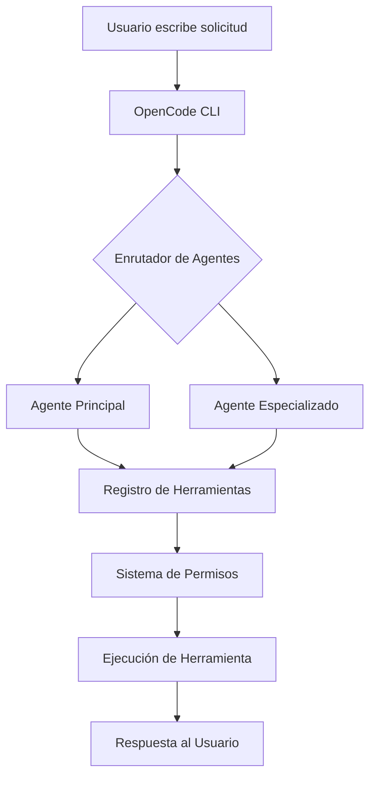

# Qué es OpenCode y por qué usarlo

## Introducción

OpenCode es un marco de trabajo de interfaz de línea de comandos (CLI) de código abierto diseñado para la ingeniería de software asistida por IA. Actúa como un puente entre modelos de lenguaje grandes (LLMs) y su entorno de desarrollo, permitiendo asistencia inteligente de código a través de un sistema estructurado de agentes, habilidades y herramientas.

> [!NOTE]
> OpenCode es completamente gratuito y de código abierto. Solo necesita proporcionar sus propias claves API para los proveedores de LLM que elija utilizar (OpenAI, Anthropic, Google, etc.).

---

## Por qué existe OpenCode

Los asistentes tradicionales de codificación con IA suelen estar limitados a editores o plataformas específicas. OpenCode adopta un enfoque diferente:

| Característica | Asistentes Tradicionales | OpenCode |
|---------|----------------------|----------|
| **Plataforma** | Vinculado a IDE específico | Funciona en cualquier terminal |
| **Bloqueo de Proveedor** | Proveedor LLM único | Múltiples proveedores soportados |
| **Extensibilidad** | Personalización limitada | Habilidades, plugins, hooks |
| **Transparencia** | Caja negra | Código abierto, auditable |
| **Costo** | Se requiere suscripción | Gratuito (pague solo por uso de API) |

> [!TIP]
> Piense en OpenCode como el "VS Code de los asistentes de codificación con IA" — una plataforma flexible y extensible que se adapta a su flujo de trabajo en lugar de forzarlo a una forma específica de trabajar.

---

## Conceptos Básicos

### Agentes

Los agentes son asistentes impulsados por IA configurados con modelos, indicaciones y capacidades específicas. Cada agente se especializa en diferentes tareas:

- **Agente Principal**: Su asistente principal de codificación
- **Subagentes**: Asistentes especializados para dominios específicos
- **Agentes Personalizados**: Asistentes definidos por el usuario con comportamiento adaptado

### Habilidades

Las habilidades son paquetes de instrucciones reutilizables que enseñan a los agentes cómo realizar tareas específicas. Contienen:

- **Instrucciones**: Guía paso a paso
- **Herramientas**: Capacidades requeridas
- **Recursos**: Plantillas y referencias

### MCP (Model Context Protocol)

MCP es un protocolo estándar para conectar LLMs con herramientas y fuentes de datos externas. Permite a OpenCode integrarse con:

- Sistemas de archivos
- Bases de datos
- APIs web
- Servicios personalizados

### Herramientas

OpenCode proporciona herramientas integradas que los agentes pueden usar:

| Herramienta | Propósito |
|------|---------|
| `bash` | Ejecutar comandos de shell |
| `read` | Leer archivos |
| `write` | Crear/modificar archivos |
| `edit` | Editar partes específicas de archivos |
| `grep` | Buscar contenido de archivos |
| `glob` | Encontrar archivos por patrón |
| `webfetch` | Obtener contenido web |
| `websearch` | Buscar en internet |

---

## Cómo funciona OpenCode



El ciclo de vida de la solicitud sigue estos pasos:

1. **Entrada del Usuario**: Escribe una solicitud en la terminal
2. **Enrutamiento de Agentes**: OpenCode selecciona el mejor agente para la tarea
3. **Selección de Herramientas**: El agente decide qué herramientas usar
4. **Verificación de Permisos**: OpenCode verifica que la acción esté permitida
5. **Ejecución**: La herramienta se ejecuta y devuelve resultados
6. **Respuesta**: El agente formatea y devuelve la respuesta

---

## ¿Quién debe usar OpenCode?

OpenCode es ideal para:

- **Desarrolladores** que quieren asistencia de IA en cualquier proyecto
- **Equipos** que necesitan flujos de trabajo de IA consistentes y auditable
- **Organizaciones** que requieren privacidad y control de datos
- **Contribuyentes de código abierto** que quieren extender las capacidades de IA
- **Estudiantes** que aprenden sobre desarrollo asistido por IA

> [!WARNING]
> OpenCode requiere conocimientos básicos de línea de comandos. Si es nuevo en terminales, considere aprender comandos básicos de shell primero.

---

## Comparación con Alternativas

| Herramienta | Tipo | Código Abierto | Multi-Proveedor | Soporte CLI |
|------|------|:-----------:|:--------------:|:-----------:|
| OpenCode | Marco de trabajo CLI | ✅ | ✅ | ✅ |
| GitHub Copilot | Plugin IDE | ❌ | ❌ | ❌ |
| Cursor | IDE | ❌ | Limitado | ❌ |
| Aider | Herramienta CLI | ✅ | ✅ | ✅ |
| Continue | Extensión IDE | ✅ | ✅ | ❌ |

---

## Practice Questions

```question
{
  "id": "oc-fund-q1",
  "type": "multiple-choice",
  "question": "¿Cuál es el propósito principal de OpenCode?",
  "options": [
    "Reemplazar su editor de código",
    "Proporcionar ingeniería de software asistida por IA a través de un marco CLI",
    "Gestionar repositorios Git",
    "Compilar y ejecutar código"
  ],
  "correct": 1,
  "explanation": "OpenCode es un marco CLI que conecta LLMs con entornos de desarrollo, permitiendo codificación asistida por IA a través de agentes, habilidades y herramientas."
}
```

```question
{
  "id": "oc-fund-q2",
  "type": "multiple-choice",
  "question": "¿Cuál de los siguientes NO es un componente básico de OpenCode?",
  "options": [
    "Agentes",
    "Habilidades",
    "Plugins",
    "Compiladores"
  ],
  "correct": 3,
  "explanation": "OpenCode usa Agentes, Habilidades, MCP (plugins) y Herramientas. Los Compiladores no son parte de la arquitectura de OpenCode."
}
```

```question
{
  "id": "oc-fund-q3",
  "type": "multiple-choice",
  "question": "¿Qué significa MCP en el contexto de OpenCode?",
  "options": [
    "Multi-Core Processing",
    "Model Context Protocol",
    "Managed Code Pipeline",
    "Modular Component Platform"
  ],
  "correct": 1,
  "explanation": "MCP significa Model Context Protocol, un estándar para conectar LLMs con herramientas y fuentes de datos externas."
}
```

```question
{
  "id": "oc-fund-q4",
  "type": "multiple-choice",
  "question": "¿Qué herramienta usaría para buscar patrones de texto dentro de archivos?",
  "options": [
    "bash",
    "glob",
    "grep",
    "read"
  ],
  "correct": 2,
  "explanation": "La herramienta grep busca contenido de archivos usando expresiones regulares, haciéndola ideal para encontrar patrones de texto."
}
```

```question
{
  "id": "oc-fund-q5",
  "type": "multiple-choice",
  "question": "¿Cuál es una ventaja clave de OpenCode sobre los asistentes tradicionales de codificación con IA?",
  "options": [
    "Es más rápido que otras herramientas",
    "Funciona sin acceso a internet",
    "Es de código abierto y soporta múltiples proveedores LLM",
    "Escribe automáticamente todo su código"
  ],
  "correct": 2,
  "explanation": "OpenCode es de código abierto y soporta múltiples proveedores LLM (OpenAI, Anthropic, Google, etc.), dándole flexibilidad y control."
}
```

---

> [!SUCCESS]
> ### Key Takeaways

- OpenCode es un marco CLI de código abierto para ingeniería de software asistida por IA
- Conecta LLMs con entornos de desarrollo a través de agentes, habilidades y herramientas
- OpenCode soporta múltiples proveedores LLM sin bloqueo de proveedor
- El ciclo de vida de la solicitud fluye a través de enrutamiento de agentes, selección de herramientas, verificación de permisos y ejecución
- Las habilidades son paquetes de instrucciones reutilizables que enseñan a los agentes tareas específicas
- MCP permite la integración con herramientas y fuentes de datos externas
- OpenCode es gratuito para usar — solo paga por el uso de API de LLM