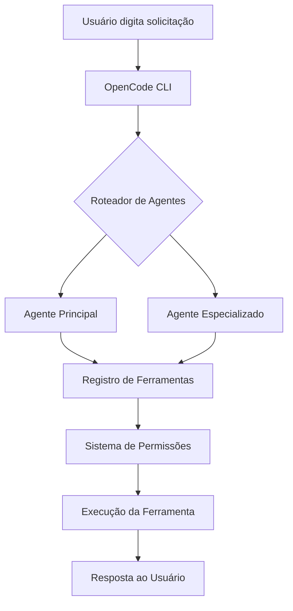

# O que é o OpenCode e por que usá-lo

## Introdução

OpenCode é um framework de interface de linha de comando (CLI) de código aberto projetado para engenharia de software assistida por IA. Ele funciona como uma ponte entre grandes modelos de linguagem (LLMs) e seu ambiente de desenvolvimento, permitindo assistência inteligente de código através de um sistema estruturado de agentes, habilidades e ferramentas.

> [!NOTE]
> OpenCode é completamente gratuito e de código aberto. Você só precisa fornecer suas próprias chaves de API para os provedores LLM que escolher usar (OpenAI, Anthropic, Google, etc.).

---

## Por que o OpenCode existe

Assistentes tradicionais de codificação com IA são frequentemente limitados a editores ou plataformas específicas. O OpenCode adota uma abordagem diferente:

| Recurso | Assistentes Tradicionais | OpenCode |
|---------|----------------------|----------|
| **Plataforma** | Vinculado a IDE específica | Funciona em qualquer terminal |
| **Lock-in de Provedor** | Provedor LLM único | Múltiplos provedores suportados |
| **Extensibilidade** | Personalização limitada | Habilidades, plugins, hooks |
| **Transparência** | Caixa-preta | Código aberto, auditável |
| **Custo** | Assinatura necessária | Gratuito (pague apenas pelo uso da API) |

> [!TIP]
> Pense no OpenCode como o "VS Code dos assistentes de codificação com IA" — uma plataforma flexível e extensível que se adapta ao seu fluxo de trabalho em vez de forçá-lo a uma maneira específica de trabalhar.

---

## Conceitos Fundamentais

### Agentes

Agentes são assistentes alimentados por IA configurados com modelos, prompts e capacidades específicas. Cada agente se especializa em tarefas diferentes:

- **Agente Principal**: Seu assistente principal de codificação
- **Subagentes**: Assistentes especializados para domínios específicos
- **Agentes Personalizados**: Assistentes definidos pelo usuário com comportamento adaptado

### Habilidades

Habilidades são pacotes de instruções reutilizáveis que ensinam agentes a executar tarefas específicas. Elas contêm:

- **Instruções**: Orientação passo a passo
- **Ferramentas**: Capacidades necessárias
- **Recursos**: Modelos e referências

### MCP (Model Context Protocol)

MCP é um protocolo padrão para conectar LLMs com ferramentas e fontes de dados externas. Ele permite que o OpenCode se integre com:

- Sistemas de arquivos
- Bancos de dados
- APIs web
- Serviços personalizados

### Ferramentas

O OpenCode fornece ferramentas integradas que os agentes podem usar:

| Ferramenta | Finalidade |
|------------|-----------|
| `bash` | Executar comandos shell |
| `read` | Ler arquivos |
| `write` | Criar/modificar arquivos |
| `edit` | Editar partes específicas de arquivos |
| `grep` | Buscar conteúdo em arquivos |
| `glob` | Encontrar arquivos por padrão |
| `webfetch` | Buscar conteúdo web |
| `websearch` | Pesquisar na internet |

---

## Como o OpenCode funciona



O ciclo de vida da solicitação segue estas etapas:

1. **Entrada do Usuário**: Você digita uma solicitação no terminal
2. **Roteamento de Agentes**: O OpenCode seleciona o melhor agente para a tarefa
3. **Seleção de Ferramentas**: O agente decide quais ferramentas usar
4. **Verificação de Permissão**: O OpenCode verifica se a ação é permitida
5. **Execução**: A ferramenta é executada e retorna resultados
6. **Resposta**: O agente formata e retorna a resposta

---

## Quem deve usar o OpenCode?

O OpenCode é ideal para:

- **Desenvolvedores** que querem assistência de IA em qualquer projeto
- **Equipes** que precisam de fluxos de trabalho de IA consistentes e auditáveis
- **Organizações** que exigem privacidade e controle de dados
- **Colaboradores de código aberto** que querem estender capacidades de IA
- **Estudantes** aprendendo sobre desenvolvimento assistido por IA

> [!WARNING]
> O OpenCode requer conhecimento básico de linha de comando. Se você é novo em terminais, considere aprender comandos básicos de shell primeiro.

---

## Comparação com Alternativas

| Ferramenta | Tipo | Código Aberto | Multi-Provedor | Suporte CLI |
|------------|------|:-------------:|:--------------:|:-----------:|
| OpenCode | Framework CLI | ✅ | ✅ | ✅ |
| GitHub Copilot | Plugin IDE | ❌ | ❌ | ❌ |
| Cursor | IDE | ❌ | Limitado | ❌ |
| Aider | Ferramenta CLI | ✅ | ✅ | ✅ |
| Continue | Extensão IDE | ✅ | ✅ | ❌ |

---

## Practice Questions

```question
{
  "id": "oc-fund-q1",
  "type": "multiple-choice",
  "question": "Qual é o objetivo principal do OpenCode?",
  "options": [
    "Substituir seu editor de código",
    "Fornecer engenharia de software assistida por IA através de um framework CLI",
    "Gerenciar repositórios Git",
    "Compilar e executar código"
  ],
  "correct": 1,
  "explanation": "O OpenCode é um framework CLI que conecta LLMs com ambientes de desenvolvimento, permitindo codificação assistida por IA através de agentes, habilidades e ferramentas."
}
```

```question
{
  "id": "oc-fund-q2",
  "type": "multiple-choice",
  "question": "Qual das seguintes opções NÃO é um componente central do OpenCode?",
  "options": [
    "Agentes",
    "Habilidades",
    "Plugins",
    "Compiladores"
  ],
  "correct": 3,
  "explanation": "O OpenCode usa Agentes, Habilidades, MCP (plugins) e Ferramentas. Compiladores não fazem parte da arquitetura do OpenCode."
}
```

```question
{
  "id": "oc-fund-q3",
  "type": "multiple-choice",
  "question": "O que significa MCP no contexto do OpenCode?",
  "options": [
    "Multi-Core Processing",
    "Model Context Protocol",
    "Managed Code Pipeline",
    "Modular Component Platform"
  ],
  "correct": 1,
  "explanation": "MCP significa Model Context Protocol, um padrão para conectar LLMs com ferramentas e fontes de dados externas."
}
```

```question
{
  "id": "oc-fund-q4",
  "type": "multiple-choice",
  "question": "Qual ferramenta você usaria para buscar padrões de texto dentro de arquivos?",
  "options": [
    "bash",
    "glob",
    "grep",
    "read"
  ],
  "correct": 2,
  "explanation": "A ferramenta grep busca conteúdo em arquivos usando expressões regulares, tornando-a ideal para encontrar padrões de texto."
}
```

```question
{
  "id": "oc-fund-q5",
  "type": "multiple-choice",
  "question": "Qual é uma vantagem chave do OpenCode em relação aos assistentes tradicionais de codificação com IA?",
  "options": [
    "É mais rápido que outras ferramentas",
    "Funciona sem acesso à internet",
    "É de código aberto e suporta múltiplos provedores LLM",
    "Escreve automaticamente todo o seu código"
  ],
  "correct": 2,
  "explanation": "O OpenCode é de código aberto e suporta múltiplos provedores LLM (OpenAI, Anthropic, Google, etc.), dando flexibilidade e controle."
}
```

---

> [!SUCCESS]
> ### Key Takeaways

- OpenCode é um framework CLI de código aberto para engenharia de software assistida por IA
- Ele conecta LLMs com ambientes de desenvolvimento através de agentes, habilidades e ferramentas
- OpenCode suporta múltiplos provedores LLM sem lock-in de fornecedor
- O ciclo de vida da solicitação flui através do roteamento de agentes, seleção de ferramentas, verificações de permissão e execução
- Habilidades são pacotes de instruções reutilizáveis que ensinam agentes tarefas específicas
- MCP permite integração com ferramentas e fontes de dados externas
- OpenCode é gratuito para usar — você só paga pelo uso da API LLM
