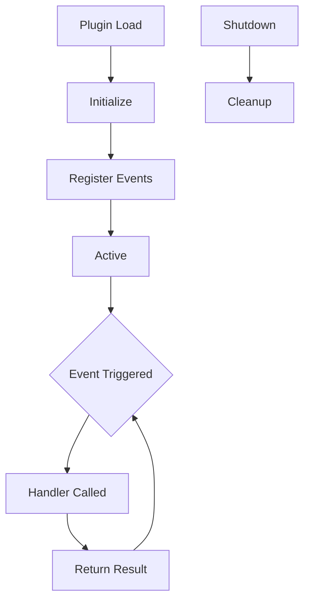

# Plugin Development from Scratch

## Plugin Architecture

Plugins are Node.js packages that extend OpenCode's functionality:

```
.opencode/plugins/my-plugin/
├── package.json
├── src/
│   └── index.ts
├── assets/
├── examples/
├── references/
└── scripts/
```

---

## Plugin Lifecycle



| Phase | Description |
|-------|-------------|
| **Load** | Plugin is discovered and loaded |
| **Initialize** | Plugin sets up resources |
| **Register** | Event handlers are registered |
| **Active** | Plugin listens for events |
| **Shutdown** | Cleanup and resource release |

---

## Creating a Plugin

### Step 1: Initialize Package

```bash
mkdir -p .opencode/plugins/code-metrics
cd .opencode/plugins/code-metrics
npm init -y
```

### Step 2: Create Plugin Entry

Create `src/index.ts`:

```typescript
import { Plugin, PluginContext } from "opencode";

export default class CodeMetricsPlugin implements Plugin {
  name = "code-metrics";
  version = "1.0.0";

  async initialize(context: PluginContext) {
    console.log("Code Metrics plugin initialized");
  }

  async onFileWrite(filePath: string, content: string) {
    const lines = content.split("\n").length;
    const bytes = Buffer.byteLength(content);
    
    console.log(`File written: ${filePath}`);
    console.log(`  Lines: ${lines}`);
    console.log(`  Bytes: ${bytes}`);
    
    return { lines, bytes };
  }

  async onToolExecute(tool: string, args: any, result: any) {
    // Log tool usage metrics
    return {
      tool,
      timestamp: Date.now(),
      success: !result.error
    };
  }

  async shutdown() {
    console.log("Code Metrics plugin shutting down");
  }
}
```

### Step 3: Register Plugin

Add to `opencode.json`:

```json
{
  "plugins": {
    "code-metrics": {
      "path": ".opencode/plugins/code-metrics",
      "enabled": true
    }
  }
}
```

---

## Plugin API Surface

### Available Events

| Event | Parameters | Return |
|-------|------------|--------|
| `session.start` | `sessionId` | void |
| `session.end` | `sessionId` | void |
| `file.read` | `path, content` | `content` |
| `file.write` | `path, content` | `content` |
| `file.edit` | `path, old, new` | `new` |
| `tool.execute.before` | `tool, args` | `args` |
| `tool.execute.after` | `tool, args, result` | `result` |
| `agent.route` | `request, agent` | `agent` |

### Context Methods

```typescript
context.log(message: string, level: "info" | "warn" | "error");
context.getConfig(key: string): any;
context.setConfig(key: string, value: any): void;
context.getMemory(key: string): any;
context.setMemory(key: string, value: any): void;
```

---

## Example: Security Scanner Plugin

```typescript
import { Plugin, PluginContext } from "opencode";

const DANGEROUS_PATTERNS = [
  /eval\s*\(/,
  /new\s+Function\s*\(/,
  /process\.exit/,
  /require\s*\(\s*['"]child_process['"]\s*\)/,
];

export default class SecurityScannerPlugin implements Plugin {
  name = "security-scanner";
  version = "1.0.0";

  async onFileWrite(path: string, content: string) {
    const warnings: string[] = [];

    for (const pattern of DANGEROUS_PATTERNS) {
      if (pattern.test(content)) {
        warnings.push(`Potentially dangerous pattern: ${pattern.source}`);
      }
    }

    if (warnings.length > 0) {
      console.warn(`Security warnings for ${path}:`);
      warnings.forEach(w => console.warn(`  - ${w}`));
    }

    return { warnings };
  }
}
```

---

## Testing Plugins

### Unit Tests

```typescript
import CodeMetricsPlugin from "../src/index";

describe("CodeMetricsPlugin", () => {
  let plugin: CodeMetricsPlugin;

  beforeEach(() => {
    plugin = new CodeMetricsPlugin();
  });

  it("should count lines correctly", async () => {
    const result = await plugin.onFileWrite("test.ts", "line1\nline2\nline3");
    expect(result.lines).toBe(3);
  });

  it("should count bytes correctly", async () => {
    const result = await plugin.onFileWrite("test.ts", "hello");
    expect(result.bytes).toBe(5);
  });
});
```

### Integration Tests

```bash
npm test
```

---

## Best Practices

| Practice | Reason |
|----------|--------|
| **Single responsibility** | One plugin, one purpose |
| **Error handling** | Graceful degradation |
| **Performance** | Don't block main thread |
| **Logging** | Useful debug information |
| **Configuration** | Make behavior adjustable |

---

## Practice Questions

```question
{
  "id": "oc-plugin-q1",
  "type": "multiple-choice",
  "question": "What is the first phase in the plugin lifecycle?",
  "options": [
    "Initialize",
    "Register",
    "Load",
    "Active"
  ],
  "correct": 2,
  "explanation": "The plugin lifecycle starts with Load, where the plugin is discovered and loaded into OpenCode."
}
```

```question
{
  "id": "oc-plugin-q2",
  "type": "multiple-choice",
  "question": "Which event fires before a file is written?",
  "options": [
    "file.write",
    "file.save",
    "file.create",
    "file.commit"
  ],
  "correct": 0,
  "explanation": "The file.write event fires before content is written, allowing transformation or validation."
}
```

```question
{
  "id": "oc-plugin-q3",
  "type": "multiple-choice",
  "question": "Where should plugins be registered?",
  "options": [
    "In the skill manifest",
    "In opencode.json under plugins key",
    "In package.json",
    "In a separate config file"
  ],
  "correct": 1,
  "explanation": "Plugins are registered in opencode.json under the plugins key with path and enabled status."
}
```

```question
{
  "id": "oc-plugin-q4",
  "type": "multiple-choice",
  "question": "What should a plugin do during shutdown?",
  "options": [
    "Delete all files",
    "Cleanup resources and save state",
    "Restart the application",
    "Send notifications"
  ],
  "correct": 1,
  "explanation": "During shutdown, plugins should cleanup resources, save state, and release any locks."
}
```

```question
{
  "id": "oc-plugin-q5",
  "type": "multiple-choice",
  "question": "How do plugins access configuration?",
  "options": [
    "Direct file access",
    "Using context.getConfig()",
    "Through environment variables only",
    "From command line arguments"
  ],
  "correct": 1,
  "explanation": "Plugins access configuration through the context object's getConfig() method."
}
```

---

> [!SUCCESS]
> ### Key Takeaways

- Plugins are Node.js packages that extend OpenCode's functionality
- The lifecycle includes Load, Initialize, Register, Active, and Shutdown phases
- Use the file.write event to validate or transform content before saving
- Register plugins in opencode.json under the plugins key
- Follow single responsibility principle for plugin design
- Always cleanup resources during shutdown
- Test plugins with both unit and integration tests