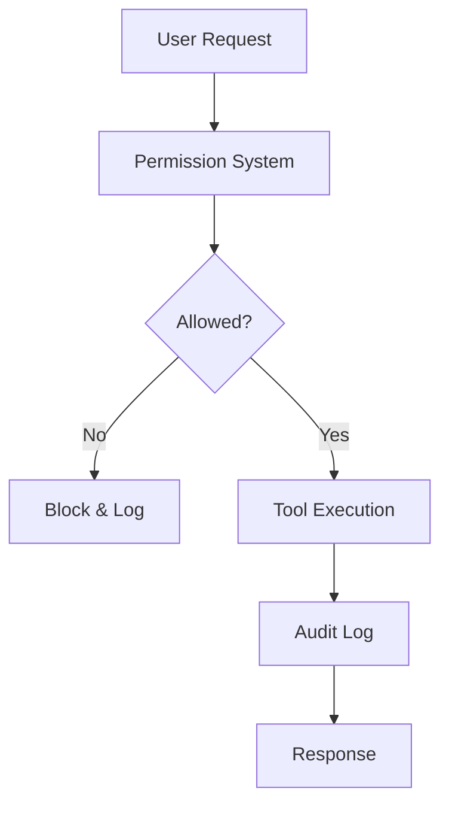

# Security Hardening and Audit

## Security Layers



---

## Permission System

### Principle of Least Privilege

```json
{
  "permissions": [
    {
      "tool": "bash",
      "allow": ["npm test", "npm run lint", "git status"],
      "deny": ["sudo *", "rm -rf *", "git push --force"]
    },
    {
      "tool": "write",
      "allow": ["src/**", "tests/**"],
      "deny": [".env*", "secrets/**", "*.key", "*.pem"]
    },
    {
      "tool": "read",
      "allow": ["**"],
      "deny": [".env*", "secrets/**"]
    }
  ]
}
```

### Permission Patterns

| Pattern | Example | Matches |
|---------|---------|---------|
| Exact | `npm test` | Only `npm test` |
| Wildcard | `npm *` | Any npm command |
| Path | `src/**` | Any file in src/ |
| Negation | `*.key` | Any .key file |

---

## Audit Logging

### Enable Comprehensive Logging

```json
{
  "logging": {
    "enabled": true,
    "level": "info",
    "file": "opencode-audit.log",
    "rotate": {
      "maxSize": "10MB",
      "maxFiles": 30
    }
  }
}
```

### Log Format

```json
{
  "timestamp": "2024-01-15T10:30:00Z",
  "level": "info",
  "event": "tool.execute",
  "tool": "bash",
  "args": {"command": "npm test"},
  "result": "success",
  "user": "developer1",
  "session": "abc123"
}
```

### Analyzing Logs

```bash
# Find all failed operations
grep '"result":"error"' opencode-audit.log

# Find bash commands
grep '"tool":"bash"' opencode-audit.log

# Find write operations to sensitive files
grep '"tool":"write"' opencode-audit.log | grep -E '\.env|secrets'
```

---

## Secrets Management

### Environment Variables

```bash
# .env (never commit)
OPENAI_API_KEY=sk-your-key
ANTHROPIC_API_KEY=sk-ant-your-key
DATABASE_URL=postgresql://...
```

### Reference in Config

```json
{
  "providers": {
    "openai": {
      "apiKey": "${OPENAI_API_KEY}"
    }
  }
}
```

### .gitignore

```gitignore
.env
.env.*
*.key
*.pem
secrets/
```

---

## Network Security

### API Key Rotation

```bash
# Generate new key
# Update .env
# Restart OpenCode
# Verify old key is invalidated
```

### Rate Limiting

```json
{
  "providers": {
    "openai": {
      "apiKey": "${OPENAI_API_KEY}",
      "rateLimit": {
        "requests": 60,
        "window": "1m"
      }
    }
  }
}
```

### Timeout Configuration

```json
{
  "providers": {
    "openai": {
      "timeout": 30000
    }
  }
}
```

---

## Compliance Patterns

### Data Residency

```json
{
  "providers": {
    "openai": {
      "apiKey": "${OPENAI_API_KEY}",
      "region": "us-east-1"
    }
  }
}
```

### Data Retention

```json
{
  "logging": {
    "retention": {
      "days": 90,
      "autoDelete": true
    }
  }
}
```

### PII Redaction

```json
{
  "security": {
    "redact": {
      "patterns": [
        "\\b\\d{3}-\\d{2}-\\d{4}\\b",
        "\\b[A-Za-z0-9._%+-]+@[A-Za-z0-9.-]+\\.[A-Z|a-z]{2,}\\b"
      ],
      "replacement": "[REDACTED]"
    }
  }
}
```

---

## Security Checklist

### Before Deployment

- [ ] API keys in environment variables
- [ ] .env in .gitignore
- [ ] Permission rules configured
- [ ] Audit logging enabled
- [ ] Rate limiting configured
- [ ] Timeouts set
- [ ] PII redaction enabled

### Regular Audits

- [ ] Review audit logs weekly
- [ ] Rotate API keys monthly
- [ ] Update permission rules quarterly
- [ ] Review security patterns annually

---

## Practice Questions

```question
{
  "id": "oc-security-q1",
  "type": "multiple-choice",
  "question": "What is the principle of least privilege?",
  "options": [
    "Give users maximum access",
    "Give users only the access they need",
    "Give no access at all",
    "Give access based on role only"
  ],
  "correct": 1,
  "explanation": "Least privilege means granting only the minimum permissions necessary for a task."
}
```

```question
{
  "id": "oc-security-q2",
  "type": "multiple-choice",
  "question": "Where should API keys be stored?",
  "options": [
    "In opencode.json",
    "In environment variables",
    "In the codebase",
    "In a database"
  ],
  "correct": 1,
  "explanation": "Environment variables keep secrets out of code and configuration files."
}
```

```question
{
  "id": "oc-security-q3",
  "type": "multiple-choice",
  "question": "What does PII redaction do?",
  "options": [
    "Encrypts all data",
    "Removes personally identifiable information from logs",
    "Compresses log files",
    "Sends alerts for sensitive data"
  ],
  "correct": 1,
  "explanation": "PII redaction replaces sensitive patterns like emails and SSNs with [REDACTED] in logs."
}
```

```question
{
  "id": "oc-security-q4",
  "type": "multiple-choice",
  "question": "How often should you rotate API keys?",
  "options": [
    "Never",
    "Once a year",
    "Monthly",
    "Daily"
  ],
  "correct": 2,
  "explanation": "Monthly rotation limits exposure if a key is compromised."
}
```

```question
{
  "id": "oc-security-q5",
  "type": "multiple-choice",
  "question": "What should audit logs track?",
  "options": [
    "Only errors",
    "All tool executions with timestamps and results",
    "Only successful operations",
    "Only user logins"
  ],
  "correct": 1,
  "explanation": "Comprehensive audit logs track all tool executions for security and compliance."
}
```

---

> [!SUCCESS]
> ### Key Takeaways

- Apply least privilege principle to all permission rules
- Store API keys in environment variables, never in code
- Enable comprehensive audit logging for compliance
- Use PII redaction to protect sensitive data in logs
- Rotate API keys monthly and review permissions quarterly
- Configure rate limits and timeouts to prevent abuse
- Regular security audits catch issues before they become breaches