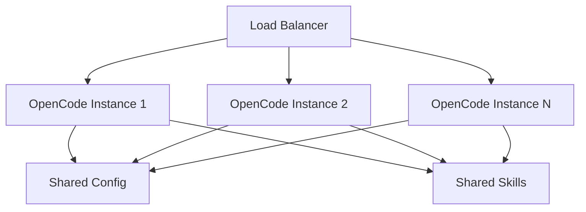

# Scaling Multi-User Deployments

## Architecture Patterns

| Pattern | Users | Use Case |
|---------|-------|----------|
| **Single-user** | 1 | Personal development |
| **Team** | 2-10 | Small teams |
| **Department** | 10-50 | Engineering teams |
| **Enterprise** | 50+ | Organization-wide |

---

## Multi-User Architecture



---

## Configuration Management

### Shared Configuration

Create a central configuration repository:

```
config-repo/
├── opencode.json
├── .opencode/
│   ├── skills/
│   └── hooks/
└── README.md
```

### Distribution

```bash
# Sync configuration
rsync -av config-repo/ /opt/opencode/config/

# Or use Git
cd /opt/opencode/config
git pull origin main
```

---

## Resource Management

### API Key Pooling

```json
{
  "providers": {
    "openai": {
      "apiKeyPool": [
        "${OPENAI_KEY_1}",
        "${OPENAI_KEY_2}",
        "${OPENAI_KEY_3}"
      ],
      "strategy": "round-robin"
    }
  }
}
```

### Rate Limiting

```json
{
  "scaling": {
    "rateLimit": {
      "perUser": {
        "requests": 100,
        "window": "1h"
      },
      "global": {
        "requests": 1000,
        "window": "1h"
      }
    }
  }
}
```

### Resource Quotas

```json
{
  "scaling": {
    "quotas": {
      "maxConcurrentSessions": 50,
      "maxTokensPerUser": 1000000,
      "maxStoragePerUser": "1GB"
    }
  }
}
```

---

## Performance Optimization

### Caching

```json
{
  "scaling": {
    "cache": {
      "enabled": true,
      "type": "redis",
      "url": "redis://localhost:6379",
      "ttl": 3600
    }
  }
}
```

### Connection Pooling

```json
{
  "scaling": {
    "connectionPool": {
      "maxConnections": 100,
      "idleTimeout": 30000
    }
  }
}
```

### Load Balancing

```yaml
# nginx.conf
upstream opencode {
    least_conn;
    server opencode1:3000;
    server opencode2:3000;
    server opencode3:3000;
}

server {
    listen 443;
    location / {
        proxy_pass http://opencode;
    }
}
```

---

## User Management

### Role-Based Access

```json
{
  "users": {
    "admin": {
      "role": "admin",
      "permissions": ["*"]
    },
    "developer": {
      "role": "developer",
      "permissions": ["read", "write", "execute"]
    },
    "viewer": {
      "role": "viewer",
      "permissions": ["read"]
    }
  }
}
```

### Session Management

```json
{
  "scaling": {
    "sessions": {
      "maxConcurrent": 10,
      "timeout": 3600,
      "cleanupInterval": 300
    }
  }
}
```

---

## Monitoring

### Metrics Collection

```json
{
  "monitoring": {
    "enabled": true,
    "metrics": {
      "requests": true,
      "latency": true,
      "errors": true,
      "tokens": true
    },
    "export": {
      "prometheus": {
        "enabled": true,
        "port": 9090
      }
    }
  }
}
```

### Health Checks

```bash
# Check instance health
curl http://localhost:3000/health

# Response
{
  "status": "healthy",
  "uptime": 86400,
  "sessions": 45,
  "memory": "2.5GB"
}
```

---

## Deployment Options

### Docker

```dockerfile
FROM node:18-alpine
RUN npm install -g opencode
COPY opencode.json /app/
WORKDIR /app
CMD ["opencode", "--host", "0.0.0.0"]
```

### Kubernetes

```yaml
apiVersion: apps/v1
kind: Deployment
metadata:
  name: opencode
spec:
  replicas: 3
  selector:
    matchLabels:
      app: opencode
  template:
    spec:
      containers:
      - name: opencode
        image: opencode:latest
        ports:
        - containerPort: 3000
        env:
        - name: OPENAI_API_KEY
          valueFrom:
            secretKeyRef:
              name: opencode-secrets
              key: api-key
```

---

## Best Practices

| Practice | Reason |
|----------|--------|
| **Centralized config** | Consistent behavior |
| **API key pooling** | Cost optimization |
| **Rate limiting** | Fair usage |
| **Monitoring** | Visibility |
| **Health checks** | Reliability |
| **Auto-scaling** | Performance |

---

## Practice Questions

```question
{
  "id": "oc-scale-q1",
  "type": "multiple-choice",
  "question": "What is the benefit of API key pooling?",
  "options": [
    "Better security",
    "Cost optimization and rate limit distribution",
    "Faster responses",
    "Simpler configuration"
  ],
  "correct": 1,
  "explanation": "API key pooling distributes requests across multiple keys for cost optimization and rate limit management."
}
```

```question
{
  "id": "oc-scale-q2",
  "type": "multiple-choice",
  "question": "What does rate limiting prevent?",
  "options": [
    "Security breaches",
    "API abuse and overuse",
    "Configuration errors",
    "Network outages"
  ],
  "correct": 1,
  "explanation": "Rate limiting prevents abuse and ensures fair usage across users."
}
```

```question
{
  "id": "oc-scale-q3",
  "type": "multiple-choice",
  "question": "Why use a load balancer?",
  "options": [
    "To encrypt traffic",
    "To distribute requests across instances",
    "To cache responses",
    "To store secrets"
  ],
  "correct": 1,
  "explanation": "Load balancers distribute requests across multiple instances for scalability and reliability."
}
```

```question
{
  "id": "oc-scale-q4",
  "type": "multiple-choice",
  "question": "What should you monitor in a multi-user deployment?",
  "options": [
    "Only errors",
    "Requests, latency, tokens, and errors",
    "Only user logins",
    "Only API costs"
  ],
  "correct": 1,
  "explanation": "Comprehensive monitoring tracks requests, latency, token usage, and errors for full visibility."
}
```

```question
{
  "id": "oc-scale-q5",
  "type": "multiple-choice",
  "question": "How do you distribute configuration to multiple instances?",
  "options": [
    "Copy files manually",
    "Use a central config repository with sync",
    "Store in a database",
    "Use environment variables only"
  ],
  "correct": 1,
  "explanation": "A central config repository with sync ensures all instances have consistent configuration."
}
```

---

> [!SUCCESS]
> ### Key Takeaways

- Use centralized configuration for consistent behavior across instances
- API key pooling distributes costs and rate limits
- Rate limiting prevents abuse and ensures fair usage
- Caching with Redis improves response times
- Load balancing distributes requests for scalability
- Monitor requests, latency, tokens, and errors
- Docker and Kubernetes enable scalable deployments