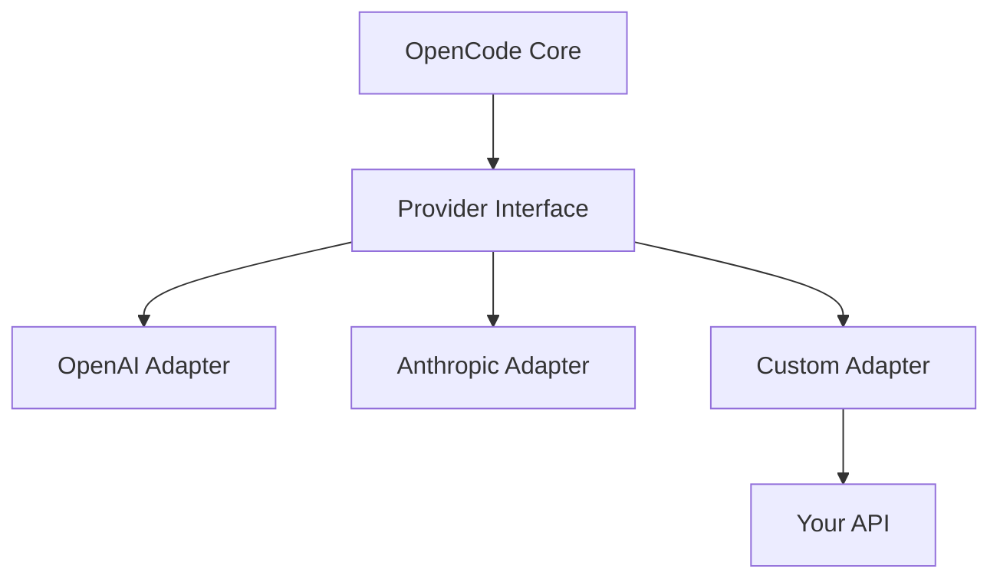

# Custom Provider Integration

## Provider Architecture



---

## Provider Interface

### Required Methods

```typescript
interface LLMProvider {
  name: string;
  models: string[];
  
  initialize(config: ProviderConfig): Promise<void>;
  
  chat(request: ChatRequest): Promise<ChatResponse>;
  
  stream(request: ChatRequest): AsyncGenerator<ChatChunk>;
  
  validate(apiKey: string): Promise<boolean>;
}
```

### Request Structure

```typescript
interface ChatRequest {
  model: string;
  messages: Message[];
  temperature?: number;
  maxTokens?: number;
  stream?: boolean;
}

interface Message {
  role: "system" | "user" | "assistant";
  content: string;
}
```

### Response Structure

```typescript
interface ChatResponse {
  content: string;
  usage: {
    promptTokens: number;
    completionTokens: number;
    totalTokens: number;
  };
  model: string;
}
```

---

## Creating a Custom Provider

### Step 1: Create Provider Directory

```bash
mkdir -p .opencode/providers/my-provider
cd .opencode/providers/my-provider
npm init -y
```

### Step 2: Implement Provider

Create `src/index.ts`:

```typescript
import { LLMProvider, ChatRequest, ChatResponse, ChatChunk } from "opencode";

export default class MyProvider implements LLMProvider {
  name = "my-provider";
  models = ["my-model-1", "my-model-2"];
  
  private apiKey: string;
  private baseUrl: string;

  async initialize(config: any) {
    this.apiKey = config.apiKey;
    this.baseUrl = config.baseUrl || "https://api.my-provider.com";
  }

  async chat(request: ChatRequest): Promise<ChatResponse> {
    const response = await fetch(`${this.baseUrl}/chat/completions`, {
      method: "POST",
      headers: {
        "Authorization": `Bearer ${this.apiKey}`,
        "Content-Type": "application/json"
      },
      body: JSON.stringify({
        model: request.model,
        messages: request.messages,
        temperature: request.temperature,
        max_tokens: request.maxTokens
      })
    });

    const data = await response.json();
    
    return {
      content: data.choices[0].message.content,
      usage: {
        promptTokens: data.usage.prompt_tokens,
        completionTokens: data.usage.completion_tokens,
        totalTokens: data.usage.total_tokens
      },
      model: request.model
    };
  }

  async *stream(request: ChatRequest): AsyncGenerator<ChatChunk> {
    const response = await fetch(`${this.baseUrl}/chat/completions`, {
      method: "POST",
      headers: {
        "Authorization": `Bearer ${this.apiKey}`,
        "Content-Type": "application/json"
      },
      body: JSON.stringify({
        model: request.model,
        messages: request.messages,
        temperature: request.temperature,
        max_tokens: request.maxTokens,
        stream: true
      })
    });

    const reader = response.body?.getReader();
    if (!reader) throw new Error("No response body");

    while (true) {
      const { done, value } = await reader.read();
      if (done) break;

      const chunk = new TextDecoder().decode(value);
      const lines = chunk.split("\n").filter(line => line.trim());

      for (const line of lines) {
        if (line.startsWith("data: ")) {
          const data = line.slice(6);
          if (data === "[DONE]") return;
          
          try {
            const parsed = JSON.parse(data);
            yield {
              content: parsed.choices[0]?.delta?.content || "",
              done: false
            };
          } catch {}
        }
      }
    }
  }

  async validate(apiKey: string): Promise<boolean> {
    try {
      const response = await fetch(`${this.baseUrl}/models`, {
        headers: {
          "Authorization": `Bearer ${apiKey}`
        }
      });
      return response.ok;
    } catch {
      return false;
    }
  }
}
```

### Step 3: Register Provider

Add to `opencode.json`:

```json
{
  "providers": {
    "my-provider": {
      "path": ".opencode/providers/my-provider",
      "apiKey": "${MY_PROVIDER_API_KEY}",
      "baseUrl": "https://api.my-provider.com"
    }
  }
}
```

---

## Authentication Patterns

### API Key

```json
{
  "providers": {
    "my-provider": {
      "apiKey": "${MY_PROVIDER_API_KEY}"
    }
  }
}
```

### OAuth2

```json
{
  "providers": {
    "my-provider": {
      "oauth": {
        "clientId": "${CLIENT_ID}",
        "clientSecret": "${CLIENT_SECRET}",
        "tokenUrl": "https://auth.my-provider.com/token"
      }
    }
  }
}
```

### Custom Headers

```typescript
async chat(request: ChatRequest): Promise<ChatResponse> {
  const response = await fetch(this.baseUrl, {
    headers: {
      "X-API-Key": this.apiKey,
      "X-Custom-Header": "value"
    }
  });
}
```

---

## Streaming Responses

### Server-Sent Events (SSE)

```typescript
async *stream(request: ChatRequest): AsyncGenerator<ChatChunk> {
  const response = await fetch(this.baseUrl, {
    method: "POST",
    headers: { "Content-Type": "application/json" },
    body: JSON.stringify({ ...request, stream: true })
  });

  const reader = response.body!.getReader();
  const decoder = new TextDecoder();

  while (true) {
    const { done, value } = await reader.read();
    if (done) break;

    const chunk = decoder.decode(value);
    const lines = chunk.split("\n");

    for (const line of lines) {
      if (line.startsWith("data: ")) {
        const data = JSON.parse(line.slice(6));
        yield { content: data.content, done: false };
      }
    }
  }
}
```

### WebSocket

```typescript
async *stream(request: ChatRequest): AsyncGenerator<ChatChunk> {
  const ws = new WebSocket("wss://api.my-provider.com/stream");
  
  ws.onopen = () => {
    ws.send(JSON.stringify(request));
  };

  while (true) {
    const message = await new Promise<any>((resolve) => {
      ws.onmessage = (event) => resolve(JSON.parse(event.data));
    });

    if (message.done) {
      ws.close();
      return;
    }

    yield { content: message.content, done: false };
  }
}
```

---

## Testing Custom Providers

### Unit Tests

```typescript
import MyProvider from "../src/index";

describe("MyProvider", () => {
  let provider: MyProvider;

  beforeEach(() => {
    provider = new MyProvider();
    provider.initialize({ apiKey: "test-key" });
  });

  it("should return response", async () => {
    const response = await provider.chat({
      model: "my-model-1",
      messages: [{ role: "user", content: "Hello" }]
    });

    expect(response.content).toBeDefined();
    expect(response.usage.totalTokens).toBeGreaterThan(0);
  });
});
```

### Integration Tests

```bash
npm test
```

---

## Best Practices

| Practice | Reason |
|----------|--------|
| **Error handling** | Graceful degradation |
| **Retry logic** | Handle transient failures |
| **Timeout handling** | Prevent hanging |
| **Streaming support** | Better UX |
| **Cost tracking** | Budget management |

---

## Practice Questions

```question
{
  "id": "oc-provider-q1",
  "type": "multiple-choice",
  "question": "What methods must a custom provider implement?",
  "options": [
    "Only chat()",
    "chat(), stream(), and validate()",
    "Only initialize()",
    "chat() and stream() only"
  ],
  "correct": 1,
  "explanation": "A complete provider implements chat(), stream(), and validate() for full functionality."
}
```

```question
{
  "id": "oc-provider-q2",
  "type": "multiple-choice",
  "question": "What is the benefit of streaming responses?",
  "options": [
    "Lower cost",
    "Better user experience with progressive output",
    "Faster completion",
    "Simpler implementation"
  ],
  "correct": 1,
  "explanation": "Streaming provides progressive output, improving perceived performance and user experience."
}
```

```question
{
  "id": "oc-provider-q3",
  "type": "multiple-choice",
  "question": "How do you register a custom provider?",
  "options": [
    "In skill.yaml",
    "In opencode.json under providers key",
    "In package.json",
    "In a separate config file"
  ],
  "correct": 1,
  "explanation": "Custom providers are registered in opencode.json under the providers key with path and configuration."
}
```

```question
{
  "id": "oc-provider-q4",
  "type": "multiple-choice",
  "question": "What should the validate() method do?",
  "options": [
    "Test the chat functionality",
    "Verify the API key is valid",
    "Check network connectivity",
    "All of the above"
  ],
  "correct": 1,
  "explanation": "The validate() method should verify the API key is valid and the provider is accessible."
}
```

```question
{
  "id": "oc-provider-q5",
  "type": "multiple-choice",
  "question": "What is the ChatResponse usage field used for?",
  "options": [
    "Debugging",
    "Cost tracking and budget management",
    "Logging",
    "Performance monitoring"
  ],
  "correct": 1,
  "explanation": "The usage field tracks token consumption for cost tracking and budget management."
}
```

---

> [!SUCCESS]
> ### Key Takeaways

- Custom providers implement chat(), stream(), and validate() methods
- Streaming responses improve user experience with progressive output
- Register providers in opencode.json under the providers key
- Support multiple authentication patterns: API key, OAuth2, custom headers
- Handle errors gracefully with retry logic and timeouts
- Track token usage for cost management
- Test providers with unit and integration tests