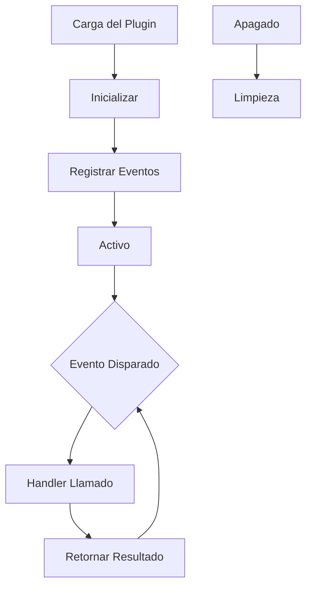

# Desarrollo de Plugins desde Cero

## Arquitectura de Plugins

Los plugins son paquetes de Node.js que extienden la funcionalidad de OpenCode:

```
.opencode/plugins/my-plugin/
├── package.json
├── src/
│   └── index.ts
├── assets/
├── examples/
├── references/
└── scripts/
```

---

## Ciclo de Vida del Plugin



| Fase | Descripción |
|------|-------------|
| **Carga** | El plugin es descubierto y cargado |
| **Inicializar** | El plugin configura recursos |
| **Registrar** | Los handlers de eventos son registrados |
| **Activo** | El plugin escucha eventos |
| **Apagado** | Limpieza y liberación de recursos |

---

## Creando un Plugin

### Paso 1: Inicializar Paquete

```bash
mkdir -p .opencode/plugins/code-metrics
cd .opencode/plugins/code-metrics
npm init -y
```

### Paso 2: Crear Entrada del Plugin

Crear `src/index.ts`:

```typescript
import { Plugin, PluginContext } from "opencode";

export default class CodeMetricsPlugin implements Plugin {
  name = "code-metrics";
  version = "1.0.0";

  async initialize(context: PluginContext) {
    console.log("Plugin de Métricas de Código inicializado");
  }

  async onFileWrite(filePath: string, content: string) {
    const lines = content.split("\n").length;
    const bytes = Buffer.byteLength(content);
    
    console.log(`Archivo escrito: ${filePath}`);
    console.log(`  Líneas: ${lines}`);
    console.log(`  Bytes: ${bytes}`);
    
    return { lines, bytes };
  }

  async onToolExecute(tool: string, args: any, result: any) {
    // Registrar métricas de uso de herramientas
    return {
      tool,
      timestamp: Date.now(),
      success: !result.error
    };
  }

  async shutdown() {
    console.log("Plugin de Métricas de Código apagándose");
  }
}
```

### Paso 3: Registrar Plugin

Agregar a `opencode.json`:

```json
{
  "plugins": {
    "code-metrics": {
      "path": ".opencode/plugins/code-metrics",
      "enabled": true
    }
  }
}
```

---

## Superficie de API del Plugin

### Eventos Disponibles

| Evento | Parámetros | Retorno |
|--------|------------|---------|
| `session.start` | `sessionId` | void |
| `session.end` | `sessionId` | void |
| `file.read` | `path, content` | `content` |
| `file.write` | `path, content` | `content` |
| `file.edit` | `path, old, new` | `new` |
| `tool.execute.before` | `tool, args` | `args` |
| `tool.execute.after` | `tool, args, result` | `result` |
| `agent.route` | `request, agent` | `agent` |

### Métodos de Contexto

```typescript
context.log(message: string, level: "info" | "warn" | "error");
context.getConfig(key: string): any;
context.setConfig(key: string, value: any): void;
context.getMemory(key: string): any;
context.setMemory(key: string, value: any): void;
```

---

## Ejemplo: Plugin de Escáner de Seguridad

```typescript
import { Plugin, PluginContext } from "opencode";

const DANGEROUS_PATTERNS = [
  /eval\s*\(/,
  /new\s+Function\s*\(/,
  /process\.exit/,
  /require\s*\(\s*['"]child_process['"]\s*\)/,
];

export default class SecurityScannerPlugin implements Plugin {
  name = "security-scanner";
  version = "1.0.0";

  async onFileWrite(path: string, content: string) {
    const warnings: string[] = [];

    for (const pattern of DANGEROUS_PATTERNS) {
      if (pattern.test(content)) {
        warnings.push(`Patrón potencialmente peligroso: ${pattern.source}`);
      }
    }

    if (warnings.length > 0) {
      console.warn(`Advertencias de seguridad para ${path}:`);
      warnings.forEach(w => console.warn(`  - ${w}`));
    }

    return { warnings };
  }
}
```

---

## Probando Plugins

### Pruebas Unitarias

```typescript
import CodeMetricsPlugin from "../src/index";

describe("CodeMetricsPlugin", () => {
  let plugin: CodeMetricsPlugin;

  beforeEach(() => {
    plugin = new CodeMetricsPlugin();
  });

  it("debería contar líneas correctamente", async () => {
    const result = await plugin.onFileWrite("test.ts", "line1\nline2\nline3");
    expect(result.lines).toBe(3);
  });

  it("debería contar bytes correctamente", async () => {
    const result = await plugin.onFileWrite("test.ts", "hello");
    expect(result.bytes).toBe(5);
  });
});
```

### Pruebas de Integración

```bash
npm test
```

---

## Mejores Prácticas

| Práctica | Razón |
|----------|-------|
| **Responsabilidad única** | Un plugin, un propósito |
| **Manejo de errores** | Degradación elegante |
| **Rendimiento** | No bloquear el hilo principal |
| **Registro** | Información de depuración útil |
| **Configuración** | Hacer el comportamiento ajustable |

---

## Practice Questions

```question
{
  "id": "oc-plugin-q1",
  "type": "multiple-choice",
  "question": "¿Cuál es la primera fase en el ciclo de vida del plugin?",
  "options": [
    "Inicializar",
    "Registrar",
    "Carga",
    "Activo"
  ],
  "correct": 2,
  "explanation": "El ciclo de vida del plugin comienza con Carga, donde el plugin es descubierto y cargado en OpenCode."
}
```

```question
{
  "id": "oc-plugin-q2",
  "type": "multiple-choice",
  "question": "¿Qué evento se dispara antes de que se escriba un archivo?",
  "options": [
    "file.write",
    "file.save",
    "file.create",
    "file.commit"
  ],
  "correct": 0,
  "explanation": "El evento file.write se dispara antes de que se escriba el contenido, permitiendo transformación o validación."
}
```

```question
{
  "id": "oc-plugin-q3",
  "type": "multiple-choice",
  "question": "¿Dónde se deben registrar los plugins?",
  "options": [
    "En el manifiesto de habilidades",
    "En opencode.json bajo la clave plugins",
    "En package.json",
    "En un archivo de configuración separado"
  ],
  "correct": 1,
  "explanation": "Los plugins se registran en opencode.json bajo la clave plugins con ruta y estado habilitado."
}
```

```question
{
  "id": "oc-plugin-q4",
  "type": "multiple-choice",
  "question": "¿Qué debe hacer un plugin durante el apagado?",
  "options": [
    "Eliminar todos los archivos",
    "Limpiar recursos y guardar estado",
    "Reiniciar la aplicación",
    "Enviar notificaciones"
  ],
  "correct": 1,
  "explanation": "Durante el apagado, los plugins deben limpiar recursos, guardar estado y liberar cualquier bloqueo."
}
```

```question
{
  "id": "oc-plugin-q5",
  "type": "multiple-choice",
  "question": "¿Cómo acceden los plugins a la configuración?",
  "options": [
    "Acceso directo a archivos",
    "Usando context.getConfig()",
    "Solo a través de variables de entorno",
    "Desde argumentos de línea de comandos"
  ],
  "correct": 1,
  "explanation": "Los plugins acceden a la configuración a través del método getConfig() del objeto contexto."
}
```

---

> [!SUCCESS]
> ### Key Takeaways

- Los plugins son paquetes de Node.js que extienden la funcionalidad de OpenCode
- El ciclo de vida incluye fases de Carga, Inicializar, Registrar, Activo y Apagado
- Usa el evento file.write para validar o transformar contenido antes de guardar
- Registra plugins en opencode.json bajo la clave plugins
- Sigue el principio de responsabilidad única para el diseño de plugins
- Siempre limpia recursos durante el apagado
- Prueba plugins con pruebas unitarias y de integración