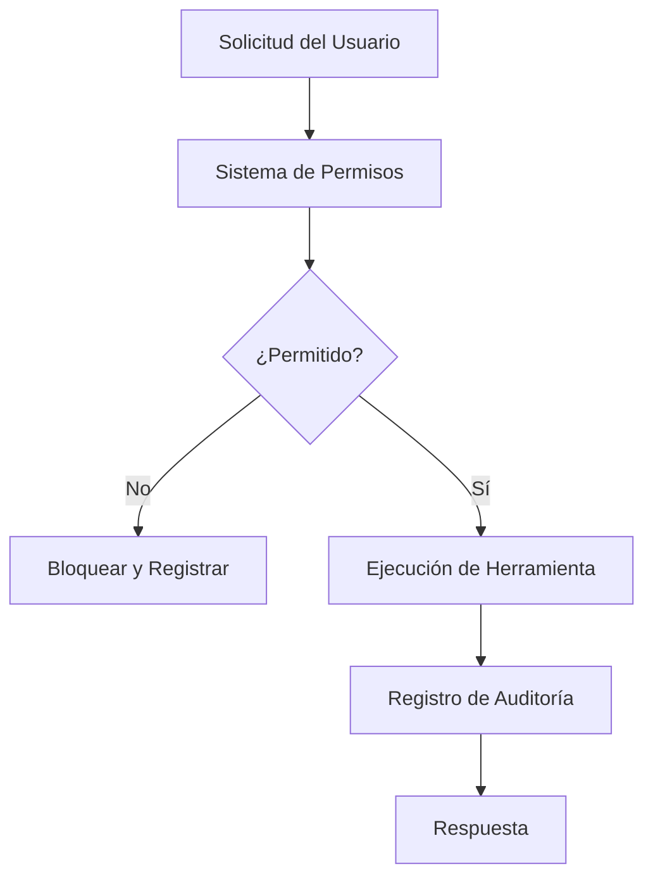

# Endurecimiento de Seguridad y Auditoría

## Capas de Seguridad



---

## Sistema de Permisos

### Principio de Menor Privilegio

```json
{
  "permissions": [
    {
      "tool": "bash",
      "allow": ["npm test", "npm run lint", "git status"],
      "deny": ["sudo *", "rm -rf *", "git push --force"]
    },
    {
      "tool": "write",
      "allow": ["src/**", "tests/**"],
      "deny": [".env*", "secrets/**", "*.key", "*.pem"]
    },
    {
      "tool": "read",
      "allow": ["**"],
      "deny": [".env*", "secrets/**"]
    }
  ]
}
```

### Patrones de Permisos

| Patrón | Ejemplo | Coincide con |
|--------|---------|--------------|
| Exacto | `npm test` | Solo `npm test` |
| Comodín | `npm *` | Cualquier comando npm |
| Ruta | `src/**` | Cualquier archivo en src/ |
| Negación | `*.key` | Cualquier archivo .key |

---

## Registro de Auditoría

### Habilitar Registro Integral

```json
{
  "logging": {
    "enabled": true,
    "level": "info",
    "file": "opencode-audit.log",
    "rotate": {
      "maxSize": "10MB",
      "maxFiles": 30
    }
  }
}
```

### Formato de Registro

```json
{
  "timestamp": "2024-01-15T10:30:00Z",
  "level": "info",
  "event": "tool.execute",
  "tool": "bash",
  "args": {"command": "npm test"},
  "result": "success",
  "user": "developer1",
  "session": "abc123"
}
```

### Analizando Registros

```bash
# Encontrar todas las operaciones fallidas
grep '"result":"error"' opencode-audit.log

# Encontrar comandos bash
grep '"tool":"bash"' opencode-audit.log

# Encontrar operaciones de escritura en archivos sensibles
grep '"tool":"write"' opencode-audit.log | grep -E '\.env|secrets'
```

---

## Gestión de Secretos

### Variables de Entorno

```bash
# .env (nunca commitear)
OPENAI_API_KEY=sk-your-key
ANTHROPIC_API_KEY=sk-ant-your-key
DATABASE_URL=postgresql://...
```

### Referencia en Configuración

```json
{
  "providers": {
    "openai": {
      "apiKey": "${OPENAI_API_KEY}"
    }
  }
}
```

### .gitignore

```gitignore
.env
.env.*
*.key
*.pem
secrets/
```

---

## Seguridad de Red

### Rotación de API Keys

```bash
# Generar nueva key
# Actualizar .env
# Reiniciar OpenCode
# Verificar que la key antigua está invalidada
```

### Limitación de Tasa

```json
{
  "providers": {
    "openai": {
      "apiKey": "${OPENAI_API_KEY}",
      "rateLimit": {
        "requests": 60,
        "window": "1m"
      }
    }
  }
}
```

### Configuración de Timeout

```json
{
  "providers": {
    "openai": {
      "timeout": 30000
    }
  }
}
```

---

## Patrones de Cumplimiento

### Residencia de Datos

```json
{
  "providers": {
    "openai": {
      "apiKey": "${OPENAI_API_KEY}",
      "region": "us-east-1"
    }
  }
}
```

### Retención de Datos

```json
{
  "logging": {
    "retention": {
      "days": 90,
      "autoDelete": true
    }
  }
}
```

### Redacción de PII

```json
{
  "security": {
    "redact": {
      "patterns": [
        "\\b\\d{3}-\\d{2}-\\d{4}\\b",
        "\\b[A-Za-z0-9._%+-]+@[A-Za-z0-9.-]+\\.[A-Z|a-z]{2,}\\b"
      ],
      "replacement": "[REDACTED]"
    }
  }
}
```

---

## Lista de Verificación de Seguridad

### Antes del Despliegue

- [ ] API keys en variables de entorno
- [ ] .env en .gitignore
- [ ] Reglas de permisos configuradas
- [ ] Registro de auditoría habilitado
- [ ] Limitación de tasa configurada
- [ ] Timeouts establecidos
- [ ] Redacción de PII habilitada

### Auditorías Regulares

- [ ] Revisar registros de auditoría semanalmente
- [ ] Rotar API keys mensualmente
- [ ] Actualizar reglas de permisos trimestralmente
- [ ] Revisar patrones de seguridad anualmente

---

## Practice Questions

```question
{
  "id": "oc-security-q1",
  "type": "multiple-choice",
  "question": "¿Qué es el principio de menor privilegio?",
  "options": [
    "Dar a los usuarios acceso máximo",
    "Dar a los usuarios solo el acceso que necesitan",
    "No dar acceso alguno",
    "Dar acceso basado solo en roles"
  ],
  "correct": 1,
  "explanation": "El menor privilegio significa otorgar solo los permisos mínimos necesarios para una tarea."
}
```

```question
{
  "id": "oc-security-q2",
  "type": "multiple-choice",
  "question": "¿Dónde se deben almacenar las API keys?",
  "options": [
    "En opencode.json",
    "En variables de entorno",
    "En el código fuente",
    "En una base de datos"
  ],
  "correct": 1,
  "explanation": "Las variables de entorno mantienen los secretos fuera del código y archivos de configuración."
}
```

```question
{
  "id": "oc-security-q3",
  "type": "multiple-choice",
  "question": "¿Qué hace la redacción de PII?",
  "options": [
    "Encripta todos los datos",
    "Elimina información personal identificable de los registros",
    "Comprime archivos de registro",
    "Envía alertas para datos sensibles"
  ],
  "correct": 1,
  "explanation": "La redacción de PII reemplaza patrones sensibles como emails y SSN con [REDACTED] en los registros."
}
```

```question
{
  "id": "oc-security-q4",
  "type": "multiple-choice",
  "question": "¿Con qué frecuencia se deben rotar las API keys?",
  "options": [
    "Nunca",
    "Una vez al año",
    "Mensualmente",
    "Diariamente"
  ],
  "correct": 2,
  "explanation": "La rotación mensual limita la exposición si una key es comprometida."
}
```

```question
{
  "id": "oc-security-q5",
  "type": "multiple-choice",
  "question": "¿Qué deben rastrear los registros de auditoría?",
  "options": [
    "Solo errores",
    "Todas las ejecuciones de herramientas con marcas de tiempo y resultados",
    "Solo operaciones exitosas",
    "Solo inicios de sesión de usuarios"
  ],
  "correct": 1,
  "explanation": "Los registros de auditoría integrales rastrean todas las ejecuciones de herramientas para seguridad y cumplimiento."
}
```

---

> [!SUCCESS]
> ### Key Takeaways

- Aplica el principio de menor privilegio a todas las reglas de permisos
- Almacena API keys en variables de entorno, nunca en código
- Habilita el registro integral de auditoría para cumplimiento
- Usa la redacción de PII para proteger datos sensibles en registros
- Rota API keys mensualmente y revisa permisos trimestralmente
- Configura límites de tasa y timeouts para prevenir abusos
- Las auditorías de seguridad regulares detectan problemas antes de que se conviertan en violaciones