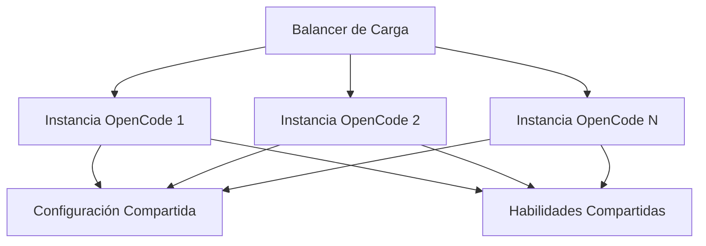

# Escalamiento de Despliegues Multiusuario

## Patrones de Arquitectura

| Patrón | Usuarios | Caso de Uso |
|--------|----------|-------------|
| **Single-user** | 1 | Desarrollo personal |
| **Team** | 2-10 | Equipos pequeños |
| **Department** | 10-50 | Equipos de ingeniería |
| **Enterprise** | 50+ | Organización completa |

---

## Arquitectura Multiusuario



---

## Gestión de Configuración

### Configuración Compartida

Crear un repositorio central de configuración:

```
config-repo/
├── opencode.json
├── .opencode/
│   ├── skills/
│   └── hooks/
└── README.md
```

### Distribución

```bash
# Sincronizar configuración
rsync -av config-repo/ /opt/opencode/config/

# O usar Git
cd /opt/opencode/config
git pull origin main
```

---

## Gestión de Recursos

### Agrupación de API Keys

```json
{
  "providers": {
    "openai": {
      "apiKeyPool": [
        "${OPENAI_KEY_1}",
        "${OPENAI_KEY_2}",
        "${OPENAI_KEY_3}"
      ],
      "strategy": "round-robin"
    }
  }
}
```

### Limitación de Tasa

```json
{
  "scaling": {
    "rateLimit": {
      "perUser": {
        "requests": 100,
        "window": "1h"
      },
      "global": {
        "requests": 1000,
        "window": "1h"
      }
    }
  }
}
```

### Cuotas de Recursos

```json
{
  "scaling": {
    "quotas": {
      "maxConcurrentSessions": 50,
      "maxTokensPerUser": 1000000,
      "maxStoragePerUser": "1GB"
    }
  }
}
```

---

## Optimización de Rendimiento

### Caché

```json
{
  "scaling": {
    "cache": {
      "enabled": true,
      "type": "redis",
      "url": "redis://localhost:6379",
      "ttl": 3600
    }
  }
}
```

### Agrupación de Conexiones

```json
{
  "scaling": {
    "connectionPool": {
      "maxConnections": 100,
      "idleTimeout": 30000
    }
  }
}
```

### Balanceo de Carga

```yaml
# nginx.conf
upstream opencode {
    least_conn;
    server opencode1:3000;
    server opencode2:3000;
    server opencode3:3000;
}

server {
    listen 443;
    location / {
        proxy_pass http://opencode;
    }
}
```

---

## Gestión de Usuarios

### Acceso Basado en Roles

```json
{
  "users": {
    "admin": {
      "role": "admin",
      "permissions": ["*"]
    },
    "developer": {
      "role": "developer",
      "permissions": ["read", "write", "execute"]
    },
    "viewer": {
      "role": "viewer",
      "permissions": ["read"]
    }
  }
}
```

### Gestión de Sesiones

```json
{
  "scaling": {
    "sessions": {
      "maxConcurrent": 10,
      "timeout": 3600,
      "cleanupInterval": 300
    }
  }
}
```

---

## Monitoreo

### Recolección de Métricas

```json
{
  "monitoring": {
    "enabled": true,
    "metrics": {
      "requests": true,
      "latency": true,
      "errors": true,
      "tokens": true
    },
    "export": {
      "prometheus": {
        "enabled": true,
        "port": 9090
      }
    }
  }
}
```

### Verificaciones de Salud

```bash
# Verificar salud de la instancia
curl http://localhost:3000/health

# Respuesta
{
  "status": "healthy",
  "uptime": 86400,
  "sessions": 45,
  "memory": "2.5GB"
}
```

---

## Opciones de Despliegue

### Docker

```dockerfile
FROM node:18-alpine
RUN npm install -g opencode
COPY opencode.json /app/
WORKDIR /app
CMD ["opencode", "--host", "0.0.0.0"]
```

### Kubernetes

```yaml
apiVersion: apps/v1
kind: Deployment
metadata:
  name: opencode
spec:
  replicas: 3
  selector:
    matchLabels:
      app: opencode
  template:
    spec:
      containers:
      - name: opencode
        image: opencode:latest
        ports:
        - containerPort: 3000
        env:
        - name: OPENAI_API_KEY
          valueFrom:
            secretKeyRef:
              name: opencode-secrets
              key: api-key
```

---

## Mejores Prácticas

| Práctica | Razón |
|----------|-------|
| **Configuración centralizada** | Comportamiento consistente |
| **Agrupación de API keys** | Optimización de costos |
| **Limitación de tasa** | Uso justo |
| **Monitoreo** | Visibilidad |
| **Verificaciones de salud** | Fiabilidad |
| **Auto-escalado** | Rendimiento |

---

## Practice Questions

```question
{
  "id": "oc-scale-q1",
  "type": "multiple-choice",
  "question": "¿Cuál es el beneficio de la agrupación de API keys?",
  "options": [
    "Mejor seguridad",
    "Optimización de costos y distribución de límites de tasa",
    "Respuestas más rápidas",
    "Configuración más simple"
  ],
  "correct": 1,
  "explanation": "La agrupación de API keys distribuye solicitudes entre múltiples keys para optimización de costos y gestión de límites de tasa."
}
```

```question
{
  "id": "oc-scale-q2",
  "type": "multiple-choice",
  "question": "¿Qué previene la limitación de tasa?",
  "options": [
    "Brechas de seguridad",
    "Abuso y sobreuso de la API",
    "Errores de configuración",
    "Interrupciones de red"
  ],
  "correct": 1,
  "explanation": "La limitación de tasa previene abusos y asegura un uso justo entre usuarios."
}
```

```question
{
  "id": "oc-scale-q3",
  "type": "multiple-choice",
  "question": "¿Por qué usar un balanceador de carga?",
  "options": [
    "Para encriptar tráfico",
    "Para distribuir solicitudes entre instancias",
    "Para cachear respuestas",
    "Para almacenar secretos"
  ],
  "correct": 1,
  "explanation": "Los balanceadores de carga distribuyen solicitudes entre múltiples instancias para escalabilidad y fiabilidad."
}
```

```question
{
  "id": "oc-scale-q4",
  "type": "multiple-choice",
  "question": "¿Qué debes monitorear en un despliegue multiusuario?",
  "options": [
    "Solo errores",
    "Solicitudes, latencia, tokens y errores",
    "Solo inicios de sesión de usuarios",
    "Solo costos de API"
  ],
  "correct": 1,
  "explanation": "El monitoreo integral rastrea solicitudes, latencia, uso de tokens y errores para visibilidad completa."
}
```

```question
{
  "id": "oc-scale-q5",
  "type": "multiple-choice",
  "question": "¿Cómo distribuyes la configuración a múltiples instancias?",
  "options": [
    "Copiar archivos manualmente",
    "Usar un repositorio central de configuración con sincronización",
    "Almacenar en una base de datos",
    "Usar solo variables de entorno"
  ],
  "correct": 1,
  "explanation": "Un repositorio central de configuración con sincronización asegura que todas las instancias tengan configuración consistente."
}
```

---

> [!SUCCESS]
> ### Key Takeaways

- Usa configuración centralizada para comportamiento consistente entre instancias
- La agrupación de API keys distribuye costos y límites de tasa
- La limitación de tasa previene abusos y asegura uso justo
- El caché con Redis mejora tiempos de respuesta
- El balanceo de carga distribuye solicitudes para escalabilidad
- Monitorea solicitudes, latencia, tokens y errores
- Docker y Kubernetes permiten despliegues escalables