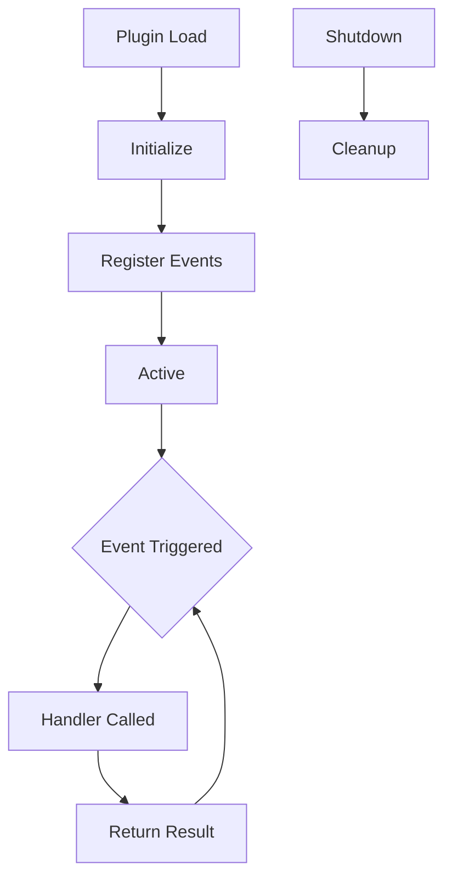

# Desenvolvimento de Plugins do Zero

## Arquitetura de Plugins

Plugins são pacotes Node.js que estendem a funcionalidade do OpenCode:

```
.opencode/plugins/my-plugin/
├── package.json
├── src/
│   └── index.ts
├── assets/
├── examples/
├── references/
└── scripts/
```

---

## Ciclo de Vida do Plugin



| Fase | Descrição |
|-------|-------------|
| **Load** | O plugin é descoberto e carregado |
| **Initialize** | O plugin configura recursos |
| **Register** | Os handlers de eventos são registrados |
| **Active** | O plugin escuta eventos |
| **Shutdown** | Limpeza e liberação de recursos |

---

## Criando um Plugin

### Passo 1: Inicializar o Pacote

```bash
mkdir -p .opencode/plugins/code-metrics
cd .opencode/plugins/code-metrics
npm init -y
```

### Passo 2: Criar o Entry do Plugin

Crie `src/index.ts`:

```typescript
import { Plugin, PluginContext } from "opencode";

export default class CodeMetricsPlugin implements Plugin {
  name = "code-metrics";
  version = "1.0.0";

  async initialize(context: PluginContext) {
    console.log("Code Metrics plugin initialized");
  }

  async onFileWrite(filePath: string, content: string) {
    const lines = content.split("\n").length;
    const bytes = Buffer.byteLength(content);
    
    console.log(`File written: ${filePath}`);
    console.log(`  Lines: ${lines}`);
    console.log(`  Bytes: ${bytes}`);
    
    return { lines, bytes };
  }

  async onToolExecute(tool: string, args: any, result: any) {
    // Log tool usage metrics
    return {
      tool,
      timestamp: Date.now(),
      success: !result.error
    };
  }

  async shutdown() {
    console.log("Code Metrics plugin shutting down");
  }
}
```

### Passo 3: Registrar o Plugin

Adicione ao `opencode.json`:

```json
{
  "plugins": {
    "code-metrics": {
      "path": ".opencode/plugins/code-metrics",
      "enabled": true
    }
  }
}
```

---

## API Surface do Plugin

### Eventos Disponíveis

| Evento | Parâmetros | Retorno |
|-------|------------|--------|
| `session.start` | `sessionId` | void |
| `session.end` | `sessionId` | void |
| `file.read` | `path, content` | `content` |
| `file.write` | `path, content` | `content` |
| `file.edit` | `path, old, new` | `new` |
| `tool.execute.before` | `tool, args` | `args` |
| `tool.execute.after` | `tool, args, result` | `result` |
| `agent.route` | `request, agent` | `agent` |

### Métodos do Context

```typescript
context.log(message: string, level: "info" | "warn" | "error");
context.getConfig(key: string): any;
context.setConfig(key: string, value: any): void;
context.getMemory(key: string): any;
context.setMemory(key: string, value: any): void;
```

---

## Exemplo: Plugin de Scanner de Segurança

```typescript
import { Plugin, PluginContext } from "opencode";

const DANGEROUS_PATTERNS = [
  /eval\s*\(/,
  /new\s+Function\s*\(/,
  /process\.exit/,
  /require\s*\(\s*['"]child_process['"]\s*\)/,
];

export default class SecurityScannerPlugin implements Plugin {
  name = "security-scanner";
  version = "1.0.0";

  async onFileWrite(path: string, content: string) {
    const warnings: string[] = [];

    for (const pattern of DANGEROUS_PATTERNS) {
      if (pattern.test(content)) {
        warnings.push(`Potentially dangerous pattern: ${pattern.source}`);
      }
    }

    if (warnings.length > 0) {
      console.warn(`Security warnings for ${path}:`);
      warnings.forEach(w => console.warn(`  - ${w}`));
    }

    return { warnings };
  }
}
```

---

## Testando Plugins

### Testes Unitários

```typescript
import CodeMetricsPlugin from "../src/index";

describe("CodeMetricsPlugin", () => {
  let plugin: CodeMetricsPlugin;

  beforeEach(() => {
    plugin = new CodeMetricsPlugin();
  });

  it("should count lines correctly", async () => {
    const result = await plugin.onFileWrite("test.ts", "line1\nline2\nline3");
    expect(result.lines).toBe(3);
  });

  it("should count bytes correctly", async () => {
    const result = await plugin.onFileWrite("test.ts", "hello");
    expect(result.bytes).toBe(5);
  });
});
```

### Testes de Integração

```bash
npm test
```

---

## Melhores Práticas

| Prática | Motivo |
|----------|--------|
| **Responsabilidade única** | Um plugin, um propósito |
| **Tratamento de erros** | Degradation graciosa |
| **Performance** | Não bloquear a thread principal |
| **Logging** | Informações úteis de debug |
| **Configuração** | Tornar o comportamento ajustável |

---

## Practice Questions

```question
{
  "id": "oc-plugin-q1",
  "type": "multiple-choice",
  "question": "Qual é a primeira fase no ciclo de vida do plugin?",
  "options": [
    "Initialize",
    "Register",
    "Load",
    "Active"
  ],
  "correct": 2,
  "explanation": "O ciclo de vida do plugin começa com Load, onde o plugin é descoberto e carregado no OpenCode."
}
```

```question
{
  "id": "oc-plugin-q2",
  "type": "multiple-choice",
  "question": "Qual evento dispara antes de um arquivo ser escrito?",
  "options": [
    "file.write",
    "file.save",
    "file.create",
    "file.commit"
  ],
  "correct": 0,
  "explanation": "O evento file.write dispara antes do conteúdo ser escrito, permitindo transformação ou validação."
}
```

```question
{
  "id": "oc-plugin-q3",
  "type": "multiple-choice",
  "question": "Onde os plugins devem ser registrados?",
  "options": [
    "No skill manifest",
    "No opencode.json sob a chave plugins",
    "No package.json",
    "Em um arquivo de configuração separado"
  ],
  "correct": 1,
  "explanation": "Os plugins são registrados no opencode.json sob a chave plugins com caminho e status habilitado."
}
```

```question
{
  "id": "oc-plugin-q4",
  "type": "multiple-choice",
  "question": "O que um plugin deve fazer durante o shutdown?",
  "options": [
    "Excluir todos os arquivos",
    "Limpar recursos e salvar estado",
    "Reiniciar a aplicação",
    "Enviar notificações"
  ],
  "correct": 1,
  "explanation": "Durante o shutdown, os plugins devem limpar recursos, salvar estado e liberar qualquer trava."
}
```

```question
{
  "id": "oc-plugin-q5",
  "type": "multiple-choice",
  "question": "Como os plugins acessam a configuração?",
  "options": [
    "Acesso direto a arquivos",
    "Usando context.getConfig()",
    "Apenas através de variáveis de ambiente",
    "De argumentos da linha de comando"
  ],
  "correct": 1,
  "explanation": "Os plugins acessam a configuração através do método getConfig() do objeto context."
}
```

---

> [!SUCCESS]
> ### Key Takeaways

- Plugins são pacotes Node.js que estendem a funcionalidade do OpenCode
- O ciclo de vida inclui as fases Load, Initialize, Register, Active e Shutdown
- Use o evento file.write para validar ou transformar o conteúdo antes de salvar
- Registre plugins no opencode.json sob a chave plugins
- Siga o princípio de responsabilidade única para o design de plugins
- Sempre limpe recursos durante o shutdown
- Teste plugins com testes unitários e de integração
