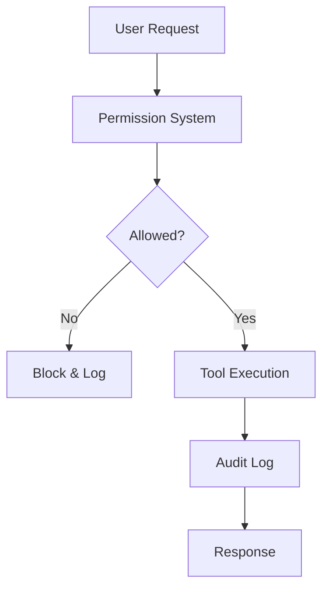

# Endurecimento de Segurança e Auditoria

## Camadas de Segurança



---

## Sistema de Permissões

### Princípio do Menor Privilégio

```json
{
  "permissions": [
    {
      "tool": "bash",
      "allow": ["npm test", "npm run lint", "git status"],
      "deny": ["sudo *", "rm -rf *", "git push --force"]
    },
    {
      "tool": "write",
      "allow": ["src/**", "tests/**"],
      "deny": [".env*", "secrets/**", "*.key", "*.pem"]
    },
    {
      "tool": "read",
      "allow": ["**"],
      "deny": [".env*", "secrets/**"]
    }
  ]
}
```

### Padrões de Permissão

| Padrão | Exemplo | Correspondência |
|---------|---------|---------|
| Exato | `npm test` | Apenas `npm test` |
| Curinga | `npm *` | Qualquer comando npm |
| Caminho | `src/**` | Qualquer arquivo em src/ |
| Negação | `*.key` | Qualquer arquivo .key |

---

## Logging de Auditoria

### Habilitar Logging Abrangente

```json
{
  "logging": {
    "enabled": true,
    "level": "info",
    "file": "opencode-audit.log",
    "rotate": {
      "maxSize": "10MB",
      "maxFiles": 30
    }
  }
}
```

### Formato do Log

```json
{
  "timestamp": "2024-01-15T10:30:00Z",
  "level": "info",
  "event": "tool.execute",
  "tool": "bash",
  "args": {"command": "npm test"},
  "result": "success",
  "user": "developer1",
  "session": "abc123"
}
```

### Analisando Logs

```bash
# Find all failed operations
grep '"result":"error"' opencode-audit.log

# Find bash commands
grep '"tool":"bash"' opencode-audit.log

# Find write operations to sensitive files
grep '"tool":"write"' opencode-audit.log | grep -E '\.env|secrets'
```

---

## Gerenciamento de Segredos

### Variáveis de Ambiente

```bash
# .env (never commit)
OPENAI_API_KEY=sk-your-key
ANTHROPIC_API_KEY=sk-ant-your-key
DATABASE_URL=postgresql://...
```

### Referência na Configuração

```json
{
  "providers": {
    "openai": {
      "apiKey": "${OPENAI_API_KEY}"
    }
  }
}
```

### .gitignore

```gitignore
.env
.env.*
*.key
*.pem
secrets/
```

---

## Segurança de Rede

### Rotação de Chaves de API

```bash
# Generate new key
# Update .env
# Restart OpenCode
# Verify old key is invalidated
```

### Limitação de Taxa

```json
{
  "providers": {
    "openai": {
      "apiKey": "${OPENAI_API_KEY}",
      "rateLimit": {
        "requests": 60,
        "window": "1m"
      }
    }
  }
}
```

### Configuração de Timeout

```json
{
  "providers": {
    "openai": {
      "timeout": 30000
    }
  }
}
```

---

## Padrões de Conformidade

### Residência de Dados

```json
{
  "providers": {
    "openai": {
      "apiKey": "${OPENAI_API_KEY}",
      "region": "us-east-1"
    }
  }
}
```

### Retenção de Dados

```json
{
  "logging": {
    "retention": {
      "days": 90,
      "autoDelete": true
    }
  }
}
```

### Redação de PII

```json
{
  "security": {
    "redact": {
      "patterns": [
        "\\b\\d{3}-\\d{2}-\\d{4}\\b",
        "\\b[A-Za-z0-9._%+-]+@[A-Za-z0-9.-]+\\.[A-Z|a-z]{2,}\\b"
      ],
      "replacement": "[REDACTED]"
    }
  }
}
```

---

## Checklist de Segurança

### Antes do Deploy

- [ ] Chaves de API em variáveis de ambiente
- [ ] .env no .gitignore
- [ ] Regras de permissão configuradas
- [ ] Logging de auditoria habilitado
- [ ] Limitação de taxa configurada
- [ ] Timeouts definidos
- [ ] Redação de PII habilitada

### Auditorias Regulares

- [ ] Revisar logs de auditoria semanalmente
- [ ] Rotacionar chaves de API mensalmente
- [ ] Atualizar regras de permissão trimestralmente
- [ ] Revisar padrões de segurança anualmente

---

## Practice Questions

```question
{
  "id": "oc-security-q1",
  "type": "multiple-choice",
  "question": "O que é o princípio do menor privilégio?",
  "options": [
    "Dar aos usuários acesso máximo",
    "Dar aos usuários apenas o acesso necessário",
    "Não dar acesso nenhum",
    "Dar acesso baseado apenas em função"
  ],
  "correct": 1,
  "explanation": "Menor privilégio significa conceder apenas as permissões mínimas necessárias para uma tarefa."
}
```

```question
{
  "id": "oc-security-q2",
  "type": "multiple-choice",
  "question": "Onde as chaves de API devem ser armazenadas?",
  "options": [
    "No opencode.json",
    "Em variáveis de ambiente",
    "No codebase",
    "Em um banco de dados"
  ],
  "correct": 1,
  "explanation": "Variáveis de ambiente mantêm segredos fora do código e arquivos de configuração."
}
```

```question
{
  "id": "oc-security-q3",
  "type": "multiple-choice",
  "question": "O que faz a redação de PII?",
  "options": [
    "Criptografa todos os dados",
    "Remove informações pessoalmente identificáveis dos logs",
    "Comprime arquivos de log",
    "Envia alertas para dados sensíveis"
  ],
  "correct": 1,
  "explanation": "A redação de PII substitui padrões sensíveis como e-mails e CPFs por [REDACTED] nos logs."
}
```

```question
{
  "id": "oc-security-q4",
  "type": "multiple-choice",
  "question": "Com que frequência você deve rotacionar as chaves de API?",
  "options": [
    "Nunca",
    "Uma vez por ano",
    "Mensalmente",
    "Diariamente"
  ],
  "correct": 2,
  "explanation": "A rotação mensal limita a exposição caso uma chave seja comprometida."
}
```

```question
{
  "id": "oc-security-q5",
  "type": "multiple-choice",
  "question": "O que os logs de auditoria devem rastrear?",
  "options": [
    "Apenas erros",
    "Todas as execuções de ferramentas com timestamps e resultados",
    "Apenas operações bem-sucedidas",
    "Apenas logins de usuários"
  ],
  "correct": 1,
  "explanation": "Logs de auditoria abrangentes rastreiam todas as execuções de ferramentas para segurança e conformidade."
}
```

---

> [!SUCCESS]
> ### Key Takeaways

- Aplique o princípio do menor privilégio a todas as regras de permissão
- Armazene chaves de API em variáveis de ambiente, nunca no código
- Habilite logging de auditoria abrangente para conformidade
- Use redação de PII para proteger dados sensíveis nos logs
- Rotacione chaves de API mensalmente e revise permissões trimestralmente
- Configure limites de taxa e timeouts para prevenir abusos
- Auditorias regulares de segurança detectam problemas antes que se tornem violações
