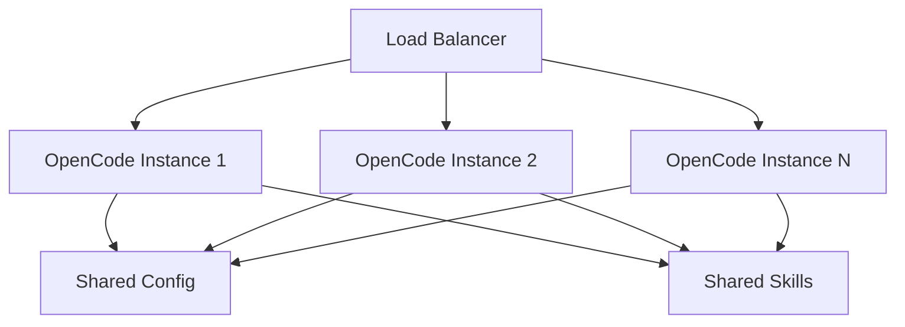

# Escalonamento de Deploys Multiusuário

## Padrões de Arquitetura

| Padrão | Usuários | Caso de Uso |
|---------|-------|----------|
| **Usuário único** | 1 | Desenvolvimento pessoal |
| **Equipe** | 2-10 | Pequenas equipes |
| **Departamento** | 10-50 | Equipes de engenharia |
| **Empresarial** | 50+ | Organização inteira |

---

## Arquitetura Multiusuário



---

## Gerenciamento de Configuração

### Configuração Compartilhada

Crie um repositório central de configuração:

```
config-repo/
├── opencode.json
├── .opencode/
│   ├── skills/
│   └── hooks/
└── README.md
```

### Distribuição

```bash
# Sync configuration
rsync -av config-repo/ /opt/opencode/config/

# Or use Git
cd /opt/opencode/config
git pull origin main
```

---

## Gerenciamento de Recursos

### Pooling de Chaves de API

```json
{
  "providers": {
    "openai": {
      "apiKeyPool": [
        "${OPENAI_KEY_1}",
        "${OPENAI_KEY_2}",
        "${OPENAI_KEY_3}"
      ],
      "strategy": "round-robin"
    }
  }
}
```

### Limitação de Taxa

```json
{
  "scaling": {
    "rateLimit": {
      "perUser": {
        "requests": 100,
        "window": "1h"
      },
      "global": {
        "requests": 1000,
        "window": "1h"
      }
    }
  }
}
```

### Quotas de Recursos

```json
{
  "scaling": {
    "quotas": {
      "maxConcurrentSessions": 50,
      "maxTokensPerUser": 1000000,
      "maxStoragePerUser": "1GB"
    }
  }
}
```

---

## Otimização de Performance

### Cache

```json
{
  "scaling": {
    "cache": {
      "enabled": true,
      "type": "redis",
      "url": "redis://localhost:6379",
      "ttl": 3600
    }
  }
}
```

### Pooling de Conexões

```json
{
  "scaling": {
    "connectionPool": {
      "maxConnections": 100,
      "idleTimeout": 30000
    }
  }
}
```

### Balanceamento de Carga

```yaml
# nginx.conf
upstream opencode {
    least_conn;
    server opencode1:3000;
    server opencode2:3000;
    server opencode3:3000;
}

server {
    listen 443;
    location / {
        proxy_pass http://opencode;
    }
}
```

---

## Gerenciamento de Usuários

### Acesso Baseado em Função

```json
{
  "users": {
    "admin": {
      "role": "admin",
      "permissions": ["*"]
    },
    "developer": {
      "role": "developer",
      "permissions": ["read", "write", "execute"]
    },
    "viewer": {
      "role": "viewer",
      "permissions": ["read"]
    }
  }
}
```

### Gerenciamento de Sessões

```json
{
  "scaling": {
    "sessions": {
      "maxConcurrent": 10,
      "timeout": 3600,
      "cleanupInterval": 300
    }
  }
}
```

---

## Monitoramento

### Coleta de Métricas

```json
{
  "monitoring": {
    "enabled": true,
    "metrics": {
      "requests": true,
      "latency": true,
      "errors": true,
      "tokens": true
    },
    "export": {
      "prometheus": {
        "enabled": true,
        "port": 9090
      }
    }
  }
}
```

### Health Checks

```bash
# Check instance health
curl http://localhost:3000/health

# Response
{
  "status": "healthy",
  "uptime": 86400,
  "sessions": 45,
  "memory": "2.5GB"
}
```

---

## Opções de Deploy

### Docker

```dockerfile
FROM node:18-alpine
RUN npm install -g opencode
COPY opencode.json /app/
WORKDIR /app
CMD ["opencode", "--host", "0.0.0.0"]
```

### Kubernetes

```yaml
apiVersion: apps/v1
kind: Deployment
metadata:
  name: opencode
spec:
  replicas: 3
  selector:
    matchLabels:
      app: opencode
  template:
    spec:
      containers:
      - name: opencode
        image: opencode:latest
        ports:
        - containerPort: 3000
        env:
        - name: OPENAI_API_KEY
          valueFrom:
            secretKeyRef:
              name: opencode-secrets
              key: api-key
```

---

## Melhores Práticas

| Prática | Motivo |
|----------|--------|
| **Configuração centralizada** | Comportamento consistente |
| **Pooling de chaves de API** | Otimização de custos |
| **Limitação de taxa** | Uso justo |
| **Monitoramento** | Visibilidade |
| **Health checks** | Confiabilidade |
| **Auto-escalonamento** | Performance |

---

## Practice Questions

```question
{
  "id": "oc-scale-q1",
  "type": "multiple-choice",
  "question": "Qual é o benefício do pooling de chaves de API?",
  "options": [
    "Melhor segurança",
    "Otimização de custos e distribuição de limites de taxa",
    "Respostas mais rápidas",
    "Configuração mais simples"
  ],
  "correct": 1,
  "explanation": "O pooling de chaves de API distribui requisições entre múltiplas chaves para otimização de custos e gerenciamento de limites de taxa."
}
```

```question
{
  "id": "oc-scale-q2",
  "type": "multiple-choice",
  "question": "O que a limitação de taxa previne?",
  "options": [
    "Violações de segurança",
    "Abuso e uso excessivo da API",
    "Erros de configuração",
    "Interrupções de rede"
  ],
  "correct": 1,
  "explanation": "A limitação de taxa previne abusos e garante uso justo entre usuários."
}
```

```question
{
  "id": "oc-scale-q3",
  "type": "multiple-choice",
  "question": "Por que usar um balanceador de carga?",
  "options": [
    "Para criptografar o tráfego",
    "Para distribuir requisições entre instâncias",
    "Para armazenar respostas em cache",
    "Para armazenar segredos"
  ],
  "correct": 1,
  "explanation": "Balanceadores de carga distribuem requisições entre múltiplas instâncias para escalabilidade e confiabilidade."
}
```

```question
{
  "id": "oc-scale-q4",
  "type": "multiple-choice",
  "question": "O que você deve monitorar em um deploy multiusuário?",
  "options": [
    "Apenas erros",
    "Requisições, latência, tokens e erros",
    "Apenas logins de usuários",
    "Apenas custos de API"
  ],
  "correct": 1,
  "explanation": "Monitoramento abrangente rastreia requisições, latência, uso de tokens e erros para visibilidade completa."
}
```

```question
{
  "id": "oc-scale-q5",
  "type": "multiple-choice",
  "question": "Como você distribui configuração para múltiplas instâncias?",
  "options": [
    "Copiar arquivos manualmente",
    "Usar um repositório central de configuração com sincronização",
    "Armazenar em um banco de dados",
    "Usar apenas variáveis de ambiente"
  ],
  "correct": 1,
  "explanation": "Um repositório central de configuração com sincronização garante que todas as instâncias tenham configuração consistente."
}
```

---

> [!SUCCESS]
> ### Key Takeaways

- Use configuração centralizada para comportamento consistente entre instâncias
- Pooling de chaves de API distribui custos e limites de taxa
- Limitação de taxa previne abusos e garante uso justo
- Cache com Redis melhora tempos de resposta
- Balanceamento de carga distribui requisições para escalabilidade
- Monitore requisições, latência, tokens e erros
- Docker e Kubernetes permitem deploys escaláveis
