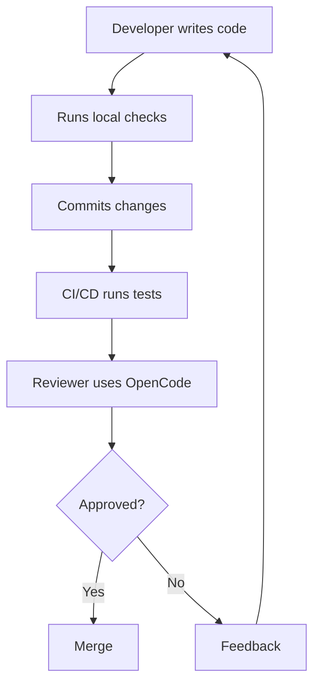

# Team Collaboration Workflows

## Why Team Configuration?

| Benefit | Description |
|---------|-------------|
| **Consistency** | Same behavior across team |
| **Knowledge sharing** | Shared skills and prompts |
| **Security** | Controlled permissions |
| **Auditability** | Track AI usage |

---

## Configuration Sharing

### Version Control Strategy

```
your-project/
├── .opencode/
│   ├── config.json          # ✅ Commit (team config)
│   ├── skills/              # ✅ Commit (shared skills)
│   └── memory/              # ❌ Don't commit (personal)
├── opencode.json            # ✅ Commit (legacy format)
└── .env                     # ❌ Don't commit (secrets)
```

### .gitignore

```gitignore
# OpenCode
.env
.opencode/memory/
.opencode/sessions/
*.log
```

### Shared Configuration

Create `.opencode/config.json`:

```json
{
  "$schema": "https://opencode.ai/config.json",
  "agents": {
    "default": {
      "model": "gpt-4o",
      "description": "Team coding assistant"
    }
  },
  "permissions": [
    {
      "tool": "bash",
      "allow": ["npm *", "git *", "pytest *"],
      "deny": ["sudo *", "rm -rf /"]
    }
  ],
  "skills": {
    "code-review": {
      "manifest": ".opencode/skills/code-review/skill.yaml"
    }
  }
}
```

---

## Role-Based Configuration

### Different Roles, Different Configs

Create role-specific config files:

```bash
.config/
├── opencode-developer.json
├── opencode-reviewer.json
└── opencode-lead.json
```

### Usage

```bash
# Developer mode
opencode --config .config/opencode-developer.json

# Reviewer mode
opencode --config .config/opencode-reviewer.json
```

---

## Shared Skills

### Create Team Skills

```
.opencode/skills/
├── code-review/
│   ├── skill.yaml
│   └── skill.md
├── api-design/
│   ├── skill.yaml
│   └── skill.md
└── testing/
    ├── skill.yaml
    └── skill.md
```

### Share via Git

```bash
git add .opencode/skills/
git commit -m "Add team skills"
git push
```

---

## Collaborative Patterns

### Code Review Workflow



### Pair Programming

```
> Switch to pair mode
> Load shared project context
> Let's work on the authentication module together
```

### Knowledge Transfer

```
> Summarize our architecture decisions into a memory file
> Create a guide for new developers
```

---

## Security Best Practices

### Permission Isolation

```json
{
  "permissions": [
    {
      "tool": "bash",
      "allow": ["npm test", "npm run lint"],
      "deny": ["npm publish", "git push --force"]
    },
    {
      "tool": "write",
      "allow": ["src/**", "tests/**"],
      "deny": [".env", "secrets/**", "*.key"]
    }
  ]
}
```

### Secrets Management

| Practice | Implementation |
|----------|----------------|
| Use environment variables | `${API_KEY}` in config |
| Never commit secrets | Add .env to .gitignore |
| Rotate regularly | Update keys monthly |
| Audit access | Log all API calls |

---

## Monitoring and Auditing

### Enable Logging

```json
{
  "logging": {
    "enabled": true,
    "level": "info",
    "file": "opencode-audit.log"
  }
}
```

### Track Usage

```bash
# View audit log
tail -f opencode-audit.log

# Search for specific actions
grep "bash" opencode-audit.log
```

---

## Onboarding New Team Members

### Checklist

1. Clone repository
2. Install OpenCode
3. Copy `.env.example` to `.env`
4. Add API keys
5. Run `opencode` to verify

### Documentation

Create `docs/opencode-setup.md`:

```markdown
# OpenCode Setup

## Prerequisites
- Node.js 18+
- API key from OpenAI or Anthropic

## Setup
1. npm install -g opencode
2. cp .env.example .env
3. Add your API key to .env
4. opencode --version

## Usage
- `opencode` - Start interactive session
- `opencode run "task"` - Run single prompt
```

---

## Practice Questions

```question
{
  "id": "oc-team-q1",
  "type": "multiple-choice",
  "question": "Which files should be committed to version control?",
  "options": [
    ".env and opencode.json",
    "opencode.json and .opencode/skills/",
    ".opencode/memory/ and .env",
    "All files in .opencode/"
  ],
  "correct": 1,
  "explanation": "Commit configuration files and shared skills, but never commit secrets (.env) or personal memory files."
}
```

```question
{
  "id": "oc-team-q2",
  "type": "multiple-choice",
  "question": "How do you share skills with your team?",
  "options": [
    "Copy them manually",
    "Commit them to version control",
    "Email them",
    "Use a separate skill server"
  ],
  "correct": 1,
  "explanation": "Store skills in .opencode/skills/ and commit them to version control so all team members have access."
}
```

```question
{
  "id": "oc-team-q3",
  "type": "multiple-choice",
  "question": "What is the benefit of role-based configuration?",
  "options": [
    "Faster performance",
    "Different permissions for different roles",
    "Lower cost",
    "Simpler setup"
  ],
  "correct": 1,
  "explanation": "Role-based configuration allows different permissions and behaviors for developers, reviewers, and leads."
}
```

```question
{
  "id": "oc-team-q4",
  "type": "multiple-choice",
  "question": "How do you prevent accidental deletion of production data?",
  "options": [
    "Use a different AI model",
    "Add deny rules for dangerous commands",
    "Disable bash tool entirely",
    "Use a VPN"
  ],
  "correct": 1,
  "explanation": "Add deny rules for dangerous commands like 'rm -rf /' and 'sudo' to prevent accidental data loss."
}
```

```question
{
  "id": "oc-team-q5",
  "type": "multiple-choice",
  "question": "What should you do when onboarding a new team member?",
  "options": [
    "Give them admin access",
    "Walk through setup checklist and documentation",
    "Skip setup, they'll figure it out",
    "Create a custom model for them"
  ],
  "correct": 1,
  "explanation": "A structured onboarding checklist and documentation ensures consistent setup and reduces friction."
}
```

---

> [!SUCCESS]
> ### Key Takeaways

- Version control shared configuration and skills, but not secrets
- Role-based configuration provides appropriate permissions for each team member
- Shared skills in `.opencode/skills/` ensure consistent behavior
- Deny rules prevent dangerous operations like force push or data deletion
- Enable logging for audit trails and usage tracking
- Document setup procedures for new team members
- Personal memory files should not be committed to version control