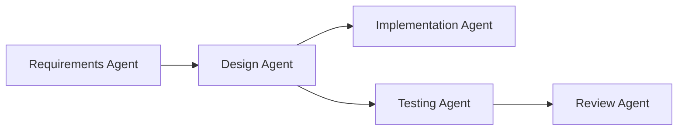
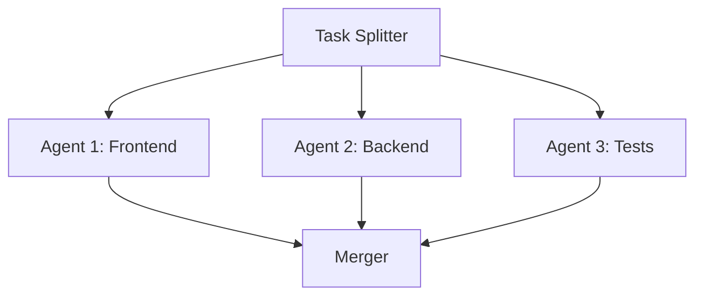

# Patrones de Orquestación Multi-Agente

## ¿Por Qué Multi-Agente?

Los agentes individuales funcionan bien para tareas simples, pero los proyectos complejos se benefician de agentes especializados trabajando juntos.

| Patrón | Caso de Uso | Beneficio |
|---------|----------|---------|
| **Router** | Dirigir tareas a especialistas | Mejor precisión |
| **Pipeline** | Procesamiento secuencial | Flujo de trabajo claro |
| **Paralelo** | Tareas independientes | Ejecución más rápida |
| **Jerárquico** | Delegación compleja | Escalabilidad |

---

## Patrón Router

El patrón router dirige las tareas al agente más apropiado según el contenido.

```json
{
  "agents": {
    "default": {
      "model": "gpt-4o",
      "description": "Routes tasks to specialists"
    },
    "frontend": {
      "model": "gpt-4o",
      "description": "React, CSS, TypeScript, UI/UX"
    },
    "backend": {
      "model": "claude-sonnet-4-20250514",
      "description": "APIs, databases, server logic"
    },
    "devops": {
      "model": "gpt-4o",
      "description": "Docker, CI/CD, deployment, infrastructure"
    }
  },
  "agentRouting": {
    "mode": "auto",
    "defaultAgent": "default",
    "rules": [
      {
        "pattern": "react|css|component|ui|frontend",
        "agent": "frontend"
      },
      {
        "pattern": "api|database|sql|endpoint|backend",
        "agent": "backend"
      },
      {
        "pattern": "docker|deploy|ci/cd|pipeline|kubernetes",
        "agent": "devops"
      }
    ]
  }
}
```

---

## Patrón Pipeline

Encadena agentes para procesamiento secuencial:



### Implementación

```json
{
  "agents": {
    "requirements": {
      "model": "gpt-4o",
      "description": "Analyzes requirements and creates specifications"
    },
    "design": {
      "model": "claude-sonnet-4-20250514",
      "description": "Creates technical design from specifications"
    },
    "implement": {
      "model": "gpt-4o",
      "description": "Writes code based on design documents"
    },
    "test": {
      "model": "gpt-4o-mini",
      "description": "Generates and runs tests"
    },
    "review": {
      "model": "claude-sonnet-4-20250514",
      "description": "Reviews code quality and security"
    }
  }
}
```

---

## Patrón Paralelo

Ejecuta tareas independientes simultáneamente:



### Cuándo Usar Paralelo

| Tipo de Tarea | ¿Paralelo? | Razón |
|-----------|:---------:|--------|
| Módulos independientes | ✅ | Sin dependencias |
| Asuntos transversales | ❌ | Necesitan coordinación |
| Lógica secuencial | ❌ | El orden importa |
| Múltiples suites de prueba | ✅ | Ejecución independiente |

---

## Patrón Jerárquico

Usa subagentes para delegación compleja:

```json
{
  "agents": {
    "lead": {
      "model": "gpt-4o",
      "description": "Project lead that coordinates work",
      "subagents": {
        "frontend-lead": {
          "model": "gpt-4o",
          "description": "Manages frontend team"
        },
        "backend-lead": {
          "model": "gpt-4o",
          "description": "Manages backend team"
        }
      }
    }
  }
}
```

---

## Comunicación entre Agentes

### A Través de Archivos

Los agentes pueden comunicarse mediante archivos compartidos:

```python
# Agent 1 writes
with open("tmp/design.json", "w") as f:
    json.dump(design_spec, f)

# Agent 2 reads
with open("tmp/design.json") as f:
    design_spec = json.load(f)
```

### A Través del Contexto

El agente principal pasa contexto a los subagentes:

```
> Have the backend agent implement the API, then have the test agent write tests for it
```

---

## Mejores Prácticas

### Especialización de Agentes

| Tipo de Agente | Modelo | Temperatura | Caso de Uso |
|------------|-------|:-----------:|----------|
| Arquitecto | Claude | 0.3 | Decisiones de diseño |
| Programador | GPT-4o | 0.7 | Implementación |
| Revisor | Claude | 0.2 | Revisión de código |
| Probador | GPT-4o-mini | 0.5 | Generación de pruebas |

### Aislamiento de Permisos

```json
{
  "permissions": [
    {
      "tool": "write",
      "allow": ["src/frontend/**"],
      "agent": "frontend"
    },
    {
      "tool": "write",
      "allow": ["src/backend/**"],
      "agent": "backend"
    }
  ]
}
```

---

## Practice Questions

```question
{
  "id": "oc-multi-q1",
  "type": "multiple-choice",
  "question": "Which orchestration pattern is best for tasks that can run independently?",
  "options": [
    "Pipeline",
    "Router",
    "Parallel",
    "Hierarchical"
  ],
  "correct": 2,
  "explanation": "The parallel pattern executes independent tasks simultaneously, improving performance when tasks don't depend on each other."
}
```

```question
{
  "id": "oc-multi-q2",
  "type": "multiple-choice",
  "question": "What field controls how OpenCode routes tasks to agents?",
  "options": [
    "agentRouting",
    "agentSelection",
    "taskDispatch",
    "routing"
  ],
  "correct": 0,
  "explanation": "The agentRouting configuration controls how tasks are dispatched to agents based on description matching and rule patterns."
}
```

```question
{
  "id": "oc-multi-q3",
  "type": "multiple-choice",
  "question": "When should you use the pipeline pattern instead of parallel?",
  "options": [
    "When tasks are independent",
    "When tasks have sequential dependencies",
    "When you need faster execution",
    "When tasks use different models"
  ],
  "correct": 1,
  "explanation": "The pipeline pattern is for sequential workflows where each step depends on the output of the previous one."
}
```

```question
{
  "id": "oc-multi-q4",
  "type": "multiple-choice",
  "question": "How do subagents communicate with their parent agent?",
  "options": [
    "Direct API calls",
    "Through shared files and context",
    "Via message queues",
    "Through database"
  ],
  "correct": 1,
  "explanation": "Subagents communicate through shared files and context passed by the parent agent, not through external systems."
}
```

```question
{
  "id": "oc-multi-q5",
  "type": "multiple-choice",
  "question": "Which model temperature is best for code review tasks?",
  "options": [
    "0.7 (creative)",
    "0.5 (balanced)",
    "0.3 (deterministic)",
    "1.0 (random)"
  ],
  "correct": 2,
  "explanation": "Code review requires deterministic, focused outputs, so a low temperature (0.1-0.3) is ideal."
}
```

---

> [!SUCCESS]
> ### Key Takeaways

- Los flujos de trabajo multi-agente mejoran la precisión mediante la especialización
- El patrón router dirige las tareas a especialistas según el contenido
- Usa pipeline para dependencias secuenciales, paralelo para tareas independientes
- Los patrones jerárquicos con subagentes permiten delegación compleja
- La temperatura del agente debe coincidir con la tarea: baja para revisión, alta para creatividad
- El aislamiento de permisos evita que los agentes se interfieran entre sí
- Los agentes se comunican mediante archivos compartidos y contexto, no sistemas externos
