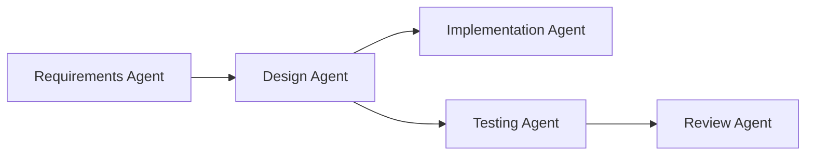
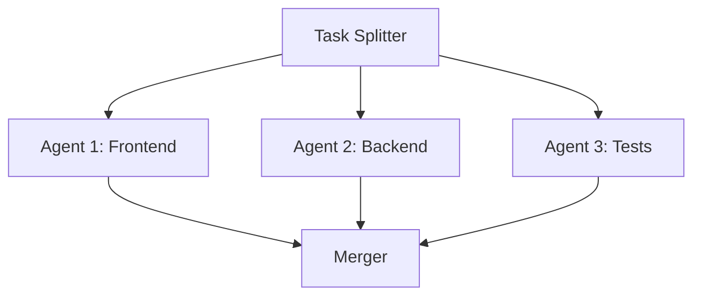

# Padrões de Orquestração Multi-Agente

## Por que Multi-Agente?

Agentes individuais funcionam bem para tarefas simples, mas projetos complexos se beneficiam de agentes especializados trabalhando juntos.

| Padrão | Caso de Uso | Benefício |
|---------|----------|---------|
| **Roteador** | Direcionar tarefas a especialistas | Maior precisão |
| **Pipeline** | Processamento sequencial | Fluxo de trabalho claro |
| **Paralelo** | Tarefas independentes | Execução mais rápida |
| **Hierárquico** | Delegação complexa | Escalabilidade |

---

## Padrão Roteador

O padrão roteador direciona tarefas ao agente mais adequado com base no conteúdo.

```json
{
  "agents": {
    "default": {
      "model": "gpt-4o",
      "description": "Routes tasks to specialists"
    },
    "frontend": {
      "model": "gpt-4o",
      "description": "React, CSS, TypeScript, UI/UX"
    },
    "backend": {
      "model": "claude-sonnet-4-20250514",
      "description": "APIs, databases, server logic"
    },
    "devops": {
      "model": "gpt-4o",
      "description": "Docker, CI/CD, deployment, infrastructure"
    }
  },
  "agentRouting": {
    "mode": "auto",
    "defaultAgent": "default",
    "rules": [
      {
        "pattern": "react|css|component|ui|frontend",
        "agent": "frontend"
      },
      {
        "pattern": "api|database|sql|endpoint|backend",
        "agent": "backend"
      },
      {
        "pattern": "docker|deploy|ci/cd|pipeline|kubernetes",
        "agent": "devops"
      }
    ]
  }
}
```

---

## Padrão Pipeline

Encadeie agentes para processamento sequencial:



### Implementação

```json
{
  "agents": {
    "requirements": {
      "model": "gpt-4o",
      "description": "Analyzes requirements and creates specifications"
    },
    "design": {
      "model": "claude-sonnet-4-20250514",
      "description": "Creates technical design from specifications"
    },
    "implement": {
      "model": "gpt-4o",
      "description": "Writes code based on design documents"
    },
    "test": {
      "model": "gpt-4o-mini",
      "description": "Generates and runs tests"
    },
    "review": {
      "model": "claude-sonnet-4-20250514",
      "description": "Reviews code quality and security"
    }
  }
}
```

---

## Padrão Paralelo

Execute tarefas independentes simultaneamente:



### Quando Usar Paralelo

| Tipo de Tarefa | Paralelo? | Motivo |
|-----------|:---------:|--------|
| Módulos independentes | ✅ | Sem dependências |
| Preocupações transversais | ❌ | Precisam de coordenação |
| Lógica sequencial | ❌ | A ordem importa |
| Múltiplos conjuntos de testes | ✅ | Execução independente |

---

## Padrão Hierárquico

Use subagentes para delegação complexa:

```json
{
  "agents": {
    "lead": {
      "model": "gpt-4o",
      "description": "Project lead that coordinates work",
      "subagents": {
        "frontend-lead": {
          "model": "gpt-4o",
          "description": "Manages frontend team"
        },
        "backend-lead": {
          "model": "gpt-4o",
          "description": "Manages backend team"
        }
      }
    }
  }
}
```

---

## Comunicação entre Agentes

### Através de Arquivos

Agentes podem se comunicar através de arquivos compartilhados:

```python
# Agent 1 writes
with open("tmp/design.json", "w") as f:
    json.dump(design_spec, f)

# Agent 2 reads
with open("tmp/design.json") as f:
    design_spec = json.load(f)
```

### Através de Contexto

O agente principal passa contexto aos subagentes:

```
> Have the backend agent implement the API, then have the test agent write tests for it
```

---

## Melhores Práticas

### Especialização de Agentes

| Tipo de Agente | Modelo | Temperatura | Caso de Uso |
|------------|-------|:-----------:|----------|
| Arquiteto | Claude | 0.3 | Decisões de design |
| Codificador | GPT-4o | 0.7 | Implementação |
| Revisor | Claude | 0.2 | Revisão de código |
| Testador | GPT-4o-mini | 0.5 | Geração de testes |

### Isolamento de Permissões

```json
{
  "permissions": [
    {
      "tool": "write",
      "allow": ["src/frontend/**"],
      "agent": "frontend"
    },
    {
      "tool": "write",
      "allow": ["src/backend/**"],
      "agent": "backend"
    }
  ]
}
```

---

## Practice Questions

```question
{
  "id": "oc-multi-q1",
  "type": "multiple-choice",
  "question": "Which orchestration pattern is best for tasks that can run independently?",
  "options": [
    "Pipeline",
    "Router",
    "Parallel",
    "Hierarchical"
  ],
  "correct": 2,
  "explanation": "The parallel pattern executes independent tasks simultaneously, improving performance when tasks don't depend on each other."
}
```

```question
{
  "id": "oc-multi-q2",
  "type": "multiple-choice",
  "question": "What field controls how OpenCode routes tasks to agents?",
  "options": [
    "agentRouting",
    "agentSelection",
    "taskDispatch",
    "routing"
  ],
  "correct": 0,
  "explanation": "The agentRouting configuration controls how tasks are dispatched to agents based on description matching and rule patterns."
}
```

```question
{
  "id": "oc-multi-q3",
  "type": "multiple-choice",
  "question": "When should you use the pipeline pattern instead of parallel?",
  "options": [
    "When tasks are independent",
    "When tasks have sequential dependencies",
    "When you need faster execution",
    "When tasks use different models"
  ],
  "correct": 1,
  "explanation": "The pipeline pattern is for sequential workflows where each step depends on the output of the previous one."
}
```

```question
{
  "id": "oc-multi-q4",
  "type": "multiple-choice",
  "question": "How do subagents communicate with their parent agent?",
  "options": [
    "Direct API calls",
    "Through shared files and context",
    "Via message queues",
    "Through database"
  ],
  "correct": 1,
  "explanation": "Subagents communicate through shared files and context passed by the parent agent, not through external systems."
}
```

```question
{
  "id": "oc-multi-q5",
  "type": "multiple-choice",
  "question": "Which model temperature is best for code review tasks?",
  "options": [
    "0.7 (creative)",
    "0.5 (balanced)",
    "0.3 (deterministic)",
    "1.0 (random)"
  ],
  "correct": 2,
  "explanation": "Code review requires deterministic, focused outputs, so a low temperature (0.1-0.3) is ideal."
}
```

---

> [!SUCCESS]
> ### Key Takeaways

- Fluxos de trabalho multi-agente melhoram a precisão através da especialização
- O padrão roteador direciona tarefas a especialistas com base no conteúdo
- Use pipeline para dependências sequenciais, paralelo para tarefas independentes
- Padrões hierárquicos com subagentes permitem delegação complexa
- A temperatura do agente deve corresponder à tarefa: baixa para revisão, alta para criatividade
- O isolamento de permissões impede que agentes interfiram entre si
- Agentes se comunicam através de arquivos compartilhados e contexto, não sistemas externos
