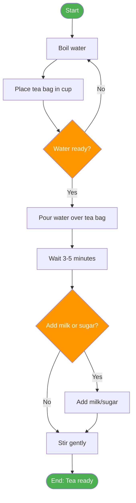
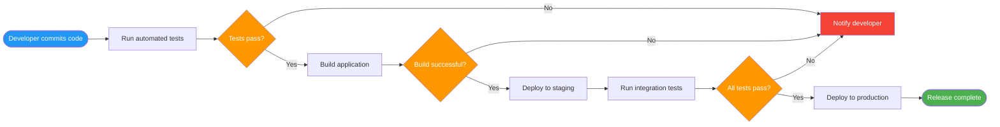
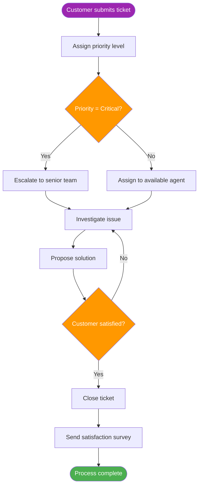

# What Are Processes?

Processes are everywhere. From the moment you wake up to the moment you go to sleep, you interact with processes — both consciously and unconsciously. Understanding what processes are and how they work is a foundational skill for anyone working in technology, business, or any field that requires systematic thinking.

## Defining a Process

A **process** is a series of actions or steps taken in a specific order to achieve a particular end. It transforms inputs into outputs through a defined sequence of operations.

> [!NOTE] Key Definition
> A process is a **repeatable, systematic series of actions** designed to produce a consistent result. The key word is *repeatable* — if something happens once by chance, it's not a process.

### Core Characteristics of Processes

Every well-defined process shares these fundamental characteristics:

| Characteristic | Description | Example |
|---|---|---|
| **Sequence** | Steps follow a specific order | You can't bake a cake before mixing ingredients |
| **Repeatability** | Can be executed multiple times with consistent results | Making coffee every morning |
| **Inputs** | Requires resources to begin | Coffee beans, water, electricity |
| **Outputs** | Produces a result or deliverable | A cup of coffee |
| **Boundaries** | Has a clear start and end point | From order placement to delivery |
| **Purpose** | Designed to achieve a specific goal | Satisfy customer hunger |

## Real-World Process Examples

### Example 1: Making a Cup of Tea

This simple daily activity is actually a well-structured process:



### Example 2: Software Deployment Pipeline

In software engineering, processes are critical for reliability:



### Example 3: Customer Support Ticket Resolution



## Process Thinking

**Process thinking** is a mindset that views work as a series of interconnected activities rather than isolated tasks. This perspective is powerful because it:

- Reveals dependencies between steps
- Identifies opportunities for improvement
- Makes problems easier to diagnose
- Enables automation and optimization

> [!TIP] Think in Processes
> Next time you complete a task, pause and ask yourself:
> 1. What was the trigger that started this?
> 2. What steps did I follow?
> 3. What decisions did I make along the way?
> 4. What was the final output?
> 
> You'll be surprised how often you can identify a process!

### The Process Mindset in Software Engineering

In software engineering, process thinking applies to everything:

| Area | Process Example |
|---|---|
| **Development** | Feature request → Design → Code → Review → Test → Deploy |
| **Operations** | Alert → Investigate → Diagnose → Fix → Verify → Document |
| **Security** | Vulnerability report → Assess → Prioritize → Patch → Verify |
| **Data** | Data ingestion → Validation → Transformation → Storage → Analysis |

## Why Processes Matter

### Consistency and Quality

Processes ensure that work is done the same way every time, reducing errors and variability.

```
Without Process:          With Process:
┌──────────────┐          ┌──────────────┐
│  Person A    │ ────►    │  Step 1      │
│  does it     │          │  Step 2      │ ──► Consistent
│  their way   │          │  Step 3      │     Results
└──────────────┘          │  Step 4      │
┌──────────────┐          └──────────────┘
│  Person B    │
│  does it     │ ──► Different
│  their way   │     Results
└──────────────┘
```

### Scalability

Processes allow work to scale beyond individual capability. When a process is documented, anyone can execute it.

### Continuous Improvement

You cannot improve what you cannot describe. Processes make improvement possible because they provide a baseline to measure against.

> [!WARNING] Common Pitfall
> Don't confuse **processes** with **bureaucracy**. A good process reduces friction; bureaucracy creates it. If a process step doesn't add value, it shouldn't exist.

## Types of Processes

Processes can be categorized in several ways:

### By Predictability

| Type | Description | Example |
|---|---|---|
| **Deterministic** | Same inputs always produce same outputs | Mathematical calculations |
| **Probabilistic** | Outcomes have some variability | Customer service interactions |

### By Structure

| Type | Description | Example |
|---|---|---|
| **Linear** | Sequential steps with no branching | Assembly line |
| **Conditional** | Steps depend on decisions made | Loan approval |
| **Iterative** | Steps repeat until condition is met | Software debugging |
| **Parallel** | Multiple steps occur simultaneously | CI/CD pipeline stages |

### By Scope

| Type | Description | Example |
|---|---|---|
| **Macro** | High-level, organizational | Product development lifecycle |
| **Micro** | Detailed, task-level | Code review checklist |

## Practice Exercises

### Exercise 1: Identify the Process

Think about your morning routine. Write down each step in order. Identify:
- What triggers the process?
- What are the inputs?
- What are the outputs?
- Where are the decision points?

### Exercise 2: Analyze a Process

Consider the process of ordering food from a delivery app. Draw a simple flowchart showing:
1. The main steps from opening the app to receiving food
2. At least two decision points
3. The start and end points

### Exercise 3: Process vs. Non-Process

Determine which of the following are processes and explain why:

1. Brushing your teeth every morning
2. Winning the lottery
3. Responding to a customer email
4. A random number generator producing 7
5. Deploying a software update

<details>
<summary>Click to see answers</summary>

1. **Process** — Repeatable, ordered steps with a clear goal
2. **Not a process** — Not repeatable or controllable
3. **Process** — Systematic approach to handling requests
4. **Not a process** — No transformation or goal, just random output
5. **Process** — Defined steps to achieve a specific outcome

</details>

## Key Takeaways

- A process is a **repeatable series of steps** that transforms inputs into outputs
- Processes have **clear boundaries**, **defined sequences**, and **specific purposes**
- **Process thinking** helps you see work as interconnected activities rather than isolated tasks
- Understanding processes is the first step toward **optimizing** and **automating** them
- In the next lesson, we'll dive deeper into the **components** that make up any process

> [!SUCCESS] You've Completed Lesson 1
> You now understand what processes are and can identify them in everyday life. In the next lesson, we'll explore the building blocks that make processes work: **inputs, outputs, transformations, decision points, and actors**.
