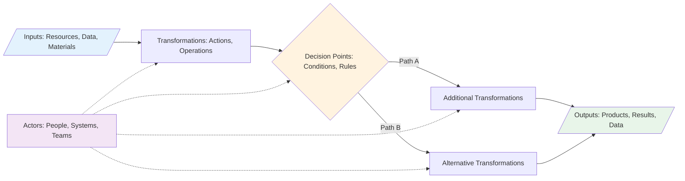
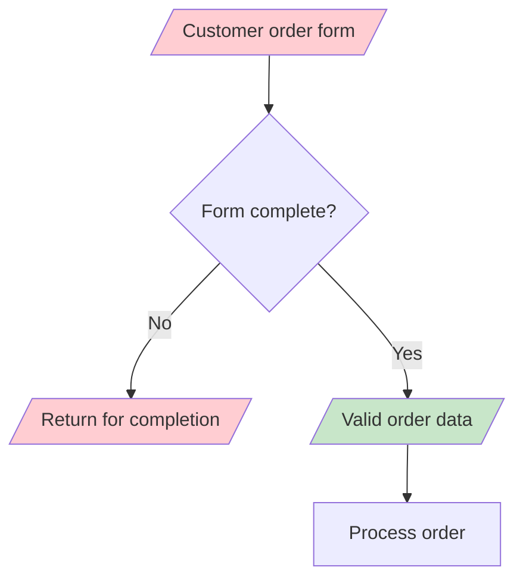
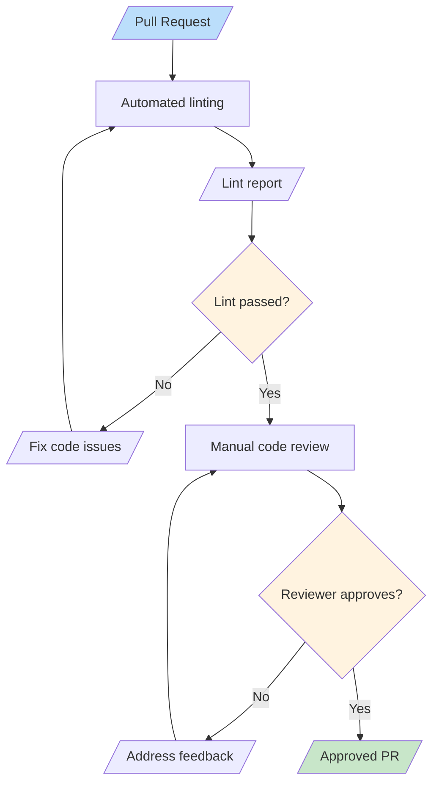
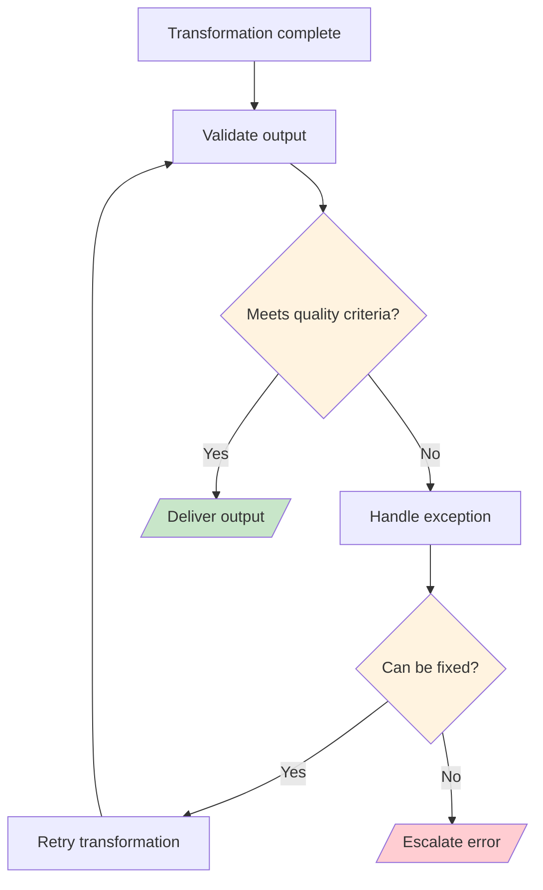
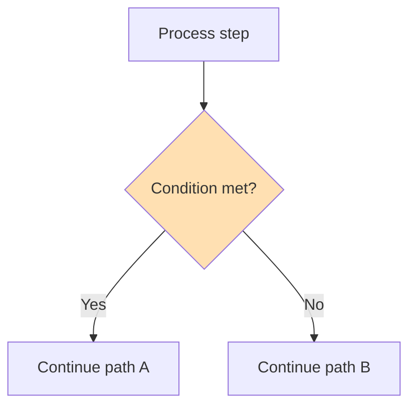
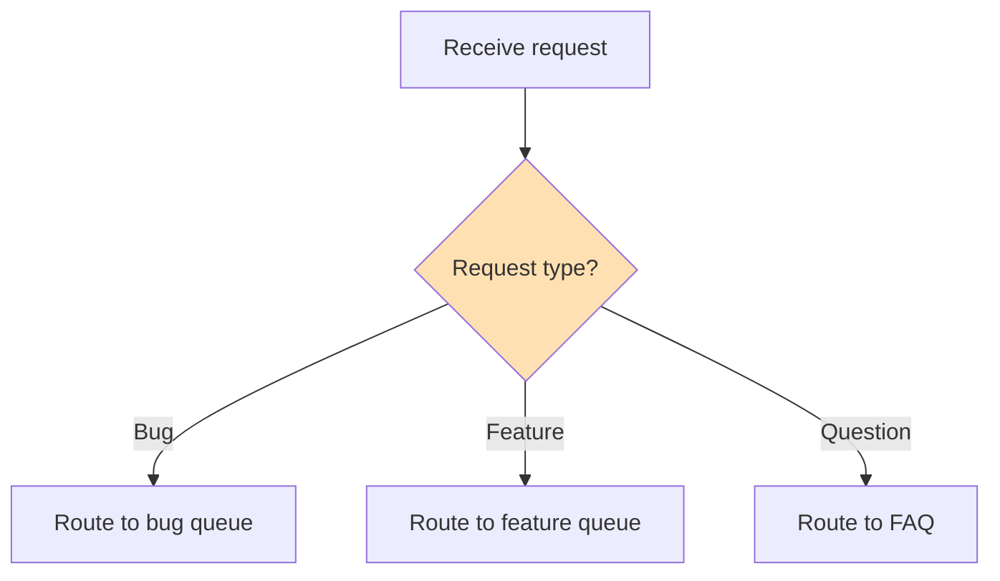
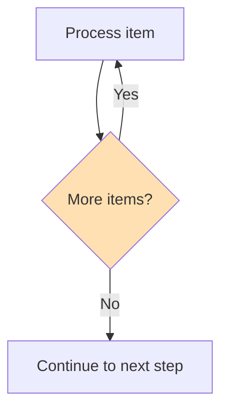
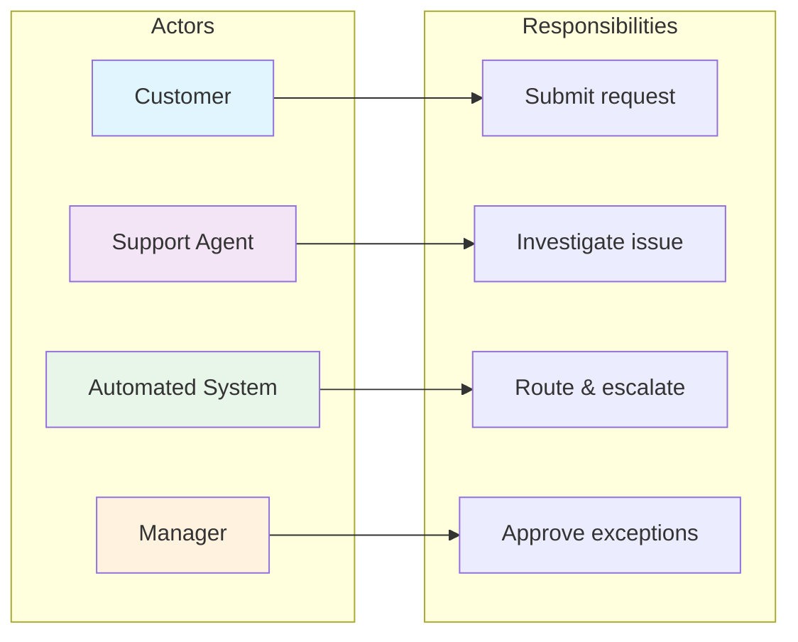
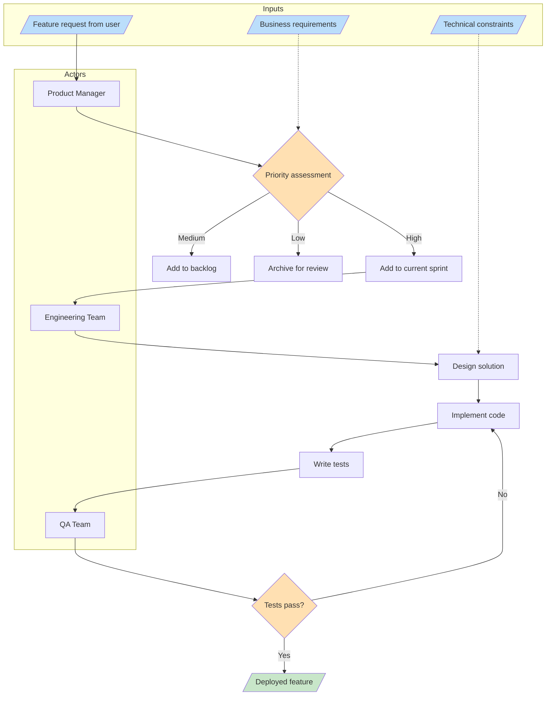

# Process Components

Every process, no matter how simple or complex, is built from a set of fundamental components. Understanding these components is essential for analyzing, documenting, and improving processes. In this lesson, we'll break down each component and see how they work together.

## The Five Core Components

All processes consist of five fundamental elements:

1. **Inputs** — Resources that enter the process
2. **Transformations** — Actions that change the inputs
3. **Outputs** — Results that exit the process
4. **Decision Points** — Places where the process branches
5. **Actors** — Entities that perform the actions



## 1. Inputs

Inputs are everything a process needs to start and operate. They can be tangible or intangible.

### Types of Inputs

| Type | Description | Examples |
|---|---|---|
| **Material** | Physical resources | Raw materials, documents, hardware |
| **Information** | Data or knowledge | Customer request, specifications, requirements |
| **Energy** | Power to drive the process | Electricity, human effort, compute resources |
| **Time** | Duration allocated | Deadlines, SLAs, scheduled windows |

### Input Quality Matters

> [!WARNING] Garbage In, Garbage Out
> The quality of your outputs is directly limited by the quality of your inputs. A process cannot produce high-quality results from poor-quality inputs.



### Real-World Example: Restaurant Kitchen Inputs

```
Inputs for a Pizza Order:
├── Material: Dough, sauce, cheese, toppings
├── Information: Customer order (size, type, extras)
├── Energy: Oven heat, chef's labor
└── Time: 15-20 minute preparation window
```

## 2. Transformations

Transformations are the actions that convert inputs into outputs. They are the "work" of the process.

### Types of Transformations

| Type | Description | Example |
|---|---|---|
| **Physical** | Changing form or state | Cutting, assembling, cooking |
| **Informational** | Changing data or knowledge | Calculating, translating, analyzing |
| **Locational** | Changing position | Shipping, routing, transferring |
| **Transactional** | Changing ownership or status | Approving, purchasing, registering |

### Transformation Example: Code Review Process



### Transformation Best Practices

> [!TIP] Keep Transformations Atomic
> Each transformation step should do **one thing well**. If a step does multiple things, consider breaking it into smaller steps. This makes processes easier to understand, test, and improve.

## 3. Outputs

Outputs are the results produced by the process. They can be the primary deliverable or secondary byproducts.

### Primary vs. Secondary Outputs

| Type | Description | Example (Software Build) |
|---|---|---|
| **Primary** | The main intended result | Compiled application binary |
| **Secondary** | Additional useful results | Build logs, test reports, artifacts |
| **Waste** | Unintended byproducts | Temporary files, failed builds |

### Output Validation

Every process should validate its outputs before completion:



## 4. Decision Points

Decision points are where a process evaluates conditions and chooses between different paths.

### Decision Point Patterns

#### Pattern 1: Binary Decision



#### Pattern 2: Multi-Way Decision



#### Pattern 3: Loop Decision



### Decision Point Best Practices

| Practice | Why It Matters |
|---|---|
| **Clear criteria** | Everyone should understand when each path is taken |
| **Documented rules** | Decision logic should be explicit, not implicit |
| **Fallback paths** | Always define what happens when no condition matches |
| **Audit trail** | Record which path was taken and why |

> [!NOTE] Decision Complexity Warning
> If a decision point has more than 4-5 branches, consider whether the process can be simplified. Complex decisions often indicate that a process should be split into sub-processes.

## 5. Actors

Actors are the entities that perform the work in a process. They can be human or automated.

### Actor Types

| Type | Description | Examples |
|---|---|---|
| **Human** | People performing tasks | Developer, manager, customer |
| **System** | Software performing tasks | CI server, database, API |
| **Hybrid** | Human using a system | Analyst using a dashboard |
| **External** | Outside the organization | Payment gateway, shipping carrier |

### Actor Responsibility Matrix



### RACI Model for Process Actors

The RACI model helps clarify actor responsibilities:

| Role | Meaning | Example in Code Review |
|---|---|---|
| **R**esponsible | Does the work | Developer writing code |
| **A**ccountable | Owns the outcome | Tech lead approving changes |
| **C**onsulted | Provides input | Security team reviewing |
| **I**nformed | Kept updated | Project manager notified |

## Putting It All Together: Complete Process Example

Let's examine a complete process with all five components:

### Software Feature Request Process



## Practice Exercises

### Exercise 1: Component Identification

For the process of "Withdrawing money from an ATM," identify:
1. All inputs
2. All transformations
3. All outputs
4. All decision points
5. All actors

### Exercise 2: Diagram a Process

Draw a flowchart for the process of "Publishing a blog post" that includes:
- At least 3 inputs
- At least 4 transformations
- At least 2 decision points
- At least 2 different actors
- Clear outputs

### Exercise 3: Analyze a Broken Process

Consider this problematic process:
```
Customer complaint → Forward to department → Department handles it → Done
```

Identify what's missing:
- Are the inputs clearly defined?
- Are there decision points for routing?
- Is there output validation?
- Who are the actors?

<details>
<summary>Click to see analysis</summary>

**Problems identified:**
- No input validation (is the complaint complete?)
- No decision points (what if the wrong department receives it?)
- No output validation (was the customer satisfied?)
- Actors are vague ("department" is not specific)
- No escalation path if the department doesn't respond
- No feedback loop for improvement

</details>

## Key Takeaways

- Every process has **five core components**: inputs, transformations, outputs, decision points, and actors
- **Input quality** directly determines output quality
- **Transformations** should be atomic — one thing per step
- **Decision points** should have clear, documented criteria
- **Actors** need clearly defined responsibilities (use RACI)
- Understanding components makes it easier to **analyze** and **improve** any process

> [!SUCCESS] You've Completed Lesson 2
> You now understand the building blocks of every process. In the next lesson, we'll explore **flowcharts** — the visual language used to document and communicate processes.
