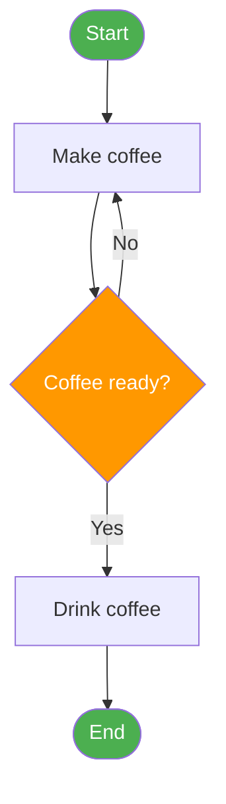
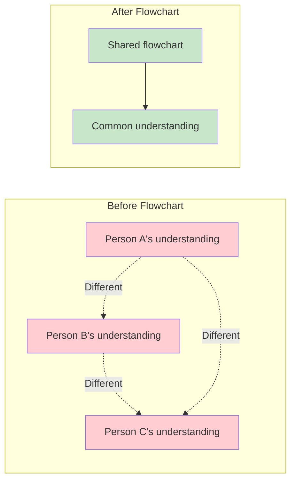
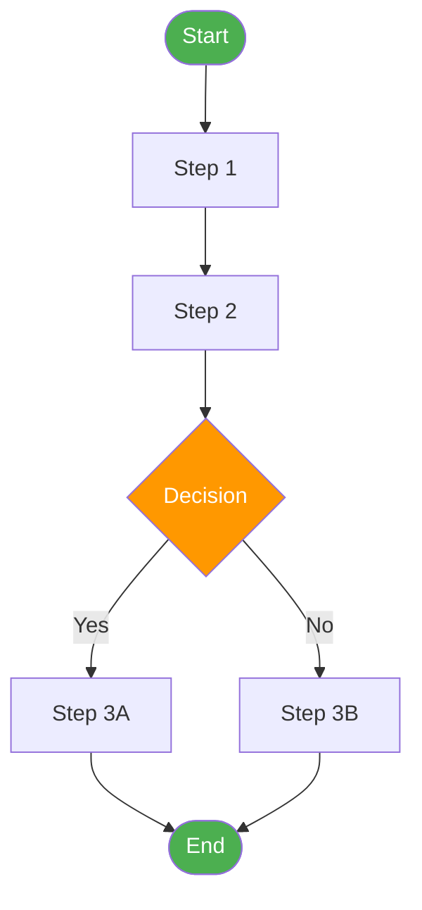
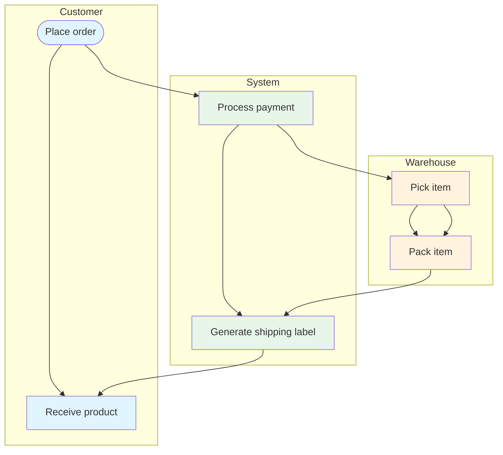
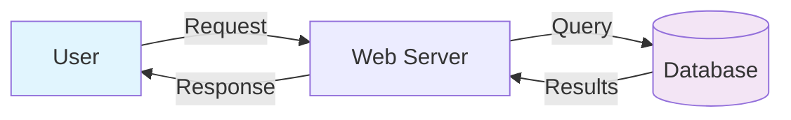
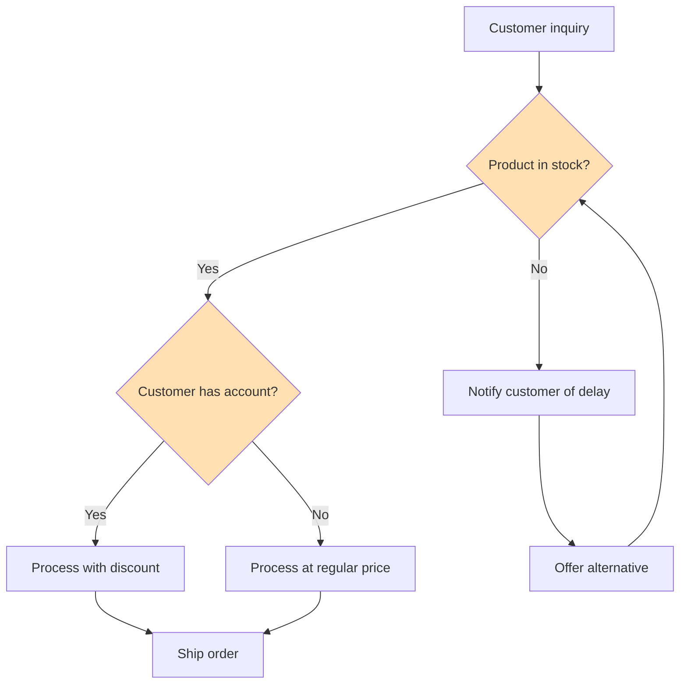
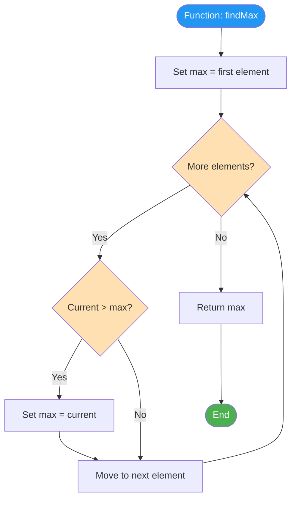
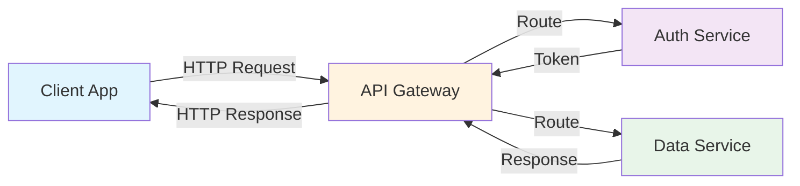

# Introduction to Flowcharts

Flowcharts are one of the most powerful tools for visualizing processes. They transform abstract sequences of steps into clear, visual diagrams that anyone can understand. In this lesson, we'll explore what flowcharts are, why they matter, and when to use them.

## What Is a Flowchart?

A **flowchart** is a diagram that represents a process or workflow using standardized symbols connected by arrows to show the sequence of steps and decision points.

> [!NOTE] Simple Definition
> A flowchart is a **picture of a process**. Just as a photograph captures a moment, a flowchart captures how work flows from start to finish.

### A Minimal Flowchart Example



## A Brief History of Flowcharts

### Origins (1920s)

Flowcharts were first introduced by **Frank and Lillian Gilbreth** in 1921. They presented a diagram called the "Flow Process Chart" to the American Society of Mechanical Engineers (ASME). The Gilbreths were pioneers in efficiency and workflow optimization.

### Standardization (1940s-1960s)

- **1947**: ASME adopted the Gilbreth symbols as the standard
- **1960s**: Flowcharts became widely used in computer programming
- **1970**: ISO established international standards for flowchart symbols

### Modern Era

Today, flowcharts are used across virtually every industry:

| Industry | Use Case |
|---|---|
| **Software** | Algorithm design, system architecture, debugging |
| **Manufacturing** | Assembly lines, quality control, supply chain |
| **Healthcare** | Patient triage, treatment protocols, emergency response |
| **Business** | Onboarding, approvals, customer journeys |
| **Education** | Learning paths, decision trees, study guides |

## Why Flowcharts Matter

### 1. Visual Communication

A flowchart can communicate a complex process in seconds — something that might take pages of text to describe.

```
Text Description:                    Flowchart:
"To process an order, first          ([Start]) --> [Receive Order]
 you receive the order, then         --> [Validate] --> {Valid?}
 you validate it, and if it's        -->|Yes| [Process Payment]
 not valid you reject it, but        -->|No| [Reject]
 if it is valid you process          --> [Ship] --> ([End])
 payment, then ship..."
```

> [!TIP] The Picture Advantage
> Research shows that people remember **65% of visual information** after 3 days, compared to only **10% of text-based information**. Flowcharts leverage this visual advantage.

### 2. Process Analysis

Flowcharts make it easy to spot:
- **Redundancies** — Steps that are repeated unnecessarily
- **Bottlenecks** — Points where work piles up
- **Missing steps** — Gaps in the process
- **Unnecessary complexity** — Overly complicated paths

### 3. Team Alignment

When everyone can see the same process diagram, misunderstandings decrease and collaboration improves.



### 4. Documentation

Flowcharts serve as living documentation that can be updated as processes evolve.

## When to Use Flowcharts

### Ideal Scenarios

| Scenario | Why Flowchart Helps |
|---|---|
| **Onboarding new team members** | Shows how work gets done at a glance |
| **Debugging a broken process** | Makes it easy to locate where things go wrong |
| **Designing a new system** | Helps plan the flow before implementation |
| **Improving an existing process** | Visualizes current state vs. future state |
| **Explaining to stakeholders** | Non-technical people can understand the flow |
| **Compliance and auditing** | Provides clear documentation of procedures |

### When NOT to Use Flowcharts

| Situation | Better Alternative |
|---|---|
| Extremely complex systems (100+ steps) | System architecture diagrams |
| Data relationships | Entity-relationship diagrams (ERD) |
| Timeline-based processes | Gantt charts or timelines |
| Hierarchical structures | Organizational charts |
| State changes | State machine diagrams |

> [!WARNING] Don't Overcomplicate
> If your flowchart has more than 30-40 nodes, consider breaking it into multiple sub-flowcharts. A flowchart that's too complex defeats the purpose of simplification.

## Types of Flowcharts

Different situations call for different types of flowcharts:

### 1. Basic Flowchart

Shows the steps of a process in sequence.



### 2. Swimlane Flowchart

Shows who is responsible for each step, organized by role or department.



### 3. Data Flow Diagram

Focuses on how data moves through a system.



### 4. Decision Flowchart

Focuses on decision logic and outcomes.



## Flowcharts in Software Engineering

Flowcharts are particularly valuable in software development:

### Algorithm Design

Before writing code, flowchart the logic:



### Debugging

Flowchart the expected flow, then compare with actual behavior to find discrepancies.

### System Design

Map how different components interact:



## Practice Exercises

### Exercise 1: Text to Flowchart

Convert this text description into a flowchart:

> "When a user logs in, the system checks their credentials. If valid, it checks their role. Admins go to the admin dashboard, regular users go to the home page. If credentials are invalid, the system shows an error and allows 2 more attempts. After 3 failed attempts, the account is locked."

### Exercise 2: Identify the Flowchart Type

For each scenario, determine which type of flowchart would be most appropriate:

1. Showing how a customer order moves through Sales, Warehouse, and Shipping departments
2. Documenting the steps to reset a forgotten password
3. Mapping how user data flows between a mobile app, API, and database
4. Showing the decision logic for a loan approval system

<details>
<summary>Click to see answers</summary>

1. **Swimlane flowchart** — Multiple departments involved
2. **Basic flowchart** — Simple sequential process
3. **Data flow diagram** — Focus on data movement
4. **Decision flowchart** — Heavy decision logic

</details>

### Exercise 3: Spot the Problem

Look at this flowchart description and identify what's wrong:

```
Start → Step A → Step B → Step C → Step D → End
```

The process actually has a decision at Step B that determines whether to go to Step C or skip to Step D. What's missing from the flowchart?

<details>
<summary>Click to see the answer</summary>

The flowchart is missing a **decision point** (diamond shape) at Step B. The correct representation should be:

```
Start → Step A → Step B → {Condition?} →|Yes| Step C → Step D → End
                                    →|No| Step D → End
```

</details>

## Key Takeaways

- Flowcharts are **visual representations of processes** using standardized symbols
- They were invented in **1921** by Frank and Lillian Gilbreth
- Flowcharts improve **communication**, **analysis**, **alignment**, and **documentation**
- Use flowcharts for **onboarding**, **debugging**, **designing**, and **improving** processes
- Choose the right **type of flowchart** for your situation
- Keep flowcharts **simple** — break complex ones into sub-flowcharts
- In the next lesson, we'll learn the **standard symbols** used in flowcharts

> [!SUCCESS] You've Completed Lesson 3
> You now understand what flowcharts are, why they're valuable, and when to use them. In the next lesson, we'll dive deep into **flowchart symbols and notation** — the visual vocabulary that makes flowcharts universal.
