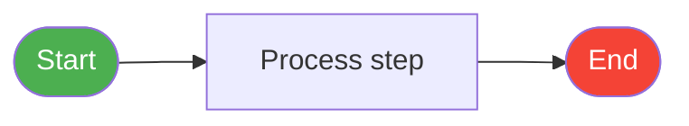
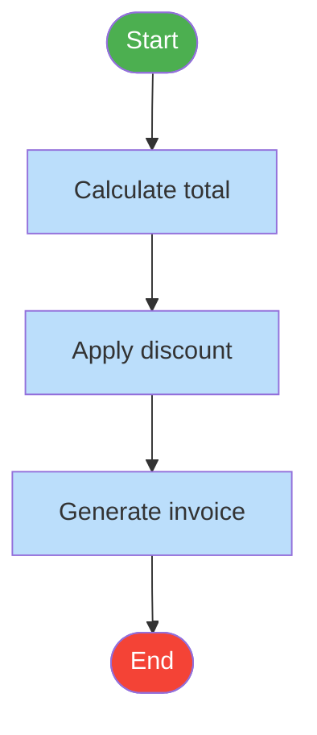
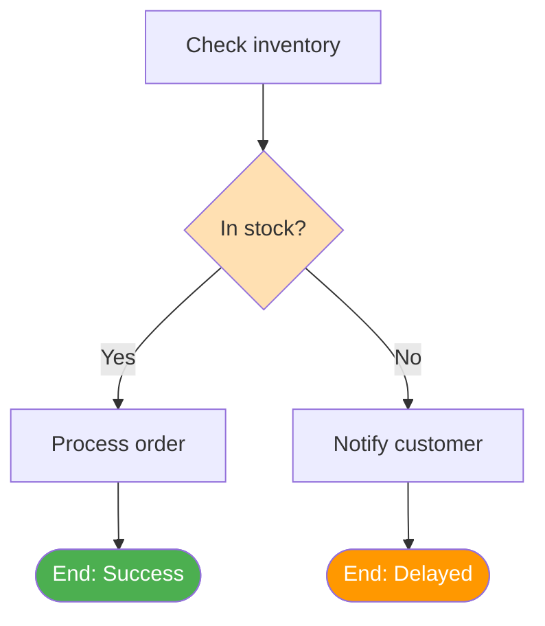
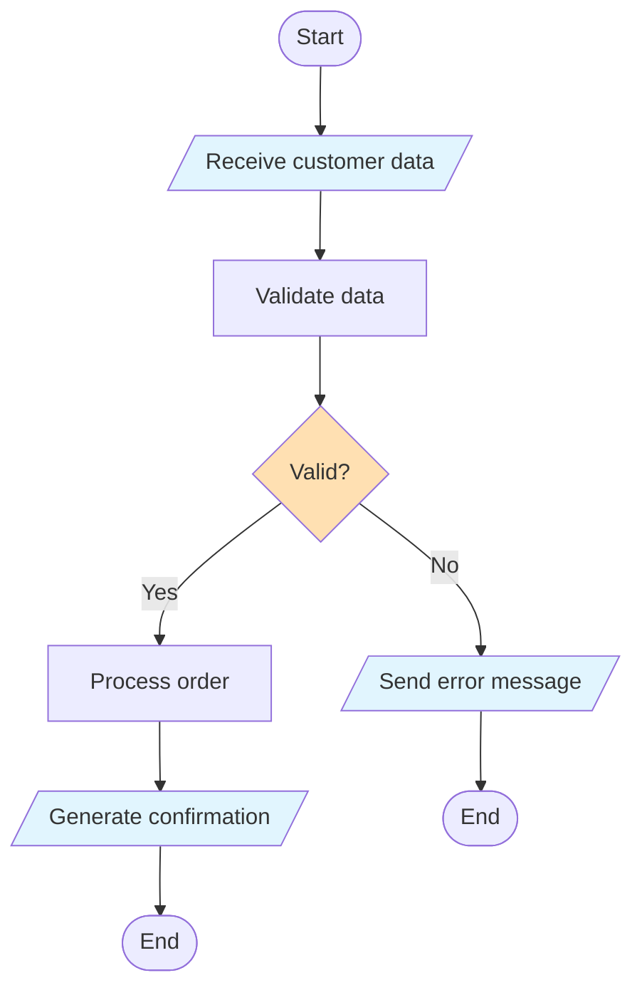
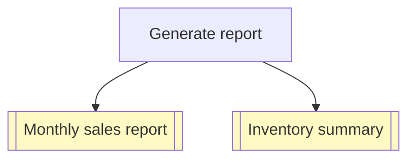
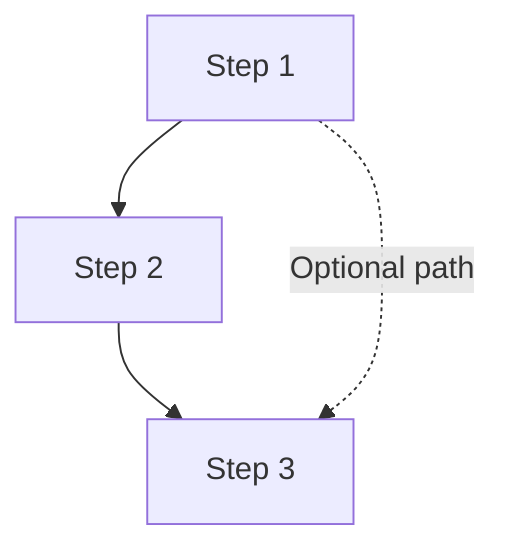
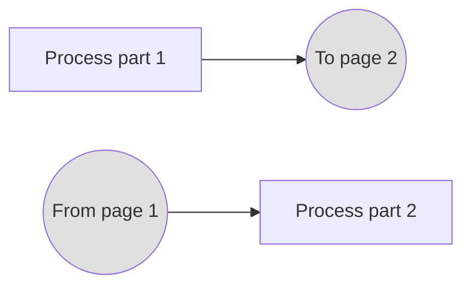
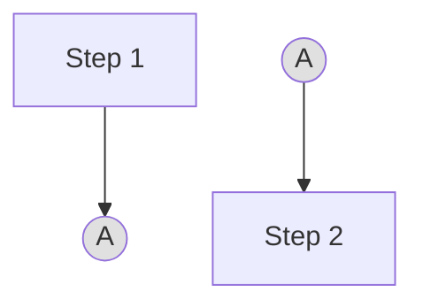
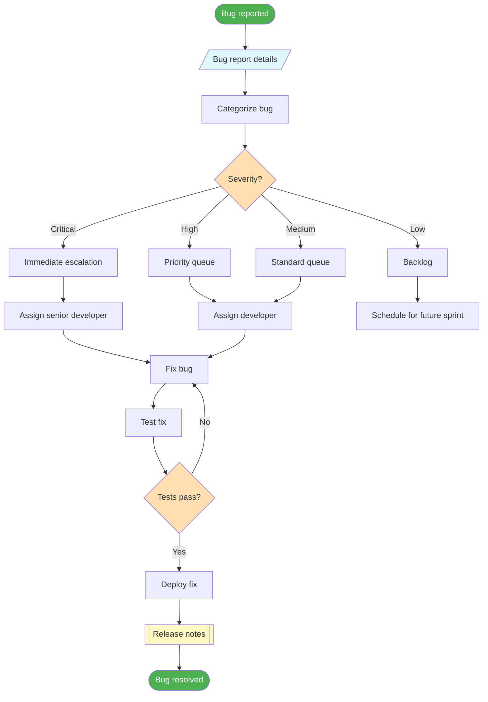

# Flowchart Symbols & Notation

Flowcharts use a standardized set of symbols that make them universally understood, regardless of language or industry. In this lesson, we'll learn each symbol, its meaning, and see practical examples of how to use them.

## The Essential Symbol Set

While there are dozens of flowchart symbols, you only need to master a core set to create effective flowcharts for most situations.

### Terminal Symbols (Start/End)

Terminal symbols mark the beginning and end of a process.

| Symbol | Shape | Usage |
|---|---|---|
| `([Start])` | Rounded rectangle / Pill | Marks the beginning of a process |
| `([End])` | Rounded rectangle / Pill | Marks the end of a process |



> [!NOTE] Best Practice
> Every flowchart should have **exactly one Start** symbol. It may have **one or more End** symbols (for different exit paths).

### Process Symbols (Action/Operation)

Process symbols represent an action, operation, or step in the workflow.

| Symbol | Shape | Usage |
|---|---|---|
| `[Action]` | Rectangle | A single step or operation |



### Decision Symbols

Decision symbols represent a point where the process branches based on a condition.

| Symbol | Shape | Usage |
|---|---|---|
| `{Condition?}` | Diamond | A yes/no or multi-way decision |



> [!TIP] Label Your Branches
> Always label the outgoing arrows from decision symbols. Use clear labels like "Yes/No", "Pass/Fail", or specific values.

### Input/Output Symbols

Input/Output symbols represent data entering or leaving the process.

| Symbol | Shape | Usage |
|---|---|---|
| `[/Input/]` | Parallelogram | Data input to the process |
| `[/Output/]` | Parallelogram | Data output from the process |



### Document Symbols

Document symbols represent documents or reports generated by the process.

| Symbol | Shape | Usage |
|---|---|---|
| `[[Document]]` | Rectangle with wavy bottom | A document or report |



### Database Symbols

Database symbols represent data storage or retrieval.

| Symbol | Shape | Usage |
|---|---|---|
| `[[(Database)]]` | Cylinder | Database or data storage |

```mermaid
flowchart TD
    A[User submits form] --> B[Validate input]
    B --> C{Valid?}
    C -->|Yes| D[Save to database]
    C -->|No| E[Show error]
    D --> F[[(User database)]]
    F --> G[Send confirmation]
    
    style F fill:#F3E5F5
    style C fill:#FFE0B2
```

## Connector Symbols

Connectors show the flow direction and link different parts of the flowchart.

### Flow Lines (Arrows)

Arrows show the direction of process flow.



### Off-Page Connectors

When a flowchart spans multiple pages, off-page connectors link them.



### On-Page Connectors

For complex flowcharts, on-page connectors avoid crossing lines.



## Complete Symbol Reference Table

| Symbol | Mermaid Syntax | Shape | Name | When to Use |
|---|---|---|---|---|
| `([Text])` | `([Text])` | Rounded | Terminal | Start or end of process |
| `[Text]` | `[Text]` | Rectangle | Process | Action or operation |
| `{Text}` | `{Text}` | Diamond | Decision | Branch point |
| `[/Text/]` | `[/Text/]` | Parallelogram | I/O | Input or output data |
| `[[Text]]` | `[[Text]]` | Wavy rect | Document | Report or document |
| `[[(Text)]]` | `[[(Text)]]` | Cylinder | Database | Data storage |
| `((Text))` | `((Text))` | Circle | Connector | Link to another point |
| `==Text==` | `==Text==` | Double line | Predefined process | Sub-process call |

## Practical Examples

### Example 1: User Registration Flow

```mermaid
flowchart TD
    A([Start]) --> B[/Enter email & password/]
    B --> C[Validate format]
    C --> D{Format valid?}
    D -->|No| E[/Show error message/]
    D -->|Yes| F[Check if email exists]
    E --> B
    F --> G{Email available?}
    G -->|No| H[/Email already registered/]
    G -->|Yes| I[Create account]
    H --> B
    I --> J[Send verification email]
    J --> K[[(Users database)]]
    K --> L[[Welcome email]]
    L --> M([Registration complete])
    
    style A fill:#4CAF50,color:#fff
    style M fill:#4CAF50,color:#fff
    style D fill:#FFE0B2
    style G fill:#FFE0B2
    style B fill:#E1F5FE
    style E fill:#E1F5FE
    style H fill:#E1F5FE
    style K fill:#F3E5F5
    style L fill:#FFF9C4
```

### Example 2: Bug Report Triage



### Example 3: E-Commerce Checkout

```mermaid
flowchart TD
    A([Start checkout]) --> B[/Cart contents/]
    B --> C[Validate cart]
    C --> D{Cart valid?}
    D -->|No| E[/Show cart errors/]
    D -->|Yes| F[/Shipping details/]
    E --> A
    F --> G[Calculate shipping]
    G --> H[/Payment details/]
    H --> I[Process payment]
    I --> J{Payment successful?}
    J -->|No| K[/Payment failed - retry/]
    J -->|Yes| L[Create order]
    K --> H
    L --> M[[(Orders database)]]
    M --> N[Update inventory]
    N --> O[[(Inventory database)]]
    O --> P[Send confirmation]
    P --> Q[[Order confirmation email]]
    Q --> R([Checkout complete])
    
    style A fill:#4CAF50,color:#fff
    style R fill:#4CAF50,color:#fff
    style D fill:#FFE0B2
    style J fill:#FFE0B2
    style B fill:#E1F5FE
    style E fill:#E1F5FE
    style F fill:#E1F5FE
    style H fill:#E1F5FE
    style K fill:#E1F5FE
    style M fill:#F3E5F5
    style O fill:#F3E5F5
    style Q fill:#FFF9C4
```

## Symbol Usage Guidelines

### Do's and Don'ts

| Do | Don't |
|---|---|
| Use consistent symbol shapes | Mix shapes for the same purpose |
| Label decision branches clearly | Leave branches unlabeled |
| Keep text concise inside symbols | Write paragraphs inside symbols |
| Use standard symbols | Invent custom symbols without a legend |
| Flow top-to-bottom or left-to-right | Create confusing flow directions |
| Use color purposefully | Use random colors without meaning |

> [!WARNING] Common Mistake
> Don't use a rectangle for decisions just because it's easier to type. The diamond shape is universally recognized as a decision point — using the wrong shape confuses readers.

### Color Coding Conventions

While not standardized, these color conventions are widely used:

| Color | Typical Meaning |
|---|---|
| Green | Start, success, positive outcome |
| Red | End, error, failure, stop |
| Orange/Yellow | Decision points, warnings |
| Blue | Process steps, actions |
| Purple | Data storage, databases |
| Yellow | Documents, reports |

## Practice Exercises

### Exercise 1: Symbol Identification

For each description, identify the correct symbol shape:

1. The point where a user's subscription status is checked
2. The step where a report is generated
3. The beginning of the order fulfillment process
4. Data being read from a configuration file
5. Saving a record to the database
6. A reference to a sub-process defined elsewhere

<details>
<summary>Click to see answers</summary>

1. **Diamond** `{}` — Decision point
2. **Wavy rectangle** `[[]]` — Document
3. **Rounded rectangle** `([ ])` — Terminal (Start)
4. **Parallelogram** `[/ /]` — Input
5. **Cylinder** `[[( )]]` — Database
6. **Circle** `(( ))` — Connector (or double-lined rectangle for predefined process)

</details>

### Exercise 2: Fix the Flowchart

This flowchart has symbol errors. Identify and fix them:

```
[Start] → [Check user role] → [Admin?] → [Show admin panel] → [End]
```

<details>
<summary>Click to see the corrected version</summary>

```
([Start]) → [Check user role] → {Admin?} →|Yes| [Show admin panel] → ([End])
                                    →|No| [Show user panel] → ([End])
```

**Errors fixed:**
- Start should be `([Start])` (terminal, not process)
- "Admin?" should be `{Admin?}` (decision, not process)
- End should be `([End])` (terminal, not process)
- Missing the "No" branch from the decision
- Branches should be labeled

</details>

### Exercise 3: Draw a Flowchart

Create a flowchart for "Making a phone call" using at least:
- 2 terminal symbols
- 4 process symbols
- 2 decision symbols
- 1 input/output symbol
- Proper flow arrows with labels

## Key Takeaways

- Flowcharts use **standardized symbols** that are universally understood
- The **core symbol set** includes: terminals, processes, decisions, I/O, documents, databases, and connectors
- Always **label decision branches** clearly
- Use **consistent shapes** — don't mix symbols for the same purpose
- **Color coding** can enhance readability but isn't required
- Keep symbol text **concise** — use descriptions outside the diagram if needed
- In the next lesson, we'll apply these symbols to **build your first flowcharts** step by step

> [!SUCCESS] You've Completed Lesson 4
> You now know the standard flowchart symbols and how to use them. In the next lesson, we'll put this knowledge into practice by **building flowcharts from scratch** with step-by-step examples.
