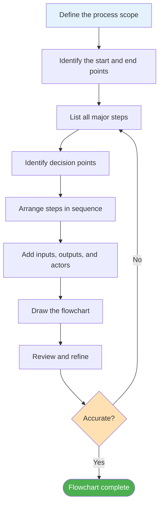
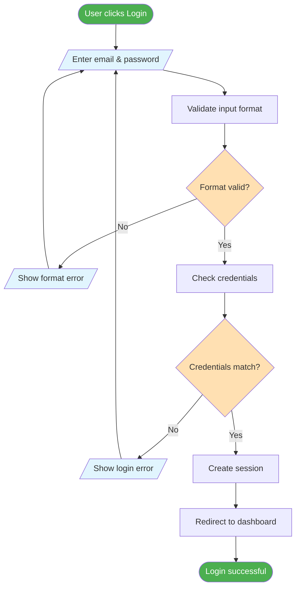
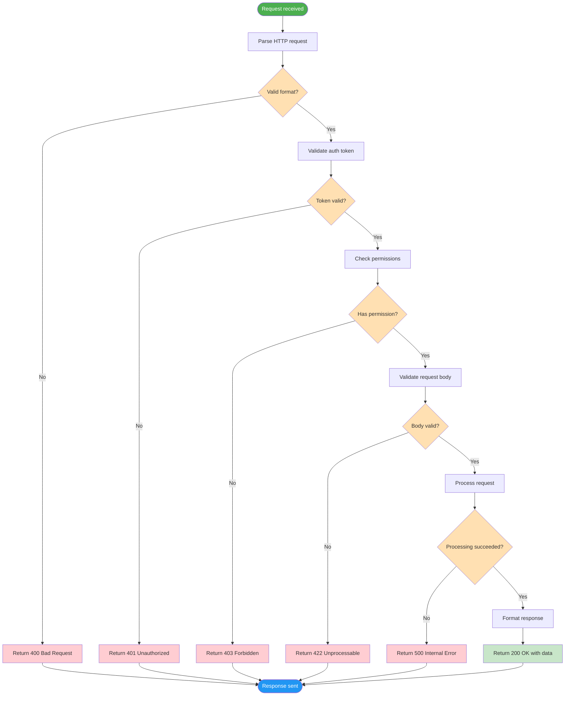
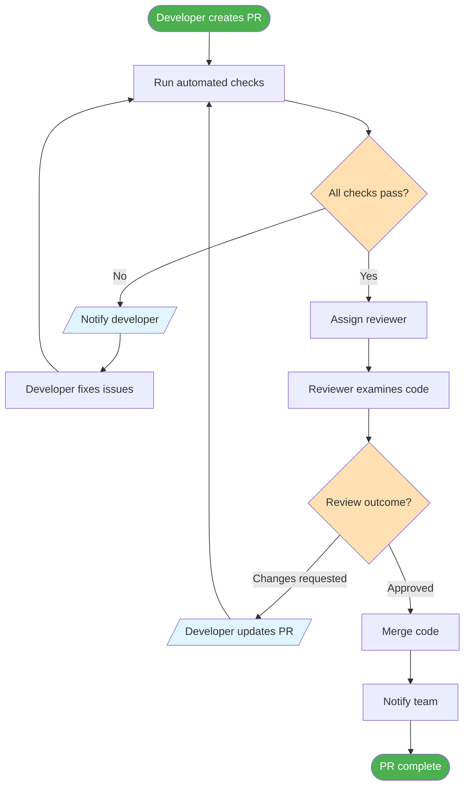
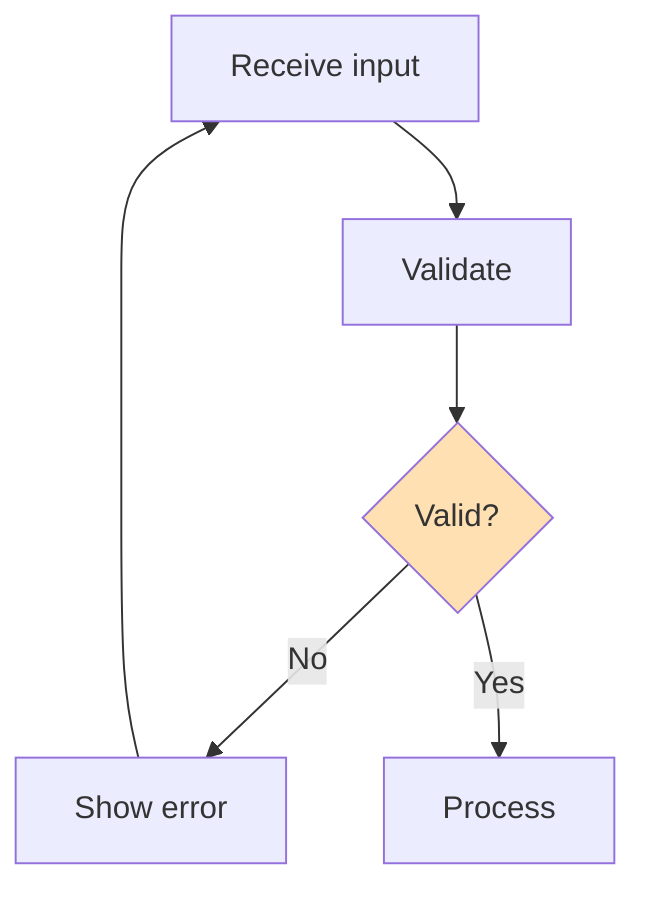
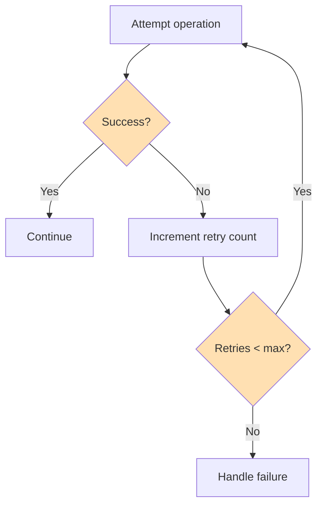
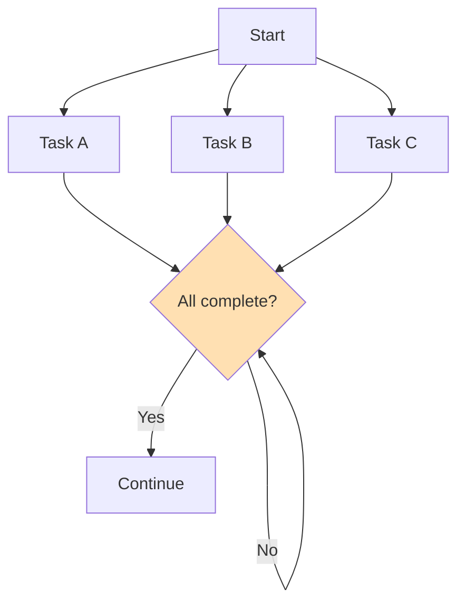
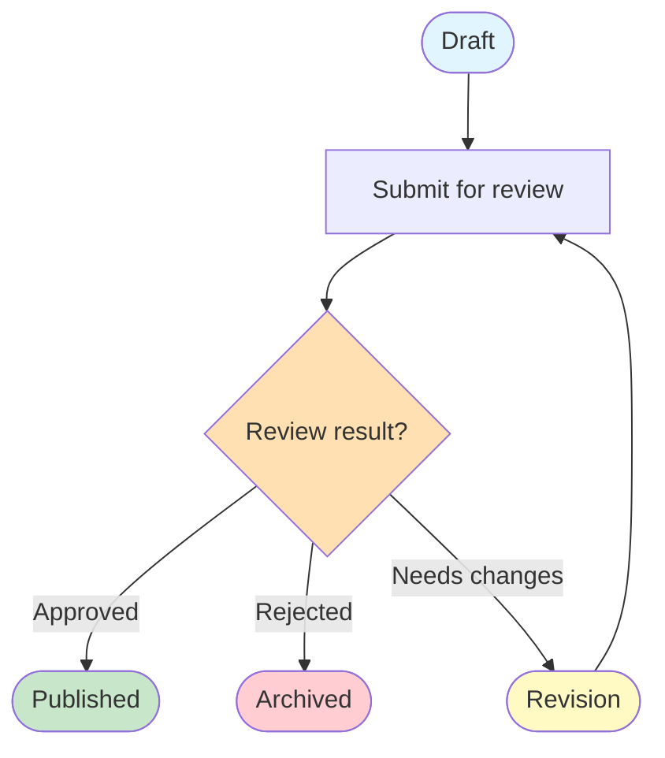

# Building Your First Flowcharts

Now that you understand process components and flowchart symbols, it's time to put that knowledge into practice. In this lesson, we'll build flowcharts step by step, starting simple and gradually increasing complexity.

## The Flowchart Building Process

Creating a flowchart follows a systematic approach:



## Step-by-Step Example 1: Simple Login Process

Let's build a flowchart for a user login process from scratch.

### Step 1: Define the Scope

**Process:** User authentication for a web application
**Start:** User enters credentials
**End:** User is logged in or receives an error

### Step 2: List the Steps

1. User enters email and password
2. System validates input format
3. System checks credentials against database
4. If valid, create session
5. If invalid, show error message
6. Redirect to appropriate page

### Step 3: Identify Decisions

- Is the input format valid?
- Do the credentials match?

### Step 4: Build the Flowchart



> [!TIP] Build Incrementally
> Start with the "happy path" (everything goes right), then add error handling and edge cases. This keeps your flowchart organized.

## Step-by-Step Example 2: Password Reset Flow

Let's build a slightly more complex flowchart.

### Step 1: Define the Scope

**Process:** Password reset for a web application
**Start:** User clicks "Forgot Password"
**End:** Password is reset or process is abandoned

### Step 2: List the Steps

1. User clicks "Forgot Password"
2. User enters email address
3. System validates email exists
4. System generates reset token
5. System sends reset email
6. User clicks reset link
7. System validates token
8. User enters new password
9. System validates password strength
10. System updates password
11. User logs in with new password

### Step 3: Identify Decisions

- Does the email exist in the system?
- Is the reset token valid and not expired?
- Does the new password meet strength requirements?

### Step 4: Build the Flowchart

```mermaid
flowchart TD
    A([Forgot password clicked]) --> B[/Enter email address/]
    B --> C[Check if email exists]
    C --> D{Email found?}
    D -->|No| E[/Show generic message/]
    D -->|Yes| F[Generate reset token]
    E --> G([Process ends])
    F --> H[Send reset email]
    H --> I[[(Store token)]]
    I --> J([Wait for user action])
    
    J --> K[User clicks reset link]
    K --> L[Validate token]
    L --> M{Token valid & not expired?}
    M -->|No| N[/Show expired link message/]
    M -->|Yes| O[/Enter new password/]
    N --> G
    O --> P[Validate password strength]
    P --> Q{Meets requirements?}
    Q -->|No| R[/Show strength requirements/]
    Q -->|Yes| S[Update password]
    R --> O
    S --> T[Invalidate all sessions]
    T --> U[Send confirmation email]
    U --> V[[Password reset confirmation]]
    V --> W([Password reset complete])
    
    style A fill:#4CAF50,color:#fff
    style W fill:#4CAF50,color:#fff
    style G fill:#F44336,color:#fff
    style D fill:#FFE0B2
    style M fill:#FFE0B2
    style Q fill:#FFE0B2
    style B fill:#E1F5FE
    style E fill:#E1F5FE
    style N fill:#E1F5FE
    style O fill:#E1F5FE
    style R fill:#E1F5FE
    style I fill:#F3E5F5
    style V fill:#FFF9C4
```

> [!NOTE] Security Note
> Notice that when the email is not found, we show a "generic message" rather than "email not found." This is a security best practice — don't reveal whether an email exists in your system.

## Step-by-Step Example 3: API Request Processing

Now let's build a technical flowchart for API request processing.

### Step 1: Define the Scope

**Process:** Handling an incoming API request
**Start:** Request received by server
**End:** Response sent to client

### Step 2: List the Steps

1. Request received
2. Parse request
3. Validate authentication token
4. Check authorization/permissions
5. Validate request body
6. Process the request
7. Format response
8. Send response

### Step 3: Identify Decisions

- Is the request format valid?
- Is the authentication token valid?
- Does the user have permission?
- Is the request body valid?
- Did processing succeed?

### Step 4: Build the Flowchart



## Practice: Build Your Own

### Exercise 1: File Upload Process

Build a flowchart for a file upload feature with these requirements:
- User selects a file
- System validates file type (only images allowed)
- System validates file size (max 5MB)
- System uploads to cloud storage
- System generates a thumbnail
- System saves metadata to database
- User receives a success or error message

### Exercise 2: Shopping Cart Process

Build a flowchart for adding an item to a shopping cart:
- User browses product catalog
- User selects a product
- System checks product availability
- User selects quantity
- System checks if quantity is available
- System adds to cart
- System updates cart total
- User can continue shopping or proceed to checkout

### Exercise 3: Code Review Process

Build a flowchart for a code review workflow:
- Developer creates a pull request
- Automated checks run (linting, tests)
- If checks fail, developer fixes issues
- If checks pass, reviewer is assigned
- Reviewer examines the code
- Reviewer approves or requests changes
- If changes requested, developer updates PR
- If approved, code is merged
- Notification is sent to the team

<details>
<summary>Click to see a sample code review flowchart</summary>



</details>

## Common Flowchart Patterns

### Pattern 1: Validation Loop



### Pattern 2: Retry with Limit



### Pattern 3: Parallel Processing



### Pattern 4: State Machine



## Tools for Building Flowcharts

| Tool | Type | Best For |
|---|---|---|
| **Mermaid** | Code-based | Documentation, version control |
| **Draw.io** | Visual editor | Quick diagrams, collaboration |
| **Lucidchart** | Visual editor | Team collaboration, templates |
| **PlantUML** | Code-based | Technical diagrams |
| **Excalidraw** | Whiteboard | Brainstorming, informal diagrams |

> [!TIP] Start with Mermaid
> Since Mermaid is code-based, your flowcharts can be version-controlled, reviewed in pull requests, and automatically rendered in Markdown files. This makes it ideal for documentation.

## Key Takeaways

- Follow a **systematic approach**: define scope → list steps → identify decisions → draw → review
- Build the **happy path first**, then add error handling
- Use **common patterns** like validation loops, retry logic, and parallel processing
- **Review your flowchart** against the actual process to ensure accuracy
- **Mermaid** is an excellent tool for creating version-controlled flowcharts
- Practice makes perfect — the more flowcharts you build, the better you'll get

> [!SUCCESS] You've Completed Lesson 5
> You now know how to build flowcharts from scratch. In the final lesson of this course, we'll explore **process optimization** — how to use flowcharts to identify bottlenecks and improve processes.
